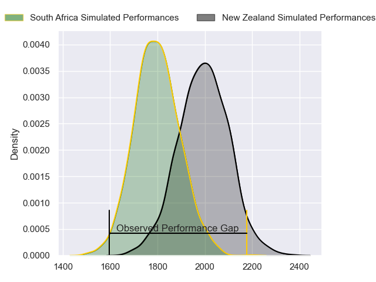
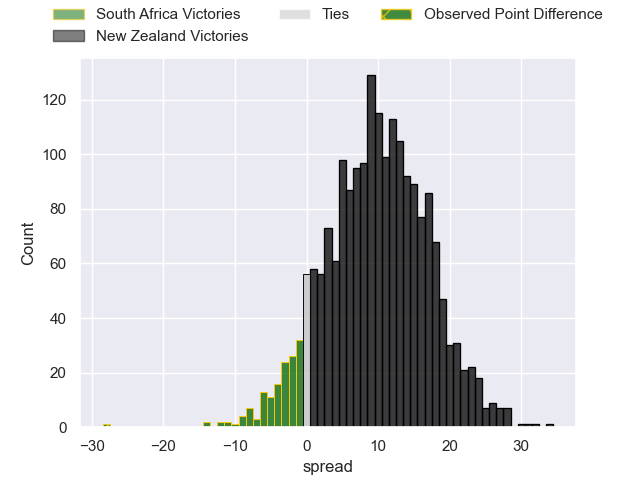
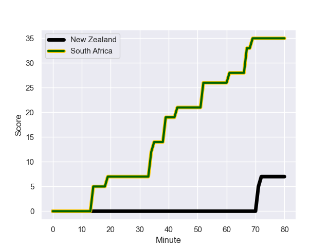
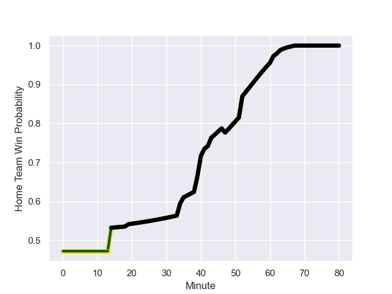

---  
layout: page  
title: South Africa at New Zealand; 35.0-7.0  
date: 2023-08-24 18:00:00 -0500  
categories: match review  
---
# South Africa at New Zealand; 35.0-7.0

# Club Level Predictions

The first set of predictions treats a club as the smallest object, as the club develops its members, organizes a gameplan, and deploys its players as needed for each match. This club model has a prediction of 0.748, which translates to predicting New Zealand to win by 9.9.

Each club has a rating and a rating deviation (simiar to a Glicko system), and expected performances can be generated. This allows for simulated matches and spreads like the ones below.
## Projected Performances

## Projected Spreads

## Projected Results

# Player Level Predictions - Version 1

Treating teams instead as an entity made up of the currently active players, I have ratings for each player in an altogether different system. These can be combined to form team ratings once teamsheets are announced, weighting starters a bit higher than the reserves. After the match is played, players can be weighted by their minutes on the field, allowing for an accurate measure of the team's composition. With these compiled team ratings, we can make predictions, measure inaccuracy, and update the individual player ratings.
## Prediction with Player Minutes: South Africa by 1.0

South Africa by 5.0 on a neutral field
## Prediction without Player Minutes: New Zealand by 3.9

South Africa by 0.1 on a neutral pitch

## Scores over Time

## Win Probability over Time

There were 5 large changes in win probability in this match

|   Away Minutes | Away Player          |   Away elo |   Away Percentile |   Number |   Home Percentile |   Home elo | Home Player         |   Home Minutes |
|---------------:|:---------------------|-----------:|------------------:|---------:|------------------:|-----------:|:--------------------|---------------:|
|             47 | Steven Kitshoff      |     101    |            560852 |        1 |            921370 |      88.99 | Ethan de Groot      |             51 |
|             47 | Malcolm Marx         |     101.48 |            722145 |        2 |            381255 |     122.37 | Dane Coles          |             41 |
|             47 | Frans Malherbe       |     125.36 |            542907 |        3 |            803217 |     136.33 | Tyrel Lomax         |             14 |
|             47 | Eben Etzebeth        |     113.97 |            614145 |        4 |           1007026 |      99.74 | Sam Whitelock       |             51 |
|             47 | Franco Mostert       |     132.05 |            650672 |        5 |            730284 |     130.08 | Scott Barrett       |             80 |
|             47 | Siya Kolisi          |      93.88 |            567732 |        6 |            879791 |     127.02 | Luke Jacobson       |             40 |
|             80 | Pieter-Steph du Toit |      78.95 |            621793 |        7 |            512708 |     127.64 | Sam Cane            |             63 |
|             47 | Duane Vermeulen      |     109.04 |            299647 |        8 |            635356 |     106.29 | Ardie Savea         |             80 |
|             80 | Faf de Klerk         |     104.17 |            631634 |        9 |            485835 |      88.49 | Aaron Smith         |             61 |
|             80 | Manie Libbok         |     103.38 |            876698 |       10 |            686689 |     137.79 | Richie Mo'unga      |             80 |
|             63 | Makazole Mapimpi     |     119.13 |            727714 |       11 |            832839 |     102.63 | Mark Telea          |             80 |
|             80 | Andre Esterhuizen    |     140.75 |            720741 |       12 |            830084 |     113.04 | Jordie Barrett      |             80 |
|             80 | Canan Moodie         |     116.81 |            997306 |       13 |            782899 |      82.07 | Rieko Ioane         |             80 |
|             80 | Kurt-Lee Arendse     |     139.55 |            971811 |       14 |            881816 |     114.27 | Will Jordan         |             63 |
|             80 | Damian Willemse      |     110.14 |            868248 |       15 |            499178 |     147.55 | Beauden Barrett     |             80 |
|             33 | Bongi Mbonambi       |     116.7  |            618060 |       16 |            866956 |     105.11 | Samisoni Taukei'aho |             39 |
|             33 | Ox Nche              |      89.78 |            813421 |       17 |            981505 |      92.37 | Tamaiti Williams    |             29 |
|             33 | Trevor Nyakane       |     115.18 |            574001 |       18 |            976165 |      73.73 | Fletcher Newell     |             66 |
|             33 | Jean Kleyn           |     107.7  |            724833 |       19 |            946819 |      97.43 | Josh Lord           |             29 |
|             33 | RG Snyman            |     111.98 |            793375 |       20 |            924026 |      66.02 | Tupou Vaa'i         |             40 |
|             33 | Marco van Staden     |     101.32 |            897839 |       21 |           1007009 |      98.01 | Dalton Papali'i     |             17 |
|             17 | Cobus Reinach        |     118.85 |            569140 |       22 |            980667 |      92.81 | Cam Roigard         |             19 |
|             33 | Kwagga Smith         |     102.2  |            742066 |       23 |            720491 |     102.39 | Anton Lienert-Brown |             17 |

# Player Level Predictions - Version 2

Treating teams instead as an entity made up of the currently active players, I have ratings for each player in an altogether different system. These can be combined to form team ratings once teamsheets are announced, weighting starters a bit higher than the reserves. After the match is played, players can be weighted by their minutes on the field, allowing for an accurate measure of the team's composition. With these compiled team ratings, we can make predictions, measure inaccuracy, and update the individual player ratings.
## Prediction with Player Minutes: New Zealand by 8.3

New Zealand by 4.6 on a neutral field
## Prediction without Player Minutes: New Zealand by 7.5

New Zealand by 3.9 on a neutral pitch

|   Away Minutes | Away Player          |   Away elo |   Away variance |   Number |   Home variance |   Home elo | Home Player         |   Home Minutes |
|---------------:|:---------------------|-----------:|----------------:|---------:|----------------:|-----------:|:--------------------|---------------:|
|             47 | Steven Kitshoff      |      90.74 |           49.45 |        1 |           48.21 |      64.45 | Ethan de Groot      |             51 |
|             47 | Malcolm Marx         |     121.34 |           49.88 |        2 |           49.68 |     133.27 | Dane Coles          |             41 |
|             47 | Frans Malherbe       |      70.74 |           49.65 |        3 |           48.15 |      79.2  | Tyrel Lomax         |             14 |
|             47 | Eben Etzebeth        |     120.62 |           49.75 |        4 |           48.68 |      89    | Sam Whitelock       |             51 |
|             47 | Franco Mostert       |     104.75 |           49.89 |        5 |           47.2  |     126.95 | Scott Barrett       |             80 |
|             47 | Siya Kolisi          |      98.34 |           50    |        6 |           48.01 |      78.98 | Luke Jacobson       |             40 |
|             80 | Pieter-Steph du Toit |      67.25 |           49.65 |        7 |           47.92 |     125.17 | Sam Cane            |             63 |
|             47 | Duane Vermeulen      |     139.58 |           49.07 |        8 |           47.68 |     124.51 | Ardie Savea         |             80 |
|             80 | Faf de Klerk         |     101.43 |           49.82 |        9 |           48.43 |     118.19 | Aaron Smith         |             61 |
|             80 | Manie Libbok         |      64.76 |           48.73 |       10 |           47.36 |     144.01 | Richie Mo'unga      |             80 |
|             63 | Makazole Mapimpi     |     106.45 |           48.4  |       11 |           47.66 |     103.07 | Mark Telea          |             80 |
|             80 | Andre Esterhuizen    |     110.9  |           47.73 |       12 |           47.54 |      99.99 | Jordie Barrett      |             80 |
|             80 | Canan Moodie         |     105.47 |           49.79 |       13 |           47.38 |      75.54 | Rieko Ioane         |             80 |
|             80 | Kurt-Lee Arendse     |     109.44 |           49.76 |       14 |           48.62 |     119.59 | Will Jordan         |             63 |
|             80 | Damian Willemse      |      93.36 |           48.87 |       15 |           47.66 |     171.62 | Beauden Barrett     |             80 |
|             33 | Bongi Mbonambi       |      92.65 |           49.71 |       16 |           48.26 |      90.22 | Samisoni Taukei'aho |             39 |
|             33 | Ox Nche              |     103.35 |           50    |       17 |           48.09 |      80.41 | Tamaiti Williams    |             29 |
|             33 | Trevor Nyakane       |      56.57 |           47.04 |       18 |           50    |      37.87 | Fletcher Newell     |             66 |
|             33 | Jean Kleyn           |     102.17 |           49.31 |       19 |           49.73 |      68.19 | Josh Lord           |             29 |
|             33 | RG Snyman            |     120.66 |           49.81 |       20 |           48.48 |      89.06 | Tupou Vaa'i         |             40 |
|             33 | Marco van Staden     |      69.73 |           49.02 |       21 |           47.91 |      66.52 | Dalton Papali'i     |             17 |
|             17 | Cobus Reinach        |      86.14 |           49.83 |       22 |           48.29 |      46.72 | Cam Roigard         |             19 |
|             33 | Kwagga Smith         |      83.26 |           49.78 |       23 |           49.09 |      84.22 | Anton Lienert-Brown |             17 |

