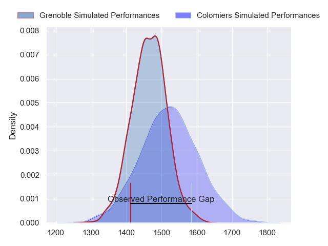
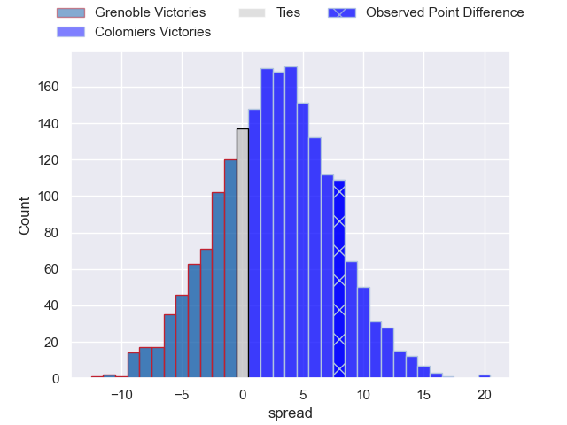
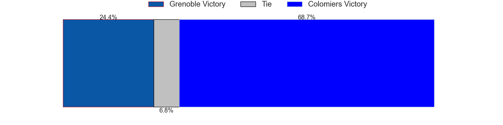
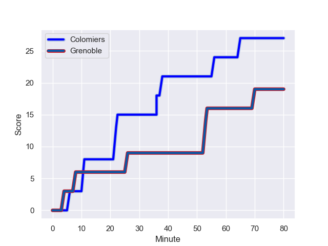
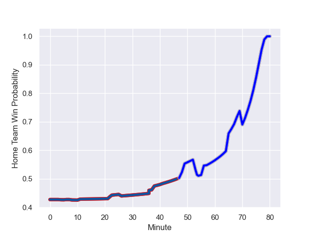

---  
layout: page  
title: Grenoble at Colomiers; 19-27  
date: 2023-08-25 18:00:00 -0500  
categories: match review  
---
# Grenoble at Colomiers; 19-27

# Club Level Predictions

The first set of predictions treats a club as the smallest object, as the club develops its members, organizes a gameplan, and deploys its players as needed for each match. This club model has a prediction of 0.58, which translates to predicting Colomiers to win by 2.8.

Each club has a rating and a rating deviation (simiar to a Glicko system), and expected performances can be generated. This allows for simulated matches and spreads like the ones below.
## Projected Performances

## Projected Spreads

## Projected Results

# Player Level Predictions - Version 1

Treating teams instead as an entity made up of the currently active players, I have ratings for each player in an altogether different system. These can be combined to form team ratings once teamsheets are announced, weighting starters a bit higher than the reserves. After the match is played, players can be weighted by their minutes on the field, allowing for an accurate measure of the team's composition. With these compiled team ratings, we can make predictions, measure inaccuracy, and update the individual player ratings.
## Prediction with Player Minutes: Grenoble by 8.8

Grenoble by 12.8 on a neutral field
## Prediction without Player Minutes: Grenoble by 8.9

Grenoble by 12.9 on a neutral pitch

## Scores over Time

## Win Probability over Time

There were 12 large changes in win probability in this match

|   Away Minutes | Away Player         |   Away elo |   Away Percentile |   Number |   Home Percentile |   Home elo | Home Player        |   Home Minutes |
|---------------:|:--------------------|-----------:|------------------:|---------:|------------------:|-----------:|:-------------------|---------------:|
|             49 | Zack Gauthier       |      96.36 |  995268           |        1 |  954256           |      68.27 | Guillaume Tartas   |             48 |
|             49 | Lilian Rossi        |      75.31 |       1.01947e+06 |        2 |  605858           |      54.24 | Thomas Larrieu     |             48 |
|             49 | Regis Montagne      |      94.48 |  971233           |        3 |  877772           |      58.9  | Hugo Pirlet        |             48 |
|             80 | Thomas Lainault     |     123.59 |  854292           |        4 |  771142           |     103.86 | Jean Thomas        |             80 |
|             57 | Brendon Nansen      |      76.55 |       1.01946e+06 |        5 |       1.01918e+06 |      74.21 | Jack Whetton       |             52 |
|             80 | Antonin Berruyer    |      72    |       1.01692e+06 |        6 |       1.0192e+06  |      67.63 | Robert Harley      |             80 |
|             80 | Steeve Blanc-Mappaz |      75.46 |       1.01695e+06 |        7 |       1.01916e+06 |      69.89 | Jeremy Bechu       |             52 |
|             80 | Talalelei Gray      |      78.18 |       1.01689e+06 |        8 |  659475           |      85.31 | Aldric Lescure     |             80 |
|             62 | Barnabé Couilloud   |      75.84 |       1.01944e+06 |        9 |  969110           |      59.1  | Ugo Seguela        |             68 |
|             72 | Sam Davies          |      79.46 |       1.01944e+06 |       10 |       1.01919e+06 |      74.09 | Maxime Javaux      |             80 |
|             80 | Erwan Dridi         |      75.03 |       1.01946e+06 |       11 |  965770           |      63.56 | Martin Dulon       |             80 |
|             41 | Romain Barthélémy   |      75.5  |       1.01688e+06 |       12 |       1.0169e+06  |      78.76 | Dorian Laborde     |             54 |
|             80 | Romain Trouilloud   |      78.85 |  974235           |       13 |  619391           |      81.18 | Fabien Perrin      |             80 |
|             80 | Nathan Farissier    |      76.72 |       1.00798e+06 |       14 |       1.01996e+06 |      67.96 | Lucas Paulien-Camy |             62 |
|             80 | Geoffrey Cros       |      77.47 |       1.01945e+06 |       15 |  659965           |      62    | Thomas Girard      |             80 |
|             39 | Romain Fusier       |      73.57 |  967236           |       16 |  653340           |      72.99 | Thomas Dubois      |             32 |
|             31 | Luka Goginava       |      74.43 |  917621           |       17 |     nan           |      72.79 | Pablo Dimcheff     |             32 |
|             31 | Mathis Sarragallet  |      59.69 |  969996           |       18 |     nan           |      71.88 | Marco Fepulea'i    |             32 |
|             31 | Vincent Vial        |      73.99 |       1.00795e+06 |       19 |  947283           |      62.55 | Waël Ponpon        |             28 |
|             23 | Bernabe Massa       |      84.61 |       1.01446e+06 |       20 |       1.01359e+06 |      80.57 | Louis Descoux      |             28 |
|             18 | Éric Escande        |      78.77 |       1.01693e+06 |       21 |       1.01917e+06 |      68.7  | Enzo Salles        |             26 |
|              8 | Max Clément         |      75.81 |     nan           |       22 |       1.0192e+06  |      70.27 | Ugo Pacome         |             18 |
|            nan | nan                 |     nan    |     nan           |       23 |     nan           |      73.13 | Edoardo Gori       |             12 |

# Player Level Predictions - Version 2

Treating teams instead as an entity made up of the currently active players, I have ratings for each player in an altogether different system. These can be combined to form team ratings once teamsheets are announced, weighting starters a bit higher than the reserves. After the match is played, players can be weighted by their minutes on the field, allowing for an accurate measure of the team's composition. With these compiled team ratings, we can make predictions, measure inaccuracy, and update the individual player ratings.
## Prediction with Player Minutes: Colomiers by 4.6

Grenoble by 0.1 on a neutral field
## Prediction without Player Minutes: Colomiers by 3.7

Grenoble by 0.8 on a neutral pitch

|   Away Minutes | Away Player         |   Away elo |   Away variance |   Number |   Home variance |   Home elo | Home Player        |   Home Minutes |
|---------------:|:--------------------|-----------:|----------------:|---------:|----------------:|-----------:|:-------------------|---------------:|
|             49 | Zack Gauthier       |      64.55 |           49.82 |        1 |              50 |      50.82 | Guillaume Tartas   |             48 |
|             49 | Lilian Rossi        |      46.65 |           50    |        2 |              50 |      21.66 | Thomas Larrieu     |             48 |
|             49 | Regis Montagne      |      48.66 |           50    |        3 |              50 |      27.86 | Hugo Pirlet        |             48 |
|             80 | Thomas Lainault     |      60.57 |           50    |        4 |              50 |      43.98 | Jean Thomas        |             80 |
|             57 | Brendon Nansen      |      46.65 |           50    |        5 |              50 |      46.65 | Jack Whetton       |             52 |
|             80 | Antonin Berruyer    |      46.65 |           50    |        6 |              50 |      46.65 | Robert Harley      |             80 |
|             80 | Steeve Blanc-Mappaz |      46.65 |           50    |        7 |              50 |      46.65 | Jeremy Bechu       |             52 |
|             80 | Talalelei Gray      |      46.65 |           50    |        8 |              50 |      74.66 | Aldric Lescure     |             80 |
|             62 | Barnabé Couilloud   |      46.65 |           50    |        9 |              50 |      39.55 | Ugo Seguela        |             68 |
|             72 | Sam Davies          |      46.65 |           50    |       10 |              50 |      46.65 | Maxime Javaux      |             80 |
|             80 | Erwan Dridi         |      46.65 |           50    |       11 |              50 |      43    | Martin Dulon       |             80 |
|             41 | Romain Barthélémy   |      46.65 |           50    |       12 |              50 |      46.65 | Dorian Laborde     |             54 |
|             80 | Romain Trouilloud   |      42.81 |           50    |       13 |              50 |      61.61 | Fabien Perrin      |             80 |
|             80 | Nathan Farissier    |      25.37 |           50    |       14 |              50 |      46.65 | Lucas Paulien-Camy |             62 |
|             80 | Geoffrey Cros       |      46.65 |           50    |       15 |              50 |      48.44 | Thomas Girard      |             80 |
|             39 | Romain Fusier       |      40.39 |           50    |       16 |              50 |      45.61 | Thomas Dubois      |             32 |
|             31 | Luka Goginava       |      53.46 |           50    |       17 |              50 |      46.65 | Pablo Dimcheff     |             32 |
|             31 | Mathis Sarragallet  |      43.26 |           50    |       18 |              50 |      46.65 | Marco Fepulea'i    |             32 |
|             31 | Vincent Vial        |      45.82 |           50    |       19 |              50 |      34.61 | Waël Ponpon        |             28 |
|             23 | Bernabe Massa       |      54.34 |           50    |       20 |              50 |      47.63 | Louis Descoux      |             28 |
|             18 | Éric Escande        |      46.65 |           50    |       21 |              50 |      46.65 | Enzo Salles        |             26 |
|              8 | Max Clément         |      46.65 |           50    |       22 |              50 |      46.65 | Ugo Pacome         |             18 |
|            nan | nan                 |     nan    |          nan    |       23 |              50 |      46.65 | Edoardo Gori       |             12 |

