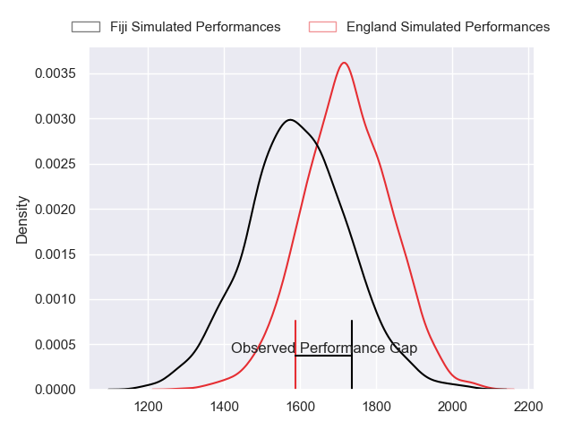
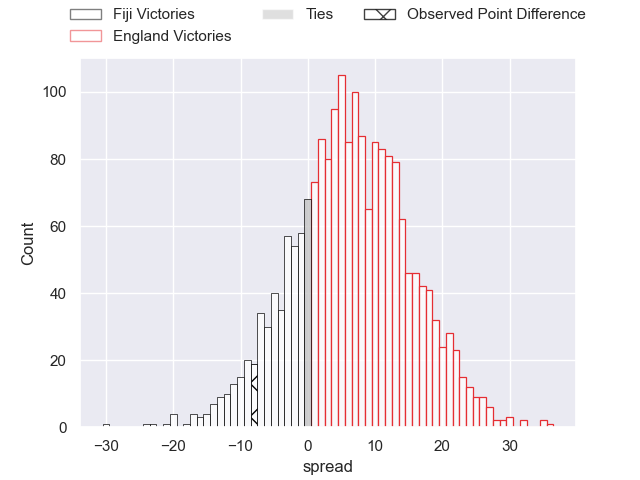
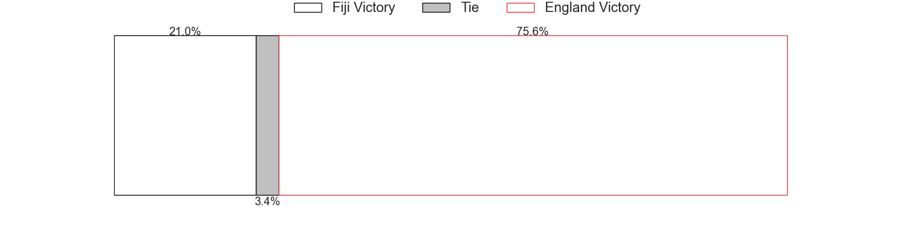
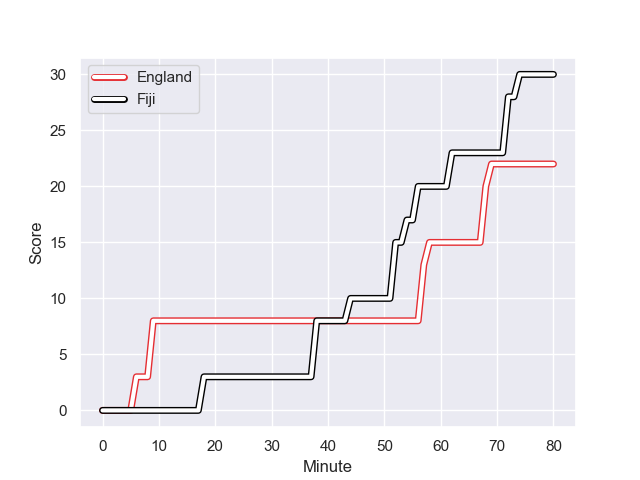
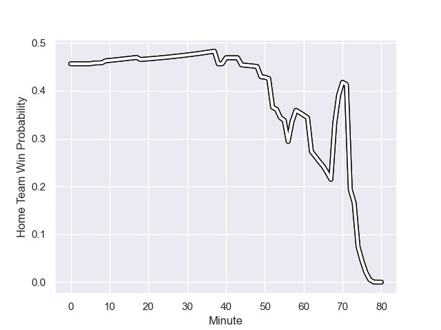

---  
layout: page  
title: Fiji at England; 30.0-22.0  
date: 2023-08-25 18:00:00 -0500  
categories: match review  
---
# Fiji at England; 30.0-22.0

# Club Level Predictions

The first set of predictions treats a club as the smallest object, as the club develops its members, organizes a gameplan, and deploys its players as needed for each match. This club model has a prediction of 0.665, which translates to predicting England to win by 6.5.

Each club has a rating and a rating deviation (simiar to a Glicko system), and expected performances can be generated. This allows for simulated matches and spreads like the ones below.
## Projected Performances

## Projected Spreads

## Projected Results

# Player Level Predictions - Version 1

Treating teams instead as an entity made up of the currently active players, I have ratings for each player in an altogether different system. These can be combined to form team ratings once teamsheets are announced, weighting starters a bit higher than the reserves. After the match is played, players can be weighted by their minutes on the field, allowing for an accurate measure of the team's composition. With these compiled team ratings, we can make predictions, measure inaccuracy, and update the individual player ratings.
## Prediction with Player Minutes: Fiji by 3.6

Fiji by 7.6 on a neutral field
## Prediction without Player Minutes: Fiji by 3.5

Fiji by 7.5 on a neutral pitch

## Scores over Time

## Win Probability over Time

There were 12 large changes in win probability in this match

|   Away Minutes | Away Player             |   Away elo |   Away Percentile |   Number |   Home Percentile |   Home elo | Home Player     |   Home Minutes |
|---------------:|:------------------------|-----------:|------------------:|---------:|------------------:|-----------:|:----------------|---------------:|
|             62 | Eroni Mawi              |      53.39 |            898495 |        1 |  814930           |      75.22 | Ellis Genge     |             51 |
|             80 | Sam Matavesi            |      61.67 |            906350 |        2 |  993555           |      82.39 | Theo Dan        |             74 |
|             70 | Luke Tagi               |      84.85 |            918486 |        3 |  365979           |      70.28 | Dan Cole        |             70 |
|             80 | Isoa Nasilasila         |     128.93 |            999040 |        4 |  669700           |      87.47 | Maro Itoje      |             80 |
|             65 | Te Ahiwaru Cirikidaveta |      96.75 |            894254 |        5 |  956814           |      83.56 | Ollie Chessum   |             70 |
|             67 | Albert Tuisue           |      69.07 |            885810 |        6 |  376284           |      74.06 | Courtney Lawes  |             80 |
|             53 | Lekima Tagitagivalu     |     104.65 |            897505 |        7 |  855153           |     112.06 | Jack Willis     |             57 |
|             78 | Viliame Mata            |      65.68 |            852387 |        8 |  856644           |      93.55 | Ben Earl        |             80 |
|             49 | Frank Lomani            |      79.06 |            884178 |        9 |       1.01983e+06 |      81.82 | Alex Mitchell   |             70 |
|             80 | Caleb Muntz             |      88.87 |            943981 |       10 |  434978           |     104.39 | George Ford     |             80 |
|             80 | Vinaya Habosi           |     114.96 |            999096 |       11 |       1.01983e+06 |      82.02 | Jonny May       |             80 |
|             65 | Semi Radradra           |     122.09 |            894950 |       12 |  512453           |     107.79 | Manu Tuilagi    |             80 |
|             75 | Waisea Nayacalevu       |      99.43 |           1011210 |       13 |  899418           |      72.56 | Ollie Lawrence  |             54 |
|             80 | Selestino Ravutaumada   |     100.41 |            999122 |       14 |  772614           |      72.71 | Max Malins      |             80 |
|             80 | Ilaisa Droasese         |      84.48 |            975563 |       15 |  935993           |      84.92 | Freddie Steward |             54 |
|              2 | Zuriel Togiatama        |      77.3  |            986840 |       16 |     nan           |      81.64 | Jack Walker     |              6 |
|             27 | Jone Koroiduadua        |      84.58 |            944839 |       17 |  439561           |      72.54 | Joe Marler      |             29 |
|             10 | Samuela Tawake          |      73.64 |           1014369 |       18 |  855044           |      55.23 | Will Stuart     |             10 |
|             18 | Temo Mayanavanua        |      92.8  |            920264 |       19 |  865386           |      95.94 | David Ribbans   |             10 |
|             28 | Vilive Miramira         |      76.59 |            998958 |       20 |       1.01816e+06 |      83.68 | Lewis Ludlam    |             23 |
|             31 | Simione Kuruvoli        |      91.88 |            984830 |       21 |  248851           |     122.57 | Danny Care      |             10 |
|              5 | Teti Tela               |     105.57 |            798127 |       22 |  885108           |     101.8  | Marcus Smith    |             26 |
|             15 | Kalaveti Ravouvou       |     145.16 |            999070 |       23 |  779675           |      73.94 | Joe Marchant    |             26 |

# Player Level Predictions - Version 2

Treating teams instead as an entity made up of the currently active players, I have ratings for each player in an altogether different system. These can be combined to form team ratings once teamsheets are announced, weighting starters a bit higher than the reserves. After the match is played, players can be weighted by their minutes on the field, allowing for an accurate measure of the team's composition. With these compiled team ratings, we can make predictions, measure inaccuracy, and update the individual player ratings.
## Prediction with Player Minutes: England by 12.4

England by 8.7 on a neutral field
## Prediction without Player Minutes: England by 10.9

England by 7.2 on a neutral pitch

|   Away Minutes | Away Player             |   Away elo |   Away variance |   Number |   Home variance |   Home elo | Home Player     |   Home Minutes |
|---------------:|:------------------------|-----------:|----------------:|---------:|----------------:|-----------:|:----------------|---------------:|
|             62 | Eroni Mawi              |      55.08 |           49.83 |        1 |           50    |      51.82 | Ellis Genge     |             51 |
|             80 | Sam Matavesi            |      62.65 |           49.84 |        2 |           50    |      50.11 | Theo Dan        |             74 |
|             70 | Luke Tagi               |      59.04 |           49.79 |        3 |           50    |      48.55 | Dan Cole        |             70 |
|             80 | Isoa Nasilasila         |      59.2  |           47.48 |        4 |           50    |     114.52 | Maro Itoje      |             80 |
|             65 | Te Ahiwaru Cirikidaveta |      48.85 |           48.41 |        5 |           50    |      59.86 | Ollie Chessum   |             70 |
|             67 | Albert Tuisue           |      92.39 |           49.79 |        6 |           50    |     102.76 | Courtney Lawes  |             80 |
|             53 | Lekima Tagitagivalu     |      65.62 |           49.79 |        7 |           49.92 |      91.51 | Jack Willis     |             57 |
|             78 | Viliame Mata            |      50.28 |           49.78 |        8 |           50    |      95.95 | Ben Earl        |             80 |
|             49 | Frank Lomani            |      61.6  |           48.23 |        9 |           50    |      46.65 | Alex Mitchell   |             70 |
|             80 | Caleb Muntz             |      51.74 |           49.25 |       10 |           50    |     101.37 | George Ford     |             80 |
|             80 | Vinaya Habosi           |      50.45 |           50    |       11 |           50    |      46.65 | Jonny May       |             80 |
|             65 | Semi Radradra           |     127.98 |           49.79 |       12 |           50    |     109.81 | Manu Tuilagi    |             80 |
|             75 | Waisea Nayacalevu       |      53.79 |           49.79 |       13 |           50    |      60.29 | Ollie Lawrence  |             54 |
|             80 | Selestino Ravutaumada   |      64.29 |           47.67 |       14 |           50    |      64.89 | Max Malins      |             80 |
|             80 | Ilaisa Droasese         |      59.85 |           48.02 |       15 |           49.59 |      63.33 | Freddie Steward |             54 |
|              2 | Zuriel Togiatama        |      42.08 |           49.64 |       16 |           50    |      46.65 | Jack Walker     |              6 |
|             27 | Jone Koroiduadua        |      44.11 |           50    |       17 |           50    |     107.79 | Joe Marler      |             29 |
|             10 | Samuela Tawake          |      46.43 |           48.95 |       18 |           50    |      38.48 | Will Stuart     |             10 |
|             18 | Temo Mayanavanua        |      66.98 |           49.66 |       19 |           50    |      73.09 | David Ribbans   |             10 |
|             28 | Vilive Miramira         |      56.54 |           48.59 |       20 |           50    |      46.65 | Lewis Ludlam    |             23 |
|             31 | Simione Kuruvoli        |      43.63 |           49.93 |       21 |           50    |     140.05 | Danny Care      |             10 |
|              5 | Teti Tela               |      66.93 |           50    |       22 |           50    |      77.71 | Marcus Smith    |             26 |
|             15 | Kalaveti Ravouvou       |      54.79 |           48.11 |       23 |           50    |      93.18 | Joe Marchant    |             26 |

