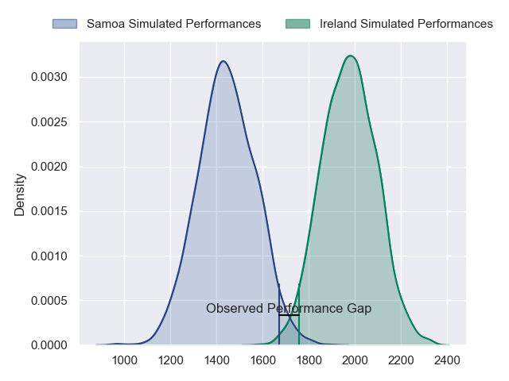
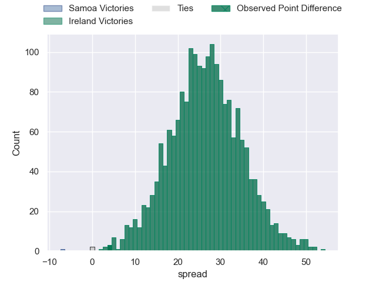
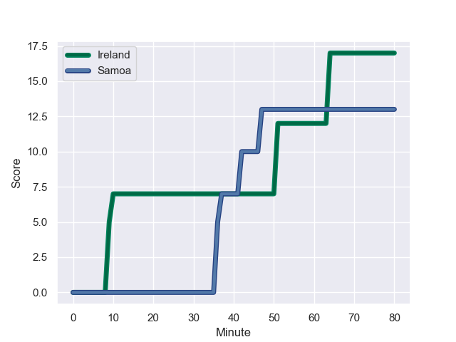
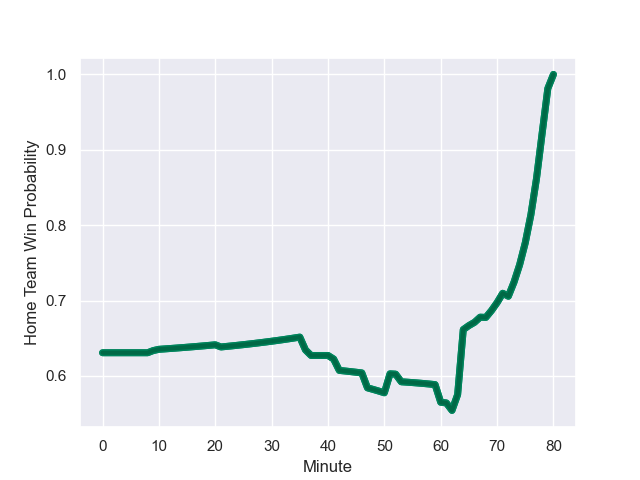

---  
layout: page  
title: Samoa at Ireland; 13.0-17.0  
date: 2023-08-25 18:00:00 -0500  
categories: match review  
---
# Samoa at Ireland; 13.0-17.0

# Club Level Predictions

The first set of predictions treats a club as the smallest object, as the club develops its members, organizes a gameplan, and deploys its players as needed for each match. This club model has a prediction of 0.944, which translates to predicting Ireland to win by 26.5.

Each club has a rating and a rating deviation (simiar to a Glicko system), and expected performances can be generated. This allows for simulated matches and spreads like the ones below.
## Projected Performances

## Projected Spreads

## Projected Results

# Player Level Predictions - Version 1

Treating teams instead as an entity made up of the currently active players, I have ratings for each player in an altogether different system. These can be combined to form team ratings once teamsheets are announced, weighting starters a bit higher than the reserves. After the match is played, players can be weighted by their minutes on the field, allowing for an accurate measure of the team's composition. With these compiled team ratings, we can make predictions, measure inaccuracy, and update the individual player ratings.
## Prediction with Player Minutes: Ireland by 27.3

Ireland by 23.3 on a neutral field
## Prediction without Player Minutes: Ireland by 27.8

Ireland by 23.8 on a neutral pitch

## Scores over Time

## Win Probability over Time

There were 7 large changes in win probability in this match

|   Away Minutes | Away Player           |   Away elo |   Away Percentile |   Number |   Home Percentile |   Home elo | Home Player        |   Home Minutes |
|---------------:|:----------------------|-----------:|------------------:|---------:|------------------:|-----------:|:-------------------|---------------:|
|             63 | James Lay             |      79.49 |       1.01872e+06 |        1 |            362906 |     113.26 | Cian Healy         |             21 |
|             51 | Seilala Lam           |      83.4  |       1.01692e+06 |        2 |            995150 |      83.83 | Tom Stewart        |             51 |
|             47 | Paul Alo-Emile        |      95.43 |  631911           |        3 |            617287 |      87.03 | Finlay Bealham     |             62 |
|             41 | Chris Vui             |      76.99 |  781379           |        4 |            619205 |     118.17 | Iain Henderson     |             60 |
|             80 | Theo McFarland        |     100.08 |       1.00578e+06 |        5 |            798424 |     152.29 | Tadhg Beirne       |             80 |
|             80 | Taleni Seu            |      82.05 |  785080           |        6 |            938192 |      99.71 | Ryan Baird         |             60 |
|             80 | Fritz Lee             |     122.37 |  488725           |        7 |            757725 |     116.51 | Josh van der Flier |             80 |
|             63 | Steven Luatua         |     121.12 |  571174           |        8 |            910921 |     112.99 | Caelan Doris       |             80 |
|             68 | Jonathan Taumateine   |      75.24 |  834156           |        9 |            410805 |     129.35 | Conor Murray       |             72 |
|             80 | Lima Sopoaga          |      85.88 |       1.01733e+06 |       10 |            969188 |     112.47 | Jack Crowley       |             80 |
|             80 | Nigel Ah Wong         |      95.97 |  673247           |       11 |            811894 |      90.33 | Jacob Stockdale    |             66 |
|             80 | Tumua Manu            |     113.35 |  882297           |       12 |            719231 |     115.19 | Stuart McCloskey   |             80 |
|             80 | Ulupano Seuteni       |      89.42 |  779953           |       13 |            641615 |     148.65 | Robbie Henshaw     |             80 |
|             51 | Ed Fidow              |      56.87 |  884083           |       14 |            924368 |      81.13 | Mack Hansen        |             80 |
|             80 | Duncan Paia'aua       |     126.28 |  773552           |       15 |            930679 |     116.33 | Jimmy O'Brien      |             53 |
|             29 | Sama Malolo           |      84.83 |  910768           |       16 |            460859 |      85.67 | Rob Herring        |             29 |
|             17 | Jordan Lay            |      67.45 |  882556           |       17 |            811563 |     105.42 | Jeremy Loughman    |             59 |
|             33 | Michael Alaalatoa     |      93.68 |  732010           |       18 |            908795 |      68.66 | Tom O'Toole        |             18 |
|             17 | Miracle Faiilagi      |      87.14 |       1.01488e+06 |       19 |            873651 |     102.43 | James Ryan         |             20 |
|             39 | Jordan Taufua         |      87.19 |     nan           |       20 |            443408 |      68.29 | Peter O'Mahony     |             20 |
|             12 | Ere Enari             |      93.78 |  839453           |       21 |            938300 |      83.93 | Craig Casey        |              8 |
|              0 | Christian Leali'ifano |     104.34 |  330182           |       22 |            794744 |      95.93 | Ross Byrne         |             27 |
|             29 | Neria Fomai           |      83.99 |       1.00767e+06 |       23 |            794912 |      86.63 | Garry Ringrose     |             14 |

# Player Level Predictions - Version 2

Treating teams instead as an entity made up of the currently active players, I have ratings for each player in an altogether different system. These can be combined to form team ratings once teamsheets are announced, weighting starters a bit higher than the reserves. After the match is played, players can be weighted by their minutes on the field, allowing for an accurate measure of the team's composition. With these compiled team ratings, we can make predictions, measure inaccuracy, and update the individual player ratings.
## Prediction with Player Minutes: Ireland by 25.2

Ireland by 21.5 on a neutral field
## Prediction without Player Minutes: Ireland by 24.5

Ireland by 20.8 on a neutral pitch

|   Away Minutes | Away Player           |   Away elo |   Away variance |   Number |   Home variance |   Home elo | Home Player        |   Home Minutes |
|---------------:|:----------------------|-----------:|----------------:|---------:|----------------:|-----------:|:-------------------|---------------:|
|             63 | James Lay             |      46.65 |           50    |        1 |              50 |      86.36 | Cian Healy         |             21 |
|             51 | Seilala Lam           |      46.65 |           50    |        2 |              50 |      43.05 | Tom Stewart        |             51 |
|             47 | Paul Alo-Emile        |      71.91 |           48.36 |        3 |              50 |      99.25 | Finlay Bealham     |             62 |
|             41 | Chris Vui             |      50.11 |           48.03 |        4 |              50 |      77.64 | Iain Henderson     |             60 |
|             80 | Theo McFarland        |      54.48 |           50    |        5 |              50 |     138.93 | Tadhg Beirne       |             80 |
|             80 | Taleni Seu            |      70.73 |           48.25 |        6 |              50 |      80.2  | Ryan Baird         |             60 |
|             80 | Fritz Lee             |      91.38 |           49.13 |        7 |              50 |     117.33 | Josh van der Flier |             80 |
|             63 | Steven Luatua         |      97.07 |           49.9  |        8 |              50 |     113.08 | Caelan Doris       |             80 |
|             68 | Jonathan Taumateine   |      35.39 |           49.44 |        9 |              50 |     125.08 | Conor Murray       |             72 |
|             80 | Lima Sopoaga          |      46.65 |           50    |       10 |              50 |      57.47 | Jack Crowley       |             80 |
|             80 | Nigel Ah Wong         |      61.88 |           49.86 |       11 |              50 |      71.81 | Jacob Stockdale    |             66 |
|             80 | Tumua Manu            |      81.42 |           49.68 |       12 |              50 |      95.76 | Stuart McCloskey   |             80 |
|             80 | Ulupano Seuteni       |      50.58 |           46.06 |       13 |              50 |     101.09 | Robbie Henshaw     |             80 |
|             51 | Ed Fidow              |      -0.33 |           48    |       14 |              50 |      79.33 | Mack Hansen        |             80 |
|             80 | Duncan Paia'aua       |      63.17 |           49.46 |       15 |              50 |      81.03 | Jimmy O'Brien      |             53 |
|             29 | Sama Malolo           |      40.62 |           49.92 |       16 |              50 |      79.88 | Rob Herring        |             29 |
|             17 | Jordan Lay            |      26.02 |           48.86 |       17 |              50 |      92.48 | Jeremy Loughman    |             59 |
|             33 | Michael Alaalatoa     |      76.99 |           50    |       18 |              50 |      47.6  | Tom O'Toole        |             18 |
|             17 | Miracle Faiilagi      |      55.79 |           48.74 |       19 |              50 |      90.68 | James Ryan         |             20 |
|             39 | Jordan Taufua         |      46.65 |           50    |       20 |              50 |     101.09 | Peter O'Mahony     |             20 |
|             12 | Ere Enari             |      30.07 |           48.75 |       21 |              50 |      71.7  | Craig Casey        |              8 |
|              0 | Christian Leali'ifano |      89.61 |           48.6  |       22 |              50 |      95.37 | Ross Byrne         |             27 |
|             29 | Neria Fomai           |      45.36 |           49.85 |       23 |              50 |     116.71 | Garry Ringrose     |             14 |

