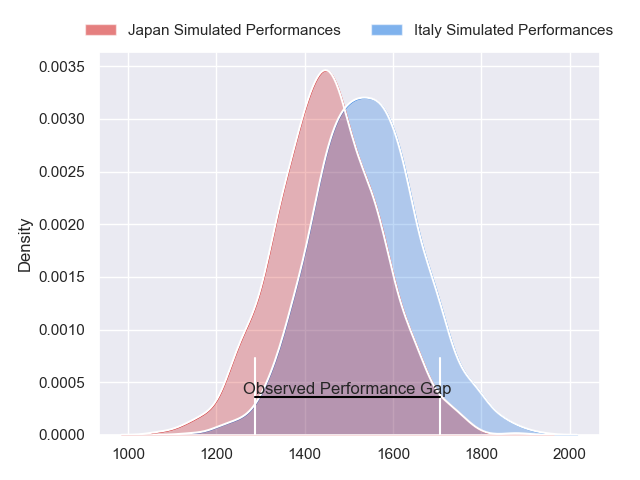
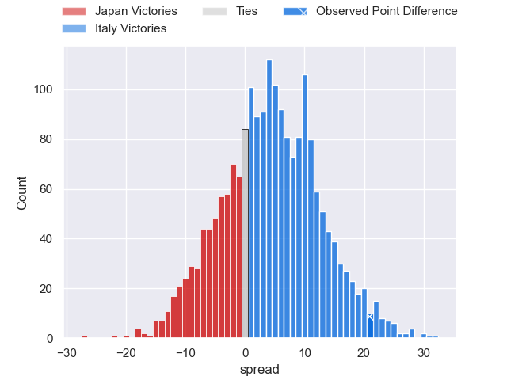
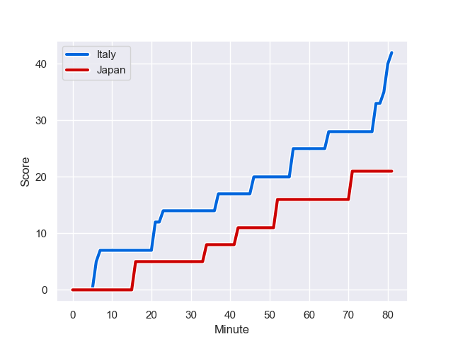
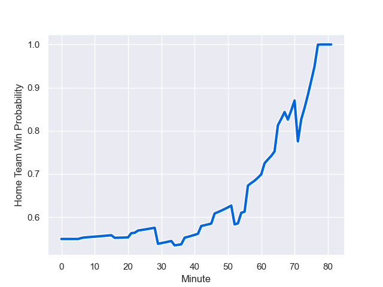

---  
layout: page  
title: Japan at Italy; 21.0-42.0  
date: 2023-08-25 18:00:00 -0500  
categories: match review  
---
# Japan at Italy; 21.0-42.0

# Club Level Predictions

The first set of predictions treats a club as the smallest object, as the club develops its members, organizes a gameplan, and deploys its players as needed for each match. This club model has a prediction of 0.613, which translates to predicting Italy to win by 4.3.

Each club has a rating and a rating deviation (simiar to a Glicko system), and expected performances can be generated. This allows for simulated matches and spreads like the ones below.
## Projected Performances

## Projected Spreads

## Projected Results

# Player Level Predictions - Version 1

Treating teams instead as an entity made up of the currently active players, I have ratings for each player in an altogether different system. These can be combined to form team ratings once teamsheets are announced, weighting starters a bit higher than the reserves. After the match is played, players can be weighted by their minutes on the field, allowing for an accurate measure of the team's composition. With these compiled team ratings, we can make predictions, measure inaccuracy, and update the individual player ratings.
## Prediction with Player Minutes: Italy by 12.6

Italy by 8.6 on a neutral field
## Prediction without Player Minutes: Italy by 12.9

Italy by 8.9 on a neutral pitch

## Scores over Time

## Win Probability over Time

There were 12 large changes in win probability in this match

|   Away Minutes | Away Player       |   Away elo |   Away Percentile |   Number |   Home Percentile |   Home elo | Home Player         |   Home Minutes |
|---------------:|:------------------|-----------:|------------------:|---------:|------------------:|-----------:|:--------------------|---------------:|
|             54 | Craig Millar      |      80.23 |  690531           |        1 |            962260 |      88.83 | Ivan Nemer          |             29 |
|             61 | Shota Horie       |     119.37 |  438127           |        2 |            957110 |     126.87 | Giacomo Nicotera    |             55 |
|             54 | Jiwon Gu          |      79.87 |       1.0116e+06  |        3 |            705208 |      75.46 | Simone Ferrari      |             54 |
|             81 | Jack Cornelsen    |     106.44 |  790935           |        4 |            929198 |      62.43 | Niccolo Cannone     |             54 |
|             42 | Uwe Helu          |      85.99 |  843098           |        5 |            774841 |     100.31 | Federico Ruzza      |             72 |
|             81 | Michael Leitch    |      87.21 |  387055           |        6 |            882772 |      84.75 | Sebastian Negri     |             81 |
|             61 | Shota Fukui       |      88.33 |       1.01794e+06 |        7 |            926307 |     104.88 | Michele Lamaro      |             81 |
|             81 | Kazuki Himeno     |      73.07 |  877191           |        8 |            972462 |      78.16 | Lorenzo Cannone     |             54 |
|             58 | Yutaka Nagare     |      75.98 |  804887           |        9 |            961120 |      59.17 | Stephen Varney      |             72 |
|             42 | Seungsin Lee      |      73.23 |  995986           |       10 |            950843 |      85.24 | Paolo Garbisi       |             81 |
|             81 | Jone Naikabula    |      68.42 |       1.01794e+06 |       11 |            746102 |     124.13 | Monty Ioane         |             81 |
|             68 | Tomoki Osada      |      72.5  |       1.01795e+06 |       12 |            581418 |     118.59 | Luca Morisi         |             81 |
|             81 | Dylan Riley       |     101    |  891041           |       13 |            622579 |     108.59 | Juan Ignacio Brex   |             81 |
|             81 | Semisi Masirewa   |     110.68 |  689003           |       14 |            938887 |     101.99 | Ange Capuozzo       |             63 |
|             81 | Kotaro Matsushima |      94.83 |  727127           |       15 |            699744 |      87.23 | Tommaso Allan       |             81 |
|             20 | Atsushi Sakate    |      64.66 |  849381           |       16 |            705887 |      69.31 | Luca Bigi           |             26 |
|             27 | Keita Inagaki     |      89.91 |  692952           |       17 |            933049 |      75.99 | Danilo Fischetti    |             52 |
|             27 | Asaeli Ai Valu    |     118.14 |  808985           |       18 |            796791 |      96.25 | Pietro Ceccarelli   |             27 |
|             39 | Amanaki Saumaki   |      84.84 |     nan           |       19 |            893245 |     116.96 | Dino Lamb           |             27 |
|             20 | Ben Gunter        |     106.07 |  879209           |       20 |            835752 |     123.87 | Giovanni Pettinelli |              9 |
|             23 | Naoto Saito       |      78.54 |  959099           |       21 |            958339 |      92.34 | Manuel Zuliani      |             27 |
|             39 | Rikiya Matsuda    |      71.04 |  824556           |       22 |            965915 |     104.72 | Martin Page-Relo    |              9 |
|             13 | Ryoto Nakamura    |     119.14 |  808291           |       23 |            803058 |      98.82 | Paolo Odogwu        |             18 |

# Player Level Predictions - Version 2

Treating teams instead as an entity made up of the currently active players, I have ratings for each player in an altogether different system. These can be combined to form team ratings once teamsheets are announced, weighting starters a bit higher than the reserves. After the match is played, players can be weighted by their minutes on the field, allowing for an accurate measure of the team's composition. With these compiled team ratings, we can make predictions, measure inaccuracy, and update the individual player ratings.
## Prediction with Player Minutes: Japan by 2.4

Japan by 5.9 on a neutral field
## Prediction without Player Minutes: Japan by 0.0

Japan by 3.6 on a neutral pitch

|   Away Minutes | Away Player       |   Away elo |   Away variance |   Number |   Home variance |   Home elo | Home Player         |   Home Minutes |
|---------------:|:------------------|-----------:|----------------:|---------:|----------------:|-----------:|:--------------------|---------------:|
|             54 | Craig Millar      |      54.37 |           49.9  |        1 |           50    |      60.92 | Ivan Nemer          |             29 |
|             61 | Shota Horie       |     118.57 |           49.9  |        2 |           50    |      88.03 | Giacomo Nicotera    |             55 |
|             54 | Jiwon Gu          |      38.34 |           49.77 |        3 |           50    |      87.64 | Simone Ferrari      |             54 |
|             81 | Jack Cornelsen    |      99.67 |           49.62 |        4 |           50    |      32.68 | Niccolo Cannone     |             54 |
|             42 | Uwe Helu          |      70.54 |           49.85 |        5 |           49.88 |      97.45 | Federico Ruzza      |             72 |
|             81 | Michael Leitch    |     105.76 |           49.8  |        6 |           50    |      54.95 | Sebastian Negri     |             81 |
|             61 | Shota Fukui       |      46.65 |           50    |        7 |           50    |      90.08 | Michele Lamaro      |             81 |
|             81 | Kazuki Himeno     |      73.47 |           49.62 |        8 |           49.95 |      75.04 | Lorenzo Cannone     |             54 |
|             58 | Yutaka Nagare     |      77.61 |           49.8  |        9 |           50    |      31.82 | Stephen Varney      |             72 |
|             42 | Seungsin Lee      |      21.1  |           49.72 |       10 |           50    |      48.61 | Paolo Garbisi       |             81 |
|             81 | Jone Naikabula    |      45.46 |           49.81 |       11 |           49.88 |      87.77 | Monty Ioane         |             81 |
|             68 | Tomoki Osada      |      45.46 |           49.81 |       12 |           49.91 |      84.68 | Luca Morisi         |             81 |
|             81 | Dylan Riley       |     117.44 |           49.62 |       13 |           50    |      87.58 | Juan Ignacio Brex   |             81 |
|             81 | Semisi Masirewa   |      63.4  |           49.81 |       14 |           50    |      80.66 | Ange Capuozzo       |             63 |
|             81 | Kotaro Matsushima |     104.83 |           49.76 |       15 |           49.88 |      48.03 | Tommaso Allan       |             81 |
|             20 | Atsushi Sakate    |      44.98 |           49.71 |       16 |           50    |      41.64 | Luca Bigi           |             26 |
|             27 | Keita Inagaki     |      98.66 |           49.71 |       17 |           49.95 |      40.51 | Danilo Fischetti    |             52 |
|             27 | Asaeli Ai Valu    |      99.97 |           49.88 |       18 |           49.91 |      41.34 | Pietro Ceccarelli   |             27 |
|             39 | Amanaki Saumaki   |      46.65 |           50    |       19 |           50    |      61.9  | Dino Lamb           |             27 |
|             20 | Ben Gunter        |     111.9  |           49.86 |       20 |           50    |      45.33 | Giovanni Pettinelli |              9 |
|             23 | Naoto Saito       |      45.84 |           49.81 |       21 |           49.92 |      49.64 | Manuel Zuliani      |             27 |
|             39 | Rikiya Matsuda    |     115.69 |           49.9  |       22 |           49.9  |      53.38 | Martin Page-Relo    |              9 |
|             13 | Ryoto Nakamura    |     119.53 |           50    |       23 |           50    |      74.88 | Paolo Odogwu        |             18 |

