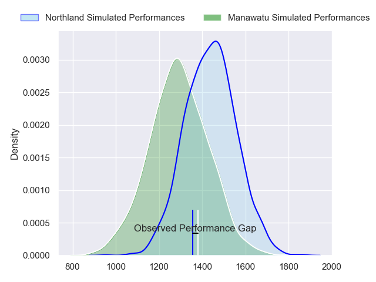
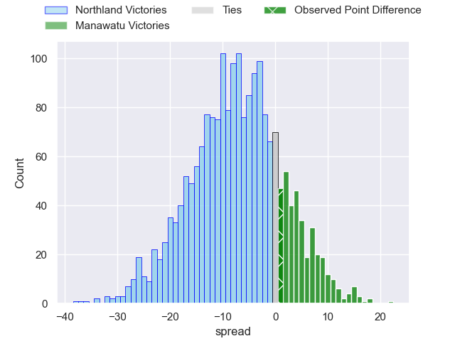
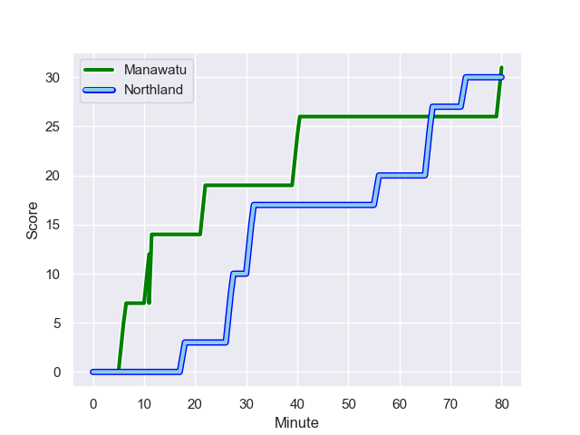
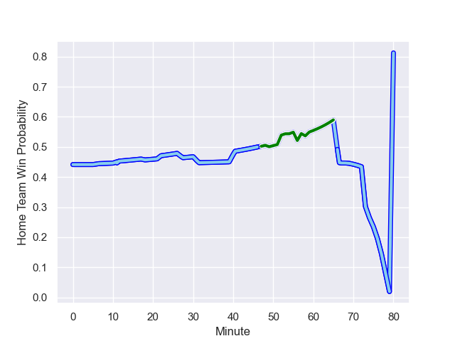

---  
layout: page  
title: Northland at Manawatu; 30-31  
date: 2023-08-25 18:00:00 -0500  
categories: match review  
---
# Northland at Manawatu; 30-31

# Club Level Predictions

The first set of predictions treats a club as the smallest object, as the club develops its members, organizes a gameplan, and deploys its players as needed for each match. This club model has a prediction of 0.315, which translates to predicting Northland to win by 7.2.

Each club has a rating and a rating deviation (simiar to a Glicko system), and expected performances can be generated. This allows for simulated matches and spreads like the ones below.
## Projected Performances

## Projected Spreads

## Projected Results

# Player Level Predictions - Version 1

Treating teams instead as an entity made up of the currently active players, I have ratings for each player in an altogether different system. These can be combined to form team ratings once teamsheets are announced, weighting starters a bit higher than the reserves. After the match is played, players can be weighted by their minutes on the field, allowing for an accurate measure of the team's composition. With these compiled team ratings, we can make predictions, measure inaccuracy, and update the individual player ratings.
## Prediction with Player Minutes: Northland by 6.2

Northland by 10.2 on a neutral field
## Prediction without Player Minutes: Northland by 6.3

Northland by 10.3 on a neutral pitch

## Scores over Time

## Win Probability over Time

There were 12 large changes in win probability in this match

|   Away Minutes | Away Player           |   Away elo |   Away Percentile |   Number |   Home Percentile |   Home elo | Home Player           |   Home Minutes |
|---------------:|:----------------------|-----------:|------------------:|---------:|------------------:|-----------:|:----------------------|---------------:|
|             49 | Jarred Adams          |      58.17 |       1.01695e+06 |        1 |       1.0195e+06  |      65.47 | Malakai Hala-Ngatai   |             49 |
|             49 | Matt Moulds           |      70.31 |       1.01859e+06 |        2 |       1.01904e+06 |      63.12 | Leif Schwenke         |             47 |
|             59 | Remsy Lemisio         |      80.39 |       1.01851e+06 |        3 |       1.01841e+06 |      61.7  | Flyn Yates            |             51 |
|             80 | Sam Weir Caird        |      73.26 |       1.01852e+06 |        4 |       1.01904e+06 |      62.4  | Stan van den Hoven    |             69 |
|             59 | Hayden Jurlina        |      70.57 |       1.01951e+06 |        5 |  941386           |      66.92 | Johannes Momsen       |             80 |
|             80 | Rob Rush              |      79    |       1.0185e+06  |        6 |       1.01842e+06 |      72.11 | Te Kamaka Howden      |             54 |
|             68 | Jonah Mau'u           |      74.29 |       1.01851e+06 |        7 |       1.0163e+06  |      64.91 | Slade McDowall        |             80 |
|             80 | Matt Matich           |      71.24 |       1.01859e+06 |        8 |  892903           |      59.94 | Brayden Iose          |             80 |
|             57 | Lisati Milo-Harris    |      75.94 |       1.01853e+06 |        9 |       1.0184e+06  |      61.1  | Jordi Viljoen         |             52 |
|             57 | Rivez Reihana         |      78.79 |       1.0185e+06  |       10 |  881947           |      96.6  | Brett Cameron         |             74 |
|             80 | Heremaia Murray       |      76.03 |       1.01854e+06 |       11 |       1.01645e+06 |      87.37 | Tima Fainga'anuku     |             80 |
|             57 | Blake Hohaia          |      75.58 |       1.01902e+06 |       12 |       1.01839e+06 |      66.16 | Kyle Brown            |             80 |
|             80 | Tamati Tua            |      99.67 |  828046           |       13 |       1.01631e+06 |      69.84 | Te Rangatira Waitokia |             58 |
|             80 | Brady Rush            |      75.39 |       1.01856e+06 |       14 |       1.01712e+06 |      70.98 | Drew Wild             |             80 |
|             80 | Joshua Moorby         |      89.11 |  946184           |       15 |       1.01761e+06 |      60.19 | Beaudein Waaka        |             80 |
|             31 | Rob Cobb              |      69.99 |       1.01713e+06 |       16 |       1.0184e+06  |      66.06 | Joseph Gavigan        |             31 |
|             21 | Coree Te Whata-Colley |      68.09 |     nan           |       17 |       1.0164e+06  |      60.69 | Cole Keith            |             29 |
|             31 | Bruce Kauika-Peterson |      75.52 |       1.01856e+06 |       18 |       1.01837e+06 |      62.09 | Raymond Tuputupu      |             33 |
|             21 | Sean Sweetman         |      66.4  |       1.01884e+06 |       19 |       1.01845e+06 |      65.15 | Ofa Tauatevalu        |             11 |
|             12 | Rory Woods            |      69.94 |     nan           |       20 |       1.01903e+06 |      62.84 | Terrell Peita         |             26 |
|             23 | Trent Hape            |      65.96 |     nan           |       21 |  960090           |     116.56 | John Poland           |             28 |
|             23 | Daniel Hawkins        |      64.59 |       1.01858e+06 |       22 |     nan           |      65.5  | Isaiah Ravula         |              6 |
|             23 | Rene Ranger           |      61.33 |     nan           |       23 |       1.01719e+06 |      45.71 | Jason Emery           |             22 |

# Player Level Predictions - Version 2

Treating teams instead as an entity made up of the currently active players, I have ratings for each player in an altogether different system. These can be combined to form team ratings once teamsheets are announced, weighting starters a bit higher than the reserves. After the match is played, players can be weighted by their minutes on the field, allowing for an accurate measure of the team's composition. With these compiled team ratings, we can make predictions, measure inaccuracy, and update the individual player ratings.
## Prediction with Player Minutes: Northland by 0.7

Northland by 4.0 on a neutral field
## Prediction without Player Minutes: Northland by 0.3

Northland by 3.6 on a neutral pitch

|   Away Minutes | Away Player           |   Away elo |   Away variance |   Number |   Home variance |   Home elo | Home Player           |   Home Minutes |
|---------------:|:----------------------|-----------:|----------------:|---------:|----------------:|-----------:|:----------------------|---------------:|
|             49 | Jarred Adams          |      46.65 |              50 |        1 |            50   |      46.65 | Malakai Hala-Ngatai   |             49 |
|             49 | Matt Moulds           |      46.65 |              50 |        2 |            50   |      46.65 | Leif Schwenke         |             47 |
|             59 | Remsy Lemisio         |      46.65 |              50 |        3 |            50   |      46.65 | Flyn Yates            |             51 |
|             80 | Sam Weir Caird        |      46.65 |              50 |        4 |            50   |      46.65 | Stan van den Hoven    |             69 |
|             59 | Hayden Jurlina        |      46.65 |              50 |        5 |            50   |     -10.25 | Johannes Momsen       |             80 |
|             80 | Rob Rush              |      46.65 |              50 |        6 |            50   |      46.65 | Te Kamaka Howden      |             54 |
|             68 | Jonah Mau'u           |      46.65 |              50 |        7 |            50   |      46.65 | Slade McDowall        |             80 |
|             80 | Matt Matich           |      46.65 |              50 |        8 |            50   |      24.15 | Brayden Iose          |             80 |
|             57 | Lisati Milo-Harris    |      46.65 |              50 |        9 |            50   |      46.65 | Jordi Viljoen         |             52 |
|             57 | Rivez Reihana         |      46.65 |              50 |       10 |            50   |      32.31 | Brett Cameron         |             74 |
|             80 | Heremaia Murray       |      46.65 |              50 |       11 |            50   |      46.65 | Tima Fainga'anuku     |             80 |
|             57 | Blake Hohaia          |      46.65 |              50 |       12 |            50   |      46.65 | Kyle Brown            |             80 |
|             80 | Tamati Tua            |      52.03 |              50 |       13 |            50   |      46.65 | Te Rangatira Waitokia |             58 |
|             80 | Brady Rush            |      46.65 |              50 |       14 |            50   |      46.65 | Drew Wild             |             80 |
|             80 | Joshua Moorby         |      45.64 |              50 |       15 |            50   |      46.65 | Beaudein Waaka        |             80 |
|             31 | Rob Cobb              |      46.65 |              50 |       16 |            50   |      46.65 | Joseph Gavigan        |             31 |
|             21 | Coree Te Whata-Colley |      46.65 |              50 |       17 |            50   |      46.65 | Cole Keith            |             29 |
|             31 | Bruce Kauika-Peterson |      46.65 |              50 |       18 |            50   |      46.65 | Raymond Tuputupu      |             33 |
|             21 | Sean Sweetman         |      46.65 |              50 |       19 |            50   |      46.65 | Ofa Tauatevalu        |             11 |
|             12 | Rory Woods            |      46.65 |              50 |       20 |            50   |      46.65 | Terrell Peita         |             26 |
|             23 | Trent Hape            |      46.65 |              50 |       21 |            48.4 |      44.18 | John Poland           |             28 |
|             23 | Daniel Hawkins        |      46.65 |              50 |       22 |            50   |      46.65 | Isaiah Ravula         |              6 |
|             23 | Rene Ranger           |      46.65 |              50 |       23 |            50   |      46.65 | Jason Emery           |             22 |

