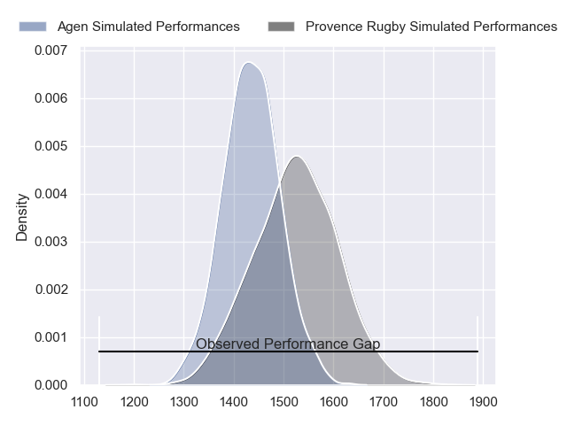
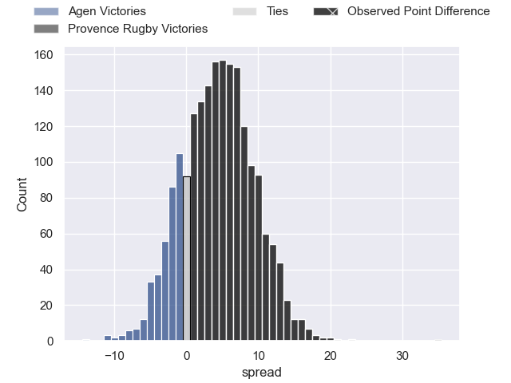
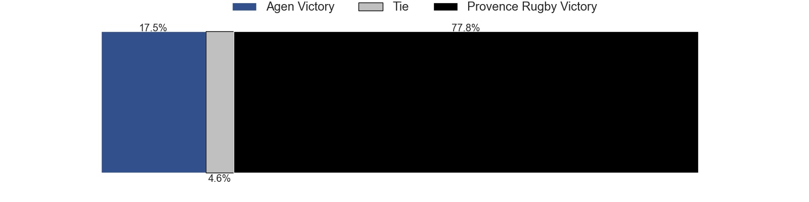
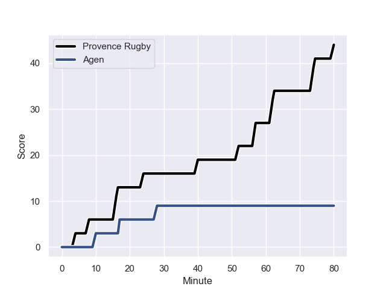
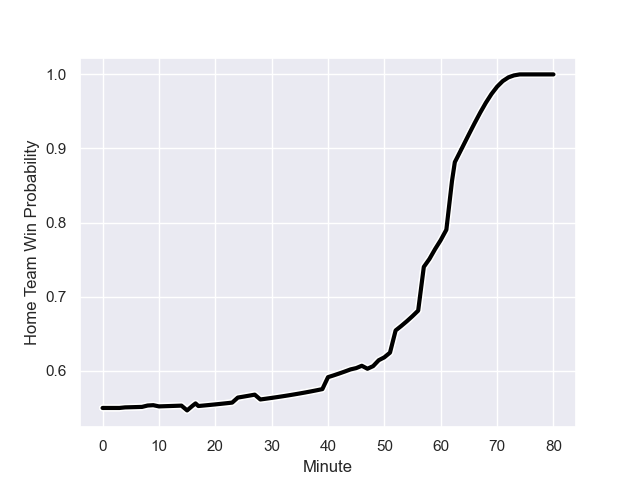

---  
layout: page  
title: Agen at Provence Rugby; 9-44  
date: 2023-08-25 18:00:00 -0500  
categories: match review  
---
# Agen at Provence Rugby; 9-44

# Club Level Predictions

The first set of predictions treats a club as the smallest object, as the club develops its members, organizes a gameplan, and deploys its players as needed for each match. This club model has a prediction of 0.623, which translates to predicting Provence Rugby to win by 4.4.

Each club has a rating and a rating deviation (simiar to a Glicko system), and expected performances can be generated. This allows for simulated matches and spreads like the ones below.
## Projected Performances

## Projected Spreads

## Projected Results

# Player Level Predictions - Version 1

Treating teams instead as an entity made up of the currently active players, I have ratings for each player in an altogether different system. These can be combined to form team ratings once teamsheets are announced, weighting starters a bit higher than the reserves. After the match is played, players can be weighted by their minutes on the field, allowing for an accurate measure of the team's composition. With these compiled team ratings, we can make predictions, measure inaccuracy, and update the individual player ratings.
## Prediction with Player Minutes: Provence Rugby by 12.7

Provence Rugby by 8.7 on a neutral field
## Prediction without Player Minutes: Provence Rugby by 14.0

Provence Rugby by 10.0 on a neutral pitch

## Scores over Time

## Win Probability over Time

There were 4 large changes in win probability in this match

|   Away Minutes | Away Player                   |   Away elo |   Away Percentile |   Number |   Home Percentile |   Home elo | Home Player         |   Home Minutes |
|---------------:|:------------------------------|-----------:|------------------:|---------:|------------------:|-----------:|:--------------------|---------------:|
|             45 | Hans Lombard-Buret            |      73.85 |       1.01923e+06 |        1 |       1.01937e+06 |      79.2  | Julius Nostadt      |             61 |
|             24 | Pierre Jouvin                 |      75.24 |       1.00677e+06 |        2 |       1.01938e+06 |      78.32 | Loïck Jammes        |             47 |
|             45 | Alex Burin                    |      72.66 |       1.01926e+06 |        3 |       1.00995e+06 |      94.04 | Paul Mallez         |             47 |
|             80 | Joe Maksymiw                  |      74.24 |       1.01923e+06 |        4 |       1.01938e+06 |      75.73 | Théo Hannoyer       |             51 |
|             45 | Corentin Vernet               |      71.39 |       1.01993e+06 |        5 |       1.01937e+06 |      83.62 | Josh Tyrell         |             80 |
|             80 | Julien Lebian                 |      82.08 |       1.01358e+06 |        6 |  929101           |      94.8  | Guillaume Piazzoli  |             15 |
|             80 | Valentin Gayraud              |     104.72 |       1.01307e+06 |        7 |       1.01992e+06 |      78.15 | Jessy Jegerlhener   |             47 |
|             47 | Fotu Lokotui                  |      73.61 |       1.0192e+06  |        8 |       1.01939e+06 |      82.1  | Teimana Harrison    |             80 |
|             64 | Dorian Bellot                 |      73.65 |  992602           |        9 |       1.01671e+06 |      85.27 | Arthur Coville      |             59 |
|             49 | Dorian Jones                  |      77.63 |       1.01925e+06 |       10 |       1.01936e+06 |      79.55 | Jimmy Gopperth      |             80 |
|             80 | Iban Etcheverry               |      69.88 |       1.01923e+06 |       11 |  976114           |      78.94 | Nadir Bouhedjeur    |             80 |
|             80 | Harry Sloan                   |      71.56 |       1.01992e+06 |       12 |       1.01937e+06 |      83.11 | Kaveinga Finau      |             80 |
|             80 | Théo Belan                    |      71.73 |       1.01992e+06 |       13 |       1.01938e+06 |      76.13 | Atila Septar        |             59 |
|             49 | Inoke Nalaga Kurukuruvakatini |      72.06 |       1.00355e+06 |       14 |       1.01936e+06 |      84.21 | Adrien Lapègue      |             80 |
|             80 | Mathieu Lamoulie              |      72.1  |       1.01992e+06 |       15 |       1.01939e+06 |      81.76 | Thomas Salles       |             80 |
|             56 | Mike Sosene-Feagai            |      75.97 |       1.01922e+06 |       16 |  982241           |      81.43 | Lucas Martin        |             65 |
|             35 | Richard Barrington            |      79.39 |     nan           |       17 |       1.01694e+06 |      78.36 | Jean-Charles Orioli |             33 |
|             35 | Antoine Erbani                |      73.47 |     nan           |       18 |       1.01937e+06 |      82.89 | Bilel Taieb         |             33 |
|             35 | Beau Farrance                 |      67.56 |  989769           |       19 |       1.01939e+06 |      77.77 | Quentin Samaran     |             33 |
|             33 | Martin Devergie               |      77.16 |     nan           |       20 |  769461           |      80.11 | Clément Chartier    |             29 |
|             31 | Thomas Vincent                |      69.06 |       1.01924e+06 |       21 |  752738           |      88.1  | Joris Cazenave      |             21 |
|             31 | Yul Charrier                  |      71.91 |     nan           |       22 |     nan           |      77.97 | Dorian Lavernhe     |             21 |
|             16 | Theo Idjellidaine             |      73.83 |       1.01924e+06 |       23 |     nan           |      82.07 | Nicolas Toth        |             19 |

# Player Level Predictions - Version 2

Treating teams instead as an entity made up of the currently active players, I have ratings for each player in an altogether different system. These can be combined to form team ratings once teamsheets are announced, weighting starters a bit higher than the reserves. After the match is played, players can be weighted by their minutes on the field, allowing for an accurate measure of the team's composition. With these compiled team ratings, we can make predictions, measure inaccuracy, and update the individual player ratings.
## Prediction with Player Minutes: Provence Rugby by 3.5

Agen by 0.5 on a neutral field
## Prediction without Player Minutes: Provence Rugby by 3.4

Agen by 0.5 on a neutral pitch

|   Away Minutes | Away Player                   |   Away elo |   Away variance |   Number |   Home variance |   Home elo | Home Player         |   Home Minutes |
|---------------:|:------------------------------|-----------:|----------------:|---------:|----------------:|-----------:|:--------------------|---------------:|
|             45 | Hans Lombard-Buret            |      46.65 |              50 |        1 |              50 |      46.65 | Julius Nostadt      |             61 |
|             24 | Pierre Jouvin                 |      45.5  |              50 |        2 |              50 |      46.65 | Loïck Jammes        |             47 |
|             45 | Alex Burin                    |      46.65 |              50 |        3 |              50 |      41.71 | Paul Mallez         |             47 |
|             80 | Joe Maksymiw                  |      46.65 |              50 |        4 |              50 |      46.65 | Théo Hannoyer       |             51 |
|             45 | Corentin Vernet               |      46.65 |              50 |        5 |              50 |      46.65 | Josh Tyrell         |             80 |
|             80 | Julien Lebian                 |      41.52 |              50 |        6 |              50 |      49.12 | Guillaume Piazzoli  |             15 |
|             80 | Valentin Gayraud              |      56.53 |              50 |        7 |              50 |      46.65 | Jessy Jegerlhener   |             47 |
|             47 | Fotu Lokotui                  |      46.65 |              50 |        8 |              50 |      46.65 | Teimana Harrison    |             80 |
|             64 | Dorian Bellot                 |      51.29 |              50 |        9 |              50 |      46.65 | Arthur Coville      |             59 |
|             49 | Dorian Jones                  |      46.65 |              50 |       10 |              50 |      46.65 | Jimmy Gopperth      |             80 |
|             80 | Iban Etcheverry               |      46.65 |              50 |       11 |              50 |      42.85 | Nadir Bouhedjeur    |             80 |
|             80 | Harry Sloan                   |      46.65 |              50 |       12 |              50 |      46.65 | Kaveinga Finau      |             80 |
|             80 | Théo Belan                    |      46.65 |              50 |       13 |              50 |      46.65 | Atila Septar        |             59 |
|             49 | Inoke Nalaga Kurukuruvakatini |      42.89 |              50 |       14 |              50 |      46.65 | Adrien Lapègue      |             80 |
|             80 | Mathieu Lamoulie              |      46.65 |              50 |       15 |              50 |      46.65 | Thomas Salles       |             80 |
|             56 | Mike Sosene-Feagai            |      46.65 |              50 |       16 |              50 |      53.14 | Lucas Martin        |             65 |
|             35 | Richard Barrington            |      46.65 |              50 |       17 |              50 |      46.65 | Jean-Charles Orioli |             33 |
|             35 | Antoine Erbani                |      46.65 |              50 |       18 |              50 |      46.65 | Bilel Taieb         |             33 |
|             35 | Beau Farrance                 |      46.74 |              50 |       19 |              50 |      46.65 | Quentin Samaran     |             33 |
|             33 | Martin Devergie               |      46.65 |              50 |       20 |              50 |      43.1  | Clément Chartier    |             29 |
|             31 | Thomas Vincent                |      46.65 |              50 |       21 |              50 |      37.56 | Joris Cazenave      |             21 |
|             31 | Yul Charrier                  |      46.65 |              50 |       22 |              50 |      46.65 | Dorian Lavernhe     |             21 |
|             16 | Theo Idjellidaine             |      46.65 |              50 |       23 |              50 |      40.54 | Nicolas Toth        |             19 |

