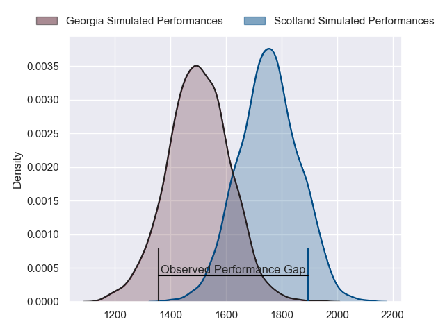
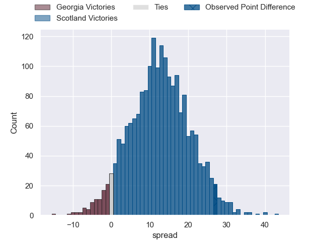
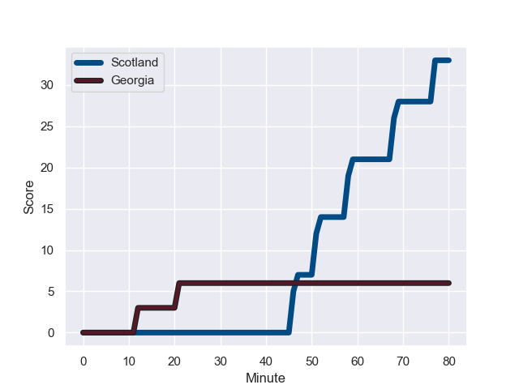
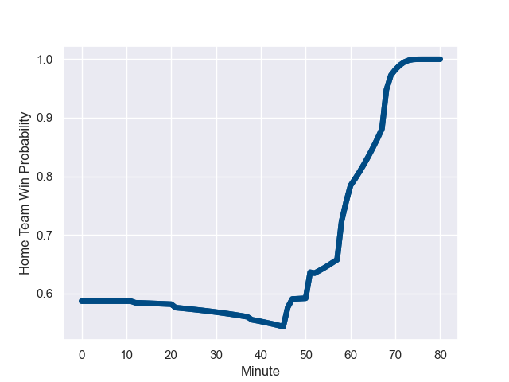

---  
layout: page  
title: Georgia at Scotland; 6.0-33.0  
date: 2023-08-25 18:00:00 -0500  
categories: match review  
---
# Georgia at Scotland; 6.0-33.0

# Club Level Predictions

The first set of predictions treats a club as the smallest object, as the club develops its members, organizes a gameplan, and deploys its players as needed for each match. This club model has a prediction of 0.797, which translates to predicting Scotland to win by 12.6.

Each club has a rating and a rating deviation (simiar to a Glicko system), and expected performances can be generated. This allows for simulated matches and spreads like the ones below.
## Projected Performances

## Projected Spreads

## Projected Results

# Player Level Predictions - Version 1

Treating teams instead as an entity made up of the currently active players, I have ratings for each player in an altogether different system. These can be combined to form team ratings once teamsheets are announced, weighting starters a bit higher than the reserves. After the match is played, players can be weighted by their minutes on the field, allowing for an accurate measure of the team's composition. With these compiled team ratings, we can make predictions, measure inaccuracy, and update the individual player ratings.
## Prediction with Player Minutes: Scotland by 19.2

Scotland by 15.2 on a neutral field
## Prediction without Player Minutes: Scotland by 20.7

Scotland by 16.7 on a neutral pitch

## Scores over Time

## Win Probability over Time

There were 6 large changes in win probability in this match

|   Away Minutes | Away Player             |   Away elo |   Away Percentile |   Number |   Home Percentile |   Home elo | Home Player         |   Home Minutes |
|---------------:|:------------------------|-----------:|------------------:|---------:|------------------:|-----------:|:--------------------|---------------:|
|             52 | Mikheil Nariashvili     |     106.37 |  595333           |        1 |            858078 |      92.1  | Jamie Bhatti        |             52 |
|             38 | Shalva Mamukashvili     |      78.22 |  611800           |        2 |            841489 |      72.36 | Dave Cherry         |             52 |
|             57 | Beka Gigashvili         |      76.5  |  890448           |        3 |            429100 |     125.67 | WP Nel              |             52 |
|             80 | Lado Chachanidze        |      92.11 |       1.00722e+06 |        4 |            764339 |     104.37 | Sam Skinner         |             60 |
|             52 | Konstantine Mikautadze  |      66.82 |       1.00616e+06 |        5 |            523989 |     117.21 | Grant Gilchrist     |             80 |
|             75 | Luka Ivanishvili        |      57.05 |  993638           |        6 |            763169 |     124.44 | Jamie Ritchie       |             80 |
|             80 | Mikheil Gachechiladze   |      69.53 |  852858           |        7 |            971574 |     128.78 | Rory Darge          |             52 |
|             80 | Tornike Jalagonia       |      78.18 |  974433           |        8 |            756285 |      61.47 | Jack Dempsey        |             80 |
|             60 | Vasil Lobzhanidze       |      78.47 |       1.00615e+06 |        9 |            803167 |      90.4  | Ben White           |             52 |
|             67 | Luka Matkava            |      80.37 |       1.01207e+06 |       10 |            670910 |     114.08 | Finn Russell        |             52 |
|             80 | Mirian Modebadze        |      86.88 |       1.01934e+06 |       11 |            864550 |      94.03 | Duhan van der Merwe |             80 |
|             80 | Merab Sharikadze        |     108.85 |  611986           |       12 |            794391 |      58.01 | Sione Tuipulotu     |             80 |
|             52 | Demur Tapladze          |     111.9  |  961584           |       13 |            774317 |      66.21 | Huw Jones           |             60 |
|             80 | Aka Tabutsadze          |      79.3  |       1.01934e+06 |       14 |            879735 |     102.13 | Kyle Steyn          |             80 |
|             80 | Davit Niniashvili       |      96.16 |  975496           |       15 |            974509 |      77.57 | Ollie Smith         |             80 |
|             42 | Tengiz Zamtaradze       |      85.01 |     nan           |       16 |            938338 |      93.27 | Ewan Ashman         |             28 |
|             28 | Guram Gogichashvili     |     100.7  |  922235           |       17 |            748540 |     103.97 | Rory Sutherland     |             28 |
|             23 | Guram Papidze           |      77.8  |  896131           |       18 |            768001 |      60.52 | Javan Sebastian     |             28 |
|             28 | Lasha Jaiani            |      62.06 |  961540           |       19 |            796572 |     122.44 | Scott Cummings      |             20 |
|              5 | Sandro Mamamtavrishvili |      79.35 |     nan           |       20 |            847665 |      89.34 | Matt Fagerson       |             28 |
|             20 | Gela Aprasidze          |      81.03 |  903159           |       21 |            862718 |     111.95 | George Horne        |             28 |
|             13 | Tedo Abzhandadze        |      79.17 |     nan           |       22 |            956003 |      78.55 | Ben Healy           |             28 |
|             28 | Giorgi Kveseladze       |      80.84 |  903089           |       23 |            758726 |      94.04 | Chris Harris        |             20 |

# Player Level Predictions - Version 2

Treating teams instead as an entity made up of the currently active players, I have ratings for each player in an altogether different system. These can be combined to form team ratings once teamsheets are announced, weighting starters a bit higher than the reserves. After the match is played, players can be weighted by their minutes on the field, allowing for an accurate measure of the team's composition. With these compiled team ratings, we can make predictions, measure inaccuracy, and update the individual player ratings.
## Prediction with Player Minutes: Scotland by 10.3

Scotland by 6.6 on a neutral field
## Prediction without Player Minutes: Scotland by 10.3

Scotland by 6.6 on a neutral pitch

|   Away Minutes | Away Player             |   Away elo |   Away variance |   Number |   Home variance |   Home elo | Home Player         |   Home Minutes |
|---------------:|:------------------------|-----------:|----------------:|---------:|----------------:|-----------:|:--------------------|---------------:|
|             52 | Mikheil Nariashvili     |      69.71 |              50 |        1 |           49.95 |      83.97 | Jamie Bhatti        |             52 |
|             38 | Shalva Mamukashvili     |      74.79 |              50 |        2 |           50    |      49.5  | Dave Cherry         |             52 |
|             57 | Beka Gigashvili         |      68.72 |              50 |        3 |           50    |      91.47 | WP Nel              |             52 |
|             80 | Lado Chachanidze        |      53.29 |              50 |        4 |           49.88 |      66.31 | Sam Skinner         |             60 |
|             52 | Konstantine Mikautadze  |      48.28 |              50 |        5 |           50    |      89.27 | Grant Gilchrist     |             80 |
|             75 | Luka Ivanishvili        |      70.51 |              50 |        6 |           50    |     108.2  | Jamie Ritchie       |             80 |
|             80 | Mikheil Gachechiladze   |      -3.26 |              50 |        7 |           49.88 |      55.69 | Rory Darge          |             52 |
|             80 | Tornike Jalagonia       |      67.05 |              50 |        8 |           50    |      30.9  | Jack Dempsey        |             80 |
|             60 | Vasil Lobzhanidze       |      48.47 |              50 |        9 |           50    |      58.76 | Ben White           |             52 |
|             67 | Luka Matkava            |      46.81 |              50 |       10 |           48.47 |     123.13 | Finn Russell        |             52 |
|             80 | Mirian Modebadze        |      46.65 |              50 |       11 |           50    |      57.36 | Duhan van der Merwe |             80 |
|             80 | Merab Sharikadze        |      92.26 |              50 |       12 |           50    |      32.95 | Sione Tuipulotu     |             80 |
|             52 | Demur Tapladze          |      81.7  |              50 |       13 |           50    |      47.19 | Huw Jones           |             60 |
|             80 | Aka Tabutsadze          |      46.65 |              50 |       14 |           49.48 |      86.45 | Kyle Steyn          |             80 |
|             80 | Davit Niniashvili       |      96.06 |              50 |       15 |           49.88 |      73.12 | Ollie Smith         |             80 |
|             42 | Tengiz Zamtaradze       |      46.65 |              50 |       16 |           50    |      37.07 | Ewan Ashman         |             28 |
|             28 | Guram Gogichashvili     |      53.18 |              50 |       17 |           49.93 |      49.19 | Rory Sutherland     |             28 |
|             23 | Guram Papidze           |      35.83 |              50 |       18 |           49.95 |      46.89 | Javan Sebastian     |             28 |
|             28 | Lasha Jaiani            |      67.23 |              50 |       19 |           49.9  |     111.11 | Scott Cummings      |             20 |
|              5 | Sandro Mamamtavrishvili |      46.65 |              50 |       20 |           49.1  |      95.83 | Matt Fagerson       |             28 |
|             20 | Gela Aprasidze          |      61.32 |              50 |       21 |           50    |     129.11 | George Horne        |             28 |
|             13 | Tedo Abzhandadze        |      46.65 |              50 |       22 |           49.88 |      52.86 | Ben Healy           |             28 |
|             28 | Giorgi Kveseladze       |     107.42 |              50 |       23 |           49.27 |      72.6  | Chris Harris        |             20 |

