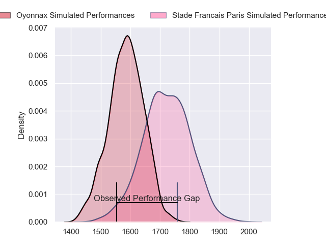
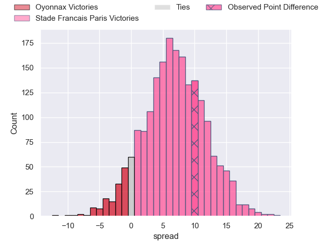
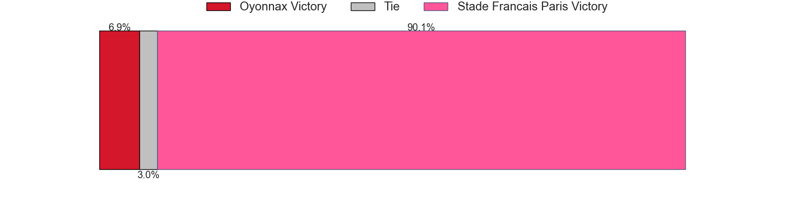
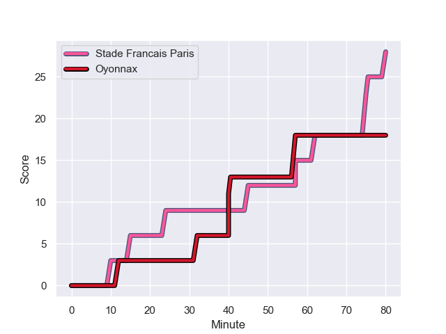
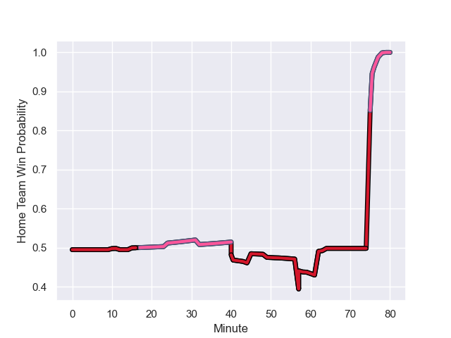

---  
layout: page  
title: Oyonnax at Stade Francais Paris; 18-28  
date: 2023-08-25 18:00:00 -0500  
categories: match review  
---
# Oyonnax at Stade Francais Paris; 18-28

# Club Level Predictions

The first set of predictions treats a club as the smallest object, as the club develops its members, organizes a gameplan, and deploys its players as needed for each match. This club model has a prediction of 0.684, which translates to predicting Stade Francais Paris to win by 6.8.

Each club has a rating and a rating deviation (simiar to a Glicko system), and expected performances can be generated. This allows for simulated matches and spreads like the ones below.
## Projected Performances

## Projected Spreads

## Projected Results

# Player Level Predictions - Version 1

Treating teams instead as an entity made up of the currently active players, I have ratings for each player in an altogether different system. These can be combined to form team ratings once teamsheets are announced, weighting starters a bit higher than the reserves. After the match is played, players can be weighted by their minutes on the field, allowing for an accurate measure of the team's composition. With these compiled team ratings, we can make predictions, measure inaccuracy, and update the individual player ratings.
## Prediction with Player Minutes: Stade Francais Paris by 3.1

Oyonnax by 0.9 on a neutral field
## Prediction without Player Minutes: Stade Francais Paris by 2.6

Oyonnax by 1.4 on a neutral pitch

## Scores over Time

## Win Probability over Time

There were 7 large changes in win probability in this match

|   Away Minutes | Away Player       |   Away elo |   Away Percentile |   Number |   Home Percentile |   Home elo | Home Player                   |   Home Minutes |
|---------------:|:------------------|-----------:|------------------:|---------:|------------------:|-----------:|:------------------------------|---------------:|
|             57 | Tommy Raynaud     |      86.46 |       1.01984e+06 |        1 |       1.0105e+06  |      80.51 | Sergo Abramishvili            |             52 |
|             49 | Benjamin Geledan  |      86.1  |       1.02001e+06 |        2 |       1.01668e+06 |      87.47 | Mickaël Ivaldi                |             64 |
|             59 | Ali Oz            |      86.72 |       1.01981e+06 |        3 |       1.01987e+06 |      87.57 | Giorgi Melikidze              |             80 |
|             57 | Victor Lebas      |      84.66 |       1.01984e+06 |        4 |       1.01662e+06 |      92.14 | Paul Gabrillagues             |             80 |
|             80 | Phoenix Battye    |      86.79 |       1.02001e+06 |        5 |       1.01663e+06 |      89.66 | Baptiste Pesenti              |             63 |
|             49 | Wandrille Picault |      94.77 |  863358           |        6 |       1.02001e+06 |      84.62 | Julien Ory                    |             57 |
|             80 | Loïc Credoz       |     113.96 |  948234           |        7 |       1.01666e+06 |      90.46 | Romain Briatte                |             80 |
|             80 | Rory Grice        |      87.22 |       1.01983e+06 |        8 |       1.01668e+06 |      94.89 | Mathieu Hirigoyen             |             80 |
|             49 | Jonathan Ruru     |      86.38 |       1.01981e+06 |        9 |       1.01985e+06 |      85.82 | Jules Gimbert                 |             44 |
|             64 | Jules Soulan      |     106.05 |  945275           |       10 |       1.02001e+06 |      84.21 | Zack Henry                    |             63 |
|             80 | Daniel Ikpefan    |      85.9  |       1.02001e+06 |       11 |  964627           |     119.65 | Stéphane Ahmed                |             80 |
|             80 | Théo Millet       |      87    |       1.01983e+06 |       12 |       1.01986e+06 |      82.52 | Pierre Boudehent              |             57 |
|             80 | Chris Farrell     |      89.65 |       1.0198e+06  |       13 |       1.0166e+06  |      92.92 | Jeremy Charles Ward           |             80 |
|             80 | Darren Sweetnam   |      89.25 |       1.0198e+06  |       14 |       1.01284e+06 |      91.26 | Peniasi Dakuwaqa              |             80 |
|             80 | Tony Ensor        |      86.54 |       1.02001e+06 |       15 |       1.01664e+06 |      86.22 | Kylan Hamdaoui                |             80 |
|             31 | Charlie Cassang   |      89.36 |       1.01979e+06 |       16 |     nan           |      82.73 | Rory Kockott                  |             36 |
|             31 | Kevin Lebreton    |     135.5  |  810854           |       17 |       1.01985e+06 |      86.31 | Julien Delbouis               |             23 |
|             31 | Teddy Durand      |      53.42 |  972909           |       18 |     nan           |      84.41 | Giovanni Habel Kuffner        |             23 |
|             23 | Leva Fifita       |      86.32 |     nan           |       19 |       1.01669e+06 |      80.98 | Moses Eneliko Alo-Emile       |             28 |
|             23 | Adrien Bordenave  |      84.87 |     nan           |       20 |     nan           |      82.62 | Juan John (JJ) van der Mescht |             17 |
|             21 | Thibault Berthaud |      82.89 |  921182           |       21 |       1.01659e+06 |      93.87 | Joris Segonds                 |             17 |
|             16 | Justin Bouraux    |      94.84 |  996330           |       22 |     nan           |      84.84 | Laurent Panis                 |             16 |

# Player Level Predictions - Version 2

Treating teams instead as an entity made up of the currently active players, I have ratings for each player in an altogether different system. These can be combined to form team ratings once teamsheets are announced, weighting starters a bit higher than the reserves. After the match is played, players can be weighted by their minutes on the field, allowing for an accurate measure of the team's composition. With these compiled team ratings, we can make predictions, measure inaccuracy, and update the individual player ratings.
## Prediction with Player Minutes: Stade Francais Paris by 3.8

Oyonnax by 1.2 on a neutral field
## Prediction without Player Minutes: Stade Francais Paris by 3.8

Oyonnax by 1.3 on a neutral pitch

|   Away Minutes | Away Player       |   Away elo |   Away variance |   Number |   Home variance |   Home elo | Home Player                   |   Home Minutes |
|---------------:|:------------------|-----------:|----------------:|---------:|----------------:|-----------:|:------------------------------|---------------:|
|             57 | Tommy Raynaud     |      46.65 |              50 |        1 |              50 |      55.2  | Sergo Abramishvili            |             52 |
|             49 | Benjamin Geledan  |      46.65 |              50 |        2 |              50 |      46.65 | Mickaël Ivaldi                |             64 |
|             59 | Ali Oz            |      46.65 |              50 |        3 |              50 |      46.65 | Giorgi Melikidze              |             80 |
|             57 | Victor Lebas      |      46.65 |              50 |        4 |              50 |      46.65 | Paul Gabrillagues             |             80 |
|             80 | Phoenix Battye    |      46.65 |              50 |        5 |              50 |      46.65 | Baptiste Pesenti              |             63 |
|             49 | Wandrille Picault |      58.86 |              50 |        6 |              50 |      46.65 | Julien Ory                    |             57 |
|             80 | Loïc Credoz       |      58.51 |              50 |        7 |              50 |      46.65 | Romain Briatte                |             80 |
|             80 | Rory Grice        |      46.65 |              50 |        8 |              50 |      46.65 | Mathieu Hirigoyen             |             80 |
|             49 | Jonathan Ruru     |      46.65 |              50 |        9 |              50 |      46.65 | Jules Gimbert                 |             44 |
|             64 | Jules Soulan      |      71.6  |              50 |       10 |              50 |      46.65 | Zack Henry                    |             63 |
|             80 | Daniel Ikpefan    |      46.65 |              50 |       11 |              50 |      73.47 | Stéphane Ahmed                |             80 |
|             80 | Théo Millet       |      46.65 |              50 |       12 |              50 |      46.65 | Pierre Boudehent              |             57 |
|             80 | Chris Farrell     |      46.65 |              50 |       13 |              50 |      46.65 | Jeremy Charles Ward           |             80 |
|             80 | Darren Sweetnam   |      46.65 |              50 |       14 |              50 |      31.55 | Peniasi Dakuwaqa              |             80 |
|             80 | Tony Ensor        |      46.65 |              50 |       15 |              50 |      46.65 | Kylan Hamdaoui                |             80 |
|             31 | Charlie Cassang   |      46.65 |              50 |       16 |              50 |      46.65 | Rory Kockott                  |             36 |
|             31 | Kevin Lebreton    |      70.44 |              50 |       17 |              50 |      46.65 | Julien Delbouis               |             23 |
|             31 | Teddy Durand      |      38.55 |              50 |       18 |              50 |      46.65 | Giovanni Habel Kuffner        |             23 |
|             23 | Leva Fifita       |      46.65 |              50 |       19 |              50 |      46.65 | Moses Eneliko Alo-Emile       |             28 |
|             23 | Adrien Bordenave  |      46.65 |              50 |       20 |              50 |      46.65 | Juan John (JJ) van der Mescht |             17 |
|             21 | Thibault Berthaud |      49.14 |              50 |       21 |              50 |      46.65 | Joris Segonds                 |             17 |
|             16 | Justin Bouraux    |      49.17 |              50 |       22 |              50 |      46.65 | Laurent Panis                 |             16 |

