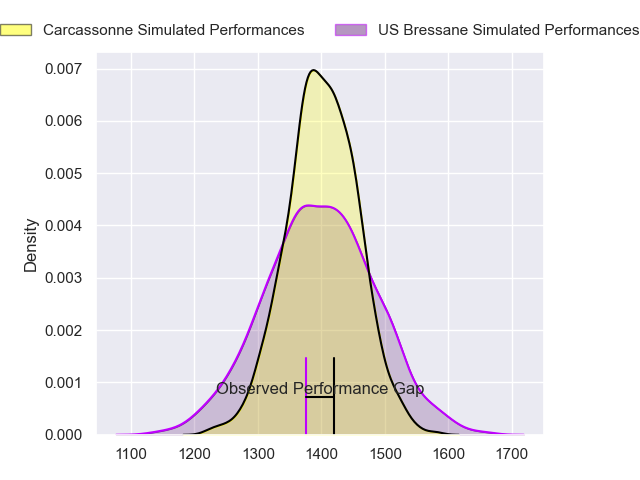
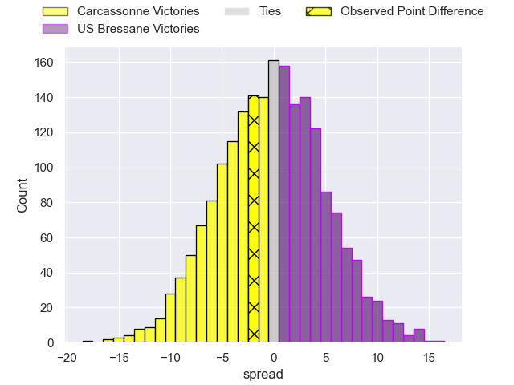
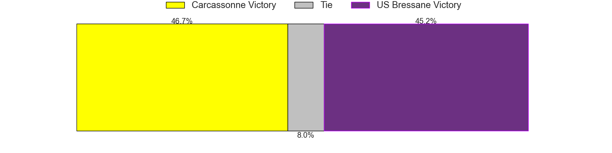
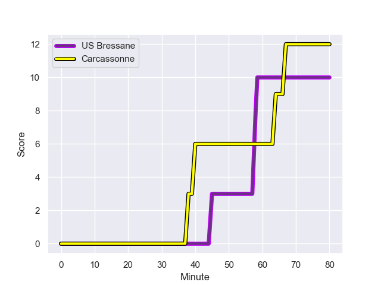
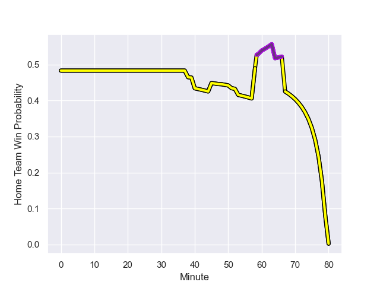

---  
layout: page  
title: Carcassonne at US Bressane; 12-10  
date: 2023-08-25 18:00:00 -0500  
categories: match review  
---
# Carcassonne at US Bressane; 12-10

# Club Level Predictions

The first set of predictions treats a club as the smallest object, as the club develops its members, organizes a gameplan, and deploys its players as needed for each match. This club model has a prediction of 0.497, which translates to predicting Carcassonne to win by 0.1.

Each club has a rating and a rating deviation (simiar to a Glicko system), and expected performances can be generated. This allows for simulated matches and spreads like the ones below.
## Projected Performances

## Projected Spreads

## Projected Results

# Player Level Predictions - Version 1

Treating teams instead as an entity made up of the currently active players, I have ratings for each player in an altogether different system. These can be combined to form team ratings once teamsheets are announced, weighting starters a bit higher than the reserves. After the match is played, players can be weighted by their minutes on the field, allowing for an accurate measure of the team's composition. With these compiled team ratings, we can make predictions, measure inaccuracy, and update the individual player ratings.
## Prediction with Player Minutes: US Bressane by 1.1

Carcassonne by 2.9 on a neutral field
## Prediction without Player Minutes: US Bressane by 3.7

Carcassonne by 0.3 on a neutral pitch

## Scores over Time

## Win Probability over Time

There were 10 large changes in win probability in this match

|   Away Minutes | Away Player         |   Away elo |   Away Percentile |   Number |   Home Percentile |   Home elo | Home Player                |   Home Minutes |
|---------------:|:--------------------|-----------:|------------------:|---------:|------------------:|-----------:|:---------------------------|---------------:|
|             48 | Florent Lorenzon    |      78.71 |  938611           |        1 |       1.01999e+06 |      74.29 | Nicolas Lemaire            |             53 |
|             51 | Raphaël Carbou      |      76.76 |       1.01998e+06 |        2 |       1.01086e+06 |      59.76 | Louis Dasalmartini         |             53 |
|             60 | Vakhtangi Akhobadze |      75.17 |       1.02e+06    |        3 |  982218           |     100.46 | Atonio Ulutuipalelei       |             53 |
|             80 | Romain Manchia      |     105.8  |  694760           |        4 |       1.01999e+06 |      74.68 | Koen Bloemen               |             80 |
|             80 | Romain Guyot        |      68.28 |  935210           |        5 |       1.01998e+06 |      75.34 | Maselino Paulino           |             53 |
|             51 | Ferdinand Dreno     |      81    |       1.01198e+06 |        6 |       1.01038e+06 |      75.55 | Thomas Déliance            |             64 |
|             80 | Valentin Sese       |      46.53 |  967076           |        7 |       1.01999e+06 |      74.12 | Pierre Reynaud             |             80 |
|             60 | Carl Fearns         |      76.49 |       1.01998e+06 |        8 |  974098           |      91.07 | Joseph Penitito            |             80 |
|             80 | Gaëtan Pichon       |      72    |       1.00665e+06 |        9 |       1.01999e+06 |      74.48 | Jérémy Valençot            |             64 |
|             80 | Gabin Michet        |      75.56 |       1.01999e+06 |       10 |       1.0176e+06  |      86    | Frederik Johannes Zeilinga |             80 |
|             80 | Léo Darrelatour     |     104.58 |       1.0101e+06  |       11 |  977026           |      90.27 | Élie De Fleurian           |             80 |
|             40 | Jeremy To'a         |      79.73 |  980716           |       12 |       1.01999e+06 |      75.1  | Maile Mamao                |             40 |
|             80 | Pierre Aguillon     |      77.06 |       1.01998e+06 |       13 |  964203           |      56.67 | Alexandre Badet            |             80 |
|             80 | Mesake Kurisaru     |      76.23 |       1.01998e+06 |       14 |  995432           |      53.13 | Thibaut Perrette           |             80 |
|             80 | Maxime Gianet       |      99.18 |  974265           |       15 |  916637           |     107.91 | Florent Massip             |             80 |
|             40 | Jordan Puletua      |      76    |     nan           |       16 |  917051           |      58.96 | Benjamin Doy               |             40 |
|             32 | Andrei Ursache      |      77.38 |     nan           |       17 |  863239           |      77.2  | Arnaud Feltrin             |             27 |
|             29 | Gary Graham         |      75.77 |     nan           |       18 |  929673           |      64.41 | Vazha Kapanadze            |             27 |
|             29 | Luka Petriashvili   |      90.46 |       1.01083e+06 |       19 |     nan           |      74.88 | Ma'afu Fia                 |             27 |
|             20 | Étienne Herjean     |      75.36 |     nan           |       20 |  908128           |      71.85 | Josh Peters                |             27 |
|             20 | Fabien Lorenzon     |      69.72 |  938645           |       21 |       1.01084e+06 |      71.29 | Nail Ait Naceur            |             16 |
|            nan | nan                 |     nan    |     nan           |       22 |  719471           |     125.04 | Nicolas Faure              |             16 |

# Player Level Predictions - Version 2

Treating teams instead as an entity made up of the currently active players, I have ratings for each player in an altogether different system. These can be combined to form team ratings once teamsheets are announced, weighting starters a bit higher than the reserves. After the match is played, players can be weighted by their minutes on the field, allowing for an accurate measure of the team's composition. With these compiled team ratings, we can make predictions, measure inaccuracy, and update the individual player ratings.
## Prediction with Player Minutes: US Bressane by 4.8

US Bressane by 1.3 on a neutral field
## Prediction without Player Minutes: US Bressane by 4.6

US Bressane by 1.1 on a neutral pitch

|   Away Minutes | Away Player         |   Away elo |   Away variance |   Number |   Home variance |   Home elo | Home Player                |   Home Minutes |
|---------------:|:--------------------|-----------:|----------------:|---------:|----------------:|-----------:|:---------------------------|---------------:|
|             48 | Florent Lorenzon    |      28.54 |              50 |        1 |              50 |      46.65 | Nicolas Lemaire            |             53 |
|             51 | Raphaël Carbou      |      46.65 |              50 |        2 |              50 |      38    | Louis Dasalmartini         |             53 |
|             60 | Vakhtangi Akhobadze |      46.65 |              50 |        3 |              50 |      30.78 | Atonio Ulutuipalelei       |             53 |
|             80 | Romain Manchia      |      46.33 |              50 |        4 |              50 |      46.65 | Koen Bloemen               |             80 |
|             80 | Romain Guyot        |      35.93 |              50 |        5 |              50 |      46.65 | Maselino Paulino           |             53 |
|             51 | Ferdinand Dreno     |      43.3  |              50 |        6 |              50 |      50.91 | Thomas Déliance            |             64 |
|             80 | Valentin Sese       |      39.03 |              50 |        7 |              50 |      46.65 | Pierre Reynaud             |             80 |
|             60 | Carl Fearns         |      46.65 |              50 |        8 |              50 |      62.26 | Joseph Penitito            |             80 |
|             80 | Gaëtan Pichon       |      27.07 |              50 |        9 |              50 |      46.65 | Jérémy Valençot            |             64 |
|             80 | Gabin Michet        |      46.65 |              50 |       10 |              50 |      46.65 | Frederik Johannes Zeilinga |             80 |
|             80 | Léo Darrelatour     |      63.23 |              50 |       11 |              50 |      35.93 | Élie De Fleurian           |             80 |
|             40 | Jeremy To'a         |      45.36 |              50 |       12 |              50 |      46.65 | Maile Mamao                |             40 |
|             80 | Pierre Aguillon     |      46.65 |              50 |       13 |              50 |      37.7  | Alexandre Badet            |             80 |
|             80 | Mesake Kurisaru     |      46.65 |              50 |       14 |              50 |      42.38 | Thibaut Perrette           |             80 |
|             80 | Maxime Gianet       |      54.13 |              50 |       15 |              50 |      84.93 | Florent Massip             |             80 |
|             40 | Jordan Puletua      |      46.65 |              50 |       16 |              50 |      42.79 | Benjamin Doy               |             40 |
|             32 | Andrei Ursache      |      46.65 |              50 |       17 |              50 |      43.99 | Arnaud Feltrin             |             27 |
|             29 | Gary Graham         |      46.65 |              50 |       18 |              50 |      46.13 | Vazha Kapanadze            |             27 |
|             29 | Luka Petriashvili   |      50.73 |              50 |       19 |              50 |      46.65 | Ma'afu Fia                 |             27 |
|             20 | Étienne Herjean     |      46.65 |              50 |       20 |              50 |      35.01 | Josh Peters                |             27 |
|             20 | Fabien Lorenzon     |      53.9  |              50 |       21 |              50 |      43.64 | Nail Ait Naceur            |             16 |
|            nan | nan                 |     nan    |             nan |       22 |              50 |      33.14 | Nicolas Faure              |             16 |

