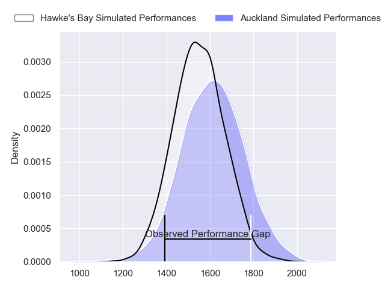
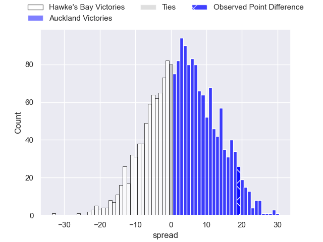
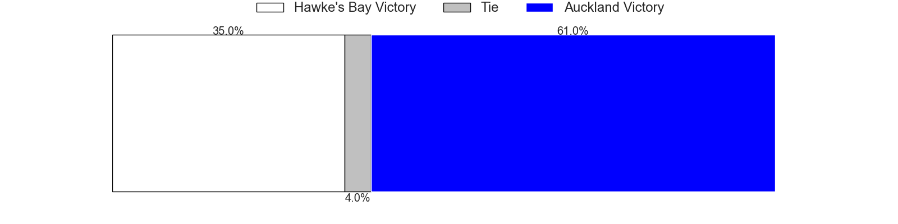
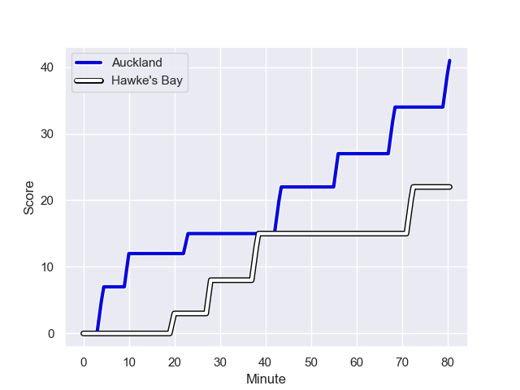
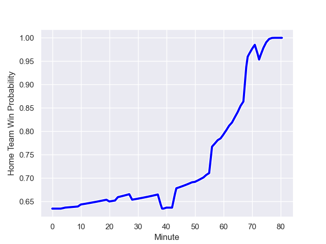

---  
layout: page  
title: Hawke's Bay at Auckland; 22-41  
date: 2023-08-26 18:00:00 -0500  
categories: match review  
---
# Hawke's Bay at Auckland; 22-41

# Club Level Predictions

The first set of predictions treats a club as the smallest object, as the club develops its members, organizes a gameplan, and deploys its players as needed for each match. This club model has a prediction of 0.591, which translates to predicting Auckland to win by 3.4.

Each club has a rating and a rating deviation (simiar to a Glicko system), and expected performances can be generated. This allows for simulated matches and spreads like the ones below.
## Projected Performances

## Projected Spreads

## Projected Results

# Player Level Predictions - Version 1

Treating teams instead as an entity made up of the currently active players, I have ratings for each player in an altogether different system. These can be combined to form team ratings once teamsheets are announced, weighting starters a bit higher than the reserves. After the match is played, players can be weighted by their minutes on the field, allowing for an accurate measure of the team's composition. With these compiled team ratings, we can make predictions, measure inaccuracy, and update the individual player ratings.
## Prediction with Player Minutes: Auckland by 28.0

Auckland by 24.0 on a neutral field
## Prediction without Player Minutes: Auckland by 26.9

Auckland by 22.9 on a neutral pitch

## Scores over Time

## Win Probability over Time

There were 3 large changes in win probability in this match

|   Away Minutes | Away Player                |   Away elo |   Away Percentile |   Number |   Home Percentile |   Home elo | Home Player                 |   Home Minutes |
|---------------:|:---------------------------|-----------:|------------------:|---------:|------------------:|-----------:|:----------------------------|---------------:|
|             40 | Isileli Tu'ungafasi        |      66.13 |       1.01978e+06 |        1 |       1.01864e+06 |      74.61 | Josh Fusitua                |             54 |
|             65 | Tyrone Thompson            |      78.65 |  988952           |        2 |       1.01871e+06 |      74.57 | Soane Vikena                |             59 |
|             65 | Pouri Gordon Rakete-Stones |      69.38 |       1.01836e+06 |        3 |       1.0186e+06  |      85.96 | Angus Ta'avao-Matau         |             59 |
|             59 | Geoffrey Cridge            |      65.71 |       1.01906e+06 |        4 |       1.01604e+06 |      86    | Patrick Tuipulotu           |             80 |
|             80 | Tom Parsons                |      60.78 |       1.01837e+06 |        5 |       1.01863e+06 |      80.9  | Josh Beehre                 |             67 |
|             56 | Patrick Tuifua             |      70.41 |       1.01887e+06 |        6 |       1.0186e+06  |      86.9  | Adrian Joseph Choat         |             80 |
|             80 | Siosiua (Josh) Kaifa       |      70.95 |       1.01833e+06 |        7 |       1.01861e+06 |      85.78 | Blake Gibson                |             63 |
|             80 | Devan Flanders             |      69.34 |  916462           |        8 |  773849           |     112.44 | Akira Ioane                 |             80 |
|             65 | Folau Fakatava             |      68.78 |       1.01827e+06 |        9 |       1.01865e+06 |      77.73 | Kalani Thomas               |             50 |
|             58 | Lincoln McClutchie         |      63.46 |       1.01835e+06 |       10 |  981582           |     100.9  | Zarn Sullivan               |             72 |
|             59 | Lolagi Visinia             |      70.98 |       1.01834e+06 |       11 |       1.01866e+06 |      84.06 | Salesi Tuivuna Mauri Rayasi |             65 |
|             80 | Chase Tiatia               |      69.37 |       1.01652e+06 |       12 |       1.01865e+06 |      82.55 | Harry Plummer               |             80 |
|             80 | Ollie Sapsford             |      73.17 |  945531           |       13 |  495765           |     103.84 | Bryce Heem                  |             80 |
|             80 | Paul Balekana              |      82.42 |       1.0164e+06  |       14 |  947975           |      76.82 | AJ Lam                      |             80 |
|             80 | Harry Godfrey              |      65.89 |       1.0183e+06  |       15 |       1.01898e+06 |      80.36 | Roger Tuivasa-Scheck        |             80 |
|             40 | Kianu Kereru-Symes         |      62.09 |       1.01636e+06 |       16 |     nan           |      77.38 | Sione Ahio                  |             21 |
|             15 | Bo Abra                    |      81.93 |     nan           |       17 |     nan           |      78.38 | Ben Ake                     |             26 |
|             15 | Hisamitsu Shimada          |      64.49 |       1.01204e+06 |       18 |       1.01866e+06 |      76.32 | Leni Apisai                 |             21 |
|             21 | Frank Lochore              |      74.05 |       1.01826e+06 |       19 |     nan           |      75.51 | Che Clark                   |             17 |
|             24 | Sam Smith                  |      65.61 |       1.01832e+06 |       20 |       1.01903e+06 |      64.58 | Terrell Peita               |             13 |
|             15 | Sam Wye                    |      69.79 |     nan           |       21 |       1.0187e+06  |      73.8  | Taufa Funaki                |             30 |
|             22 | Caleb Makene               |      63.84 |       1.01736e+06 |       22 |     nan           |      71.36 | Jock McKenzie               |              8 |
|             21 | Stacey Ili                 |      65.95 |     nan           |       23 |       1.01861e+06 |      79.82 | Caleb Tangitau              |             15 |

# Player Level Predictions - Version 2

Treating teams instead as an entity made up of the currently active players, I have ratings for each player in an altogether different system. These can be combined to form team ratings once teamsheets are announced, weighting starters a bit higher than the reserves. After the match is played, players can be weighted by their minutes on the field, allowing for an accurate measure of the team's composition. With these compiled team ratings, we can make predictions, measure inaccuracy, and update the individual player ratings.
## Prediction with Player Minutes: Auckland by 7.9

Auckland by 4.6 on a neutral field
## Prediction without Player Minutes: Auckland by 7.4

Auckland by 4.0 on a neutral pitch

|   Away Minutes | Away Player                |   Away elo |   Away variance |   Number |   Home variance |   Home elo | Home Player                 |   Home Minutes |
|---------------:|:---------------------------|-----------:|----------------:|---------:|----------------:|-----------:|:----------------------------|---------------:|
|             40 | Isileli Tu'ungafasi        |      46.65 |              50 |        1 |              50 |      46.65 | Josh Fusitua                |             54 |
|             65 | Tyrone Thompson            |      42.66 |              50 |        2 |              50 |      46.65 | Soane Vikena                |             59 |
|             65 | Pouri Gordon Rakete-Stones |      46.65 |              50 |        3 |              50 |      46.65 | Angus Ta'avao-Matau         |             59 |
|             59 | Geoffrey Cridge            |      46.65 |              50 |        4 |              50 |      46.65 | Patrick Tuipulotu           |             80 |
|             80 | Tom Parsons                |      46.65 |              50 |        5 |              50 |      46.65 | Josh Beehre                 |             67 |
|             56 | Patrick Tuifua             |      46.65 |              50 |        6 |              50 |      46.65 | Adrian Joseph Choat         |             80 |
|             80 | Siosiua (Josh) Kaifa       |      46.65 |              50 |        7 |              50 |      46.65 | Blake Gibson                |             63 |
|             80 | Devan Flanders             |      59.92 |              50 |        8 |              50 |     102.53 | Akira Ioane                 |             80 |
|             65 | Folau Fakatava             |      46.65 |              50 |        9 |              50 |      46.65 | Kalani Thomas               |             50 |
|             58 | Lincoln McClutchie         |      46.65 |              50 |       10 |              50 |      58.84 | Zarn Sullivan               |             72 |
|             59 | Lolagi Visinia             |      46.65 |              50 |       11 |              50 |      46.65 | Salesi Tuivuna Mauri Rayasi |             65 |
|             80 | Chase Tiatia               |      46.65 |              50 |       12 |              50 |      46.65 | Harry Plummer               |             80 |
|             80 | Ollie Sapsford             |      51.82 |              50 |       13 |              50 |     106.9  | Bryce Heem                  |             80 |
|             80 | Paul Balekana              |      46.65 |              50 |       14 |              50 |      47.82 | AJ Lam                      |             80 |
|             80 | Harry Godfrey              |      46.65 |              50 |       15 |              50 |      46.65 | Roger Tuivasa-Scheck        |             80 |
|             40 | Kianu Kereru-Symes         |      46.65 |              50 |       16 |              50 |      46.65 | Sione Ahio                  |             21 |
|             15 | Bo Abra                    |      41.45 |              50 |       17 |              50 |      46.65 | Ben Ake                     |             26 |
|             15 | Hisamitsu Shimada          |      66.12 |              50 |       18 |              50 |      46.65 | Leni Apisai                 |             21 |
|             21 | Frank Lochore              |      46.65 |              50 |       19 |              50 |      46.65 | Che Clark                   |             17 |
|             24 | Sam Smith                  |      46.65 |              50 |       20 |              50 |      46.65 | Terrell Peita               |             13 |
|             15 | Sam Wye                    |      46.65 |              50 |       21 |              50 |      46.65 | Taufa Funaki                |             30 |
|             22 | Caleb Makene               |      46.65 |              50 |       22 |              50 |      46.65 | Jock McKenzie               |              8 |
|             21 | Stacey Ili                 |      46.65 |              50 |       23 |              50 |      46.65 | Caleb Tangitau              |             15 |

