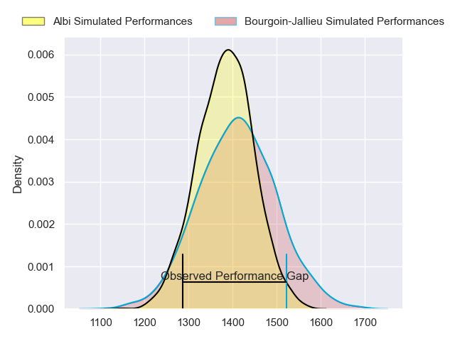
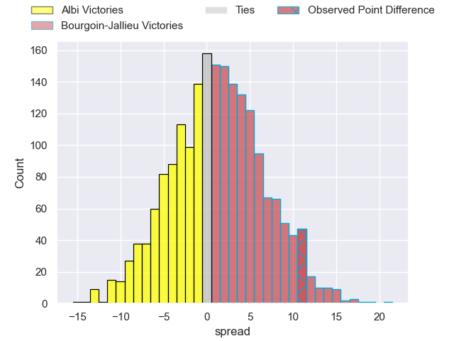
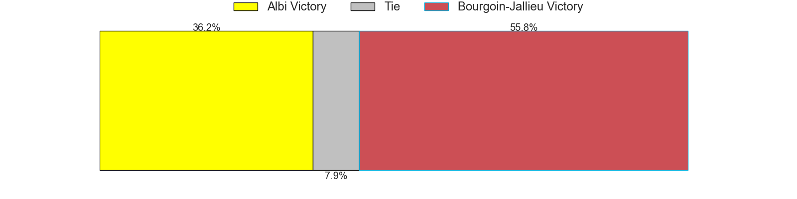
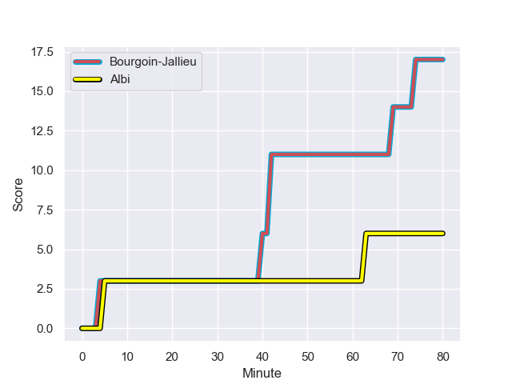
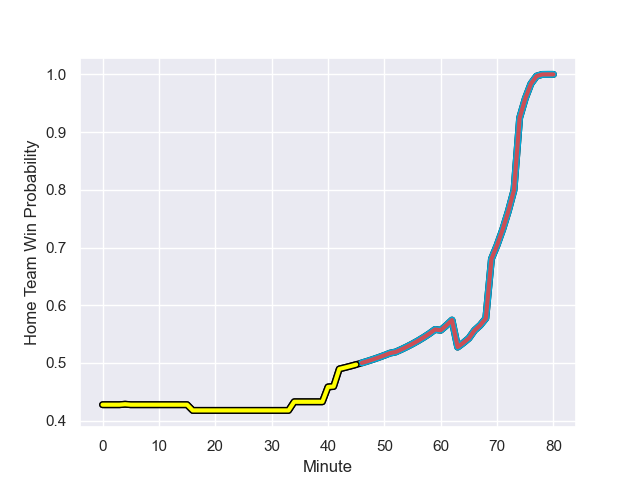

---  
layout: page  
title: Albi at Bourgoin-Jallieu; 6-17  
date: 2023-08-26 18:00:00 -0500  
categories: match review  
---
# Albi at Bourgoin-Jallieu; 6-17

# Club Level Predictions

The first set of predictions treats a club as the smallest object, as the club develops its members, organizes a gameplan, and deploys its players as needed for each match. This club model has a prediction of 0.534, which translates to predicting Bourgoin-Jallieu to win by 1.2.

Each club has a rating and a rating deviation (simiar to a Glicko system), and expected performances can be generated. This allows for simulated matches and spreads like the ones below.
## Projected Performances

## Projected Spreads

## Projected Results

# Player Level Predictions - Version 1

Treating teams instead as an entity made up of the currently active players, I have ratings for each player in an altogether different system. These can be combined to form team ratings once teamsheets are announced, weighting starters a bit higher than the reserves. After the match is played, players can be weighted by their minutes on the field, allowing for an accurate measure of the team's composition. With these compiled team ratings, we can make predictions, measure inaccuracy, and update the individual player ratings.
## Prediction with Player Minutes: Albi by 8.7

Albi by 12.7 on a neutral field
## Prediction without Player Minutes: Albi by 6.1

Albi by 10.1 on a neutral pitch

## Scores over Time

## Win Probability over Time

There were 10 large changes in win probability in this match

|   Away Minutes | Away Player                 |   Away elo |   Away Percentile |   Number |   Home Percentile |   Home elo | Home Player              |   Home Minutes |
|---------------:|:----------------------------|-----------:|------------------:|---------:|------------------:|-----------:|:-------------------------|---------------:|
|             52 | Thibaud Sebire              |      77.42 |       1.01158e+06 |        1 |  964076           |      90.29 | Rémy Gaborit             |             60 |
|             52 | Reinach Venter              |      87.48 |  885485           |        2 |  909261           |      64.01 | Maxime Castant           |             34 |
|             52 | Dimitri Tchapnga            |      76.09 |  968056           |        3 |       1.01998e+06 |      71.86 | Pieter Rossouw de Klerk  |             52 |
|             80 | Mohsen Essid                |      37.6  |  916027           |        4 |  603680           |      71.89 | Léandre Cotte            |             60 |
|             52 | Jacques Jacobus Engelbrecht |      78.26 |       1.01999e+06 |        5 |  841737           |      42.22 | Morgan Eames             |             80 |
|             80 | Vincent Calas               |      74.67 |  667900           |        6 |  967795           |     102.78 | Kevin Chaudouard         |             16 |
|             52 | Pierre Roussel              |      76.99 |       1.02e+06    |        7 |       1.01998e+06 |      72.08 | Théophile Cotte          |             40 |
|             80 | Guillem Calmon              |      67.84 |       1.01063e+06 |        8 |       1.01998e+06 |      71.65 | Poutasi Luafutu          |             80 |
|             52 | Titouan Pouzoullic          |      89.35 |  963544           |        9 |       1.01999e+06 |      70.75 | Jérémy Gondrand          |             59 |
|             80 | Benjamin Pehau              |     103.99 |  926536           |       10 |  847603           |      67    | Aviata Silago            |             80 |
|             66 | Kamilieni Raivono           |      81.84 |  935698           |       11 |  965462           |      76.86 | Quentin Lefort           |             80 |
|             80 | Jarrod Poi                  |      78.02 |       1.01999e+06 |       12 |       1.01999e+06 |      71.45 | Gabiriele Lovobalavu     |             80 |
|             80 | Baptiste Couchinave         |     136.23 |  972954           |       13 |       1.01999e+06 |      71.26 | Brieuc Plessis Couillaud |             80 |
|             80 | Sean Jack Robinson          |      77.79 |       1.01999e+06 |       14 |  782274           |      74.04 | Christopher Bosch        |             67 |
|             80 | Téo Dospital                |      73.4  |  965604           |       15 |  842463           |      66.37 | Nicolas Cachet           |             80 |
|             28 | Gilen Queheille             |      90.38 |  770609           |       16 |  967678           |      84.49 | Bynjamin Rabatel         |             64 |
|             28 | Simon Meka                  |      77.57 |     nan           |       17 |  604442           |      91.67 | Mohamed Khribache        |             46 |
|             28 | Evrard Dion Oulai           |      77.37 |     nan           |       18 |  975534           |      90.08 | Robin Gascou             |             40 |
|             28 | Arthur Castant              |      77.53 |  981922           |       19 |  995068           |      70.79 | Osman Dimen              |             28 |
|             28 | Antoine Soave               |      88.33 |  877508           |       20 |     nan           |      71.08 | Tomas Munilla            |             21 |
|             28 | Jean-Baptiste De Clercq     |      77.17 |     nan           |       21 |  948047           |      74.32 | Zhorzhi (Jorji) Saldadze |             20 |
|             14 | Gabriel Aviragnet           |      73.58 |       1.01571e+06 |       22 |  950202           |      71.38 | Jonathan Kpoku           |             20 |
|            nan | nan                         |     nan    |     nan           |       23 |     nan           |      70.91 | Paul-Hugo Champ          |             13 |

# Player Level Predictions - Version 2

Treating teams instead as an entity made up of the currently active players, I have ratings for each player in an altogether different system. These can be combined to form team ratings once teamsheets are announced, weighting starters a bit higher than the reserves. After the match is played, players can be weighted by their minutes on the field, allowing for an accurate measure of the team's composition. With these compiled team ratings, we can make predictions, measure inaccuracy, and update the individual player ratings.
## Prediction with Player Minutes: Albi by 1.3

Albi by 5.6 on a neutral field
## Prediction without Player Minutes: Albi by 0.3

Albi by 4.6 on a neutral pitch

|   Away Minutes | Away Player                 |   Away elo |   Away variance |   Number |   Home variance |   Home elo | Home Player              |   Home Minutes |
|---------------:|:----------------------------|-----------:|----------------:|---------:|----------------:|-----------:|:-------------------------|---------------:|
|             52 | Thibaud Sebire              |      46.94 |              50 |        1 |              50 |      54.92 | Rémy Gaborit             |             60 |
|             52 | Reinach Venter              |      38.21 |              50 |        2 |              50 |      51.54 | Maxime Castant           |             34 |
|             52 | Dimitri Tchapnga            |      59.45 |              50 |        3 |              50 |      46.65 | Pieter Rossouw de Klerk  |             52 |
|             80 | Mohsen Essid                |      68.63 |              50 |        4 |              50 |      27.3  | Léandre Cotte            |             60 |
|             52 | Jacques Jacobus Engelbrecht |      46.65 |              50 |        5 |              50 |      -3.69 | Morgan Eames             |             80 |
|             80 | Vincent Calas               |      52.23 |              50 |        6 |              50 |      61.06 | Kevin Chaudouard         |             16 |
|             52 | Pierre Roussel              |      46.65 |              50 |        7 |              50 |      46.65 | Théophile Cotte          |             40 |
|             80 | Guillem Calmon              |      42.74 |              50 |        8 |              50 |      46.65 | Poutasi Luafutu          |             80 |
|             52 | Titouan Pouzoullic          |      49.74 |              50 |        9 |              50 |      46.65 | Jérémy Gondrand          |             59 |
|             80 | Benjamin Pehau              |      55.12 |              50 |       10 |              50 |      29.41 | Aviata Silago            |             80 |
|             66 | Kamilieni Raivono           |      55.92 |              50 |       11 |              50 |      54.91 | Quentin Lefort           |             80 |
|             80 | Jarrod Poi                  |      46.65 |              50 |       12 |              50 |      46.65 | Gabiriele Lovobalavu     |             80 |
|             80 | Baptiste Couchinave         |      67.8  |              50 |       13 |              50 |      46.65 | Brieuc Plessis Couillaud |             80 |
|             80 | Sean Jack Robinson          |      46.65 |              50 |       14 |              50 |      47.48 | Christopher Bosch        |             67 |
|             80 | Téo Dospital                |      36.34 |              50 |       15 |              50 |      44.98 | Nicolas Cachet           |             80 |
|             28 | Gilen Queheille             |      59.36 |              50 |       16 |              50 |      55.1  | Bynjamin Rabatel         |             64 |
|             28 | Simon Meka                  |      46.65 |              50 |       17 |              50 |      41.67 | Mohamed Khribache        |             46 |
|             28 | Evrard Dion Oulai           |      46.65 |              50 |       18 |              50 |      34.93 | Robin Gascou             |             40 |
|             28 | Arthur Castant              |      51.58 |              50 |       19 |              50 |      49.42 | Osman Dimen              |             28 |
|             28 | Antoine Soave               |      67.66 |              50 |       20 |              50 |      46.65 | Tomas Munilla            |             21 |
|             28 | Jean-Baptiste De Clercq     |      46.65 |              50 |       21 |              50 |      40.13 | Zhorzhi (Jorji) Saldadze |             20 |
|             14 | Gabriel Aviragnet           |      47.44 |              50 |       22 |              50 |      44.98 | Jonathan Kpoku           |             20 |
|            nan | nan                         |     nan    |             nan |       23 |              50 |      46.65 | Paul-Hugo Champ          |             13 |

