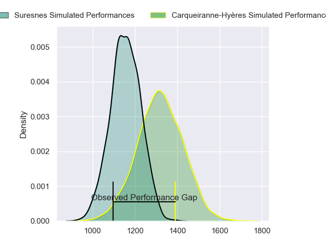
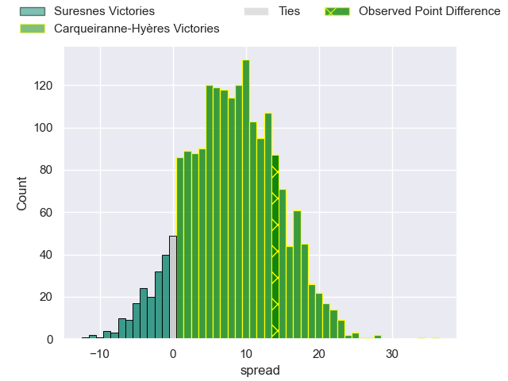
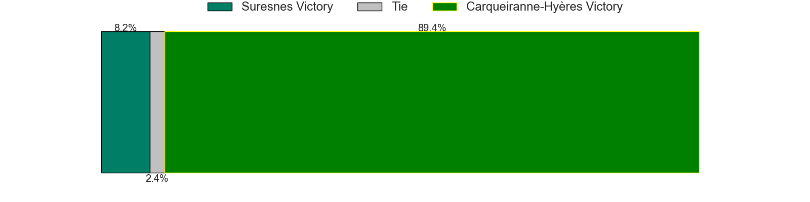
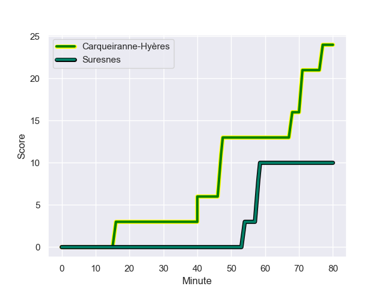
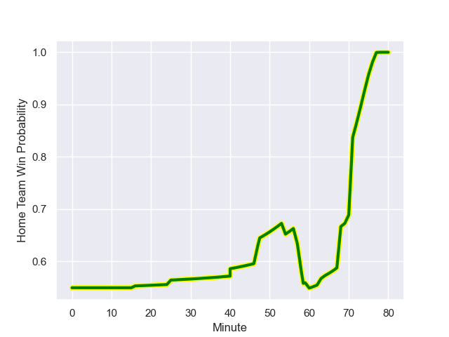

---  
layout: page  
title: Suresnes at Carqueiranne-Hyères; 10-24  
date: 2023-08-26 18:00:00 -0500  
categories: match review  
---
# Suresnes at Carqueiranne-Hyères; 10-24

# Club Level Predictions

The first set of predictions treats a club as the smallest object, as the club develops its members, organizes a gameplan, and deploys its players as needed for each match. This club model has a prediction of 0.711, which translates to predicting Carqueiranne-Hyères to win by 8.0.

Each club has a rating and a rating deviation (simiar to a Glicko system), and expected performances can be generated. This allows for simulated matches and spreads like the ones below.
## Projected Performances

## Projected Spreads

## Projected Results

# Player Level Predictions - Version 1

Treating teams instead as an entity made up of the currently active players, I have ratings for each player in an altogether different system. These can be combined to form team ratings once teamsheets are announced, weighting starters a bit higher than the reserves. After the match is played, players can be weighted by their minutes on the field, allowing for an accurate measure of the team's composition. With these compiled team ratings, we can make predictions, measure inaccuracy, and update the individual player ratings.
## Prediction with Player Minutes: Carqueiranne-Hyères by 12.6

Carqueiranne-Hyères by 8.6 on a neutral field
## Prediction without Player Minutes: Carqueiranne-Hyères by 14.0

Carqueiranne-Hyères by 10.0 on a neutral pitch

## Scores over Time

## Win Probability over Time

There were 9 large changes in win probability in this match

|   Away Minutes | Away Player            |   Away elo |   Away Percentile |   Number |   Home Percentile |   Home elo | Home Player          |   Home Minutes |
|---------------:|:-----------------------|-----------:|------------------:|---------:|------------------:|-----------:|:---------------------|---------------:|
|             60 | Lucas Dycke            |      59.51 |  996152           |        1 |       1.02069e+06 |      68.87 | Liam Chad Hendricks  |             64 |
|             60 | Hayam El Bibouji       |      54.35 |       1.00779e+06 |        2 |  992796           |      67.15 | Yan Tabarot          |             57 |
|             60 | Leandro Mario Assi     |      84.44 |  680709           |        3 |       1.01052e+06 |      74.73 | Lasha Mchelidze      |             57 |
|             63 | Florian Desbordes      |      58.29 |  964535           |        4 |  880398           |      64.12 | Lucas Cazac          |             80 |
|             63 | Marvin Woki            |      81.66 |  969443           |        5 |       1.02069e+06 |      69.19 | César Damiani        |             25 |
|             80 | Louis-Mathieu Jazeix   |      67.19 |  779112           |        6 |  814464           |      86.15 | Florian Munoz Rivero |             80 |
|             80 | Jean-Baptiste Lachaise |      88.29 |       1.01102e+06 |        7 |       1.00838e+06 |      68.39 | Joachim Beaumont     |             80 |
|             80 | Lakisipone Lee         |      51.82 |  990335           |        8 |       1.00824e+06 |      70.25 | Nicolas Baquer       |             57 |
|             80 | Thomas Lacroix         |      47.11 |  965551           |        9 |       1.00827e+06 |      96.54 | Thomas Sonetti       |             57 |
|             80 | Jean Chezeau           |      82.3  |       1.01194e+06 |       10 |       1.00824e+06 |      73.31 | Enzo Miot            |             69 |
|             80 | Ervin Muric            |     129.52 |  866961           |       11 |       1.01623e+06 |      75.92 | Paul Gadea           |             80 |
|             60 | Lilan Savioz Fouillet  |      70.01 |       1.01454e+06 |       12 |       1.02069e+06 |      69.03 | Dylan Michael Sage   |             63 |
|             80 | Jamie-Jerry Taulagi    |      65.72 |       1.02069e+06 |       13 |       1.02068e+06 |      69.74 | Charles Brousse      |             80 |
|             63 | Alexis Clément         |      51.09 |  990363           |       14 |  965500           |      72.73 | Vincent Alessi       |             80 |
|             80 | Thomas Baudy           |      32.29 |  967223           |       15 |  630512           |      98.98 | Juan Kotze           |             80 |
|             20 | Anthony Bajart         |      76.95 |  965813           |       16 |  969217           |      86.03 | Nathan Gendre        |             55 |
|             20 | Elias Coulibaly        |      70.81 |       1.00786e+06 |       17 |     nan           |      69.36 | Spike Salman         |             23 |
|             20 | Guiterembi Vickos      |      81.57 |  980201           |       18 |       1.00829e+06 |      48.02 | Rémi Dubié           |             23 |
|             20 | Faraj Fartass          |      65.56 |       1.02069e+06 |       19 |     nan           |      69.55 | Thomas Lithaud       |             23 |
|             17 | Petero Tuwai           |      65.88 |       1.02068e+06 |       20 |  762718           |      44.24 | Michael Tyumenev     |             23 |
|             17 | Damien Bozic           |      64.39 |       1.01365e+06 |       21 |  719613           |      93.26 | Romain Leveque       |             17 |
|             17 | Wian Vosloo            |      66.06 |       1.02068e+06 |       22 |     nan           |      72.37 | Ferdinand Changel    |             16 |
|            nan | nan                    |     nan    |     nan           |       23 |       1.0112e+06  |      55.81 | Théo Defrance        |             11 |

# Player Level Predictions - Version 2

Treating teams instead as an entity made up of the currently active players, I have ratings for each player in an altogether different system. These can be combined to form team ratings once teamsheets are announced, weighting starters a bit higher than the reserves. After the match is played, players can be weighted by their minutes on the field, allowing for an accurate measure of the team's composition. With these compiled team ratings, we can make predictions, measure inaccuracy, and update the individual player ratings.
## Prediction with Player Minutes: Carqueiranne-Hyères by 9.2

Carqueiranne-Hyères by 6.1 on a neutral field
## Prediction without Player Minutes: Carqueiranne-Hyères by 9.6

Carqueiranne-Hyères by 6.5 on a neutral pitch

|   Away Minutes | Away Player            |   Away elo |   Away variance |   Number |   Home variance |   Home elo | Home Player          |   Home Minutes |
|---------------:|:-----------------------|-----------:|----------------:|---------:|----------------:|-----------:|:---------------------|---------------:|
|             60 | Lucas Dycke            |      14.27 |              50 |        1 |              50 |      46.65 | Liam Chad Hendricks  |             64 |
|             60 | Hayam El Bibouji       |      22.7  |              50 |        2 |              50 |      44.62 | Yan Tabarot          |             57 |
|             60 | Leandro Mario Assi     |      45.89 |              50 |        3 |              50 |      49.7  | Lasha Mchelidze      |             57 |
|             63 | Florian Desbordes      |      22.11 |              50 |        4 |              50 |      10.92 | Lucas Cazac          |             80 |
|             63 | Marvin Woki            |      51.78 |              50 |        5 |              50 |      46.65 | César Damiani        |             25 |
|             80 | Louis-Mathieu Jazeix   |      20.95 |              50 |        6 |              50 |      52.98 | Florian Munoz Rivero |             80 |
|             80 | Jean-Baptiste Lachaise |      46.49 |              50 |        7 |              50 |      50.07 | Joachim Beaumont     |             80 |
|             80 | Lakisipone Lee         |      40.9  |              50 |        8 |              50 |      36.14 | Nicolas Baquer       |             57 |
|             80 | Thomas Lacroix         |      13.79 |              50 |        9 |              50 |      54.73 | Thomas Sonetti       |             57 |
|             80 | Jean Chezeau           |      53.55 |              50 |       10 |              50 |      43.51 | Enzo Miot            |             69 |
|             80 | Ervin Muric            |      -1.92 |              50 |       11 |              50 |      45.36 | Paul Gadea           |             80 |
|             60 | Lilan Savioz Fouillet  |      37.97 |              50 |       12 |              50 |      46.65 | Dylan Michael Sage   |             63 |
|             80 | Jamie-Jerry Taulagi    |      46.65 |              50 |       13 |              50 |      46.65 | Charles Brousse      |             80 |
|             63 | Alexis Clément         |      30.65 |              50 |       14 |              50 |      20.65 | Vincent Alessi       |             80 |
|             80 | Thomas Baudy           |      -4.95 |              50 |       15 |              50 |      36.58 | Juan Kotze           |             80 |
|             20 | Anthony Bajart         |      44.93 |              50 |       16 |              50 |      26.52 | Nathan Gendre        |             55 |
|             20 | Elias Coulibaly        |      42.31 |              50 |       17 |              50 |      46.65 | Spike Salman         |             23 |
|             20 | Guiterembi Vickos      |      39.86 |              50 |       18 |              50 |      34.6  | Rémi Dubié           |             23 |
|             20 | Faraj Fartass          |      46.65 |              50 |       19 |              50 |      46.65 | Thomas Lithaud       |             23 |
|             17 | Petero Tuwai           |      46.65 |              50 |       20 |              50 |      16.32 | Michael Tyumenev     |             23 |
|             17 | Damien Bozic           |      42.42 |              50 |       21 |              50 |      62.63 | Romain Leveque       |             17 |
|             17 | Wian Vosloo            |      46.65 |              50 |       22 |              50 |      39.25 | Ferdinand Changel    |             16 |
|            nan | nan                    |     nan    |             nan |       23 |              50 |      37.76 | Théo Defrance        |             11 |

