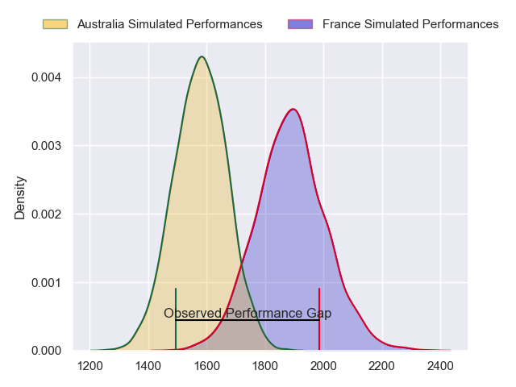
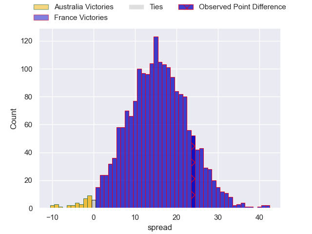
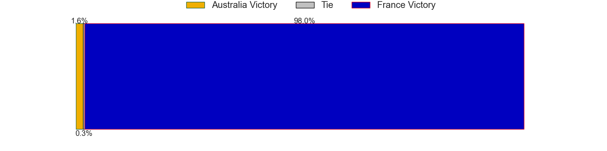
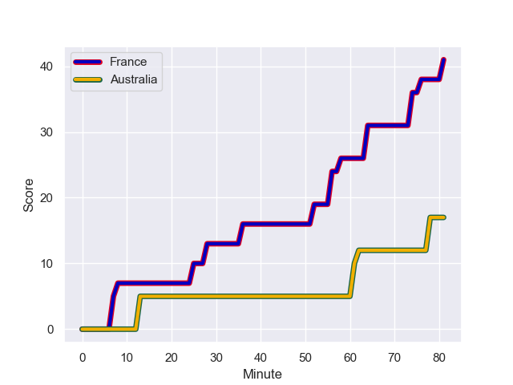
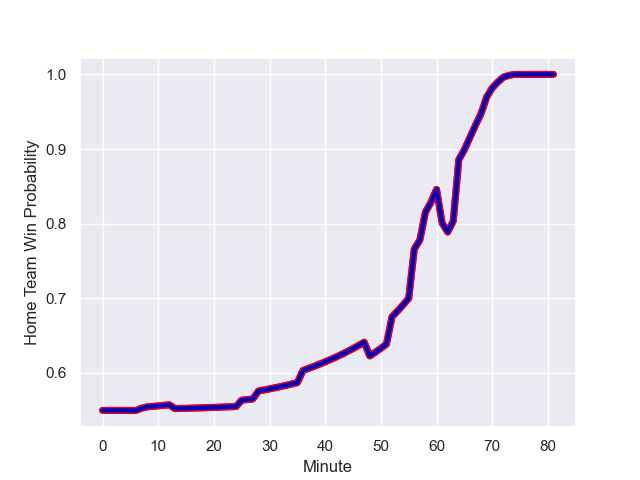

---  
layout: page  
title: Australia at France; 17.0-41.0  
date: 2023-08-26 18:00:00 -0500  
categories: match review  
---
# Australia at France; 17.0-41.0

# Club Level Predictions

The first set of predictions treats a club as the smallest object, as the club develops its members, organizes a gameplan, and deploys its players as needed for each match. This club model has a prediction of 0.841, which translates to predicting France to win by 15.0.

Each club has a rating and a rating deviation (simiar to a Glicko system), and expected performances can be generated. This allows for simulated matches and spreads like the ones below.
## Projected Performances

## Projected Spreads

## Projected Results

# Player Level Predictions - Version 1

Treating teams instead as an entity made up of the currently active players, I have ratings for each player in an altogether different system. These can be combined to form team ratings once teamsheets are announced, weighting starters a bit higher than the reserves. After the match is played, players can be weighted by their minutes on the field, allowing for an accurate measure of the team's composition. With these compiled team ratings, we can make predictions, measure inaccuracy, and update the individual player ratings.
## Prediction with Player Minutes: France by 12.6

France by 8.6 on a neutral field
## Prediction without Player Minutes: France by 14.1

France by 10.1 on a neutral pitch

## Scores over Time

## Win Probability over Time

There were 5 large changes in win probability in this match

|   Away Minutes | Away Player           |   Away elo |   Away Percentile |   Number |   Home Percentile |   Home elo | Home Player          |   Home Minutes |
|---------------:|:----------------------|-----------:|------------------:|---------:|------------------:|-----------:|:---------------------|---------------:|
|             72 | Angus Bell            |      89.75 |  943623           |        1 |            904975 |     111.1  | Jean-Baptiste Gros   |             48 |
|             69 | Dave Porecki          |      98.41 |  748147           |        2 |            756961 |      88.43 | Julien Marchand      |             48 |
|             69 | Taniela Tupou         |     125.8  |  800387           |        3 |            615832 |     105.48 | Uini Atonio          |             48 |
|             62 | Richie Arnold         |      80.45 |  791342           |        4 |            912957 |      85.33 | Thibaud Flament      |             48 |
|             72 | Will Skelton          |     121.44 |  680168           |        5 |            618529 |     135.53 | Paul Willemse        |             48 |
|             81 | Tom Hooper            |      87.47 |  982787           |        6 |            811275 |     150.01 | Francois Cros        |             81 |
|             81 | Fraser McReight       |      77.49 |  920745           |        7 |            696239 |     120.6  | Charles Ollivon      |             81 |
|             69 | Rob Valetini          |     102.94 |  889236           |        8 |            902596 |     111.47 | Gregory Alldritt     |             65 |
|             72 | Tate McDermott        |     109.93 |  907762           |        9 |            762348 |     111.32 | Antoine Dupont       |             60 |
|             81 | Carter Gordon         |      95.15 |  945519           |       10 |            891021 |      94.65 | Matthieu Jalibert    |             81 |
|             81 | Suliasi Vunivalu      |      87.77 |  976709           |       11 |            951994 |      73.16 | Gabin Villiere       |             81 |
|             69 | Lalakai Foketi        |      90.27 |  726300           |       12 |            581017 |     107.55 | Jonathan Danty       |             81 |
|             81 | Jordan Petaia         |     120.47 |  909225           |       13 |            646236 |      91.87 | Gael Fickou          |             81 |
|             81 | Mark Nawaqanitawase   |     100.71 |  943687           |       14 |            817239 |      87.26 | Damian Penaud        |             81 |
|             70 | Andrew Kellaway       |     117.45 |  740991           |       15 |            718352 |     111.89 | Thomas Ramos         |             69 |
|             12 | Matt Faessler         |      89.68 |  945564           |       16 |            863933 |     111.27 | Peato Mauvaka        |             33 |
|              9 | Blake Schoupp         |      87.71 |       1.01496e+06 |       17 |               nan |      99.99 | Sebastien Taofifenua |             33 |
|             12 | Zane Nonggorr         |      91.87 |  962534           |       18 |            756755 |     107.61 | Dorian Aldegheri     |             33 |
|              9 | Matt Philip           |      81.58 |  757465           |       19 |               nan |      99.76 | Romain Taofifenua    |             33 |
|             19 | Rob Leota             |      76.68 |  825989           |       20 |            895752 |      67.87 | Cameron Woki         |             33 |
|             12 | Langi Gleeson         |      88.97 |       1.00004e+06 |       21 |            931737 |     101.37 | Paul Boudehent       |             16 |
|              9 | Issak Fines-Leleiwasa |      90.94 |     nan           |       22 |            821506 |     119.32 | Baptiste Couilloud   |             21 |
|             23 | Ben Donaldson         |      84.07 |  943891           |       23 |            968947 |     117.21 | Melvyn Jaminet       |             12 |

# Player Level Predictions - Version 2

Treating teams instead as an entity made up of the currently active players, I have ratings for each player in an altogether different system. These can be combined to form team ratings once teamsheets are announced, weighting starters a bit higher than the reserves. After the match is played, players can be weighted by their minutes on the field, allowing for an accurate measure of the team's composition. With these compiled team ratings, we can make predictions, measure inaccuracy, and update the individual player ratings.
## Prediction with Player Minutes: France by 33.7

France by 30.0 on a neutral field
## Prediction without Player Minutes: France by 34.3

France by 30.6 on a neutral pitch

|   Away Minutes | Away Player           |   Away elo |   Away variance |   Number |   Home variance |   Home elo | Home Player          |   Home Minutes |
|---------------:|:----------------------|-----------:|----------------:|---------:|----------------:|-----------:|:---------------------|---------------:|
|             72 | Angus Bell            |      55.85 |           49.84 |        1 |           50    |      88.07 | Jean-Baptiste Gros   |             48 |
|             69 | Dave Porecki          |      45.04 |           48.24 |        2 |           50    |     104.72 | Julien Marchand      |             48 |
|             69 | Taniela Tupou         |      99.55 |           49.94 |        3 |           49.96 |     131.61 | Uini Atonio          |             48 |
|             62 | Richie Arnold         |      33.26 |           46.3  |        4 |           50    |      81.23 | Thibaud Flament      |             48 |
|             72 | Will Skelton          |     107.58 |           44.18 |        5 |           50    |      74.58 | Paul Willemse        |             48 |
|             81 | Tom Hooper            |      32.79 |           48.95 |        6 |           50    |     124.53 | Francois Cros        |             81 |
|             81 | Fraser McReight       |      55.03 |           47.41 |        7 |           50    |     121.75 | Charles Ollivon      |             81 |
|             69 | Rob Valetini          |      87.73 |           47.47 |        8 |           49.07 |     122.82 | Gregory Alldritt     |             65 |
|             72 | Tate McDermott        |      49.56 |           47.87 |        9 |           49.05 |     145.52 | Antoine Dupont       |             60 |
|             81 | Carter Gordon         |      33.23 |           47.51 |       10 |           50    |     107.36 | Matthieu Jalibert    |             81 |
|             81 | Suliasi Vunivalu      |      30.04 |           47.94 |       11 |           50    |      88.01 | Gabin Villiere       |             81 |
|             69 | Lalakai Foketi        |      64.26 |           50    |       12 |           50    |     113.92 | Jonathan Danty       |             81 |
|             81 | Jordan Petaia         |      64.98 |           49.86 |       13 |           49.5  |     112.86 | Gael Fickou          |             81 |
|             81 | Mark Nawaqanitawase   |      26.62 |           47.41 |       14 |           50    |      94.67 | Damian Penaud        |             81 |
|             70 | Andrew Kellaway       |      58.42 |           48.45 |       15 |           50    |     122.73 | Thomas Ramos         |             69 |
|             12 | Matt Faessler         |      37.06 |           50    |       16 |           50    |      83.07 | Peato Mauvaka        |             33 |
|              9 | Blake Schoupp         |      42.53 |           50    |       17 |           50    |      46.65 | Sebastien Taofifenua |             33 |
|             12 | Zane Nonggorr         |      44.73 |           48.31 |       18 |           49.55 |     103.22 | Dorian Aldegheri     |             33 |
|              9 | Matt Philip           |      40.97 |           49.53 |       19 |           50    |      46.65 | Romain Taofifenua    |             33 |
|             19 | Rob Leota             |      24.49 |           49.89 |       20 |           50    |      66.19 | Cameron Woki         |             33 |
|             12 | Langi Gleeson         |      50.69 |           50    |       21 |           50    |      43    | Paul Boudehent       |             16 |
|              9 | Issak Fines-Leleiwasa |      46.65 |           50    |       22 |           50    |      87.3  | Baptiste Couilloud   |             21 |
|             23 | Ben Donaldson         |      53.57 |           50    |       23 |           50    |      76.35 | Melvyn Jaminet       |             12 |

