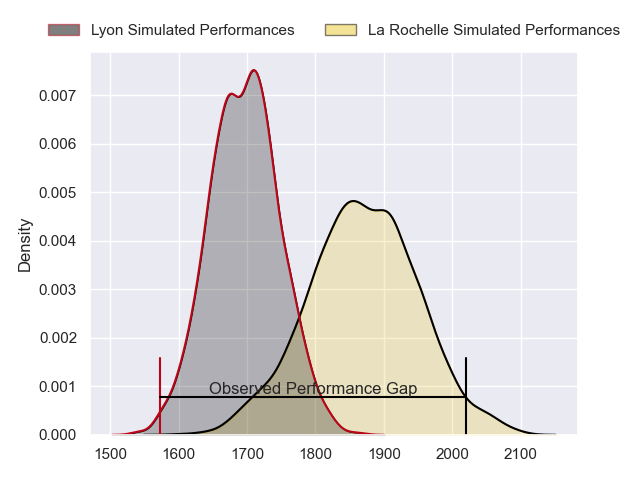
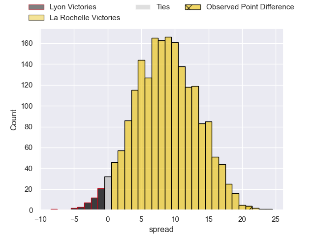
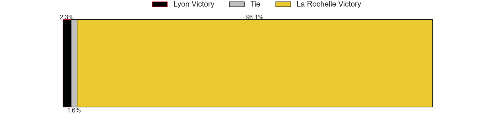
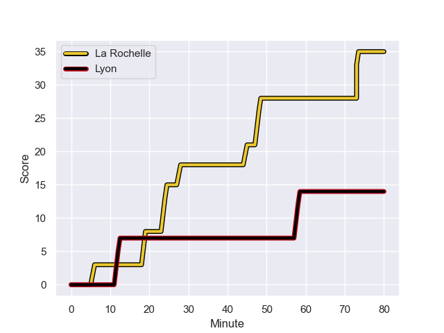
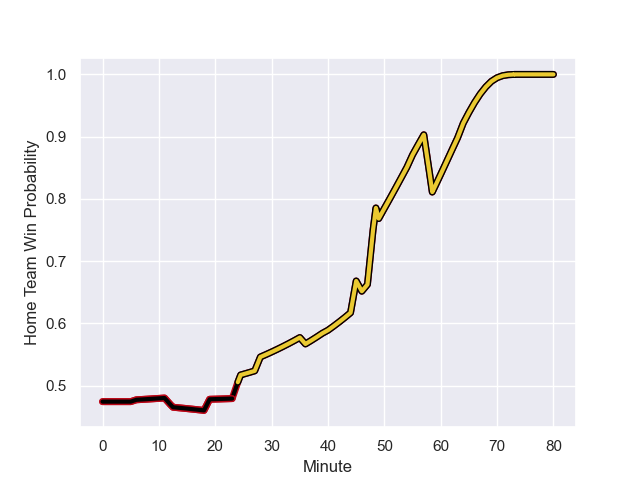

---  
layout: page  
title: Lyon at La Rochelle; 14-35  
date: 2023-08-26 18:00:00 -0500  
categories: match review  
---
# Lyon at La Rochelle; 14-35

# Club Level Predictions

The first set of predictions treats a club as the smallest object, as the club develops its members, organizes a gameplan, and deploys its players as needed for each match. This club model has a prediction of 0.733, which translates to predicting La Rochelle to win by 8.9.

Each club has a rating and a rating deviation (simiar to a Glicko system), and expected performances can be generated. This allows for simulated matches and spreads like the ones below.
## Projected Performances

## Projected Spreads

## Projected Results

# Player Level Predictions - Version 1

Treating teams instead as an entity made up of the currently active players, I have ratings for each player in an altogether different system. These can be combined to form team ratings once teamsheets are announced, weighting starters a bit higher than the reserves. After the match is played, players can be weighted by their minutes on the field, allowing for an accurate measure of the team's composition. With these compiled team ratings, we can make predictions, measure inaccuracy, and update the individual player ratings.
## Prediction with Player Minutes: Lyon by 0.5

Lyon by 4.5 on a neutral field
## Prediction without Player Minutes: La Rochelle by 1.1

Lyon by 2.9 on a neutral pitch

## Scores over Time

## Win Probability over Time

There were 6 large changes in win probability in this match

|   Away Minutes | Away Player           |   Away elo |   Away Percentile |   Number |   Home Percentile |   Home elo | Home Player               |   Home Minutes |
|---------------:|:----------------------|-----------:|------------------:|---------:|------------------:|-----------:|:--------------------------|---------------:|
|             49 | Jerome Rey            |      83.53 |       1.01965e+06 |        1 |       1.01749e+06 |      91.09 | Georges-Henri Colombe     |             36 |
|             49 | Yanis Charcosset      |      84.08 |       1.01964e+06 |        2 |       1.0199e+06  |      79.58 | Billy Pollard             |             40 |
|             49 | Demba Bamba           |      88.82 |       1.01726e+06 |        3 |  977331           |      79.39 | Archer Holz               |             40 |
|             80 | Killian Geraci        |      88.69 |       1.01962e+06 |        4 |       1.01751e+06 |      82.79 | Thomas Lavault            |             69 |
|             46 | Loann Goujon          |      86.5  |       1.01963e+06 |        5 |       1.01982e+06 |      75.32 | Rémi Picquette            |             80 |
|             46 | Pierre-Samuel Pacheco |      75.17 |  992525           |        6 |       1.01752e+06 |      78.65 | Ultan Dillane             |             80 |
|             80 | Joel Kpoku            |      85.03 |       1.01965e+06 |        7 |       1.01603e+06 |      80    | Oscar Jegou               |             55 |
|             80 | Arno Botha            |      84.92 |       1.01967e+06 |        8 |       1.01979e+06 |      76.33 | Judicael Cancoriet        |             80 |
|             46 | Pierre Pagès          |      82.42 |       1.01968e+06 |        9 |       1.0175e+06  |      94.24 | Tawera Kerr-Barlow        |             49 |
|             50 | Fletcher Smith        |      83.4  |       1.01968e+06 |       10 |       1.01537e+06 |      89.54 | Hugo Reus                 |             49 |
|             80 | Vincent Rattez        |      86.21 |       1.01964e+06 |       11 |       1.01749e+06 |      94.07 | Dillyn Leyds              |             80 |
|             80 | Kyle Godwin           |      88.15 |       1.01962e+06 |       12 |       1.01748e+06 |      84    | Jules Favre               |             80 |
|             55 | Josiah Maraku         |      88.63 |       1.01728e+06 |       13 |       1.01979e+06 |      76.65 | Jack Nowell               |             80 |
|             80 | Xavier Mignot         |      86.88 |       1.01964e+06 |       14 |       1.01981e+06 |      75.03 | Teddy Thomas              |             64 |
|             80 | Toby Arnold           |      93.75 |       1.01722e+06 |       15 |       1.01748e+06 |     108.66 | Brice Dulin               |             80 |
|             34 | Mickael Guillard      |      91.03 |     nan           |       16 |       1.01981e+06 |      78.3  | Thierry Paiva             |             44 |
|             34 | Félix Lambey          |      94.21 |       1.01721e+06 |       17 |       1.01111e+06 |      74.1  | Aleksandre Kuntelia       |             40 |
|             34 | Paul Dumas            |      82.39 |     nan           |       18 |       1.01751e+06 |      83.78 | Quentin Lespiaucq-Brettes |             40 |
|             31 | Hamza Kaabeche        |      84.03 |       1.01965e+06 |       19 |     nan           |      84.37 | Teddy Iribaren            |             31 |
|             31 | Guillaume Marchand    |      93.09 |     nan           |       20 |       1.0198e+06  |      76.03 | Ihaia West                |             31 |
|             31 | Santiago Medrano      |      82.58 |     nan           |       21 |     nan           |      90.16 | Noé Della Schiava         |             25 |
|             30 | Paddy Jackson         |      82.86 |     nan           |       22 |     nan           |      84.62 | Nathan Bollengier         |             16 |
|             25 | Alfred Parisien       |      94.08 |     nan           |       23 |     nan           |      85.84 | Thomas Ployet             |             11 |

# Player Level Predictions - Version 2

Treating teams instead as an entity made up of the currently active players, I have ratings for each player in an altogether different system. These can be combined to form team ratings once teamsheets are announced, weighting starters a bit higher than the reserves. After the match is played, players can be weighted by their minutes on the field, allowing for an accurate measure of the team's composition. With these compiled team ratings, we can make predictions, measure inaccuracy, and update the individual player ratings.
## Prediction with Player Minutes: La Rochelle by 4.7

Lyon by 0.0 on a neutral field
## Prediction without Player Minutes: La Rochelle by 4.7

Lyon by 0.0 on a neutral pitch

|   Away Minutes | Away Player           |   Away elo |   Away variance |   Number |   Home variance |   Home elo | Home Player               |   Home Minutes |
|---------------:|:----------------------|-----------:|----------------:|---------:|----------------:|-----------:|:--------------------------|---------------:|
|             49 | Jerome Rey            |      46.65 |              50 |        1 |              50 |      46.65 | Georges-Henri Colombe     |             36 |
|             49 | Yanis Charcosset      |      46.65 |              50 |        2 |              50 |      46.65 | Billy Pollard             |             40 |
|             49 | Demba Bamba           |      46.65 |              50 |        3 |              50 |      39.05 | Archer Holz               |             40 |
|             80 | Killian Geraci        |      46.65 |              50 |        4 |              50 |      46.65 | Thomas Lavault            |             69 |
|             46 | Loann Goujon          |      46.65 |              50 |        5 |              50 |      46.65 | Rémi Picquette            |             80 |
|             46 | Pierre-Samuel Pacheco |      42.2  |              50 |        6 |              50 |      46.65 | Ultan Dillane             |             80 |
|             80 | Joel Kpoku            |      46.65 |              50 |        7 |              50 |      47    | Oscar Jegou               |             55 |
|             80 | Arno Botha            |      46.65 |              50 |        8 |              50 |      46.65 | Judicael Cancoriet        |             80 |
|             46 | Pierre Pagès          |      46.65 |              50 |        9 |              50 |      46.65 | Tawera Kerr-Barlow        |             49 |
|             50 | Fletcher Smith        |      46.65 |              50 |       10 |              50 |      49.86 | Hugo Reus                 |             49 |
|             80 | Vincent Rattez        |      46.65 |              50 |       11 |              50 |      46.65 | Dillyn Leyds              |             80 |
|             80 | Kyle Godwin           |      46.65 |              50 |       12 |              50 |      46.65 | Jules Favre               |             80 |
|             55 | Josiah Maraku         |      46.65 |              50 |       13 |              50 |      46.65 | Jack Nowell               |             80 |
|             80 | Xavier Mignot         |      46.65 |              50 |       14 |              50 |      46.65 | Teddy Thomas              |             64 |
|             80 | Toby Arnold           |      46.65 |              50 |       15 |              50 |      46.65 | Brice Dulin               |             80 |
|             34 | Mickael Guillard      |      46.65 |              50 |       16 |              50 |      46.65 | Thierry Paiva             |             44 |
|             34 | Félix Lambey          |      46.65 |              50 |       17 |              50 |      43.52 | Aleksandre Kuntelia       |             40 |
|             34 | Paul Dumas            |      46.65 |              50 |       18 |              50 |      46.65 | Quentin Lespiaucq-Brettes |             40 |
|             31 | Hamza Kaabeche        |      46.65 |              50 |       19 |              50 |      46.65 | Teddy Iribaren            |             31 |
|             31 | Guillaume Marchand    |      46.65 |              50 |       20 |              50 |      46.65 | Ihaia West                |             31 |
|             31 | Santiago Medrano      |      46.65 |              50 |       21 |              50 |      46.67 | Noé Della Schiava         |             25 |
|             30 | Paddy Jackson         |      46.65 |              50 |       22 |              50 |      46.65 | Nathan Bollengier         |             16 |
|             25 | Alfred Parisien       |      46.65 |              50 |       23 |              50 |      46.65 | Thomas Ployet             |             11 |

