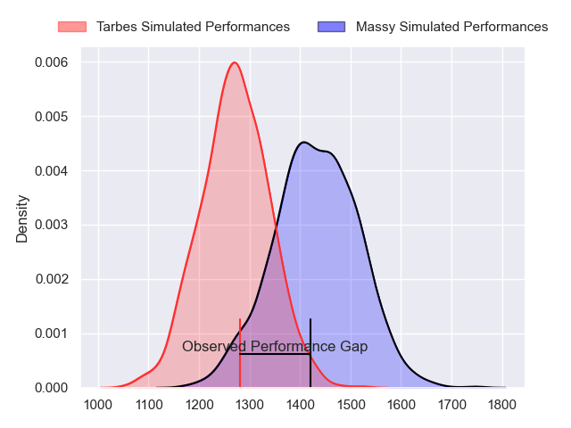
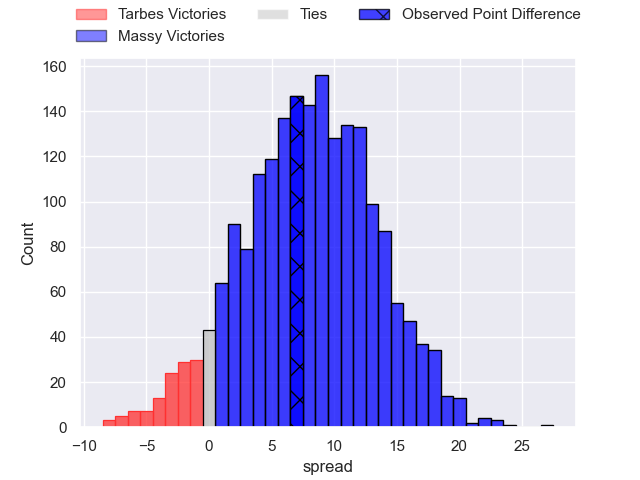
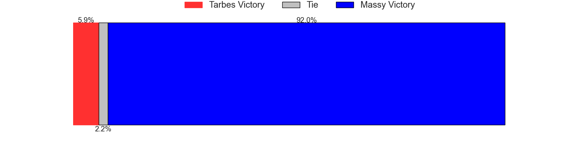
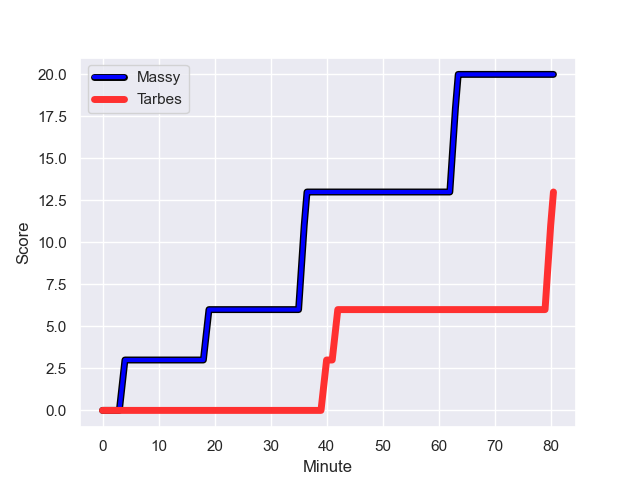
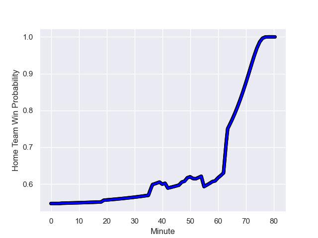

---  
layout: page  
title: Tarbes at Massy; 13-20  
date: 2023-08-26 18:00:00 -0500  
categories: match review  
---
# Tarbes at Massy; 13-20

# Club Level Predictions

The first set of predictions treats a club as the smallest object, as the club develops its members, organizes a gameplan, and deploys its players as needed for each match. This club model has a prediction of 0.714, which translates to predicting Massy to win by 8.1.

Each club has a rating and a rating deviation (simiar to a Glicko system), and expected performances can be generated. This allows for simulated matches and spreads like the ones below.
## Projected Performances

## Projected Spreads

## Projected Results

# Player Level Predictions - Version 1

Treating teams instead as an entity made up of the currently active players, I have ratings for each player in an altogether different system. These can be combined to form team ratings once teamsheets are announced, weighting starters a bit higher than the reserves. After the match is played, players can be weighted by their minutes on the field, allowing for an accurate measure of the team's composition. With these compiled team ratings, we can make predictions, measure inaccuracy, and update the individual player ratings.
## Prediction with Player Minutes: Massy by 12.2

Massy by 8.2 on a neutral field
## Prediction without Player Minutes: Massy by 13.4

Massy by 9.4 on a neutral pitch

## Scores over Time

## Win Probability over Time

There were 3 large changes in win probability in this match

|   Away Minutes | Away Player            |   Away elo |   Away Percentile |   Number |   Home Percentile |   Home elo | Home Player              |   Home Minutes |
|---------------:|:-----------------------|-----------:|------------------:|---------:|------------------:|-----------:|:-------------------------|---------------:|
|             59 | Antoine Palisse        |      64.26 |  980959           |        1 |  992722           |      91.02 | Robin Poipy              |             55 |
|             51 | Florian Lamothe        |      67.06 |  974126           |        2 |  968337           |     113.77 | Pierre Trassoudaine      |             55 |
|             52 | Aleksi Tchitchiashvili |      64.7  |       1.01033e+06 |        3 |  880453           |      84.16 | Nicolas Ferrer           |             55 |
|             59 | Francis Rolland        |      70.83 |       1.02072e+06 |        4 |  995157           |      98.46 | Saba Pesvianidze         |             80 |
|             80 | Baptiste Peytavi       |      71.37 |       1.02072e+06 |        5 |       1.00801e+06 |      71.05 | Lilian Rousset           |             49 |
|             80 | Alexis Armary          |      95.55 |  943000           |        6 |       1.01151e+06 |      67.34 | Tony Tissot              |             60 |
|             47 | Léo Saint-Guilhem      |      83.16 |  968870           |        7 |       1.01244e+06 |      76.22 | Clément Vidoni           |             49 |
|             80 | Aurelien Ricart        |      71.78 |       1.02072e+06 |        8 |       1.02072e+06 |      76.94 | Abongile Nonkontwana     |             80 |
|             59 | Anthony Meric          |      71.18 |       1.02072e+06 |        9 |       1.02072e+06 |      76.56 | Lucas Rubio              |             49 |
|             80 | Anthony  Fuertes       |      71    |       1.02072e+06 |       10 |       1.0074e+06  |      76.71 | Tom Deleuze              |             80 |
|             65 | Clement Latorre        |      71.03 |       1.01392e+06 |       11 |  964325           |      49.74 | Yanis Dit Robaglia       |             80 |
|             80 | William Pees           |      73.84 |  779082           |       12 |  937545           |      73.58 | Victorien Jacomme        |             80 |
|             40 | Pierre Descoubet       |      73.19 |       1.01294e+06 |       13 |  964347           |      83.21 | Arthur Seigneuret        |             60 |
|             80 | Thibaut Trotta         |      96.67 |  996061           |       14 |  974050           |      99.79 | Alex Preira              |             80 |
|             80 | Mathieu Berbizier      |      88.43 |  908293           |       15 |  955694           |      91.23 | Giorgi Gogoladze         |             80 |
|             40 | Julien Cantan          |      61.82 |  975996           |       16 |  665458           |      98.43 | Benjamin Prier           |             31 |
|             33 | Dorian Bonnin          |      70.67 |     nan           |       17 |     nan           |      76.74 | Louis Bruinsma           |             31 |
|             29 | Enzo Mondon            |      82.89 |  948482           |       18 |  948326           |      63.03 | Hugo Boutin              |             31 |
|             28 | Johan Mees Erasmus     |      72.92 |  833199           |       19 |  995007           |      64.73 | Tijde Visser             |             25 |
|             21 | Thibaut Dulucq         |      80.7  |  968107           |       20 |     nan           |      77.14 | Fernandez Correa         |             25 |
|             21 | Alexandre Combier      |      66.9  |  992019           |       21 |  993738           |      79.94 | Pierre-Alexandre Duclieu |             25 |
|             21 | Jone Trevor Seuvou     |      65.77 |  935504           |       22 |       1.00741e+06 |      79.19 | Tom Cusson               |             20 |
|             15 | Yon Camou              |      71.57 |     nan           |       23 |     nan           |      76.39 | Marius Ruyffelaere       |             20 |

# Player Level Predictions - Version 2

Treating teams instead as an entity made up of the currently active players, I have ratings for each player in an altogether different system. These can be combined to form team ratings once teamsheets are announced, weighting starters a bit higher than the reserves. After the match is played, players can be weighted by their minutes on the field, allowing for an accurate measure of the team's composition. With these compiled team ratings, we can make predictions, measure inaccuracy, and update the individual player ratings.
## Prediction with Player Minutes: Massy by 6.8

Massy by 3.3 on a neutral field
## Prediction without Player Minutes: Massy by 6.7

Massy by 3.2 on a neutral pitch

|   Away Minutes | Away Player            |   Away elo |   Away variance |   Number |   Home variance |   Home elo | Home Player              |   Home Minutes |
|---------------:|:-----------------------|-----------:|----------------:|---------:|----------------:|-----------:|:-------------------------|---------------:|
|             59 | Antoine Palisse        |      48.35 |              50 |        1 |              50 |      51.32 | Robin Poipy              |             55 |
|             51 | Florian Lamothe        |      40.37 |              50 |        2 |              50 |      74.45 | Pierre Trassoudaine      |             55 |
|             52 | Aleksi Tchitchiashvili |      42.9  |              50 |        3 |              50 |      56.37 | Nicolas Ferrer           |             55 |
|             59 | Francis Rolland        |      46.65 |              50 |        4 |              50 |      55.86 | Saba Pesvianidze         |             80 |
|             80 | Baptiste Peytavi       |      46.65 |              50 |        5 |              50 |      45.01 | Lilian Rousset           |             49 |
|             80 | Alexis Armary          |      75.18 |              50 |        6 |              50 |      38.13 | Tony Tissot              |             60 |
|             47 | Léo Saint-Guilhem      |      49.59 |              50 |        7 |              50 |      46    | Clément Vidoni           |             49 |
|             80 | Aurelien Ricart        |      46.65 |              50 |        8 |              50 |      46.65 | Abongile Nonkontwana     |             80 |
|             59 | Anthony Meric          |      46.65 |              50 |        9 |              50 |      46.65 | Lucas Rubio              |             49 |
|             80 | Anthony  Fuertes       |      46.65 |              50 |       10 |              50 |      32.22 | Tom Deleuze              |             80 |
|             65 | Clement Latorre        |      41.87 |              50 |       11 |              50 |      28.59 | Yanis Dit Robaglia       |             80 |
|             80 | William Pees           |      27.02 |              50 |       12 |              50 |      66.07 | Victorien Jacomme        |             80 |
|             40 | Pierre Descoubet       |      48.52 |              50 |       13 |              50 |      46.57 | Arthur Seigneuret        |             60 |
|             80 | Thibaut Trotta         |      43.36 |              50 |       14 |              50 |      66.85 | Alex Preira              |             80 |
|             80 | Mathieu Berbizier      |      21.95 |              50 |       15 |              50 |      44.36 | Giorgi Gogoladze         |             80 |
|             40 | Julien Cantan          |      35.32 |              50 |       16 |              50 |      57.22 | Benjamin Prier           |             31 |
|             33 | Dorian Bonnin          |      46.65 |              50 |       17 |              50 |      46.65 | Louis Bruinsma           |             31 |
|             29 | Enzo Mondon            |      51.64 |              50 |       18 |              50 |      39.72 | Hugo Boutin              |             31 |
|             28 | Johan Mees Erasmus     |      31.67 |              50 |       19 |              50 |      37.59 | Tijde Visser             |             25 |
|             21 | Thibaut Dulucq         |      27.83 |              50 |       20 |              50 |      46.65 | Fernandez Correa         |             25 |
|             21 | Alexandre Combier      |      33.51 |              50 |       21 |              50 |      39.32 | Pierre-Alexandre Duclieu |             25 |
|             21 | Jone Trevor Seuvou     |      22.49 |              50 |       22 |              50 |      38.27 | Tom Cusson               |             20 |
|             15 | Yon Camou              |      46.65 |              50 |       23 |              50 |      46.65 | Marius Ruyffelaere       |             20 |

