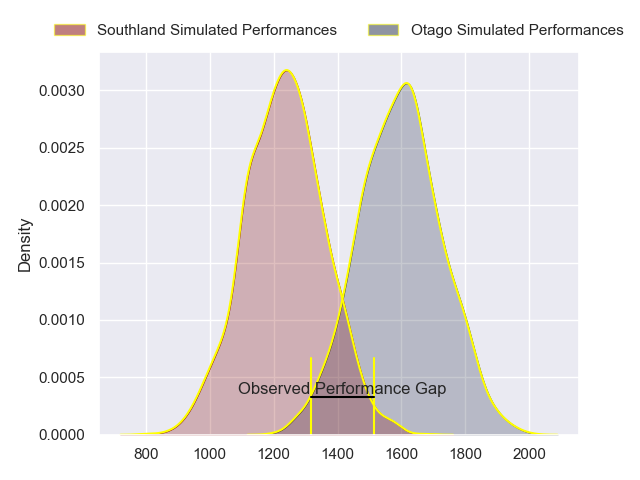
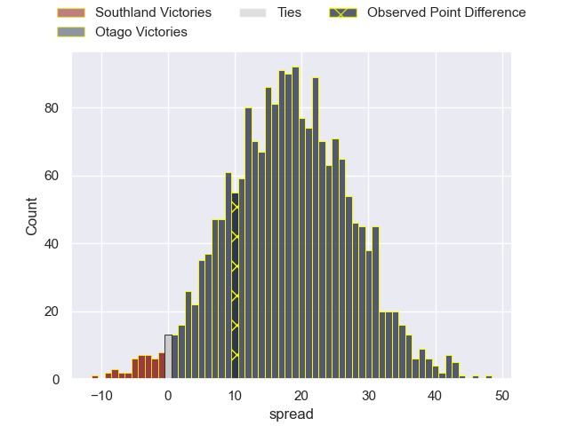
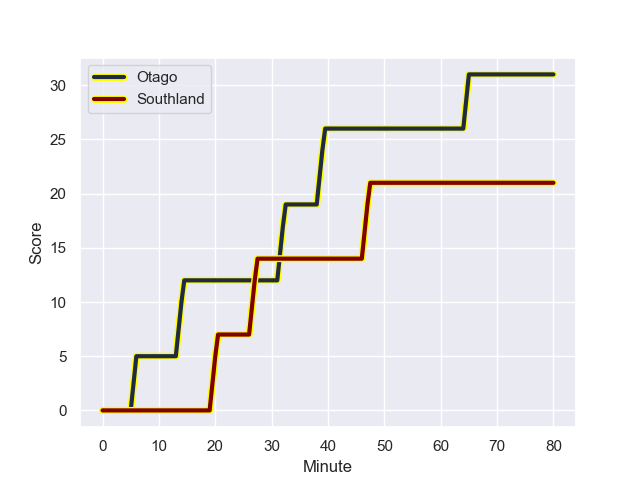
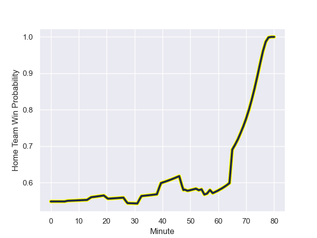

---  
layout: page  
title: Southland at Otago; 21-31  
date: 2023-08-26 18:00:00 -0500  
categories: match review  
---
# Southland at Otago; 21-31

# Club Level Predictions

The first set of predictions treats a club as the smallest object, as the club develops its members, organizes a gameplan, and deploys its players as needed for each match. This club model has a prediction of 0.868, which translates to predicting Otago to win by 17.7.

Each club has a rating and a rating deviation (simiar to a Glicko system), and expected performances can be generated. This allows for simulated matches and spreads like the ones below.
## Projected Performances

## Projected Spreads

## Projected Results

# Player Level Predictions - Version 1

Treating teams instead as an entity made up of the currently active players, I have ratings for each player in an altogether different system. These can be combined to form team ratings once teamsheets are announced, weighting starters a bit higher than the reserves. After the match is played, players can be weighted by their minutes on the field, allowing for an accurate measure of the team's composition. With these compiled team ratings, we can make predictions, measure inaccuracy, and update the individual player ratings.
## Prediction with Player Minutes: Otago by 12.5

Otago by 8.5 on a neutral field
## Prediction without Player Minutes: Otago by 13.2

Otago by 9.2 on a neutral pitch

## Scores over Time

## Win Probability over Time

There were 8 large changes in win probability in this match

|   Away Minutes | Away Player           |   Away elo |   Away Percentile |   Number |   Home Percentile |   Home elo | Home Player                |   Home Minutes |
|---------------:|:----------------------|-----------:|------------------:|---------:|------------------:|-----------:|:---------------------------|---------------:|
|             53 | Joe Walsh             |      68.11 |       1.01886e+06 |        1 |       1.01651e+06 |      83.09 | Abraham Pole               |             53 |
|             67 | Jack Taylor           |      70.27 |       1.01883e+06 |        2 |       1.01741e+06 |      75.66 | Henry Bell                 |             67 |
|             49 | Morgan Mitchell       |      60.29 |       1.01716e+06 |        3 |       1.01809e+06 |      67.64 | Jermaine Ainsley           |             53 |
|             55 | Mike McKee            |      65.73 |       1.02002e+06 |        4 |       1.0181e+06  |      69.74 | Fabian Holland             |             59 |
|             80 | Josh Bekhuis          |      74.77 |       1.0188e+06  |        5 |       1.01808e+06 |      74.3  | Josh Dickson               |             80 |
|             80 | Hayden Michaels       |      58.28 |       1.0189e+06  |        6 |       1.01988e+06 |      70.53 | Tom Sanders                |             80 |
|             57 | Leroy Ferguson        |      79.98 |       1.01882e+06 |        7 |       1.01806e+06 |      77.16 | Sean Withy                 |             80 |
|             80 | Blair Ryall           |      67.62 |       1.0189e+06  |        8 |  987483           |      96.68 | Christian Lio-Willie       |             58 |
|             65 | Jay Renton            |      65.54 |       1.01892e+06 |        9 |       1.01809e+06 |      66.91 | James Arscott              |             65 |
|             80 | Dan Hollinshead       |      64.33 |       1.0196e+06  |       10 |       1.02002e+06 |      69.6  | Ajay Faleafaga             |             67 |
|             80 | Michael Manson        |      61.55 |       1.01882e+06 |       11 |       1.01808e+06 |      69.08 | Jona Malanicagi Nareki     |             72 |
|             67 | Scott Gregory         |      60.2  |       1.01884e+06 |       12 |       1.01904e+06 |      74.65 | Jack Leslie                |             80 |
|             80 | Matt Whaanga          |      72.61 |       1.01881e+06 |       13 |       1.01803e+06 |      73.54 | Thomas Carlos Umaga-Jensen |             80 |
|             68 | Viliami Fine          |      69.15 |       1.01888e+06 |       14 |       1.01808e+06 |      75    | Josh Whaanga               |             80 |
|             80 | Gabriel Hamer-Webb    |      69.93 |       1.01911e+06 |       15 |       1.0181e+06  |      72.5  | Finn Hurley                |             80 |
|             27 | Jonah Aoina           |      74.34 |     nan           |       16 |     nan           |      68.92 | Ben Lopas                  |             27 |
|             31 | Quinn Harrison-Jones  |      71.05 |     nan           |       17 |       1.01804e+06 |      73.62 | Saula Ma'u                 |             27 |
|             13 | Ben Strang            |      64.85 |       1.0139e+06  |       18 |     nan           |      67.86 | Ricky Jackson              |             13 |
|             25 | Shneil Singh          |     103.55 |  919106           |       19 |     nan           |      69.76 | Josh Hill                  |             21 |
|             23 | Semisi Tupou Ta’eiloa |      65.02 |     nan           |       20 |       1.01767e+06 |      70.06 | Sam Fischli                |             22 |
|             15 | Jahvis Wallace        |      65.58 |     nan           |       21 |     nan           |      67.76 | Nathan Hastie              |             15 |
|             12 | Marty Banks           |      66.43 |       1.01881e+06 |       22 |     nan           |      70.66 | Jeremiah Asi               |              8 |
|             13 | Tevita Latu           |      65.1  |     nan           |       23 |     nan           |      76.6  | John Tapueluelu            |             13 |

# Player Level Predictions - Version 2

Treating teams instead as an entity made up of the currently active players, I have ratings for each player in an altogether different system. These can be combined to form team ratings once teamsheets are announced, weighting starters a bit higher than the reserves. After the match is played, players can be weighted by their minutes on the field, allowing for an accurate measure of the team's composition. With these compiled team ratings, we can make predictions, measure inaccuracy, and update the individual player ratings.
## Prediction with Player Minutes: Otago by 3.7

Otago by 0.3 on a neutral field
## Prediction without Player Minutes: Otago by 3.9

Otago by 0.5 on a neutral pitch

|   Away Minutes | Away Player           |   Away elo |   Away variance |   Number |   Home variance |   Home elo | Home Player                |   Home Minutes |
|---------------:|:----------------------|-----------:|----------------:|---------:|----------------:|-----------:|:---------------------------|---------------:|
|             53 | Joe Walsh             |      46.65 |              50 |        1 |              50 |      46.65 | Abraham Pole               |             53 |
|             67 | Jack Taylor           |      46.65 |              50 |        2 |              50 |      46.65 | Henry Bell                 |             67 |
|             49 | Morgan Mitchell       |      46.65 |              50 |        3 |              50 |      46.65 | Jermaine Ainsley           |             53 |
|             55 | Mike McKee            |      46.65 |              50 |        4 |              50 |      46.65 | Fabian Holland             |             59 |
|             80 | Josh Bekhuis          |      46.65 |              50 |        5 |              50 |      46.65 | Josh Dickson               |             80 |
|             80 | Hayden Michaels       |      46.65 |              50 |        6 |              50 |      46.65 | Tom Sanders                |             80 |
|             57 | Leroy Ferguson        |      46.65 |              50 |        7 |              50 |      46.65 | Sean Withy                 |             80 |
|             80 | Blair Ryall           |      46.65 |              50 |        8 |              50 |      66.99 | Christian Lio-Willie       |             58 |
|             65 | Jay Renton            |      46.65 |              50 |        9 |              50 |      46.65 | James Arscott              |             65 |
|             80 | Dan Hollinshead       |      46.65 |              50 |       10 |              50 |      46.65 | Ajay Faleafaga             |             67 |
|             80 | Michael Manson        |      46.65 |              50 |       11 |              50 |      46.65 | Jona Malanicagi Nareki     |             72 |
|             67 | Scott Gregory         |      46.65 |              50 |       12 |              50 |      46.65 | Jack Leslie                |             80 |
|             80 | Matt Whaanga          |      46.65 |              50 |       13 |              50 |      46.65 | Thomas Carlos Umaga-Jensen |             80 |
|             68 | Viliami Fine          |      46.65 |              50 |       14 |              50 |      46.65 | Josh Whaanga               |             80 |
|             80 | Gabriel Hamer-Webb    |      46.65 |              50 |       15 |              50 |      46.65 | Finn Hurley                |             80 |
|             27 | Jonah Aoina           |      46.65 |              50 |       16 |              50 |      46.65 | Ben Lopas                  |             27 |
|             31 | Quinn Harrison-Jones  |      46.65 |              50 |       17 |              50 |      46.65 | Saula Ma'u                 |             27 |
|             13 | Ben Strang            |      46.23 |              50 |       18 |              50 |      46.65 | Ricky Jackson              |             13 |
|             25 | Shneil Singh          |      67.42 |              50 |       19 |              50 |      46.65 | Josh Hill                  |             21 |
|             23 | Semisi Tupou Ta’eiloa |      46.65 |              50 |       20 |              50 |      46.65 | Sam Fischli                |             22 |
|             15 | Jahvis Wallace        |      46.65 |              50 |       21 |              50 |      46.65 | Nathan Hastie              |             15 |
|             12 | Marty Banks           |      46.65 |              50 |       22 |              50 |      46.65 | Jeremiah Asi               |              8 |
|             13 | Tevita Latu           |      46.65 |              50 |       23 |              50 |      46.65 | John Tapueluelu            |             13 |

