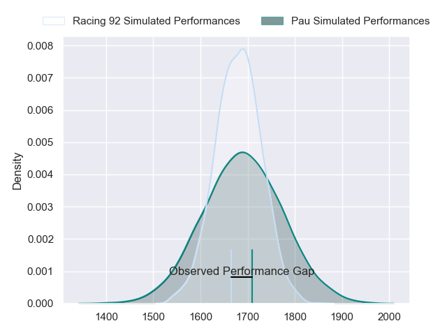
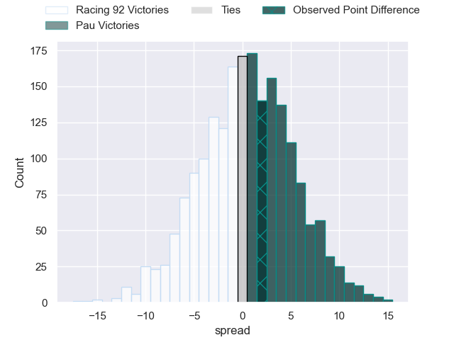
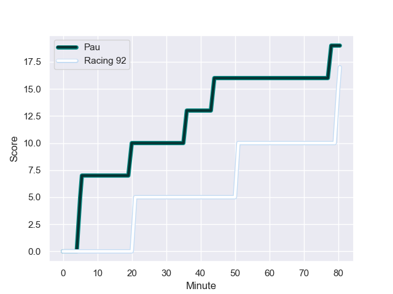
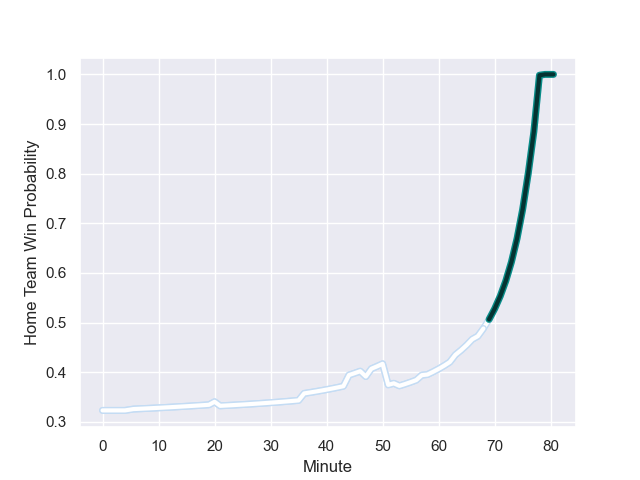

---  
layout: page  
title: Racing 92 at Pau; 17-19  
date: 2023-08-26 18:00:00 -0500  
categories: match review  
---
# Racing 92 at Pau; 17-19

# Club Level Predictions

The first set of predictions treats a club as the smallest object, as the club develops its members, organizes a gameplan, and deploys its players as needed for each match. This club model has a prediction of 0.512, which translates to predicting Pau to win by 0.4.

Each club has a rating and a rating deviation (simiar to a Glicko system), and expected performances can be generated. This allows for simulated matches and spreads like the ones below.
## Projected Performances

## Projected Spreads

## Projected Results

# Player Level Predictions - Version 1

Treating teams instead as an entity made up of the currently active players, I have ratings for each player in an altogether different system. These can be combined to form team ratings once teamsheets are announced, weighting starters a bit higher than the reserves. After the match is played, players can be weighted by their minutes on the field, allowing for an accurate measure of the team's composition. With these compiled team ratings, we can make predictions, measure inaccuracy, and update the individual player ratings.
## Prediction with Player Minutes: Racing 92 by 28.1

Racing 92 by 32.1 on a neutral field
## Prediction without Player Minutes: Racing 92 by 28.4

Racing 92 by 32.4 on a neutral pitch

## Scores over Time

## Win Probability over Time

There were 9 large changes in win probability in this match

|   Away Minutes | Away Player         |   Away elo |   Away Percentile |   Number |   Home Percentile |   Home elo | Home Player              |   Home Minutes |
|---------------:|:--------------------|-----------:|------------------:|---------:|------------------:|-----------:|:-------------------------|---------------:|
|             47 | Thomas Moukoro      |      80.59 |       1.01324e+06 |        1 |       1.01963e+06 |      62.89 | Hayden Thompson-Stringer |             53 |
|             47 | Janick Tarrit       |      75.15 |  925020           |        2 |       1.01966e+06 |      61.02 | Lucas Rey                |             57 |
|             47 | Cedate Gomes Sa     |      85.37 |       1.01669e+06 |        3 |       1.01964e+06 |      61.34 | Nicolas Corato           |             53 |
|             80 | Baptiste Chouzenoux |      85.66 |       1.01753e+06 |        4 |       1.01961e+06 |      64.63 | Guillaume Ducat          |             53 |
|             58 | Fabien Sanconnie    |      90.43 |       1.0167e+06  |        5 |       1.01962e+06 |      65.67 | Fabrice Metz             |             80 |
|             80 | Wenceslas Lauret    |      87.75 |       1.01673e+06 |        6 |       1.01964e+06 |      65.65 | Reece Hewat              |             80 |
|             47 | Maxime Baudonne     |      80.04 |       1.01959e+06 |        7 |       1.01965e+06 |      64.91 | Luke Whitelock           |             80 |
|             80 | Jordan Joseph       |      82.21 |       1.01958e+06 |        8 |  918356           |      38.77 | Sacha Zegueur            |             48 |
|             63 | Nolann Le Garrec    |      92.28 |       1.01664e+06 |        9 |       1.01968e+06 |      55.44 | Thibault Daubagna        |             57 |
|             58 | Tristan Tedder      |      80.34 |       1.01697e+06 |       10 |       1.01966e+06 |      64.02 | Joe Simmonds             |             80 |
|             80 | Wame Naituvi        |      83.71 |  898981           |       11 |       1.01282e+06 |      72.02 | Théo Attissogbe          |             67 |
|             80 | Henry Chavancy      |      91.94 |       1.01664e+06 |       12 |       1.02002e+06 |      59.83 | Nathan Decron            |             80 |
|             57 | Francis Saili       |      84.13 |       1.01672e+06 |       13 |       1.01825e+06 |      95.86 | Emilien Gailleton        |             80 |
|             80 | Christian Wade      |      81.71 |       1.02001e+06 |       14 |       1.01968e+06 |      63.88 | Clément Laporte          |             63 |
|             80 | Max Spring          |      95.41 |       1.01665e+06 |       15 |       1.01963e+06 |      66.29 | Jack Maddocks            |             80 |
|             33 | Eddy Ben Arous      |      85.33 |     nan           |       16 |     nan           |      56.47 | Rémi Seneca              |             27 |
|             33 | Thomas Laclayat     |      81.51 |     nan           |       17 |       1.01962e+06 |      63.65 | Dan Robson               |             23 |
|             33 | Ibrahim Diallo      |      92.22 |       1.01668e+06 |       18 |       1.01969e+06 |      58.7  | Martin Puech             |             32 |
|             33 | Camille Chat        |      88.64 |       1.0167e+06  |       19 |     nan           |      55.61 | Siate Tokolahi           |             27 |
|             23 | Olivier Klemenczak  |      81.68 |       1.01958e+06 |       20 |  996350           |      61.66 | Hugo Auradou             |             27 |
|             22 | Veikoso Poloniati   |      91.66 |       1.01673e+06 |       21 |     nan           |      59.98 | Youri Delhommel          |             23 |
|             22 | Antoine Gibert      |      85.61 |     nan           |       22 |       1.01966e+06 |      64.18 | Samuel Ezeala            |             17 |
|             17 | Clovis Le Bail      |      81.33 |     nan           |       23 |     nan           |      59.7  | Clément Mondinat         |             13 |

# Player Level Predictions - Version 2

Treating teams instead as an entity made up of the currently active players, I have ratings for each player in an altogether different system. These can be combined to form team ratings once teamsheets are announced, weighting starters a bit higher than the reserves. After the match is played, players can be weighted by their minutes on the field, allowing for an accurate measure of the team's composition. With these compiled team ratings, we can make predictions, measure inaccuracy, and update the individual player ratings.
## Prediction with Player Minutes: Pau by 4.1

Racing 92 by 0.7 on a neutral field
## Prediction without Player Minutes: Pau by 4.0

Racing 92 by 0.8 on a neutral pitch

|   Away Minutes | Away Player         |   Away elo |   Away variance |   Number |   Home variance |   Home elo | Home Player              |   Home Minutes |
|---------------:|:--------------------|-----------:|----------------:|---------:|----------------:|-----------:|:-------------------------|---------------:|
|             47 | Thomas Moukoro      |      39.33 |              50 |        1 |              50 |      46.65 | Hayden Thompson-Stringer |             53 |
|             47 | Janick Tarrit       |      41.53 |              50 |        2 |              50 |      46.65 | Lucas Rey                |             57 |
|             47 | Cedate Gomes Sa     |      46.65 |              50 |        3 |              50 |      46.65 | Nicolas Corato           |             53 |
|             80 | Baptiste Chouzenoux |      46.65 |              50 |        4 |              50 |      46.65 | Guillaume Ducat          |             53 |
|             58 | Fabien Sanconnie    |      46.65 |              50 |        5 |              50 |      46.65 | Fabrice Metz             |             80 |
|             80 | Wenceslas Lauret    |      46.65 |              50 |        6 |              50 |      46.65 | Reece Hewat              |             80 |
|             47 | Maxime Baudonne     |      46.65 |              50 |        7 |              50 |      46.65 | Luke Whitelock           |             80 |
|             80 | Jordan Joseph       |      46.65 |              50 |        8 |              50 |      17.46 | Sacha Zegueur            |             48 |
|             63 | Nolann Le Garrec    |      46.65 |              50 |        9 |              50 |      46.65 | Thibault Daubagna        |             57 |
|             58 | Tristan Tedder      |      46.65 |              50 |       10 |              50 |      46.65 | Joe Simmonds             |             80 |
|             80 | Wame Naituvi        |      39.88 |              50 |       11 |              50 |      39.74 | Théo Attissogbe          |             67 |
|             80 | Henry Chavancy      |      46.65 |              50 |       12 |              50 |      46.65 | Nathan Decron            |             80 |
|             57 | Francis Saili       |      46.65 |              50 |       13 |              50 |      46.65 | Emilien Gailleton        |             80 |
|             80 | Christian Wade      |      46.65 |              50 |       14 |              50 |      46.65 | Clément Laporte          |             63 |
|             80 | Max Spring          |      46.65 |              50 |       15 |              50 |      46.65 | Jack Maddocks            |             80 |
|             33 | Eddy Ben Arous      |      46.65 |              50 |       16 |              50 |      46.65 | Rémi Seneca              |             27 |
|             33 | Thomas Laclayat     |      46.65 |              50 |       17 |              50 |      46.65 | Dan Robson               |             23 |
|             33 | Ibrahim Diallo      |      46.65 |              50 |       18 |              50 |      46.65 | Martin Puech             |             32 |
|             33 | Camille Chat        |      46.65 |              50 |       19 |              50 |      46.65 | Siate Tokolahi           |             27 |
|             23 | Olivier Klemenczak  |      46.65 |              50 |       20 |              50 |      23.93 | Hugo Auradou             |             27 |
|             22 | Veikoso Poloniati   |      46.65 |              50 |       21 |              50 |      46.65 | Youri Delhommel          |             23 |
|             22 | Antoine Gibert      |      46.65 |              50 |       22 |              50 |      46.65 | Samuel Ezeala            |             17 |
|             17 | Clovis Le Bail      |      46.65 |              50 |       23 |              50 |      46.65 | Clément Mondinat         |             13 |

