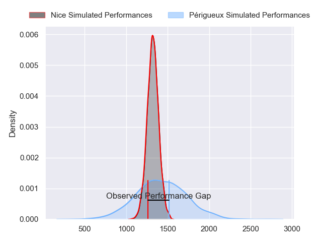
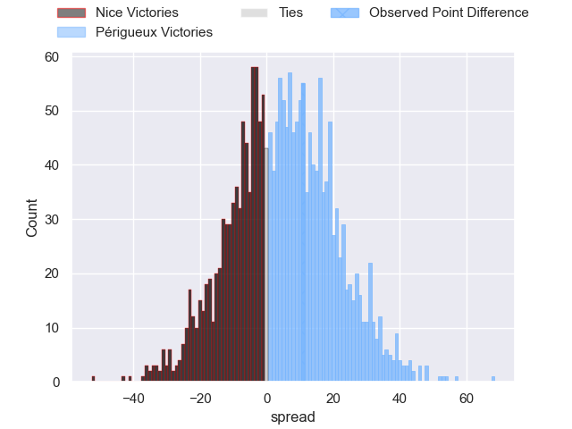
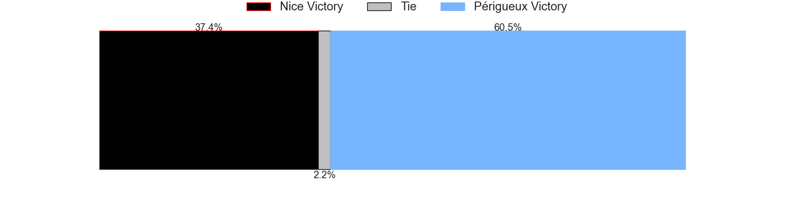
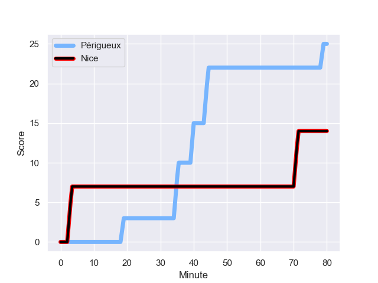
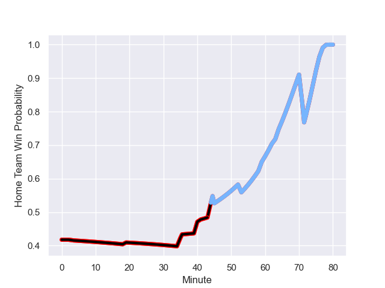

---  
layout: page  
title: Nice at Périgueux; 14-25  
date: 2023-08-26 18:00:00 -0500  
categories: match review  
---
# Nice at Périgueux; 14-25

# Club Level Predictions

The first set of predictions treats a club as the smallest object, as the club develops its members, organizes a gameplan, and deploys its players as needed for each match. This club model has a prediction of 0.632, which translates to predicting Périgueux to win by 4.8.

Each club has a rating and a rating deviation (simiar to a Glicko system), and expected performances can be generated. This allows for simulated matches and spreads like the ones below.
## Projected Performances

## Projected Spreads

## Projected Results

# Player Level Predictions - Version 1

Treating teams instead as an entity made up of the currently active players, I have ratings for each player in an altogether different system. These can be combined to form team ratings once teamsheets are announced, weighting starters a bit higher than the reserves. After the match is played, players can be weighted by their minutes on the field, allowing for an accurate measure of the team's composition. With these compiled team ratings, we can make predictions, measure inaccuracy, and update the individual player ratings.
## Prediction with Player Minutes: Nice by 10.4

Nice by 14.4 on a neutral field
## Prediction without Player Minutes: Nice by 11.3

Nice by 15.3 on a neutral pitch

## Scores over Time

## Win Probability over Time

There were 16 large changes in win probability in this match

|   Away Minutes | Away Player          |   Away elo |   Away Percentile |   Number |   Home Percentile |   Home elo | Home Player       |   Home Minutes |
|---------------:|:---------------------|-----------:|------------------:|---------:|------------------:|-----------:|:------------------|---------------:|
|             45 | Jules Martinez       |      57.14 |  969178           |        1 |       1.02074e+06 |      67.16 | Thomas Vidal      |             53 |
|             59 | Sione Anga'aelangi   |      73.95 |       1.02075e+06 |        2 |  968643           |      80.65 | Lucas Marijon     |             53 |
|             59 | Revazi Tsiklauri     |      73.74 |  974335           |        3 |       1.02073e+06 |      69.64 | Kalivati Tawake   |             45 |
|             53 | Thibaud Rey          |      74.12 |       1.02074e+06 |        4 |       1.02074e+06 |      67.62 | Clément Lanen     |             80 |
|             63 | Tom Murday           |      74.29 |       1.02074e+06 |        5 |       1.02074e+06 |      66.57 | Mathieu Pace      |             53 |
|             53 | Arthur Vignolles     |      53.2  |  990500           |        6 |       1.02074e+06 |      68.17 | Afa Amosa         |             80 |
|             80 | Louis Suaud          |      87.51 |  974604           |        7 |       1.02074e+06 |      66.75 | Madioke Konate    |             45 |
|             80 | Laijiasa Bolenaivalu |      95.37 |  844996           |        8 |       1.02074e+06 |      66.95 | Karl Lambert      |             63 |
|             64 | Matéo Jeune-Joly     |      73.91 |       1.00761e+06 |        9 |  943074           |      51.71 | Nicolas Faltrept  |             80 |
|             41 | Mathis Viard         |      83.12 |  866895           |       10 |       1.02073e+06 |      69.21 | Greg Hutley       |             80 |
|             80 | Andrzej Charlat      |     104.72 |  927217           |       11 |       1.02074e+06 |      67.38 | Vincent Fouillade |             80 |
|             80 | Nathan Courtade      |      74.24 |  930404           |       12 |  864807           |     102.12 | Fred Hickes       |             80 |
|             80 | Simon Delas          |      84.89 |  961213           |       13 |       1.02073e+06 |      70.14 | Cyril Couturier   |             80 |
|             80 | Pierre Le Huby       |      84.1  |  989862           |       14 |       1.02073e+06 |      68.82 | Axel Muller       |             80 |
|             80 | David Odiete         |      74.48 |       1.02073e+06 |       15 |       1.02075e+06 |      66.22 | Rory Scholes      |             80 |
|             35 | Julien Beaufils      |      77.32 |     nan           |       16 |     nan           |      67.88 | Jason Tindiliere  |             27 |
|             21 | Pierre Strippoli     |      61.28 |       1.0121e+06  |       17 |     nan           |      68.48 | Baptiste Arvouet  |             27 |
|             21 | Luvuyo Pupuma        |      68.54 |  940993           |       18 |  992090           |      51.93 | Anthony Pelmard   |             35 |
|             27 | Yann Tivoli          |      94.24 |  969130           |       19 |       1.0028e+06  |      87.61 | Jaco Willemse     |             27 |
|             17 | Adrien Vigne         |      86.22 |  964135           |       20 |     nan           |      66.39 | Pierre Rousserie  |             17 |
|             27 | Bastien Berenguel    |      91.5  |  964388           |       21 |     nan           |      69.01 | Hendri Storm      |             35 |
|             16 | Jules Solinas        |      61.37 |       1.00006e+06 |       22 |     nan           |     nan    | nan               |            nan |
|             39 | Romain Riguet        |      77.16 |       1.01002e+06 |       23 |     nan           |     nan    | nan               |            nan |

# Player Level Predictions - Version 2

Treating teams instead as an entity made up of the currently active players, I have ratings for each player in an altogether different system. These can be combined to form team ratings once teamsheets are announced, weighting starters a bit higher than the reserves. After the match is played, players can be weighted by their minutes on the field, allowing for an accurate measure of the team's composition. With these compiled team ratings, we can make predictions, measure inaccuracy, and update the individual player ratings.
## Prediction with Player Minutes: Périgueux by 1.2

Nice by 1.9 on a neutral field
## Prediction without Player Minutes: Périgueux by 1.6

Nice by 1.5 on a neutral pitch

|   Away Minutes | Away Player          |   Away elo |   Away variance |   Number |   Home variance |   Home elo | Home Player       |   Home Minutes |
|---------------:|:---------------------|-----------:|----------------:|---------:|----------------:|-----------:|:------------------|---------------:|
|             45 | Jules Martinez       |      30.63 |              50 |        1 |              50 |      46.65 | Thomas Vidal      |             53 |
|             59 | Sione Anga'aelangi   |      46.65 |              50 |        2 |              50 |      41.48 | Lucas Marijon     |             53 |
|             59 | Revazi Tsiklauri     |      38.89 |              50 |        3 |              50 |      46.65 | Kalivati Tawake   |             45 |
|             53 | Thibaud Rey          |      46.65 |              50 |        4 |              50 |      46.65 | Clément Lanen     |             80 |
|             63 | Tom Murday           |      46.65 |              50 |        5 |              50 |      46.65 | Mathieu Pace      |             53 |
|             53 | Arthur Vignolles     |      55.39 |              50 |        6 |              50 |      46.65 | Afa Amosa         |             80 |
|             80 | Louis Suaud          |      64.57 |              50 |        7 |              50 |      46.65 | Madioke Konate    |             45 |
|             80 | Laijiasa Bolenaivalu |      86.13 |              50 |        8 |              50 |      46.65 | Karl Lambert      |             63 |
|             64 | Matéo Jeune-Joly     |      31.79 |              50 |        9 |              50 |      28.17 | Nicolas Faltrept  |             80 |
|             41 | Mathis Viard         |      56.14 |              50 |       10 |              50 |      46.65 | Greg Hutley       |             80 |
|             80 | Andrzej Charlat      |      74.9  |              50 |       11 |              50 |      46.65 | Vincent Fouillade |             80 |
|             80 | Nathan Courtade      |      41.72 |              50 |       12 |              50 |      61.06 | Fred Hickes       |             80 |
|             80 | Simon Delas          |      39.45 |              50 |       13 |              50 |      46.65 | Cyril Couturier   |             80 |
|             80 | Pierre Le Huby       |      33.82 |              50 |       14 |              50 |      46.65 | Axel Muller       |             80 |
|             80 | David Odiete         |      46.65 |              50 |       15 |              50 |      46.65 | Rory Scholes      |             80 |
|             35 | Julien Beaufils      |      47.61 |              50 |       16 |              50 |      46.65 | Jason Tindiliere  |             27 |
|             21 | Pierre Strippoli     |      39.11 |              50 |       17 |              50 |      46.65 | Baptiste Arvouet  |             27 |
|             21 | Luvuyo Pupuma        |      22.12 |              50 |       18 |              50 |      47    | Anthony Pelmard   |             35 |
|             27 | Yann Tivoli          |      65.55 |              50 |       19 |              50 |      40.98 | Jaco Willemse     |             27 |
|             17 | Adrien Vigne         |      52.58 |              50 |       20 |              50 |      46.65 | Pierre Rousserie  |             17 |
|             27 | Bastien Berenguel    |      33.13 |              50 |       21 |              50 |      48.69 | Hendri Storm      |             35 |
|             16 | Jules Solinas        |      40.33 |              50 |       22 |             nan |     nan    | nan               |            nan |
|             39 | Romain Riguet        |      42.92 |              50 |       23 |             nan |     nan    | nan               |            nan |

