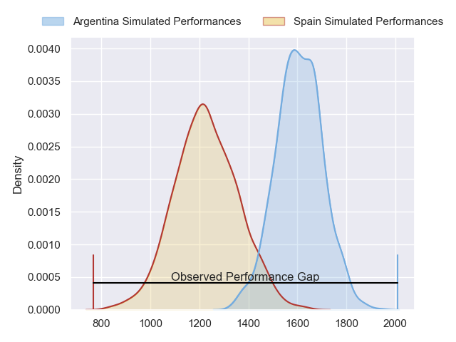
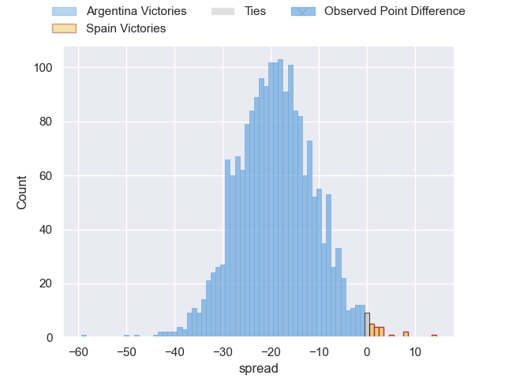
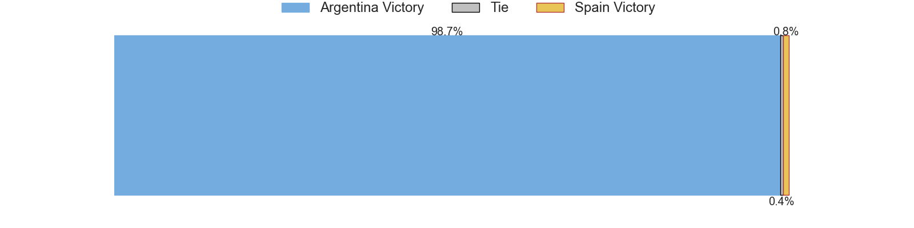
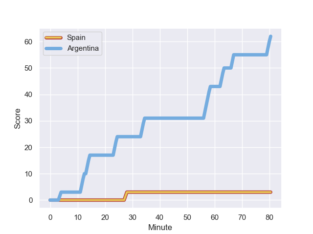
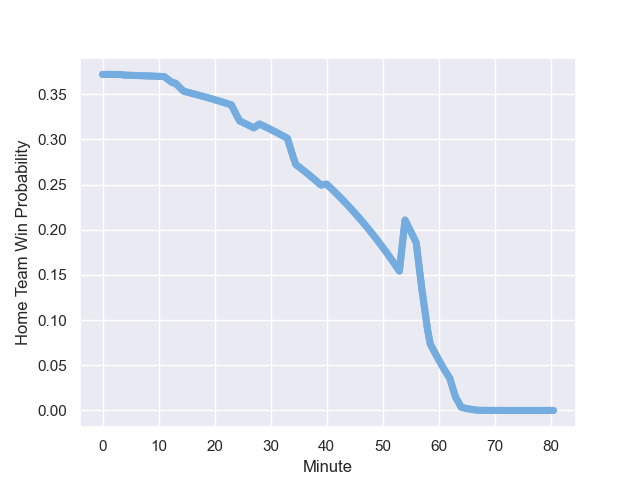

---  
layout: page  
title: Argentina at Spain; 62-3  
date: 2023-08-26 18:00:00 -0500  
categories: match review  
---
# Argentina at Spain; 62-3

# Club Level Predictions

The first set of predictions treats a club as the smallest object, as the club develops its members, organizes a gameplan, and deploys its players as needed for each match. This club model has a prediction of 0.108, which translates to predicting Argentina to win by 19.1.

Each club has a rating and a rating deviation (simiar to a Glicko system), and expected performances can be generated. This allows for simulated matches and spreads like the ones below.
## Projected Performances

## Projected Spreads

## Projected Results

# Player Level Predictions - Version 1

Treating teams instead as an entity made up of the currently active players, I have ratings for each player in an altogether different system. These can be combined to form team ratings once teamsheets are announced, weighting starters a bit higher than the reserves. After the match is played, players can be weighted by their minutes on the field, allowing for an accurate measure of the team's composition. With these compiled team ratings, we can make predictions, measure inaccuracy, and update the individual player ratings.
## Prediction with Player Minutes: Argentina by 18.7

Argentina by 22.7 on a neutral field
## Prediction without Player Minutes: Argentina by 22.7

Argentina by 26.7 on a neutral pitch

## Scores over Time

## Win Probability over Time

There were 3 large changes in win probability in this match

|   Away Minutes | Away Player             |   Away elo |   Away Percentile |   Number |   Home Percentile |   Home elo | Home Player                 |   Home Minutes |
|---------------:|:------------------------|-----------:|------------------:|---------:|------------------:|-----------:|:----------------------------|---------------:|
|             56 | Joel Sclavi             |      95.88 |       1.01755e+06 |        1 |       1.02014e+06 |      66.05 | Thierry Futeu Youtcheu      |             80 |
|             40 | Agustin Creevy          |      83.49 |       1.02014e+06 |        2 |  990809           |      61.1  | Pablo Miejimolle            |             42 |
|             64 | Eduardo Bello           |      84.19 |       1.02013e+06 |        3 |  995763           |      70.48 | Bittor Aboitiz              |             50 |
|             80 | Guido Petti Pagadizabal |      83.71 |       1.02014e+06 |        4 |  792227           |      99.03 | Lucas Guillaume             |             80 |
|             80 | Pedro Rubiolo           |      82.69 |  981804           |        5 |       1.02013e+06 |      68.15 | Alejandro Suarez            |             41 |
|             80 | Rodrigo Bruni           |      63.3  |  723443           |        6 |       1.02014e+06 |      66.38 | Matthew Foulds              |             62 |
|             80 | Marcos Kremer           |      79.99 |       1.01668e+06 |        7 |       1.02014e+06 |      66.55 | Mario Pichardie             |             68 |
|             80 | Facundo Isa             |      83.94 |       1.02013e+06 |        8 |       1.02013e+06 |      67.61 | Facundo Nahuel Dominguez    |             80 |
|             48 | Tomas Cubelli           |      82.9  |       1.02014e+06 |        9 |       1.01032e+06 |      64.84 | Estanislao Bay              |             80 |
|             80 | Nicolas Sanchez         |      83.08 |       1.02014e+06 |       10 |       1.02012e+06 |      68.46 | Gonzalo Vinuesa             |             80 |
|             59 | Mateo Carreras          |      82.44 |  942074           |       11 |  813594           |      90.91 | Silvio Federico Castiglioni |             54 |
|             40 | Santiago Chocobares     |     109.99 |  959751           |       12 |       1.02013e+06 |      67.37 | Gonzalo Lopez Bontempo      |             80 |
|             80 | Matias Moroni           |      75.48 |  554201           |       13 |       1.02013e+06 |      66.74 | Inaki Martin Mateu          |             63 |
|             64 | Rodrigo Isgro           |      95.8  |       1.0179e+06  |       14 |       1.00838e+06 |      59.07 | Martiniano Cian             |             80 |
|             40 | Juan Cruz Mallia        |     105.57 |       1.0177e+06  |       15 |       1.02013e+06 |      67.14 | John Wessel Bell            |             80 |
|             24 | Mayco Geronimo Vivas    |      83.28 |     nan           |       16 |     nan           |      68.98 | Santiago Benjamin Ovejero   |             38 |
|             40 | Ignacio Ruiz            |      70.77 |  946042           |       17 |     nan           |      69.11 | Lucas Santamaria            |             30 |
|             16 | Lucio Sordoni           |      85.14 |       1.01789e+06 |       18 |     nan           |      71.3  | Raphaël Nieto               |             39 |
|             32 | Lautaro Bazan Velez     |      88.33 |       1.00602e+06 |       19 |     nan           |      66.21 | Victor Sanchez Borrego      |             18 |
|             21 | Santiago Grondona       |      85.93 |  941216           |       20 |  992035           |      65.88 | Raul Calzon                 |             12 |
|             40 | Jeronimo de la Fuente   |      94.24 |       1.01789e+06 |       21 |     nan           |      66.93 | Jordi Jorba                 |             26 |
|             40 | Martin Bogado           |      93.1  |       1.01828e+06 |       22 |     nan           |      67.87 | Bautista Guemes             |             17 |
|             16 | Matias Alemanno         |     109.34 |  729364           |       23 |     nan           |     nan    | nan                         |            nan |

# Player Level Predictions - Version 2

Treating teams instead as an entity made up of the currently active players, I have ratings for each player in an altogether different system. These can be combined to form team ratings once teamsheets are announced, weighting starters a bit higher than the reserves. After the match is played, players can be weighted by their minutes on the field, allowing for an accurate measure of the team's composition. With these compiled team ratings, we can make predictions, measure inaccuracy, and update the individual player ratings.
## Prediction with Player Minutes: Spain by 0.3

Argentina by 2.9 on a neutral field
## Prediction without Player Minutes: Spain by 1.1

Argentina by 2.2 on a neutral pitch

|   Away Minutes | Away Player             |   Away elo |   Away variance |   Number |   Home variance |   Home elo | Home Player                 |   Home Minutes |
|---------------:|:------------------------|-----------:|----------------:|---------:|----------------:|-----------:|:----------------------------|---------------:|
|             56 | Joel Sclavi             |      46.65 |           50    |        1 |              50 |      46.65 | Thierry Futeu Youtcheu      |             80 |
|             40 | Agustin Creevy          |      46.65 |           50    |        2 |              50 |      52.87 | Pablo Miejimolle            |             42 |
|             64 | Eduardo Bello           |      46.65 |           50    |        3 |              50 |      48.95 | Bittor Aboitiz              |             50 |
|             80 | Guido Petti Pagadizabal |      46.65 |           50    |        4 |              50 |      75.32 | Lucas Guillaume             |             80 |
|             80 | Pedro Rubiolo           |      37.2  |           49.94 |        5 |              50 |      46.65 | Alejandro Suarez            |             41 |
|             80 | Rodrigo Bruni           |      88.23 |           49.82 |        6 |              50 |      46.65 | Matthew Foulds              |             62 |
|             80 | Marcos Kremer           |      46.65 |           50    |        7 |              50 |      46.65 | Mario Pichardie             |             68 |
|             80 | Facundo Isa             |      46.65 |           50    |        8 |              50 |      46.65 | Facundo Nahuel Dominguez    |             80 |
|             48 | Tomas Cubelli           |      46.65 |           50    |        9 |              50 |      46.49 | Estanislao Bay              |             80 |
|             80 | Nicolas Sanchez         |      46.65 |           50    |       10 |              50 |      46.65 | Gonzalo Vinuesa             |             80 |
|             59 | Mateo Carreras          |      35.31 |           49.35 |       11 |              50 |      55.27 | Silvio Federico Castiglioni |             54 |
|             40 | Santiago Chocobares     |      41.28 |           48.43 |       12 |              50 |      46.65 | Gonzalo Lopez Bontempo      |             80 |
|             80 | Matias Moroni           |     118.53 |           38.77 |       13 |              50 |      46.65 | Inaki Martin Mateu          |             63 |
|             64 | Rodrigo Isgro           |      52.82 |           49.88 |       14 |              50 |      54.14 | Martiniano Cian             |             80 |
|             40 | Juan Cruz Mallia        |      54.44 |           49.95 |       15 |              50 |      46.65 | John Wessel Bell            |             80 |
|             24 | Mayco Geronimo Vivas    |      46.65 |           50    |       16 |              50 |      40.6  | Santiago Benjamin Ovejero   |             38 |
|             40 | Ignacio Ruiz            |      53.08 |           50    |       17 |              50 |      44.57 | Lucas Santamaria            |             30 |
|             16 | Lucio Sordoni           |      46.65 |           50    |       18 |              50 |      45.49 | Raphaël Nieto               |             39 |
|             32 | Lautaro Bazan Velez     |      47.7  |           49.94 |       19 |              50 |      46.65 | Victor Sanchez Borrego      |             18 |
|             21 | Santiago Grondona       |      74.92 |           49.81 |       20 |              50 |      54.9  | Raul Calzon                 |             12 |
|             40 | Jeronimo de la Fuente   |      46.65 |           50    |       21 |              50 |      46.65 | Jordi Jorba                 |             26 |
|             40 | Martin Bogado           |      46.65 |           50    |       22 |              50 |      46.65 | Bautista Guemes             |             17 |
|             16 | Matias Alemanno         |      56.12 |           45.6  |       23 |             nan |     nan    | nan                         |            nan |

