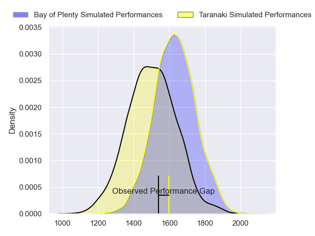
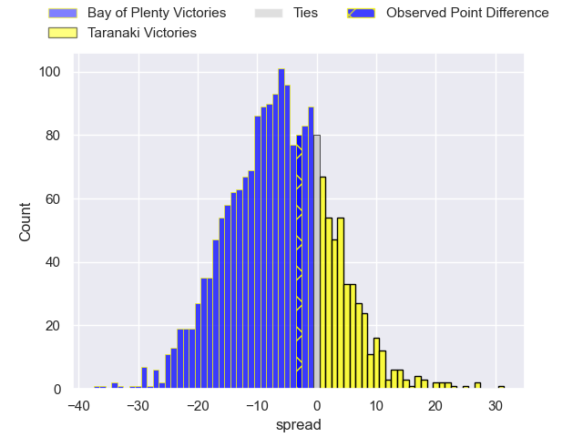
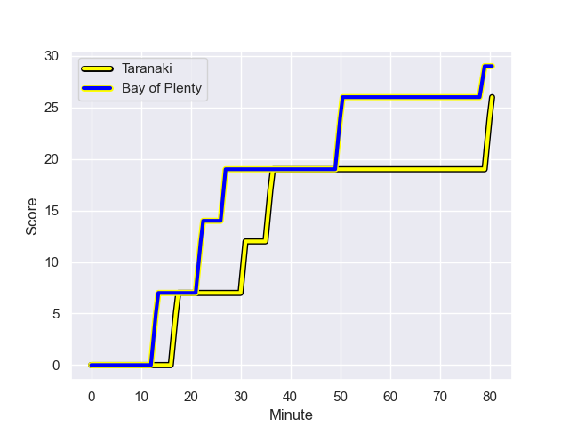
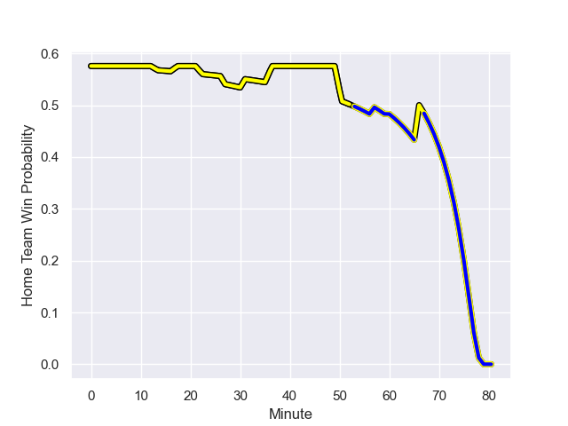

---  
layout: page  
title: Bay of Plenty at Taranaki; 29-26  
date: 2023-08-26 18:00:00 -0500  
categories: match review  
---
# Bay of Plenty at Taranaki; 29-26

# Club Level Predictions

The first set of predictions treats a club as the smallest object, as the club develops its members, organizes a gameplan, and deploys its players as needed for each match. This club model has a prediction of 0.328, which translates to predicting Bay of Plenty to win by 6.6.

Each club has a rating and a rating deviation (simiar to a Glicko system), and expected performances can be generated. This allows for simulated matches and spreads like the ones below.
## Projected Performances

## Projected Spreads

## Projected Results

# Player Level Predictions - Version 1

Treating teams instead as an entity made up of the currently active players, I have ratings for each player in an altogether different system. These can be combined to form team ratings once teamsheets are announced, weighting starters a bit higher than the reserves. After the match is played, players can be weighted by their minutes on the field, allowing for an accurate measure of the team's composition. With these compiled team ratings, we can make predictions, measure inaccuracy, and update the individual player ratings.
## Prediction with Player Minutes: Taranaki by 17.3

Taranaki by 13.3 on a neutral field
## Prediction without Player Minutes: Taranaki by 15.0

Taranaki by 11.0 on a neutral pitch

## Scores over Time

## Win Probability over Time

There were 11 large changes in win probability in this match

|   Away Minutes | Away Player            |   Away elo |   Away Percentile |   Number |   Home Percentile |   Home elo | Home Player                   |   Home Minutes |
|---------------:|:-----------------------|-----------:|------------------:|---------:|------------------:|-----------:|:------------------------------|---------------:|
|             60 | Aidan Ross             |      85.34 |  789157           |        1 |       1.01816e+06 |      80.27 | Jared Proffit                 |             66 |
|             69 | Kurt Eklund            |      72.09 |       1.01872e+06 |        2 |  788370           |      87.97 | Ricky Riccitelli              |             52 |
|             52 | John Afoa              |      84.59 |       1.01647e+06 |        3 |       1.01893e+06 |      74.22 | Reuben O'Neill                |             57 |
|             80 | Mana'aki Selby-Rickit  |      71.69 |       1.01868e+06 |        4 |       1.01766e+06 |      72.42 | Jesse Parete                  |             52 |
|             74 | Justin Sangster        |      70.94 |       1.0187e+06  |        5 |       1.01815e+06 |      85.21 | Hemopo Cunningham             |             66 |
|             80 | Naitoa Ah Kuoi         |      86.8  |  946489           |        6 |  878913           |     100.85 | Pita Gus Sowakula             |             80 |
|             66 | Veveni Lasaqa          |      73.54 |       1.01878e+06 |        7 |       1.01703e+06 |      75.21 | Tom Florence                  |             80 |
|             80 | Nikora Broughton       |      69.47 |       1.01872e+06 |        8 |       1.01818e+06 |      85.11 | Kaylum Boshier                |             80 |
|             57 | Te Toiroa Tahuriorangi |      80.62 |       1.01657e+06 |        9 |       1.01813e+06 |      73.96 | Adam Lennox                   |             66 |
|             80 | Lucas Cashmore         |      73.49 |       1.01868e+06 |       10 |       1.01823e+06 |      80.89 | Stephen Perofeta              |             80 |
|             80 | Ngarohi McGarvey-Black |      68.75 |       1.01874e+06 |       11 |  962124           |     125.09 | Kini Naholo                   |             80 |
|             71 | Lalomilo Lalomilo      |      72.53 |       1.01869e+06 |       12 |       1.01722e+06 |      68.01 | Teihorangi Walden             |             52 |
|             80 | Melani Nanai           |      72.22 |       1.01868e+06 |       13 |       1.0182e+06  |      86.56 | Meihana Grindlay              |             80 |
|             80 | Leroy Carter           |      78.13 |       1.01869e+06 |       14 |       1.01816e+06 |      87.51 | Jacob Ratumaitavuki-Kneepkens |             80 |
|             76 | Cole Forbes            |      66.13 |       1.01876e+06 |       15 |       1.01819e+06 |      71.9  | Matty McKenzie                |             57 |
|             20 | Josh Bartlett          |      73.66 |     nan           |       16 |       1.0182e+06  |      72.32 | Michael Bent                  |             23 |
|             28 | Benet Kumeroa          |      78.16 |     nan           |       17 |     nan           |      77.04 | Donald Brighouse              |             14 |
|             11 | Nathan Vella           |      78.03 |     nan           |       18 |       1.01814e+06 |      77.11 | Bradley Slater                |             28 |
|              6 | Etonia Waqa            |      73.9  |     nan           |       19 |       1.0164e+06  |      68.99 | Millenium Sanerivi            |             28 |
|             23 | Richard Judd           |      69.58 |       1.01705e+06 |       20 |       1.01764e+06 |      63.65 | Thomas Franklin               |             14 |
|             14 | Penitoa Finau          |      83.28 |       1.01652e+06 |       21 |     nan           |      77.21 | Liam Blyde                    |             14 |
|              9 | Seamus Bardoul         |      77.63 |     nan           |       22 |     nan           |      75.78 | Daniel Rona                   |             28 |
|              4 | Wharenui Hawera        |      82.29 |       1.01877e+06 |       23 |       1.01639e+06 |      93.77 | Jayson Potroz                 |             23 |

# Player Level Predictions - Version 2

Treating teams instead as an entity made up of the currently active players, I have ratings for each player in an altogether different system. These can be combined to form team ratings once teamsheets are announced, weighting starters a bit higher than the reserves. After the match is played, players can be weighted by their minutes on the field, allowing for an accurate measure of the team's composition. With these compiled team ratings, we can make predictions, measure inaccuracy, and update the individual player ratings.
## Prediction with Player Minutes: Taranaki by 3.5

Bay of Plenty by 0.2 on a neutral field
## Prediction without Player Minutes: Taranaki by 3.1

Bay of Plenty by 0.3 on a neutral pitch

|   Away Minutes | Away Player            |   Away elo |   Away variance |   Number |   Home variance |   Home elo | Home Player                   |   Home Minutes |
|---------------:|:-----------------------|-----------:|----------------:|---------:|----------------:|-----------:|:------------------------------|---------------:|
|             60 | Aidan Ross             |      94.75 |              50 |        1 |              50 |      46.65 | Jared Proffit                 |             66 |
|             69 | Kurt Eklund            |      46.65 |              50 |        2 |              50 |      44.59 | Ricky Riccitelli              |             52 |
|             52 | John Afoa              |      46.65 |              50 |        3 |              50 |      46.65 | Reuben O'Neill                |             57 |
|             80 | Mana'aki Selby-Rickit  |      46.65 |              50 |        4 |              50 |      46.65 | Jesse Parete                  |             52 |
|             74 | Justin Sangster        |      46.65 |              50 |        5 |              50 |      46.65 | Hemopo Cunningham             |             66 |
|             80 | Naitoa Ah Kuoi         |      80.6  |              50 |        6 |              50 |      82.43 | Pita Gus Sowakula             |             80 |
|             66 | Veveni Lasaqa          |      46.65 |              50 |        7 |              50 |      46.65 | Tom Florence                  |             80 |
|             80 | Nikora Broughton       |      46.65 |              50 |        8 |              50 |      46.65 | Kaylum Boshier                |             80 |
|             57 | Te Toiroa Tahuriorangi |      46.65 |              50 |        9 |              50 |      46.65 | Adam Lennox                   |             66 |
|             80 | Lucas Cashmore         |      46.65 |              50 |       10 |              50 |      46.65 | Stephen Perofeta              |             80 |
|             80 | Ngarohi McGarvey-Black |      46.65 |              50 |       11 |              50 |      85.92 | Kini Naholo                   |             80 |
|             71 | Lalomilo Lalomilo      |      46.65 |              50 |       12 |              50 |      46.65 | Teihorangi Walden             |             52 |
|             80 | Melani Nanai           |      46.65 |              50 |       13 |              50 |      46.65 | Meihana Grindlay              |             80 |
|             80 | Leroy Carter           |      46.65 |              50 |       14 |              50 |      46.65 | Jacob Ratumaitavuki-Kneepkens |             80 |
|             76 | Cole Forbes            |      46.65 |              50 |       15 |              50 |      46.65 | Matty McKenzie                |             57 |
|             20 | Josh Bartlett          |      46.65 |              50 |       16 |              50 |      46.65 | Michael Bent                  |             23 |
|             28 | Benet Kumeroa          |      46.65 |              50 |       17 |              50 |      46.65 | Donald Brighouse              |             14 |
|             11 | Nathan Vella           |      46.65 |              50 |       18 |              50 |      46.65 | Bradley Slater                |             28 |
|              6 | Etonia Waqa            |      46.65 |              50 |       19 |              50 |      46.65 | Millenium Sanerivi            |             28 |
|             23 | Richard Judd           |      46.65 |              50 |       20 |              50 |      46.65 | Thomas Franklin               |             14 |
|             14 | Penitoa Finau          |      46.65 |              50 |       21 |              50 |      46.65 | Liam Blyde                    |             14 |
|              9 | Seamus Bardoul         |      46.65 |              50 |       22 |              50 |      46.65 | Daniel Rona                   |             28 |
|              4 | Wharenui Hawera        |      46.65 |              50 |       23 |              50 |      46.65 | Jayson Potroz                 |             23 |

