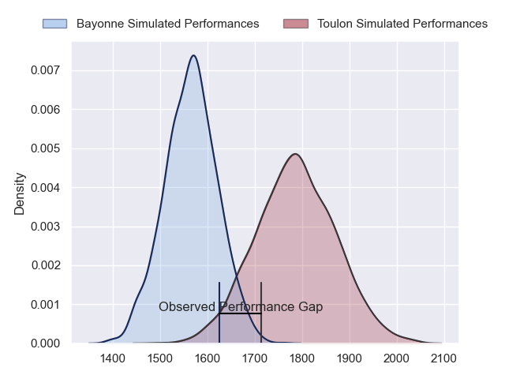
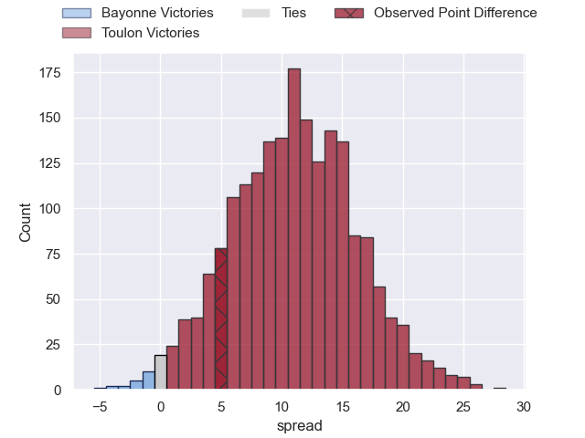
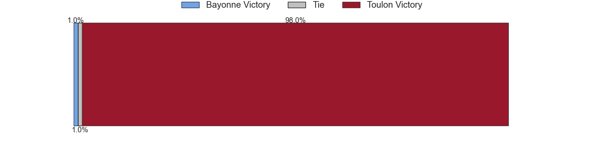
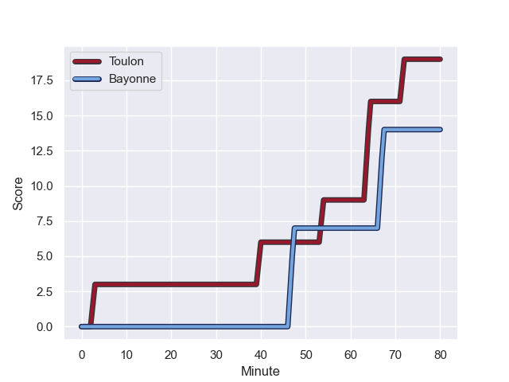
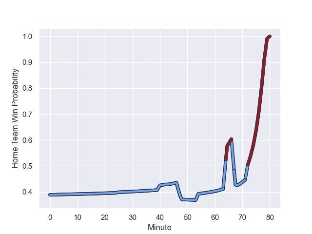

---  
layout: page  
title: Bayonne at Toulon; 14-19  
date: 2023-08-26 18:00:00 -0500  
categories: match review  
---
# Bayonne at Toulon; 14-19

# Club Level Predictions

The first set of predictions treats a club as the smallest object, as the club develops its members, organizes a gameplan, and deploys its players as needed for each match. This club model has a prediction of 0.775, which translates to predicting Toulon to win by 10.9.

Each club has a rating and a rating deviation (simiar to a Glicko system), and expected performances can be generated. This allows for simulated matches and spreads like the ones below.
## Projected Performances

## Projected Spreads

## Projected Results

# Player Level Predictions - Version 1

Treating teams instead as an entity made up of the currently active players, I have ratings for each player in an altogether different system. These can be combined to form team ratings once teamsheets are announced, weighting starters a bit higher than the reserves. After the match is played, players can be weighted by their minutes on the field, allowing for an accurate measure of the team's composition. With these compiled team ratings, we can make predictions, measure inaccuracy, and update the individual player ratings.
## Prediction with Player Minutes: Bayonne by 15.6

Bayonne by 19.6 on a neutral field
## Prediction without Player Minutes: Bayonne by 14.1

Bayonne by 18.1 on a neutral pitch

## Scores over Time

## Win Probability over Time

There were 13 large changes in win probability in this match

|   Away Minutes | Away Player            |   Away elo |   Away Percentile |   Number |   Home Percentile |   Home elo | Home Player         |   Home Minutes |
|---------------:|:-----------------------|-----------:|------------------:|---------:|------------------:|-----------:|:--------------------|---------------:|
|             54 | Swan Cormenier         |      80.26 |       1.02042e+06 |        1 |       1.02061e+06 |      82.26 | Bruce Devaux        |             48 |
|             48 | Vincent Giudicelli     |      86.39 |       1.02036e+06 |        2 |       1.0207e+06  |      75.12 | Teddy Baubigny      |             25 |
|             48 | Tevita Tatafu          |      92    |  995756           |        3 |       1.02066e+06 |      77.07 | Emerick Setiano     |             48 |
|             80 | Thomas Ceyte           |     116.98 |  804342           |        4 |       1.02068e+06 |      74.34 | Matthias Halagahu   |             80 |
|             68 | Lucas Paulos           |     116.68 |  939272           |        5 |       1.02062e+06 |      81.44 | Alun-Wyn Jones      |             48 |
|             80 | Rémi Bourdeau          |      96.81 |       1.0175e+06  |        6 |       1.02134e+06 |      74.19 | Jules Coulon        |             80 |
|             80 | Arthur Iturria         |      80.79 |       1.0204e+06  |        7 |       1.02067e+06 |      74.61 | Esteban Abadie      |             80 |
|             62 | Uzair Cassiem          |      86.52 |       1.0204e+06  |        8 |       1.01713e+06 |      94.38 | Selevasio Tolofua   |             48 |
|             54 | Guillaume Rouet        |      85    |       1.02038e+06 |        9 |       1.02063e+06 |      78.3  | Jules Danglot       |             48 |
|             80 | Camille Lopez          |      87.94 |       1.02038e+06 |       10 |       1.02067e+06 |      74.89 | Enzo Hervé          |             72 |
|             54 | Rémy Baget             |      85.68 |       1.02042e+06 |       11 |       1.02135e+06 |      73.66 | Rayan Rebbadj       |             80 |
|             68 | Guillaume Martocq      |      72.63 |  966535           |       12 |       1.0207e+06  |      73.44 | Setariki Tuicuvu    |             80 |
|             80 | Peyo Muscarditz        |      84.46 |       1.02039e+06 |       13 |       1.02063e+06 |      80.83 | Jérémy Sinzelle     |             43 |
|             80 | Arnaud Erbinartegaray  |     101.53 |       1.01229e+06 |       14 |       1.01083e+06 |      74.46 | Gaël Dréan          |             80 |
|             80 | Cheikh Tiberghien      |      82.65 |       1.02036e+06 |       15 |       1.02062e+06 |      79.38 | Aymeric Luc         |             80 |
|             32 | Facundo Bosch          |      84.54 |       1.02134e+06 |       16 |       1.02065e+06 |      78.56 | Christopher Tolofua |             55 |
|             32 | Pascal Cotet           |      75.07 |  967954           |       17 |     nan           |      77.72 | Mathieu Smaili      |             37 |
|             26 | Aurelien Callandret    |     104.92 |  918714           |       18 |     nan           |      73.83 | Kieran Brookes      |             32 |
|             26 | Maxime Machenaud       |      80.53 |       1.02039e+06 |       19 |       1.02134e+06 |      74    | Baptiste Serin      |             32 |
|             26 | Quentin Béthune        |      82.13 |       1.02041e+06 |       20 |       1.02071e+06 |      73.06 | Cornell du Preez    |             32 |
|             18 | Baptiste Heguy         |      85    |       1.02037e+06 |       21 |       1.02064e+06 |      77.94 | Mathieu Tanguy      |             32 |
|             12 | Apisalome Ratuniyarawa |      84.35 |     nan           |       22 |       1.02066e+06 |      78.25 | Dany Priso          |             32 |
|             12 | Thomas Dolhagaray      |      84.77 |  990983           |       23 |     nan           |      77.73 | Noah Lolesio        |              8 |

# Player Level Predictions - Version 2

Treating teams instead as an entity made up of the currently active players, I have ratings for each player in an altogether different system. These can be combined to form team ratings once teamsheets are announced, weighting starters a bit higher than the reserves. After the match is played, players can be weighted by their minutes on the field, allowing for an accurate measure of the team's composition. With these compiled team ratings, we can make predictions, measure inaccuracy, and update the individual player ratings.
## Prediction with Player Minutes: Toulon by 3.1

Bayonne by 1.7 on a neutral field
## Prediction without Player Minutes: Toulon by 3.2

Bayonne by 1.5 on a neutral pitch

|   Away Minutes | Away Player            |   Away elo |   Away variance |   Number |   Home variance |   Home elo | Home Player         |   Home Minutes |
|---------------:|:-----------------------|-----------:|----------------:|---------:|----------------:|-----------:|:--------------------|---------------:|
|             54 | Swan Cormenier         |      46.65 |           50    |        1 |              50 |      46.65 | Bruce Devaux        |             48 |
|             48 | Vincent Giudicelli     |      46.65 |           50    |        2 |              50 |      46.65 | Teddy Baubigny      |             25 |
|             48 | Tevita Tatafu          |      43.61 |           50    |        3 |              50 |      46.65 | Emerick Setiano     |             48 |
|             80 | Thomas Ceyte           |      50.6  |           50    |        4 |              50 |      46.65 | Matthias Halagahu   |             80 |
|             68 | Lucas Paulos           |      69.49 |           49.91 |        5 |              50 |      46.65 | Alun-Wyn Jones      |             48 |
|             80 | Rémi Bourdeau          |      46.65 |           50    |        6 |              50 |      46.65 | Jules Coulon        |             80 |
|             80 | Arthur Iturria         |      46.65 |           50    |        7 |              50 |      46.65 | Esteban Abadie      |             80 |
|             62 | Uzair Cassiem          |      46.65 |           50    |        8 |              50 |      46.65 | Selevasio Tolofua   |             48 |
|             54 | Guillaume Rouet        |      46.65 |           50    |        9 |              50 |      46.65 | Jules Danglot       |             48 |
|             80 | Camille Lopez          |      46.65 |           50    |       10 |              50 |      46.65 | Enzo Hervé          |             72 |
|             54 | Rémy Baget             |      46.65 |           50    |       11 |              50 |      46.65 | Rayan Rebbadj       |             80 |
|             68 | Guillaume Martocq      |      29.69 |           50    |       12 |              50 |      46.65 | Setariki Tuicuvu    |             80 |
|             80 | Peyo Muscarditz        |      46.65 |           50    |       13 |              50 |      46.65 | Jérémy Sinzelle     |             43 |
|             80 | Arnaud Erbinartegaray  |      53.63 |           50    |       14 |              50 |      21.75 | Gaël Dréan          |             80 |
|             80 | Cheikh Tiberghien      |      46.65 |           50    |       15 |              50 |      46.65 | Aymeric Luc         |             80 |
|             32 | Facundo Bosch          |      46.65 |           50    |       16 |              50 |      46.65 | Christopher Tolofua |             55 |
|             32 | Pascal Cotet           |      25.49 |           50    |       17 |              50 |      46.65 | Mathieu Smaili      |             37 |
|             26 | Aurelien Callandret    |      77.21 |           50    |       18 |              50 |      46.65 | Kieran Brookes      |             32 |
|             26 | Maxime Machenaud       |      46.65 |           50    |       19 |              50 |      46.65 | Baptiste Serin      |             32 |
|             26 | Quentin Béthune        |      46.65 |           50    |       20 |              50 |      46.65 | Cornell du Preez    |             32 |
|             18 | Baptiste Heguy         |      46.65 |           50    |       21 |              50 |      46.65 | Mathieu Tanguy      |             32 |
|             12 | Apisalome Ratuniyarawa |      46.65 |           50    |       22 |              50 |      46.65 | Dany Priso          |             32 |
|             12 | Thomas Dolhagaray      |      45.86 |           50    |       23 |              50 |      46.65 | Noah Lolesio        |              8 |

