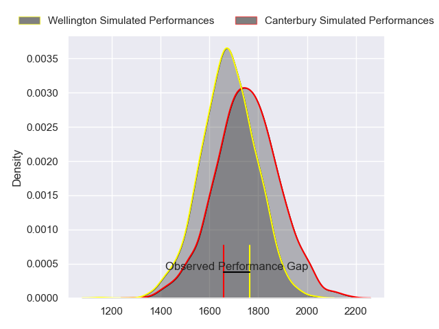
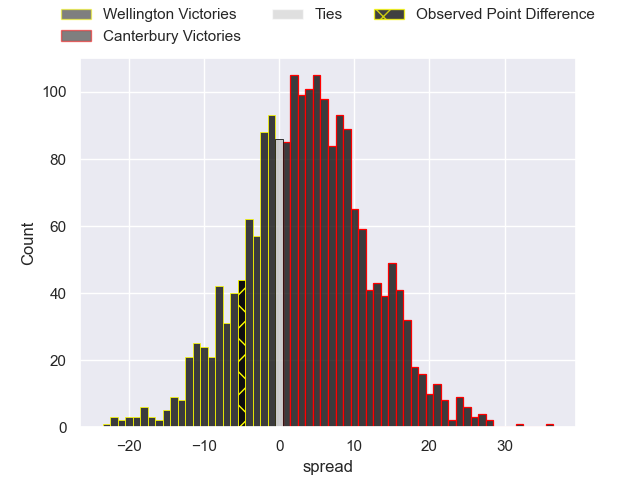
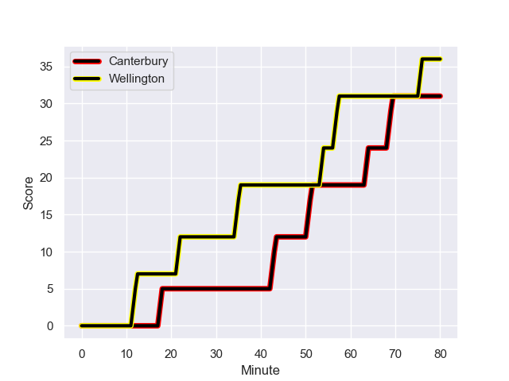
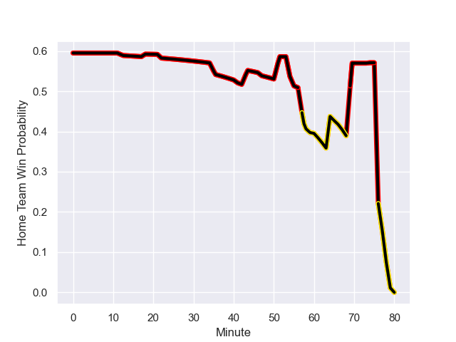

---  
layout: page  
title: Wellington at Canterbury; 36-31  
date: 2023-08-27 18:00:00 -0500  
categories: match review  
---
# Wellington at Canterbury; 36-31

# Club Level Predictions

The first set of predictions treats a club as the smallest object, as the club develops its members, organizes a gameplan, and deploys its players as needed for each match. This club model has a prediction of 0.606, which translates to predicting Canterbury to win by 4.0.

Each club has a rating and a rating deviation (simiar to a Glicko system), and expected performances can be generated. This allows for simulated matches and spreads like the ones below.
## Projected Performances

## Projected Spreads

## Projected Results

# Player Level Predictions - Version 1

Treating teams instead as an entity made up of the currently active players, I have ratings for each player in an altogether different system. These can be combined to form team ratings once teamsheets are announced, weighting starters a bit higher than the reserves. After the match is played, players can be weighted by their minutes on the field, allowing for an accurate measure of the team's composition. With these compiled team ratings, we can make predictions, measure inaccuracy, and update the individual player ratings.
## Prediction with Player Minutes: Canterbury by 20.7

Canterbury by 16.7 on a neutral field
## Prediction without Player Minutes: Canterbury by 21.6

Canterbury by 17.6 on a neutral pitch

## Scores over Time

## Win Probability over Time

There were 11 large changes in win probability in this match

|   Away Minutes | Away Player                 |   Away elo |   Away Percentile |   Number |   Home Percentile |   Home elo | Home Player       |   Home Minutes |
|---------------:|:----------------------------|-----------:|------------------:|---------:|------------------:|-----------:|:------------------|---------------:|
|             55 | Xavier Numia                |      77.78 |       1.01752e+06 |        1 |       1.0196e+06  |      83.43 | Joe Moody         |             55 |
|             47 | Josh Southall               |      79.55 |       1.01845e+06 |        2 |       1.01864e+06 |      77.64 | Ben Funnell       |             74 |
|             41 | PJ Sheck                    |      74.11 |       1.01851e+06 |        3 |       1.01865e+06 |      84.57 | Seb Calder        |             74 |
|             80 | Hugo Plummer                |      88.12 |       1.01843e+06 |        4 |       1.01856e+06 |      86.01 | Mitchell Dunshea  |             80 |
|             55 | Dominic Bird                |      52.89 |       1.01994e+06 |        5 |       1.01863e+06 |      84.25 | Tahlor Cahill     |             47 |
|             56 | Brad Shields                |      74.84 |       1.0169e+06  |        6 |       1.01863e+06 |      83.8  | Billy Harmon      |             80 |
|             80 | Sione Halalilo              |      73.67 |       1.02015e+06 |        7 |  898458           |     110.92 | Tom Christie      |             64 |
|             80 | Peter Lakai                 |      74.7  |       1.01905e+06 |        8 |       1.0191e+06  |      84.69 | Cullen Grace      |             80 |
|             64 | Kyle Preston                |      81.32 |       1.0185e+06  |        9 |       1.00769e+06 |      98.37 | Mitchell Drummond |             58 |
|             80 | Sam Clarke                  |      73.5  |       1.02015e+06 |       10 |       1.01857e+06 |      85.67 | Fergus Burke      |             80 |
|             60 | Chicago Doyle               |      89.84 |       1.01847e+06 |       11 |       1.01867e+06 |      80.37 | Blair Murray      |             66 |
|             80 | Riley Higgins               |      71.27 |       1.01905e+06 |       12 |  946709           |      94.3  | Rameka Poihipi    |             55 |
|             80 | Peter Ionatana Umaga-Jensen |      79.59 |       1.01844e+06 |       13 |  945774           |     102.26 | Dallas McLeod     |             80 |
|             80 | Losilosivale Filipo         |      72.64 |       1.0185e+06  |       14 |       1.01655e+06 |      85.43 | Manasa Mataele    |             80 |
|             41 | Tjay Clarke                 |      74.47 |       1.01851e+06 |       15 |       1.01855e+06 |      89.5  | Chay Fihaki       |             80 |
|             25 | Cameron Orr                 |      82.9  |       1.01844e+06 |       16 |     nan           |      83.94 | Tom Heywood       |             25 |
|             39 | Josiah Tavita-Metcalfe      |      80.31 |     nan           |       17 |     nan           |      81.82 | Brook Toomalatai  |              6 |
|             33 | Penieli Poasa               |      89.17 |     nan           |       18 |     nan           |      82.86 | Nick Hyde         |              6 |
|             25 | Teofilo Paulo               |      80.5  |     nan           |       19 |     nan           |      82.8  | Sam Darry         |             33 |
|             24 | Dominic Ropeti              |      77.21 |       1.01846e+06 |       20 |       1.01858e+06 |      84.37 | Corey Kellow      |             16 |
|             39 | Aidan Morgan                |      75.91 |       1.01846e+06 |       21 |       1.01861e+06 |      81.32 | Willi Heinz       |             22 |
|             20 | Isi Saumaki                 |      73.33 |     nan           |       22 |       1.01865e+06 |      84.86 | Ryan Crotty       |             25 |
|             16 | Sam Howling                 |      73.86 |     nan           |       23 |     nan           |      82.62 | Solomon Alaimalo  |             14 |

# Player Level Predictions - Version 2

Treating teams instead as an entity made up of the currently active players, I have ratings for each player in an altogether different system. These can be combined to form team ratings once teamsheets are announced, weighting starters a bit higher than the reserves. After the match is played, players can be weighted by their minutes on the field, allowing for an accurate measure of the team's composition. With these compiled team ratings, we can make predictions, measure inaccuracy, and update the individual player ratings.
## Prediction with Player Minutes: Canterbury by 7.3

Canterbury by 3.9 on a neutral field
## Prediction without Player Minutes: Canterbury by 7.6

Canterbury by 4.2 on a neutral pitch

|   Away Minutes | Away Player                 |   Away elo |   Away variance |   Number |   Home variance |   Home elo | Home Player       |   Home Minutes |
|---------------:|:----------------------------|-----------:|----------------:|---------:|----------------:|-----------:|:------------------|---------------:|
|             55 | Xavier Numia                |      46.65 |              50 |        1 |              50 |      46.65 | Joe Moody         |             55 |
|             47 | Josh Southall               |      46.65 |              50 |        2 |              50 |      46.65 | Ben Funnell       |             74 |
|             41 | PJ Sheck                    |      46.65 |              50 |        3 |              50 |      46.65 | Seb Calder        |             74 |
|             80 | Hugo Plummer                |      46.65 |              50 |        4 |              50 |      46.65 | Mitchell Dunshea  |             80 |
|             55 | Dominic Bird                |      46.65 |              50 |        5 |              50 |      46.65 | Tahlor Cahill     |             47 |
|             56 | Brad Shields                |      46.65 |              50 |        6 |              50 |      46.65 | Billy Harmon      |             80 |
|             80 | Sione Halalilo              |      46.65 |              50 |        7 |              50 |     103.08 | Tom Christie      |             64 |
|             80 | Peter Lakai                 |      46.65 |              50 |        8 |              50 |      46.65 | Cullen Grace      |             80 |
|             64 | Kyle Preston                |      46.65 |              50 |        9 |              50 |      66.51 | Mitchell Drummond |             58 |
|             80 | Sam Clarke                  |      46.65 |              50 |       10 |              50 |      46.65 | Fergus Burke      |             80 |
|             60 | Chicago Doyle               |      46.65 |              50 |       11 |              50 |      46.65 | Blair Murray      |             66 |
|             80 | Riley Higgins               |      46.65 |              50 |       12 |              50 |      62.35 | Rameka Poihipi    |             55 |
|             80 | Peter Ionatana Umaga-Jensen |      46.65 |              50 |       13 |              50 |      69.77 | Dallas McLeod     |             80 |
|             80 | Losilosivale Filipo         |      46.65 |              50 |       14 |              50 |      46.65 | Manasa Mataele    |             80 |
|             41 | Tjay Clarke                 |      46.65 |              50 |       15 |              50 |      46.65 | Chay Fihaki       |             80 |
|             25 | Cameron Orr                 |      46.65 |              50 |       16 |              50 |      46.65 | Tom Heywood       |             25 |
|             39 | Josiah Tavita-Metcalfe      |      46.65 |              50 |       17 |              50 |      46.65 | Brook Toomalatai  |              6 |
|             33 | Penieli Poasa               |      46.65 |              50 |       18 |              50 |      46.65 | Nick Hyde         |              6 |
|             25 | Teofilo Paulo               |      46.65 |              50 |       19 |              50 |      46.65 | Sam Darry         |             33 |
|             24 | Dominic Ropeti              |      46.65 |              50 |       20 |              50 |      46.65 | Corey Kellow      |             16 |
|             39 | Aidan Morgan                |      46.65 |              50 |       21 |              50 |      46.65 | Willi Heinz       |             22 |
|             20 | Isi Saumaki                 |      46.65 |              50 |       22 |              50 |      46.65 | Ryan Crotty       |             25 |
|             16 | Sam Howling                 |      46.65 |              50 |       23 |              50 |      46.65 | Solomon Alaimalo  |             14 |

