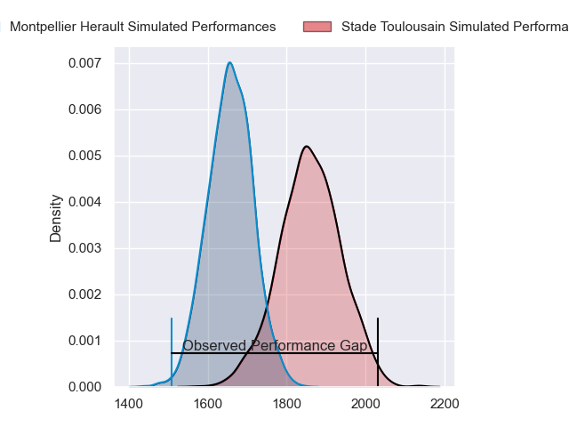
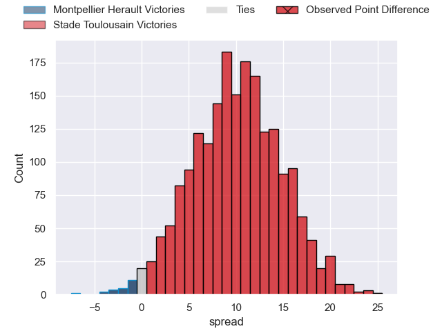
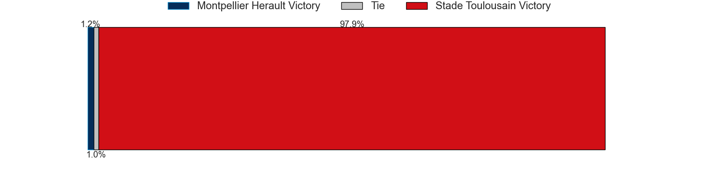
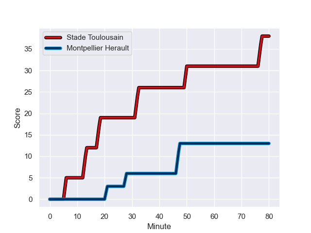
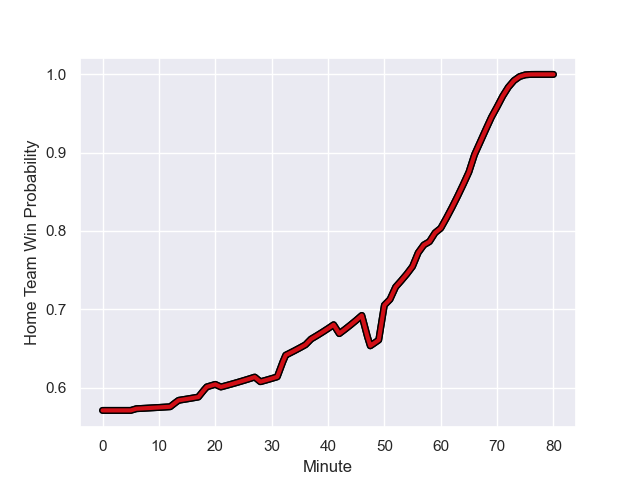

---  
layout: page  
title: Montpellier Herault at Stade Toulousain; 13-38  
date: 2023-08-27 18:00:00 -0500  
categories: match review  
---
# Montpellier Herault at Stade Toulousain; 13-38

# Club Level Predictions

The first set of predictions treats a club as the smallest object, as the club develops its members, organizes a gameplan, and deploys its players as needed for each match. This club model has a prediction of 0.76, which translates to predicting Stade Toulousain to win by 10.2.

Each club has a rating and a rating deviation (simiar to a Glicko system), and expected performances can be generated. This allows for simulated matches and spreads like the ones below.
## Projected Performances

## Projected Spreads

## Projected Results

# Player Level Predictions - Version 1

Treating teams instead as an entity made up of the currently active players, I have ratings for each player in an altogether different system. These can be combined to form team ratings once teamsheets are announced, weighting starters a bit higher than the reserves. After the match is played, players can be weighted by their minutes on the field, allowing for an accurate measure of the team's composition. With these compiled team ratings, we can make predictions, measure inaccuracy, and update the individual player ratings.
## Prediction with Player Minutes: Stade Toulousain by 16.4

Stade Toulousain by 12.4 on a neutral field
## Prediction without Player Minutes: Stade Toulousain by 18.8

Stade Toulousain by 14.8 on a neutral pitch

## Scores over Time

## Win Probability over Time

There were 2 large changes in win probability in this match

|   Away Minutes | Away Player                         |   Away elo |   Away Percentile |   Number |   Home Percentile |   Home elo | Home Player          |   Home Minutes |
|---------------:|:------------------------------------|-----------:|------------------:|---------:|------------------:|-----------:|:---------------------|---------------:|
|             52 | Enzo Forletta                       |      73.09 |       1.01993e+06 |        1 |       1.01746e+06 |      94.71 | Rodrigue Neti        |             70 |
|             42 | Vano Karkadze                       |      71.99 |       1.01992e+06 |        2 |       1.02016e+06 |      80.51 | Guillaume Cramont    |             58 |
|             55 | D'Arcy Rae                          |      72.52 |       1.01991e+06 |        3 |       1.01956e+06 |      81.59 | Owen Franks          |             52 |
|             42 | Elliott Stooke                      |      77.02 |       1.01994e+06 |        4 |       1.01958e+06 |      76.33 | Piula Fa'asalele     |             80 |
|             80 | Tyler Evan Duguid                   |      76.2  |       1.01991e+06 |        5 |       1.01749e+06 |      91.28 | Emmanuel Meafou      |             58 |
|             80 | Nicolaas Jacobus Janse van Rensburg |      79.77 |       1.0199e+06  |        6 |  976663           |      77.7  | Léo Banos            |             80 |
|             80 | Alexandre Bécognée                  |      76.86 |       1.01994e+06 |        7 |       1.00943e+06 |      80.48 | Theo Ntamack         |             52 |
|             42 | Lenni Nouchi                        |      73.5  |       1.01064e+06 |        8 |       1.01746e+06 |      84.92 | Alexandre Roumat     |             80 |
|             60 | Léo Coly                            |      55.68 |  945675           |        9 |  915651           |     100.97 | Paul Graou           |             80 |
|             66 | Louis Carbonel                      |      81.5  |       1.01989e+06 |       10 |       1.01957e+06 |      78.46 | Baptiste Germain     |             37 |
|             80 | George Bridge                       |      76.7  |       1.01994e+06 |       11 |       1.02016e+06 |      80.32 | Setareki Bituniyata  |             56 |
|             80 | Jan Lodewyk Serfontein              |      77.77 |       1.01992e+06 |       12 |       1.01956e+06 |      77.47 | Sofiane Guitoune     |             66 |
|             80 | Thomas Darmon                       |      80.69 |       1.0199e+06  |       13 |       1.01126e+06 |      79.64 | Paul Costes          |             80 |
|             80 | Gabriel Ngandebe                    |      73.76 |       1.01993e+06 |       14 |       1.01749e+06 |      91.26 | Lucas Tauzin         |             80 |
|             80 | Julien Tisseron                     |      77.99 |       1.01992e+06 |       15 |       1.0175e+06  |      79.44 | Matthis Lebel        |             80 |
|             38 | Sam Simmonds                        |      71.95 |     nan           |       16 |     nan           |      84.8  | Billy Searle         |             43 |
|             38 | Florian Verhaeghe                   |     110.77 |  862295           |       17 |     nan           |      81.96 | Joel Merkler         |             28 |
|             38 | Silalotu Latu                       |      73.13 |       1.01991e+06 |       18 |       1.01748e+06 |      93.13 | Alban Placines       |             28 |
|             28 | Baptiste Erdocio                    |      68.5  |     nan           |       19 |       1.01061e+06 |      99.39 | Edgar Retiere        |             24 |
|             25 | George (Karl) Tu'inukuafe           |      71.44 |       1.01993e+06 |       20 |       1.01125e+06 |      75.91 | Clement Verge        |             22 |
|             20 | Martin Doan                         |      72.13 |     nan           |       21 |       1.01958e+06 |      79.93 | Ian Boubila          |             22 |
|             14 | Louis Foursans-Bourdette            |      69.56 |     nan           |       22 |       1.0177e+06  |      89.54 | Pierre-Louis Barassi |             14 |
|            nan | nan                                 |     nan    |     nan           |       23 |     nan           |      80.7  | David Ainu'u         |             10 |

# Player Level Predictions - Version 2

Treating teams instead as an entity made up of the currently active players, I have ratings for each player in an altogether different system. These can be combined to form team ratings once teamsheets are announced, weighting starters a bit higher than the reserves. After the match is played, players can be weighted by their minutes on the field, allowing for an accurate measure of the team's composition. With these compiled team ratings, we can make predictions, measure inaccuracy, and update the individual player ratings.
## Prediction with Player Minutes: Stade Toulousain by 6.2

Stade Toulousain by 1.3 on a neutral field
## Prediction without Player Minutes: Stade Toulousain by 6.3

Stade Toulousain by 1.3 on a neutral pitch

|   Away Minutes | Away Player                         |   Away elo |   Away variance |   Number |   Home variance |   Home elo | Home Player          |   Home Minutes |
|---------------:|:------------------------------------|-----------:|----------------:|---------:|----------------:|-----------:|:---------------------|---------------:|
|             52 | Enzo Forletta                       |      46.65 |              50 |        1 |              50 |      46.65 | Rodrigue Neti        |             70 |
|             42 | Vano Karkadze                       |      46.65 |              50 |        2 |              50 |      46.65 | Guillaume Cramont    |             58 |
|             55 | D'Arcy Rae                          |      46.65 |              50 |        3 |              50 |      46.65 | Owen Franks          |             52 |
|             42 | Elliott Stooke                      |      46.65 |              50 |        4 |              50 |      46.65 | Piula Fa'asalele     |             80 |
|             80 | Tyler Evan Duguid                   |      46.65 |              50 |        5 |              50 |      46.65 | Emmanuel Meafou      |             58 |
|             80 | Nicolaas Jacobus Janse van Rensburg |      46.65 |              50 |        6 |              50 |      67.07 | Léo Banos            |             80 |
|             80 | Alexandre Bécognée                  |      46.65 |              50 |        7 |              50 |      46.41 | Theo Ntamack         |             52 |
|             42 | Lenni Nouchi                        |      44.33 |              50 |        8 |              50 |      46.65 | Alexandre Roumat     |             80 |
|             60 | Léo Coly                            |      38.6  |              50 |        9 |              50 |      56.29 | Paul Graou           |             80 |
|             66 | Louis Carbonel                      |      46.65 |              50 |       10 |              50 |      46.65 | Baptiste Germain     |             37 |
|             80 | George Bridge                       |      46.65 |              50 |       11 |              50 |      46.65 | Setareki Bituniyata  |             56 |
|             80 | Jan Lodewyk Serfontein              |      46.65 |              50 |       12 |              50 |      46.65 | Sofiane Guitoune     |             66 |
|             80 | Thomas Darmon                       |      46.65 |              50 |       13 |              50 |      44.82 | Paul Costes          |             80 |
|             80 | Gabriel Ngandebe                    |      46.65 |              50 |       14 |              50 |      46.65 | Lucas Tauzin         |             80 |
|             80 | Julien Tisseron                     |      46.65 |              50 |       15 |              50 |      46.65 | Matthis Lebel        |             80 |
|             38 | Sam Simmonds                        |      46.65 |              50 |       16 |              50 |      46.65 | Billy Searle         |             43 |
|             38 | Florian Verhaeghe                   |      57.17 |              50 |       17 |              50 |      46.65 | Joel Merkler         |             28 |
|             38 | Silalotu Latu                       |      46.65 |              50 |       18 |              50 |      46.65 | Alban Placines       |             28 |
|             28 | Baptiste Erdocio                    |      46.65 |              50 |       19 |              50 |      51.88 | Edgar Retiere        |             24 |
|             25 | George (Karl) Tu'inukuafe           |      46.65 |              50 |       20 |              50 |      42.96 | Clement Verge        |             22 |
|             20 | Martin Doan                         |      46.65 |              50 |       21 |              50 |      46.65 | Ian Boubila          |             22 |
|             14 | Louis Foursans-Bourdette            |      46.65 |              50 |       22 |              50 |      46.65 | Pierre-Louis Barassi |             14 |
|            nan | nan                                 |     nan    |             nan |       23 |              50 |      46.65 | David Ainu'u         |             10 |

