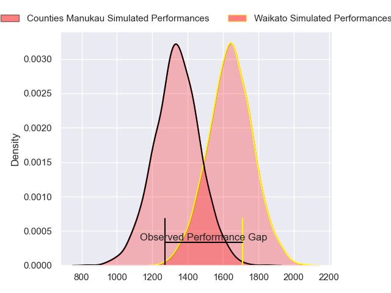
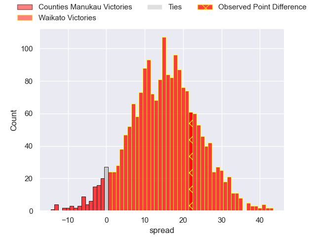
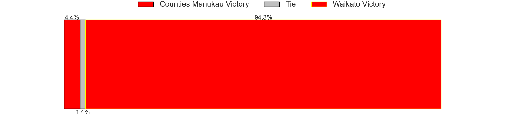
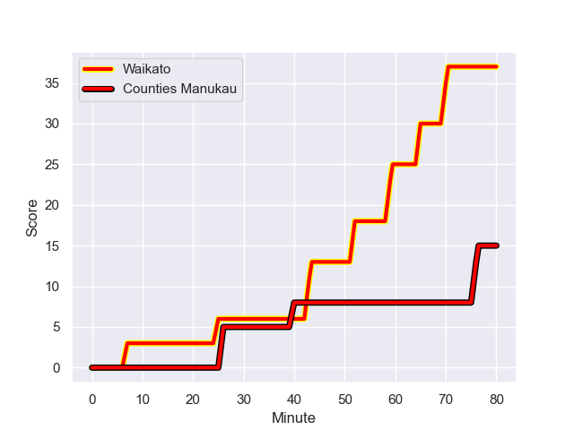
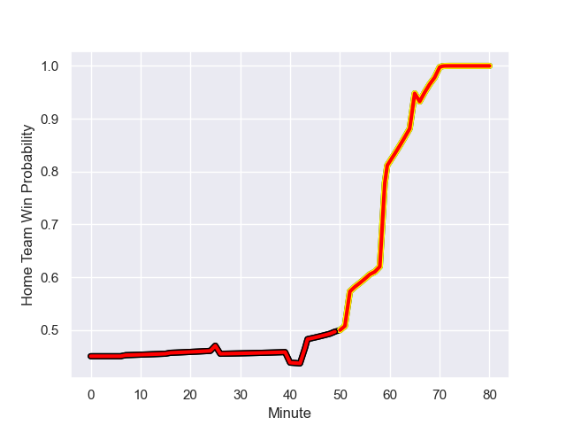

---  
layout: page  
title: Counties Manukau at Waikato; 15-37  
date: 2023-08-27 18:00:00 -0500  
categories: match review  
---
# Counties Manukau at Waikato; 15-37

# Club Level Predictions

The first set of predictions treats a club as the smallest object, as the club develops its members, organizes a gameplan, and deploys its players as needed for each match. This club model has a prediction of 0.832, which translates to predicting Waikato to win by 15.0.

Each club has a rating and a rating deviation (simiar to a Glicko system), and expected performances can be generated. This allows for simulated matches and spreads like the ones below.
## Projected Performances

## Projected Spreads

## Projected Results

# Player Level Predictions - Version 1

Treating teams instead as an entity made up of the currently active players, I have ratings for each player in an altogether different system. These can be combined to form team ratings once teamsheets are announced, weighting starters a bit higher than the reserves. After the match is played, players can be weighted by their minutes on the field, allowing for an accurate measure of the team's composition. With these compiled team ratings, we can make predictions, measure inaccuracy, and update the individual player ratings.
## Prediction with Player Minutes: Counties Manukau by 4.6

Counties Manukau by 8.6 on a neutral field
## Prediction without Player Minutes: Counties Manukau by 3.0

Counties Manukau by 7.0 on a neutral pitch

## Scores over Time

## Win Probability over Time

There were 5 large changes in win probability in this match

|   Away Minutes | Away Player         |   Away elo |   Away Percentile |   Number |   Home Percentile |   Home elo | Home Player                  |   Home Minutes |
|---------------:|:--------------------|-----------:|------------------:|---------:|------------------:|-----------:|:-----------------------------|---------------:|
|             51 | Kauvaka Kaivelata   |      73.63 |       1.01824e+06 |        1 |  945530           |      89.69 | Ollie Norris                 |             58 |
|             51 | Ian West-Stevens    |      77.43 |       1.0182e+06  |        2 |       1.01879e+06 |      75.27 | Pita Alemania Jr Anae-Ah Sue |             66 |
|             59 | Salesi Tuifua       |      74.77 |       1.01815e+06 |        3 |  988183           |      77.33 | George Dyer                  |             57 |
|             71 | Alex McRobbie       |      76.09 |       1.01822e+06 |        4 |  785845           |      89.96 | James Tucker                 |             80 |
|             80 | James Thompson      |      77.52 |       1.01819e+06 |        5 |       1.01657e+06 |      89.17 | Laghlan McWhannell           |             43 |
|             59 | Sam Tuifua          |      76.07 |       1.01814e+06 |        6 |       1.01886e+06 |      69.28 | Hamilton Burr                |             80 |
|             80 | Sean Reidy          |      79.51 |       1.01814e+06 |        7 |       1.019e+06   |      76.7  | Jack Lam                     |             59 |
|             80 | Dalton Papali'i     |      96.61 |       1.00701e+06 |        8 |       1.01658e+06 |      82.64 | Simon Parker                 |             80 |
|             73 | Liam Daniela        |      76.68 |       1.01818e+06 |        9 |       1.01888e+06 |      70.42 | Cortez Lee Ratima            |             57 |
|             80 | Riley Hohepa        |      78.4  |       1.01815e+06 |       10 |       1.01882e+06 |      64.31 | Taha Kemara                  |             59 |
|             80 | Toni Pulu           |      86.21 |       1.01662e+06 |       11 |  993923           |      56.55 | Daniel Sinkinson             |             80 |
|             16 | Nikolai Foliaki     |      73.99 |       1.01816e+06 |       12 |       1.01985e+06 |      69.9  | Quinn Tupaea                 |             80 |
|             80 | Tevita Ofa          |      84.3  |       1.01814e+06 |       13 |       1.01887e+06 |      69.8  | Gideon Wrampling             |             53 |
|             80 | Sione Molia         |      76.44 |       1.01919e+06 |       14 |       1.01659e+06 |      73.56 | Liam Coombes-Fabling         |             80 |
|             80 | Etene Nanai-Seturo  |      92.08 |  921430           |       15 |       1.01881e+06 |      74.37 | Tepaea Cook-Savage           |             80 |
|             29 | Ezekiel Lindenmuth  |      69.8  |     nan           |       16 |       1.01887e+06 |      77.18 | Colin Ayden Johnstone        |             22 |
|             21 | Keran Van Staden    |      73.37 |     nan           |       17 |       1.01883e+06 |      69.97 | Solomone Tukuafu             |             23 |
|             29 | Ioane Moananu       |      74.4  |       1.01813e+06 |       18 |     nan           |      72.24 | Sean Ralph                   |             14 |
|             21 | Adam Brash          |      72.25 |     nan           |       19 |       1.01878e+06 |      75.71 | Malachi Wrampling-Alec       |             37 |
|              9 | Jadin Kingi         |      70.44 |     nan           |       20 |  978818           |      28.93 | Joe Johnston                 |             21 |
|              7 | Cohen Brady-Leathem |      70.05 |     nan           |       21 |       1.0188e+06  |      71.53 | Xavier Roe                   |             23 |
|             33 | Ah See Tuala        |      72.08 |     nan           |       22 |     nan           |      68.97 | Aaron Cruden                 |             21 |
|             31 | Peniasi Malimali    |      70.32 |       1.01815e+06 |       23 |       1.01881e+06 |      72.63 | Tana Tuhakaraina             |             27 |

# Player Level Predictions - Version 2

Treating teams instead as an entity made up of the currently active players, I have ratings for each player in an altogether different system. These can be combined to form team ratings once teamsheets are announced, weighting starters a bit higher than the reserves. After the match is played, players can be weighted by their minutes on the field, allowing for an accurate measure of the team's composition. With these compiled team ratings, we can make predictions, measure inaccuracy, and update the individual player ratings.
## Prediction with Player Minutes: Waikato by 3.5

Waikato by 0.1 on a neutral field
## Prediction without Player Minutes: Waikato by 3.8

Waikato by 0.4 on a neutral pitch

|   Away Minutes | Away Player         |   Away elo |   Away variance |   Number |   Home variance |   Home elo | Home Player                  |   Home Minutes |
|---------------:|:--------------------|-----------:|----------------:|---------:|----------------:|-----------:|:-----------------------------|---------------:|
|             51 | Kauvaka Kaivelata   |      46.65 |           50    |        1 |           50    |      62.78 | Ollie Norris                 |             58 |
|             51 | Ian West-Stevens    |      46.65 |           50    |        2 |           50    |      46.65 | Pita Alemania Jr Anae-Ah Sue |             66 |
|             59 | Salesi Tuifua       |      46.65 |           50    |        3 |           50    |      58.3  | George Dyer                  |             57 |
|             71 | Alex McRobbie       |      46.65 |           50    |        4 |           50    |      66.26 | James Tucker                 |             80 |
|             80 | James Thompson      |      46.65 |           50    |        5 |           50    |      46.65 | Laghlan McWhannell           |             43 |
|             59 | Sam Tuifua          |      46.65 |           50    |        6 |           50    |      46.65 | Hamilton Burr                |             80 |
|             80 | Sean Reidy          |      46.65 |           50    |        7 |           50    |      46.65 | Jack Lam                     |             59 |
|             80 | Dalton Papali'i     |      66.52 |           47.91 |        8 |           50    |      46.65 | Simon Parker                 |             80 |
|             73 | Liam Daniela        |      46.65 |           50    |        9 |           50    |      46.65 | Cortez Lee Ratima            |             57 |
|             80 | Riley Hohepa        |      46.65 |           50    |       10 |           50    |      46.65 | Taha Kemara                  |             59 |
|             80 | Toni Pulu           |      46.65 |           50    |       11 |           50    |      40.79 | Daniel Sinkinson             |             80 |
|             16 | Nikolai Foliaki     |      46.65 |           50    |       12 |           50    |      46.65 | Quinn Tupaea                 |             80 |
|             80 | Tevita Ofa          |      46.65 |           50    |       13 |           50    |      46.65 | Gideon Wrampling             |             53 |
|             80 | Sione Molia         |      46.65 |           50    |       14 |           50    |      46.65 | Liam Coombes-Fabling         |             80 |
|             80 | Etene Nanai-Seturo  |      39.38 |           50    |       15 |           50    |      46.65 | Tepaea Cook-Savage           |             80 |
|             29 | Ezekiel Lindenmuth  |      46.65 |           50    |       16 |           50    |      46.65 | Colin Ayden Johnstone        |             22 |
|             21 | Keran Van Staden    |      46.65 |           50    |       17 |           50    |      46.65 | Solomone Tukuafu             |             23 |
|             29 | Ioane Moananu       |      46.65 |           50    |       18 |           50    |      46.65 | Sean Ralph                   |             14 |
|             21 | Adam Brash          |      46.65 |           50    |       19 |           50    |      46.65 | Malachi Wrampling-Alec       |             37 |
|              9 | Jadin Kingi         |      46.65 |           50    |       20 |           48.39 |     -20.42 | Joe Johnston                 |             21 |
|              7 | Cohen Brady-Leathem |      46.65 |           50    |       21 |           50    |      46.65 | Xavier Roe                   |             23 |
|             33 | Ah See Tuala        |      46.65 |           50    |       22 |           50    |      46.65 | Aaron Cruden                 |             21 |
|             31 | Peniasi Malimali    |      46.65 |           50    |       23 |           50    |      46.65 | Tana Tuhakaraina             |             27 |

