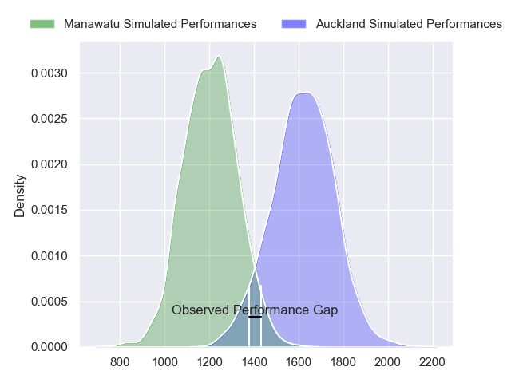
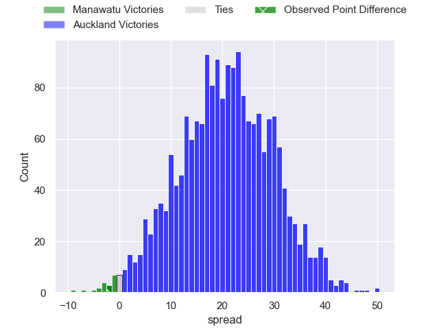
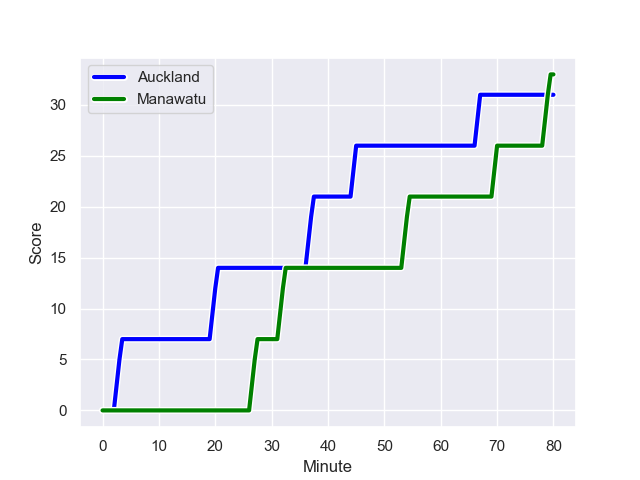
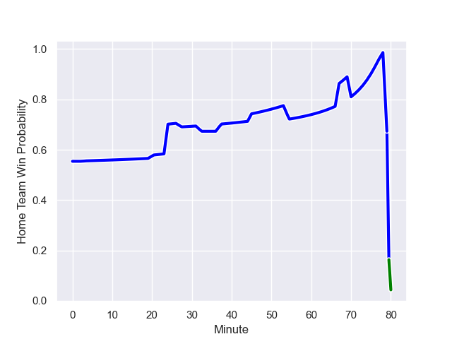

---  
layout: page  
title: Manawatu at Auckland; 33.0-31.0  
date: 2023-08-30 18:00:00 -0500  
categories: match review  
---
# Manawatu at Auckland; 33.0-31.0

# Club Level Predictions

The first set of predictions treats a club as the smallest object, as the club develops its members, organizes a gameplan, and deploys its players as needed for each match. This club model has a prediction of 0.903, which translates to predicting Auckland to win by 20.7.

Each club has a rating and a rating deviation (simiar to a Glicko system), and expected performances can be generated. This allows for simulated matches and spreads like the ones below.
## Projected Performances

## Projected Spreads

## Projected Results

# Player Level Predictions - Version 1

Treating teams instead as an entity made up of the currently active players, I have ratings for each player in an altogether different system. These can be combined to form team ratings once teamsheets are announced, weighting starters a bit higher than the reserves. After the match is played, players can be weighted by their minutes on the field, allowing for an accurate measure of the team's composition. With these compiled team ratings, we can make predictions, measure inaccuracy, and update the individual player ratings.
## Prediction with Player Minutes: Auckland by 13.5

Auckland by 9.5 on a neutral field
## Prediction without Player Minutes: Auckland by 9.1

Auckland by 5.1 on a neutral pitch

## Scores over Time

## Win Probability over Time

There were 11 large changes in win probability in this match

|   Away Minutes | Away Player          |   Away elo |   Away Percentile |   Number |   Home Percentile |   Home elo | Home Player       |   Home Minutes |
|---------------:|:---------------------|-----------:|------------------:|---------:|------------------:|-----------:|:------------------|---------------:|
|             66 | Joseph Gavigan       |      77.28 |       1.00859e+06 |        1 |       1.03331e+06 |     112.59 | Ben Ake           |             80 |
|             80 | AJ Quattrin          |     218.25 |  949556           |        2 |  751579           |      83.71 | Leni Apisai       |             69 |
|             25 | Sean Paranihi        |      89.39 |  850548           |        3 |  540691           |     147.4  | Angus Ta'avao     |             68 |
|             80 | Ofa Tauatevalu       |      77.04 |       1.00549e+06 |        4 |  865373           |     119.79 | Hamish Dalzell    |             80 |
|             49 | Josh Taula           |      89.69 |       1.03312e+06 |        5 |  704524           |     164.02 | Patrick Tuipulotu |             59 |
|             80 | TK Howden            |      92.24 |       1.00386e+06 |        6 |       1.03316e+06 |     103.17 | Che Clark         |             56 |
|             59 | Johnny Galloway      |      66.42 |  962690           |        7 |       1.0205e+06  |      71.18 | Niko Jones        |             80 |
|             59 | Terrell Peita        |     247.62 |       1.01535e+06 |        8 |  788762           |     145.71 | Akira Ioane       |             80 |
|             66 | John Poland          |      37.83 |  976793           |        9 |       1.00522e+06 |      82.63 | Taufa Funaki      |             68 |
|             80 | Isaiah Ravula        |     104.26 |       1.03334e+06 |       10 |       1.00553e+06 |     102.32 | Jock McKenzie     |             80 |
|             24 | Taniela Filimone     |     109.89 |       1.00381e+06 |       11 |  867672           |     108.36 | Salesi Rayasi     |             22 |
|             80 | James Tofa           |      98.03 |  932894           |       12 |  937136           |     111.8  | Tanielu Teleʻa    |             80 |
|             80 | Kegan Christian-Goss |      89.84 |       1.02292e+06 |       13 |       1.00516e+06 |     108.98 | Corey Evans       |             80 |
|             80 | Epeli Waqaicece      |      97.8  |       1.03358e+06 |       14 |       1.03317e+06 |     106.38 | Caleb Tangitau    |             80 |
|             66 | Nehe Milner-Skudder  |      75.63 |  580521           |       15 |       1.03358e+06 |     104.47 | Payton Spencer    |             80 |
|             56 | Pena Va'a            |      98.03 |     nan           |       16 |       1.02326e+06 |     122.3  | Joel Cobb         |             58 |
|             55 | Cole Keith           |      86.6  |  929302           |       17 |       1.00519e+06 |     105.41 | Vaiolini Ekuasi   |             24 |
|             31 | Johannes Momsen      |     173.69 |  957889           |       18 |     nan           |     104.73 | Kalin Felise      |             21 |
|             21 | Julian Goerke        |     105.52 |     nan           |       19 |       1.03332e+06 |     110.47 | Sione Ahio        |             12 |
|             21 | Raymond Tuputupu     |      90.9  |       1.03306e+06 |       20 |     nan           |     108.7  | Pele Cowley       |             12 |
|             14 | Jordi Viljoen        |      89.42 |       1.0331e+06  |       21 |     nan           |      79.6  | Joe Royal         |             11 |
|             14 | Malakai Hala-Ngatai  |      98.63 |       1.03344e+06 |       22 |     nan           |     nan    | nan               |            nan |
|             14 | Beaudein Waaka       |      48.73 |  700877           |       23 |     nan           |     nan    | nan               |            nan |

# Player Level Predictions - Version 2

Treating teams instead as an entity made up of the currently active players, I have ratings for each player in an altogether different system. These can be combined to form team ratings once teamsheets are announced, weighting starters a bit higher than the reserves. After the match is played, players can be weighted by their minutes on the field, allowing for an accurate measure of the team's composition. With these compiled team ratings, we can make predictions, measure inaccuracy, and update the individual player ratings.
## Prediction with Player Minutes: Auckland by 9.9

Auckland by 6.6 on a neutral field
## Prediction without Player Minutes: Auckland by 10.3

Auckland by 6.9 on a neutral pitch

|   Away Minutes | Away Player          |   Away elo |   Away variance |   Number |   Home variance |   Home elo | Home Player       |   Home Minutes |
|---------------:|:---------------------|-----------:|----------------:|---------:|----------------:|-----------:|:------------------|---------------:|
|             66 | Joseph Gavigan       |      26.56 |           50    |        1 |           50    |      46.65 | Ben Ake           |             80 |
|             80 | AJ Quattrin          |      41.79 |           48.69 |        2 |           50    |      18.23 | Leni Apisai       |             69 |
|             25 | Sean Paranihi        |      34.93 |           50    |        3 |           50    |      83.77 | Angus Ta'avao     |             68 |
|             80 | Ofa Tauatevalu       |      35.21 |           50    |        4 |           50    |      39.81 | Hamish Dalzell    |             80 |
|             49 | Josh Taula           |      46.65 |           50    |        5 |           50    |      78.16 | Patrick Tuipulotu |             59 |
|             80 | TK Howden            |      10.96 |           50    |        6 |           50    |      46.65 | Che Clark         |             56 |
|             59 | Johnny Galloway      |      31.41 |           50    |        7 |           48.53 |      37.87 | Niko Jones        |             80 |
|             59 | Terrell Peita        |      64.45 |           50    |        8 |           50    |      86.87 | Akira Ioane       |             80 |
|             66 | John Poland          |      63.9  |           48.14 |        9 |           50    |      33.27 | Taufa Funaki      |             68 |
|             80 | Isaiah Ravula        |      46.65 |           50    |       10 |           50    |      50.07 | Jock McKenzie     |             80 |
|             24 | Taniela Filimone     |      64.93 |           48.87 |       11 |           50    |      72.32 | Salesi Rayasi     |             22 |
|             80 | James Tofa           |      22.16 |           50    |       12 |           50    |      39.77 | Tanielu Teleʻa    |             80 |
|             80 | Kegan Christian-Goss |      44.15 |           50    |       13 |           50    |      52.6  | Corey Evans       |             80 |
|             80 | Epeli Waqaicece      |      46.65 |           50    |       14 |           50    |      46.65 | Caleb Tangitau    |             80 |
|             66 | Nehe Milner-Skudder  |      14.41 |           50    |       15 |           50    |      46.65 | Payton Spencer    |             80 |
|             56 | Pena Va'a            |      46.65 |           50    |       16 |           50    |      46.6  | Joel Cobb         |             58 |
|             55 | Cole Keith           |      64.08 |           48.56 |       17 |           50    |      36.86 | Vaiolini Ekuasi   |             24 |
|             31 | Johannes Momsen      |      19.23 |           50    |       18 |           50    |      46.65 | Kalin Felise      |             21 |
|             21 | Julian Goerke        |      46.65 |           50    |       19 |           50    |      46.65 | Sione Ahio        |             12 |
|             21 | Raymond Tuputupu     |      46.65 |           50    |       20 |           50    |      47.33 | Pele Cowley       |             12 |
|             14 | Jordi Viljoen        |      46.65 |           50    |       21 |           50    |      28.54 | Joe Royal         |             11 |
|             14 | Malakai Hala-Ngatai  |      46.65 |           50    |       22 |          nan    |     nan    | nan               |            nan |
|             14 | Beaudein Waaka       |      -2.95 |           50    |       23 |          nan    |     nan    | nan               |            nan |

