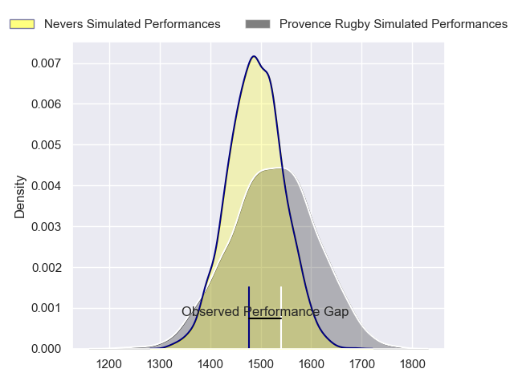
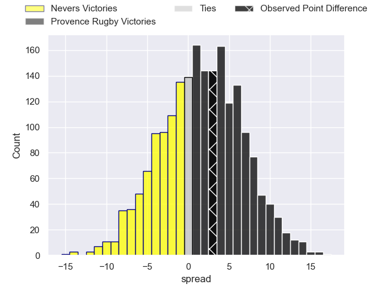
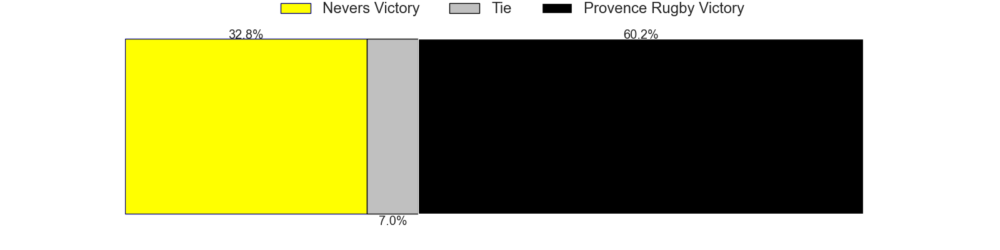
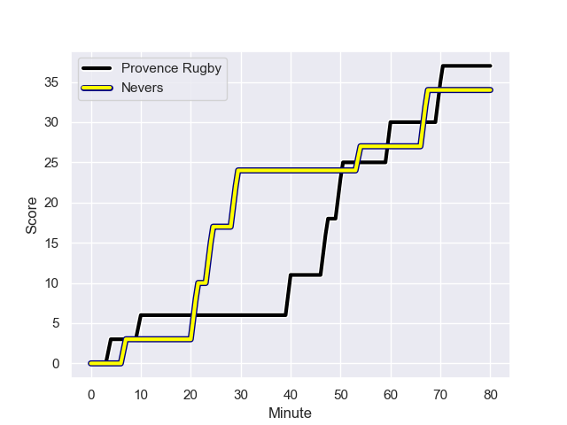
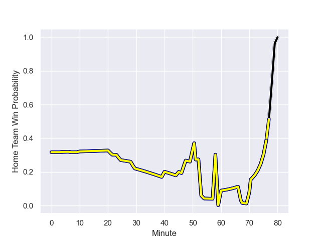

---  
layout: page  
title: Nevers at Provence Rugby; 34.0-37.0  
date: 2023-08-31 18:00:00 -0500  
categories: match review  
---
# Nevers at Provence Rugby; 34.0-37.0

# Club Level Predictions

The first set of predictions treats a club as the smallest object, as the club develops its members, organizes a gameplan, and deploys its players as needed for each match. This club model has a prediction of 0.547, which translates to predicting Provence Rugby to win by 1.7.

Each club has a rating and a rating deviation (simiar to a Glicko system), and expected performances can be generated. This allows for simulated matches and spreads like the ones below.
## Projected Performances

## Projected Spreads

## Projected Results

# Player Level Predictions - Version 1

Treating teams instead as an entity made up of the currently active players, I have ratings for each player in an altogether different system. These can be combined to form team ratings once teamsheets are announced, weighting starters a bit higher than the reserves. After the match is played, players can be weighted by their minutes on the field, allowing for an accurate measure of the team's composition. With these compiled team ratings, we can make predictions, measure inaccuracy, and update the individual player ratings.
## Prediction with Player Minutes: Nevers by 29.4

Nevers by 33.4 on a neutral field
## Prediction without Player Minutes: Nevers by 29.0

Nevers by 33.0 on a neutral pitch

## Scores over Time

## Win Probability over Time

There were 21 large changes in win probability in this match

|   Away Minutes | Away Player              |   Away elo |   Away Percentile |   Number |   Home Percentile |   Home elo | Home Player           |   Home Minutes |
|---------------:|:-------------------------|-----------:|------------------:|---------:|------------------:|-----------:|:----------------------|---------------:|
|             51 | Kamaliele Tufele         |     147.29 |  857799           |        1 |  792267           |     224.48 | Julius Nostadt        |             59 |
|             45 | Jonathan Maiau           |     113.74 |  987450           |        2 |  776112           |      71.71 | Loick Jammes          |             50 |
|             58 | Cleopas Kundiona         |     319.73 |       1.0099e+06  |        3 |  933072           |     152.38 | Quentin Samaran       |             45 |
|             80 | Christiaan van der Merwe |      27.23 |  911580           |        4 |  823562           |      44.18 | Theo Hannoyer         |             64 |
|             47 | Will Skelton             |     121.49 |  694448           |        5 |  718334           |     118.13 | Josh Tyrell           |             80 |
|             80 | Luka Plataret            |     153.16 |  958944           |        6 |  945369           |     216.23 | Guillaume Piazzoli    |             80 |
|             60 | Hugues Bastide           |     110.77 |  896235           |        7 |  829648           |     189.82 | Bilel Taieb           |             80 |
|             80 | Jason-Colin Fraser       |     118.25 |  745405           |        8 |  631103           |     104.7  | Teimana Harrison      |             53 |
|             80 | Guillaume Manevy         |     215.99 |  979797           |        9 |  866238           |     120.83 | Arthur Coville        |             71 |
|             80 | Shaun Reynolds           |      96.02 |  884022           |       10 |  193454           |     133.19 | Jimmy Gopperth        |             64 |
|             53 | Thomas Zenon             |     139.79 |  958696           |       11 |  992833           |     188.81 | Nadir Bouhedjeur      |             80 |
|             68 | Rudy Derrieux            |     138.48 |  893526           |       12 |  710715           |      57.92 | Louis Marrou          |             45 |
|             80 | Leonard Paris            |     158.37 |  918519           |       13 |  784514           |     111.13 | Atila Septar          |             80 |
|             80 | Christian Ambadiang      |     260.78 |  997923           |       14 |  955002           |     148.96 | Adrien Lapegue-Lafaye |             80 |
|             80 | Kylian Jaminet           |      69.07 |  830986           |       15 |  880246           |     141.17 | Thomas Salles         |             80 |
|             35 | Elia Elia                |      94.57 |  874649           |       16 |       1.02674e+06 |     122.35 | Paul Mallez           |             35 |
|             33 | Kevin Noah               |     242.9  |       1.0072e+06  |       17 |  844972           |     103.13 | Kaveinga Finau        |             35 |
|             29 | Jordan Seneca            |     118.98 |  678897           |       18 |  457164           |      61.77 | Jean Charles Orioli   |             30 |
|             27 | Arthurs Barbier          |     252.51 |       1.02625e+06 |       19 |       1.02478e+06 |     113.84 | Malohi Suta           |             27 |
|             22 | Farai Mudariki           |     598.5  |     nan           |       20 |     nan           |     286.07 | Nicolas Toth          |             21 |
|             20 | Robin Dione              |     233.33 |       1.00954e+06 |       21 |       1.02856e+06 |     121.91 | Charly Gambini        |             16 |
|             12 | Mattéo Faucher           |     200.08 |  987434           |       22 |  710092           |      59.49 | Enzo Selponi          |             16 |
|            nan | nan                      |     nan    |     nan           |       23 |  767407           |      85.78 | Joris Cazenave        |              9 |

# Player Level Predictions - Version 2

Treating teams instead as an entity made up of the currently active players, I have ratings for each player in an altogether different system. These can be combined to form team ratings once teamsheets are announced, weighting starters a bit higher than the reserves. After the match is played, players can be weighted by their minutes on the field, allowing for an accurate measure of the team's composition. With these compiled team ratings, we can make predictions, measure inaccuracy, and update the individual player ratings.
## Prediction with Player Minutes: Nevers by 8.5

Nevers by 12.5 on a neutral field
## Prediction without Player Minutes: Nevers by 9.6

Nevers by 13.6 on a neutral pitch

|   Away Minutes | Away Player              |   Away elo |   Away variance |   Number |   Home variance |   Home elo | Home Player           |   Home Minutes |
|---------------:|:-------------------------|-----------:|----------------:|---------:|----------------:|-----------:|:----------------------|---------------:|
|             51 | Kamaliele Tufele         |      50.83 |           50    |        1 |              50 |      32.46 | Julius Nostadt        |             59 |
|             45 | Jonathan Maiau           |      39.71 |           50    |        2 |              50 |      -3.06 | Loick Jammes          |             50 |
|             58 | Cleopas Kundiona         |      46.41 |           50    |        3 |              50 |      27.92 | Quentin Samaran       |             45 |
|             80 | Christiaan van der Merwe |       7.2  |           50    |        4 |              50 |      -2.98 | Theo Hannoyer         |             64 |
|             47 | Will Skelton             |      89.05 |           44.32 |        5 |              50 |      35.26 | Josh Tyrell           |             80 |
|             80 | Luka Plataret            |      53.66 |           50    |        6 |              50 |      49.42 | Guillaume Piazzoli    |             80 |
|             60 | Hugues Bastide           |      81.79 |           50    |        7 |              50 |      60.96 | Bilel Taieb           |             80 |
|             80 | Jason-Colin Fraser       |      92.01 |           50    |        8 |              50 |      44.02 | Teimana Harrison      |             53 |
|             80 | Guillaume Manevy         |      43.28 |           50    |        9 |              50 |      39.77 | Arthur Coville        |             71 |
|             80 | Shaun Reynolds           |      62.34 |           50    |       10 |              50 |      49.86 | Jimmy Gopperth        |             64 |
|             53 | Thomas Zenon             |      29.46 |           50    |       11 |              50 |      38.74 | Nadir Bouhedjeur      |             80 |
|             68 | Rudy Derrieux            |      61.57 |           50    |       12 |              50 |      37.1  | Louis Marrou          |             45 |
|             80 | Leonard Paris            |      74.34 |           50    |       13 |              50 |      49.33 | Atila Septar          |             80 |
|             80 | Christian Ambadiang      |      63.35 |           50    |       14 |              50 |       8.72 | Adrien Lapegue-Lafaye |             80 |
|             80 | Kylian Jaminet           |      68.82 |           50    |       15 |              50 |      34.79 | Thomas Salles         |             80 |
|             35 | Elia Elia                |      46.28 |           50    |       16 |              50 |      41.14 | Paul Mallez           |             35 |
|             33 | Kevin Noah               |      47.74 |           50    |       17 |              50 |      74.83 | Kaveinga Finau        |             35 |
|             29 | Jordan Seneca            |      50.71 |           50    |       18 |              50 |      36.67 | Jean Charles Orioli   |             30 |
|             27 | Arthurs Barbier          |      62.9  |           50    |       19 |              50 |      47.1  | Malohi Suta           |             27 |
|             22 | Farai Mudariki           |      42.85 |           50    |       20 |              50 |      41.65 | Nicolas Toth          |             21 |
|             20 | Robin Dione              |      45.19 |           50    |       21 |              50 |      37.64 | Charly Gambini        |             16 |
|             12 | Mattéo Faucher           |      53.64 |           50    |       22 |              50 |      37.48 | Enzo Selponi          |             16 |
|            nan | nan                      |     nan    |          nan    |       23 |              50 |      28.67 | Joris Cazenave        |              9 |

