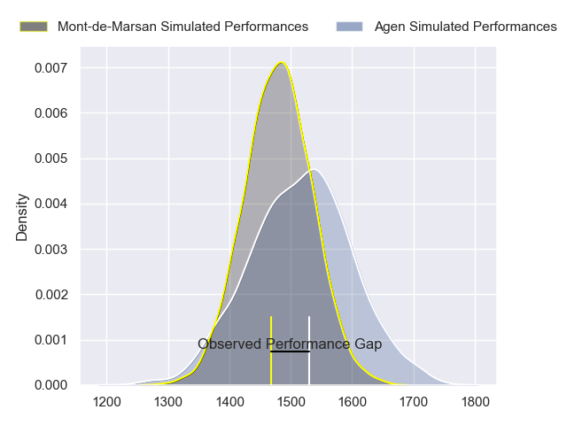
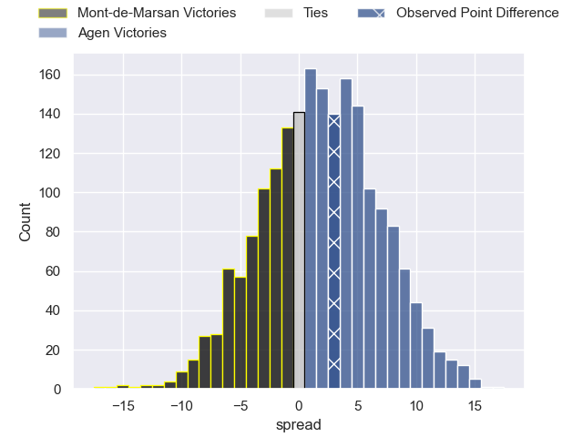
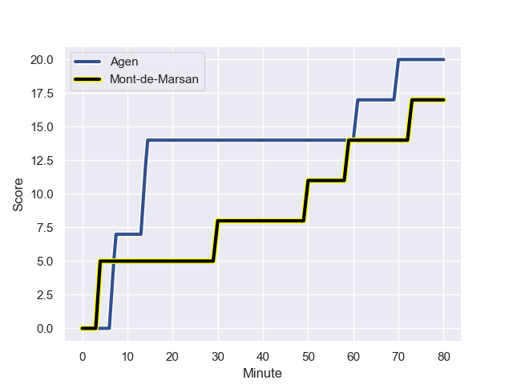
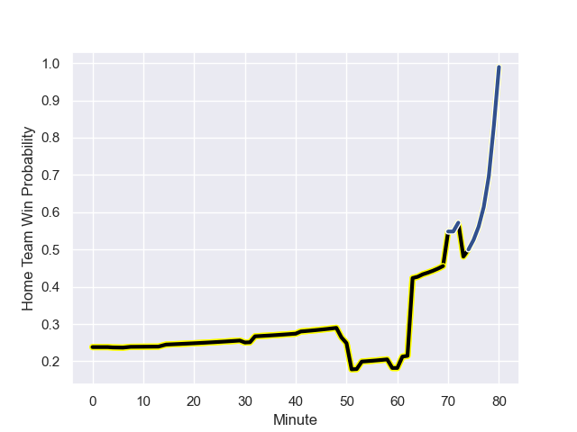

---  
layout: page  
title: Mont-de-Marsan at Agen; 17.0-20.0  
date: 2023-09-01 18:00:00 -0500  
categories: match review  
---
# Mont-de-Marsan at Agen; 17.0-20.0

# Club Level Predictions

The first set of predictions treats a club as the smallest object, as the club develops its members, organizes a gameplan, and deploys its players as needed for each match. This club model has a prediction of 0.553, which translates to predicting Agen to win by 1.9.

Each club has a rating and a rating deviation (simiar to a Glicko system), and expected performances can be generated. This allows for simulated matches and spreads like the ones below.
## Projected Performances

## Projected Spreads

## Projected Results

# Player Level Predictions - Version 1

Treating teams instead as an entity made up of the currently active players, I have ratings for each player in an altogether different system. These can be combined to form team ratings once teamsheets are announced, weighting starters a bit higher than the reserves. After the match is played, players can be weighted by their minutes on the field, allowing for an accurate measure of the team's composition. With these compiled team ratings, we can make predictions, measure inaccuracy, and update the individual player ratings.
## Prediction with Player Minutes: Mont-de-Marsan by 46.5

Mont-de-Marsan by 50.5 on a neutral field
## Prediction without Player Minutes: Mont-de-Marsan by 48.9

Mont-de-Marsan by 52.9 on a neutral pitch

## Scores over Time

## Win Probability over Time

There were 12 large changes in win probability in this match

|   Away Minutes | Away Player               |   Away elo |   Away Percentile |   Number |   Home Percentile |   Home elo | Home Player        |   Home Minutes |
|---------------:|:--------------------------|-----------:|------------------:|---------:|------------------:|-----------:|:-------------------|---------------:|
|             49 | Dino Casadei              |     238.19 |       1.01426e+06 |        1 |  991031           |     104.04 | Hans Lombard-Buret |             51 |
|             49 | Simon Labouyrie           |      73.59 |  749527           |        2 |  813022           |      43.59 | Mike Sosene-Feagai |             53 |
|             38 | Chris Talakai             |     108.19 |  815912           |        3 |  947269           |     104.61 | Alex Burin         |             63 |
|             61 | Romain Durand             |     180.85 |  924584           |        4 |  779380           |      96.06 | Joe Maksymiw       |             80 |
|             80 | Aston Fortuin             |     192.98 |  898793           |        5 |  944888           |     197.26 | Zak Farrance       |             80 |
|             32 | Raphaël Robic             |     144.04 |       1.02843e+06 |        6 |  619166           |     116.81 | Antoine Erbani     |             80 |
|             80 | Nicolas Garrault          |      99.12 |  670442           |        7 |       1.02984e+06 |     125.99 | Valentin Gayraud   |             63 |
|             80 | Veresa Tuqovu Ramototabua |     170.54 |       1.02732e+06 |        8 |  843273           |     188.51 | Fotu Lokotui       |             80 |
|             65 | Christophe Loustalot      |     108.95 |  749690           |        9 |  964375           |      92.83 | Theo Idjellidaine  |             71 |
|             80 | Joris Pialot              |     213.12 |       1.01485e+06 |       10 |  923736           |     149.18 | Thomas Vincent     |             80 |
|             41 | Semi Lagivala             |     140.76 |       1.0336e+06  |       11 |  911465           |      81.91 | Iban Etcheverry    |             61 |
|             80 | Jules Even                |     285.99 |  964521           |       12 |  982024           |      68.13 | Kolinio Ramoka     |             80 |
|             80 | Gatien Masse              |     112.32 |       1.01111e+06 |       13 |  998534           |      87.55 | Clement Garrigues  |             80 |
|             80 | Pierre Sayerse            |      98.28 |  774983           |       14 |  727888           |      91.03 | Timilai Rokoduru   |             80 |
|             80 | Yoann Laousse Azpiazu     |     109.79 |  659612           |       15 |  804560           |      88.29 | Loris Tolot        |             80 |
|             48 | William Wavrin            |     101.68 |  656281           |       16 |  905666           |     107.42 | Florent Guion      |             29 |
|             42 | Mathis Bats               |     128.03 |     nan           |       17 |  909479           |     146.26 | Clement Martinez   |             27 |
|             39 | Nacani Wakaya             |     205.72 |  851870           |       18 |  686091           |      49.58 | Ben Volavola       |             19 |
|             19 | Enzo Prosper              |     141.09 |     nan           |       19 |  980858           |     479.86 | Matthieu Bonnet    |             17 |
|             31 | Samuel Lagrange           |     116.83 |  875850           |       20 |  986439           |     280.58 | Théo Sauzaret      |             17 |
|             31 | Thomas Bultel             |     179.44 |  961042           |       21 |  808120           |      48.7  | Andre Warner       |              9 |
|             15 | Kevin Viallard            |     102.72 |  947336           |       22 |     nan           |     nan    | nan                |            nan |

# Player Level Predictions - Version 2

Treating teams instead as an entity made up of the currently active players, I have ratings for each player in an altogether different system. These can be combined to form team ratings once teamsheets are announced, weighting starters a bit higher than the reserves. After the match is played, players can be weighted by their minutes on the field, allowing for an accurate measure of the team's composition. With these compiled team ratings, we can make predictions, measure inaccuracy, and update the individual player ratings.
## Prediction with Player Minutes: Agen by 1.1

Mont-de-Marsan by 3.8 on a neutral field
## Prediction without Player Minutes: Agen by 1.3

Mont-de-Marsan by 3.5 on a neutral pitch

|   Away Minutes | Away Player               |   Away elo |   Away variance |   Number |   Home variance |   Home elo | Home Player        |   Home Minutes |
|---------------:|:--------------------------|-----------:|----------------:|---------:|----------------:|-----------:|:-------------------|---------------:|
|             49 | Dino Casadei              |      46.71 |           49.78 |        1 |           49.74 |      50.79 | Hans Lombard-Buret |             51 |
|             49 | Simon Labouyrie           |      35.87 |           49.96 |        2 |           49.73 |      -2.16 | Mike Sosene-Feagai |             53 |
|             38 | Chris Talakai             |      32.81 |           49.74 |        3 |           49.76 |      48.86 | Alex Burin         |             63 |
|             61 | Romain Durand             |      57.32 |           49.87 |        4 |           49.67 |      25.07 | Joe Maksymiw       |             80 |
|             80 | Aston Fortuin             |      34.58 |           49.6  |        5 |           50    |      45.88 | Zak Farrance       |             80 |
|             32 | Raphaël Robic             |      50.87 |           49.86 |        6 |           49.8  |      90.39 | Antoine Erbani     |             80 |
|             80 | Nicolas Garrault          |      40.25 |           49.6  |        7 |           49.79 |      47.01 | Valentin Gayraud   |             63 |
|             80 | Veresa Tuqovu Ramototabua |      55.27 |           49.79 |        8 |           49.66 |      32.01 | Fotu Lokotui       |             80 |
|             65 | Christophe Loustalot      |      31.36 |           49.86 |        9 |           49.83 |      37.78 | Theo Idjellidaine  |             71 |
|             80 | Joris Pialot              |      35.01 |           49.96 |       10 |           49.7  |      53.4  | Thomas Vincent     |             80 |
|             41 | Semi Lagivala             |      46.65 |           50    |       11 |           49.58 |      34.77 | Iban Etcheverry    |             61 |
|             80 | Jules Even                |      54.94 |           50    |       12 |           49.83 |      29.84 | Kolinio Ramoka     |             80 |
|             80 | Gatien Masse              |      42.85 |           49.6  |       13 |           49.78 |      53.17 | Clement Garrigues  |             80 |
|             80 | Pierre Sayerse            |      50.11 |           50    |       14 |           49.78 |      42.04 | Timilai Rokoduru   |             80 |
|             80 | Yoann Laousse Azpiazu     |      34.45 |           49.65 |       15 |           49.78 |     -12.34 | Loris Tolot        |             80 |
|             48 | William Wavrin            |      51.54 |           49.92 |       16 |           50    |      24.73 | Florent Guion      |             29 |
|             42 | Mathis Bats               |      45.89 |           49.85 |       17 |           50    |      41.88 | Clement Martinez   |             27 |
|             39 | Nacani Wakaya             |      79.99 |           49.6  |       18 |           49.82 |      43.98 | Ben Volavola       |             19 |
|             19 | Enzo Prosper              |      46.65 |           50    |       19 |           49.78 |      51.76 | Matthieu Bonnet    |             17 |
|             31 | Samuel Lagrange           |      47.66 |           49.7  |       20 |           49.91 |      47.25 | Théo Sauzaret      |             17 |
|             31 | Thomas Bultel             |      38.41 |           50    |       21 |           50    |      28.19 | Andre Warner       |              9 |
|             15 | Kevin Viallard            |      47.98 |           49.74 |       22 |          nan    |     nan    | nan                |            nan |

