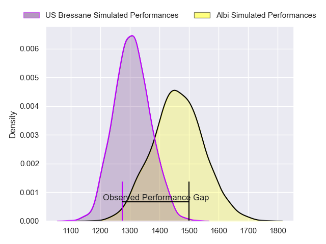
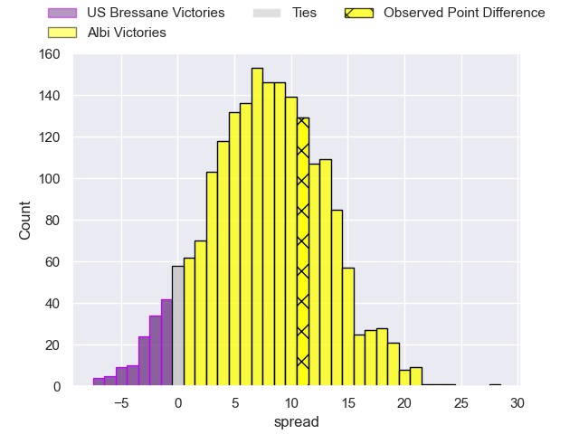
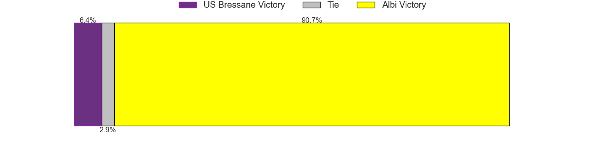
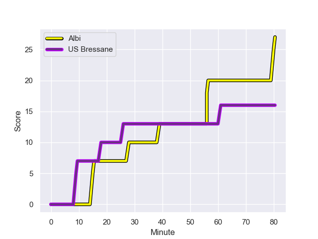
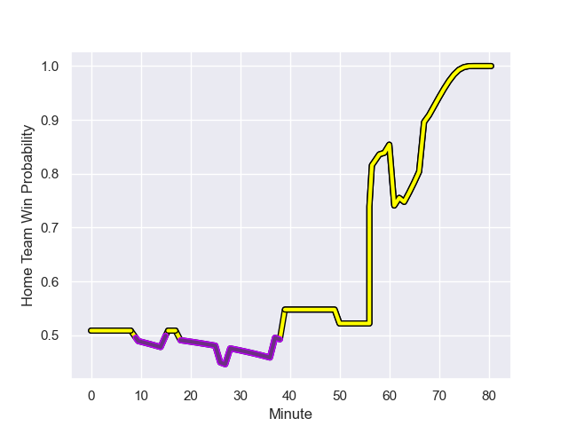

---  
layout: page  
title: US Bressane at Albi; 16.0-27.0  
date: 2023-09-01 18:00:00 -0500  
categories: match review  
---
# US Bressane at Albi; 16.0-27.0

# Club Level Predictions

The first set of predictions treats a club as the smallest object, as the club develops its members, organizes a gameplan, and deploys its players as needed for each match. This club model has a prediction of 0.71, which translates to predicting Albi to win by 7.9.

Each club has a rating and a rating deviation (simiar to a Glicko system), and expected performances can be generated. This allows for simulated matches and spreads like the ones below.
## Projected Performances

## Projected Spreads

## Projected Results

# Player Level Predictions - Version 1

Treating teams instead as an entity made up of the currently active players, I have ratings for each player in an altogether different system. These can be combined to form team ratings once teamsheets are announced, weighting starters a bit higher than the reserves. After the match is played, players can be weighted by their minutes on the field, allowing for an accurate measure of the team's composition. With these compiled team ratings, we can make predictions, measure inaccuracy, and update the individual player ratings.
## Prediction with Player Minutes: Albi by 25.5

Albi by 21.5 on a neutral field
## Prediction without Player Minutes: Albi by 43.0

Albi by 39.0 on a neutral pitch

## Scores over Time

## Win Probability over Time

There were 11 large changes in win probability in this match

|   Away Minutes | Away Player          |   Away elo |   Away Percentile |   Number |   Home Percentile |   Home elo | Home Player             |   Home Minutes |
|---------------:|:---------------------|-----------:|------------------:|---------:|------------------:|-----------:|:------------------------|---------------:|
|             59 | Vazha Kapanadze      |     288.87 |  946274           |        1 |  893549           |     179.95 | Antoine Soave           |             50 |
|             37 | Arnaud Feltrin       |     173.82 |  879034           |        2 |  901713           |     214.78 | Reinach Venter          |             63 |
|             67 | Atonio Ulutuipalelei |     260.1  |  999532           |        3 |  985245           |     307.22 | Dimitri Tchapnga        |             50 |
|             59 | Louis Bruinsma       |      -9.6  |  983893           |        4 |  932460           |     516.48 | Mohsen Essid            |             80 |
|             80 | Josh Peters          |     283.07 |  924421           |        5 |  642295           |      91.93 | Jacques Engelbrecht     |             59 |
|             74 | Thomas Déliance      |     175.3  |       1.02783e+06 |        6 |  682316           |     142.82 | Vincent Calas           |             80 |
|             80 | Pierre Reynaud       |     155.64 |  924238           |        7 |  989999           |     262.39 | Simon Meka              |             50 |
|             80 | Joseph Penitito      |     254.7  |  991282           |        8 |       1.0282e+06  |     183.94 | Guillem Calmon          |             80 |
|             80 | Robin Graulle        |     199.72 |  997813           |        9 |  785643           |     114.52 | Gilen Queheille         |             67 |
|             80 | Fred Zeilinga        |      83.33 |  698310           |       10 |  999948           |     349.88 | Théo Vidal              |             80 |
|             63 | Malcolm Bertschy     |     119.56 |       1.0245e+06  |       11 |  790862           |     205.19 | Tim Giresse             |             80 |
|             80 | Benjamin Doy         |     178.01 |  933465           |       12 |  708546           |      92.54 | Jarrod Poi              |             68 |
|             80 | Alexandre Badet      |     223.59 |  981481           |       13 |  990234           |     179.43 | Baptiste Couchinave     |             80 |
|             80 | Thibaut Perrette     |     213.74 |       1.01306e+06 |       14 |  995118           |     302.06 | Enzo Marzocca           |             80 |
|             80 | Florent Massip       |     166.35 |  933025           |       15 |  982421           |      21.6  | Téo Dospital            |             76 |
|             21 | Nicolas Lemaire      |     215.88 |  916939           |       16 |  786926           |      77.22 | Dylan Jacquot           |             30 |
|             43 | Louis Dasalmartini   |     146.15 |       1.02832e+06 |       17 |       1.02509e+06 |     207.02 | Romain Maurice          |             17 |
|             13 | Erich de Jager       |     140.46 |  957763           |       18 |  806476           |      95.51 | Jean Baptiste De Clercq |             30 |
|             21 | Maselino Paulino     |      88.56 |  540274           |       19 |  810594           |      86.05 | Dion Evrard Oulai       |             21 |
|              6 | Nail Ait Naceur      |     161.65 |       1.02832e+06 |       20 |  607236           |     -40.1  | Pierre Roussel          |             30 |
|             17 | Élie De Fleurian     |     233.16 |  994264           |       21 |  980646           |     218.46 | Titouan Pouzoullic      |             13 |
|            nan | nan                  |     nan    |     nan           |       22 |       1.01469e+06 |     187.28 | James Haydn Tedder      |             12 |
|            nan | nan                  |     nan    |     nan           |       23 |     nan           |     331.04 | Simon Hartmann          |              4 |

# Player Level Predictions - Version 2

Treating teams instead as an entity made up of the currently active players, I have ratings for each player in an altogether different system. These can be combined to form team ratings once teamsheets are announced, weighting starters a bit higher than the reserves. After the match is played, players can be weighted by their minutes on the field, allowing for an accurate measure of the team's composition. With these compiled team ratings, we can make predictions, measure inaccuracy, and update the individual player ratings.
## Prediction with Player Minutes: Albi by 5.4

Albi by 1.0 on a neutral field
## Prediction without Player Minutes: Albi by 5.7

Albi by 1.3 on a neutral pitch

|   Away Minutes | Away Player          |   Away elo |   Away variance |   Number |   Home variance |   Home elo | Home Player             |   Home Minutes |
|---------------:|:---------------------|-----------:|----------------:|---------:|----------------:|-----------:|:------------------------|---------------:|
|             59 | Vazha Kapanadze      |      48.08 |           49.93 |        1 |           49.92 |      52.48 | Antoine Soave           |             50 |
|             37 | Arnaud Feltrin       |      43.08 |           49.93 |        2 |           49.86 |      33.64 | Reinach Venter          |             63 |
|             67 | Atonio Ulutuipalelei |      27.27 |           49.86 |        3 |           49.86 |      57.7  | Dimitri Tchapnga        |             50 |
|             59 | Louis Bruinsma       |      28.23 |           49.79 |        4 |           49.78 |      65.17 | Mohsen Essid            |             80 |
|             80 | Josh Peters          |      36.67 |           49.93 |        5 |           49.86 |      12.4  | Jacques Engelbrecht     |             59 |
|             74 | Thomas Déliance      |      50.69 |           49.83 |        6 |           49.78 |      43.87 | Vincent Calas           |             80 |
|             80 | Pierre Reynaud       |      44.41 |           49.79 |        7 |           49.92 |      49.96 | Simon Meka              |             50 |
|             80 | Joseph Penitito      |      60.33 |           49.79 |        8 |           49.78 |      36.99 | Guillem Calmon          |             80 |
|             80 | Robin Graulle        |      34.37 |           50    |        9 |           49.92 |      62.54 | Gilen Queheille         |             67 |
|             80 | Fred Zeilinga        |      60.38 |           49.79 |       10 |           50    |      70.1  | Théo Vidal              |             80 |
|             63 | Malcolm Bertschy     |      48.12 |           50    |       11 |           50    |      55.13 | Tim Giresse             |             80 |
|             80 | Benjamin Doy         |      46.29 |           49.9  |       12 |           49.78 |      18.06 | Jarrod Poi              |             68 |
|             80 | Alexandre Badet      |      28.86 |           49.79 |       13 |           49.78 |      65.28 | Baptiste Couchinave     |             80 |
|             80 | Thibaut Perrette     |      33.84 |           49.79 |       14 |           50    |      57.87 | Enzo Marzocca           |             80 |
|             80 | Florent Massip       |      60.99 |           49.79 |       15 |           49.78 |      -3.95 | Téo Dospital            |             76 |
|             21 | Nicolas Lemaire      |      46.39 |           49.86 |       16 |           50    |      44.15 | Dylan Jacquot           |             30 |
|             43 | Louis Dasalmartini   |      37.43 |           49.86 |       17 |           50    |      50.11 | Romain Maurice          |             17 |
|             13 | Erich de Jager       |      31.05 |           50    |       18 |           49.92 |      49.36 | Jean Baptiste De Clercq |             30 |
|             21 | Maselino Paulino     |     -10.05 |           49.86 |       19 |           49.92 |       6.56 | Dion Evrard Oulai       |             21 |
|              6 | Nail Ait Naceur      |      46.09 |           49.96 |       20 |           49.86 |      11.34 | Pierre Roussel          |             30 |
|             17 | Élie De Fleurian     |      32.77 |           49.79 |       21 |           49.86 |      47.69 | Titouan Pouzoullic      |             13 |
|            nan | nan                  |     nan    |          nan    |       22 |           50    |      27.42 | James Haydn Tedder      |             12 |
|            nan | nan                  |     nan    |          nan    |       23 |           50    |      49.1  | Simon Hartmann          |              4 |

