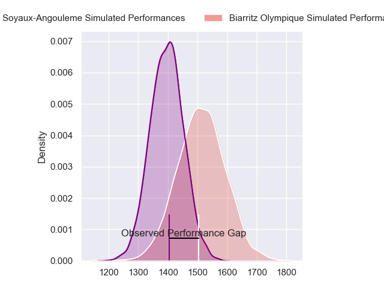
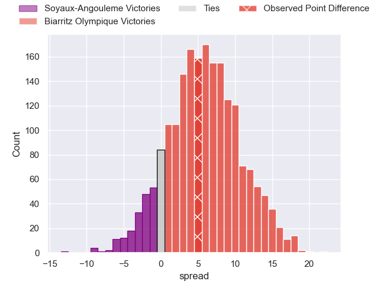
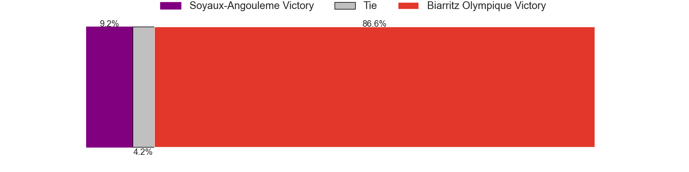
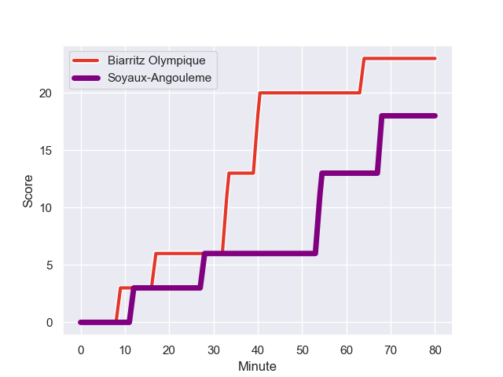
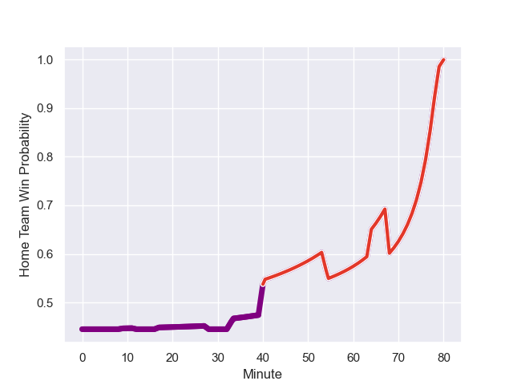

---  
layout: page  
title: Soyaux-Angouleme at Biarritz Olympique; 18.0-23.0  
date: 2023-09-01 18:00:00 -0500  
categories: match review  
---
# Soyaux-Angouleme at Biarritz Olympique; 18.0-23.0

# Club Level Predictions

The first set of predictions treats a club as the smallest object, as the club develops its members, organizes a gameplan, and deploys its players as needed for each match. This club model has a prediction of 0.661, which translates to predicting Biarritz Olympique to win by 5.9.

Each club has a rating and a rating deviation (simiar to a Glicko system), and expected performances can be generated. This allows for simulated matches and spreads like the ones below.
## Projected Performances

## Projected Spreads

## Projected Results

# Player Level Predictions - Version 1

Treating teams instead as an entity made up of the currently active players, I have ratings for each player in an altogether different system. These can be combined to form team ratings once teamsheets are announced, weighting starters a bit higher than the reserves. After the match is played, players can be weighted by their minutes on the field, allowing for an accurate measure of the team's composition. With these compiled team ratings, we can make predictions, measure inaccuracy, and update the individual player ratings.
## Prediction with Player Minutes: Soyaux-Angouleme by 5.6

Soyaux-Angouleme by 9.6 on a neutral field
## Prediction without Player Minutes: Soyaux-Angouleme by 12.7

Soyaux-Angouleme by 16.7 on a neutral pitch

## Scores over Time

## Win Probability over Time

There were 10 large changes in win probability in this match

|   Away Minutes | Away Player            |   Away elo |   Away Percentile |   Number |   Home Percentile |   Home elo | Home Player         |   Home Minutes |
|---------------:|:-----------------------|-----------:|------------------:|---------:|------------------:|-----------:|:--------------------|---------------:|
|             41 | Omar Odishvili         |      68.85 |            974700 |        1 |  973415           |     193.77 | Giorgi Nutsubidze   |             55 |
|             40 | Patxi Bidart           |     223.67 |            991819 |        2 |  804627           |      66.05 | Bastien Soury       |             40 |
|             40 | Omar Dahir             |     205.52 |            990061 |        3 |  896894           |      97.35 | Mohamed Haouas      |             55 |
|             40 | William Greatbanks     |     136.39 |           1034355 |        4 |  941023           |     296.7  | Johnny Dyer         |             80 |
|             80 | Matthew Dalton         |      59.12 |            918909 |        5 |  452736           |     102.9  | Charlie Matthews    |             49 |
|             80 | Gautier Gibouin        |     134.34 |            468464 |        6 |  879538           |     104.58 | Charlie Francoz     |             80 |
|             40 | Hubert Texier          |     268.39 |           1017952 |        7 |       1.02452e+06 |     162.46 | Thomas Hebert       |             49 |
|             80 | Alexander Masibaka     |     136.7  |           1034354 |        8 |       1.02891e+06 |     107.32 | Temo Matiu          |             80 |
|             40 | Alexis Levron          |      75.42 |           1010361 |        9 |       1.03409e+06 |     118.83 | Antoine Domercq     |             56 |
|             80 | Corentin Glenat        |      68.97 |            944937 |       10 |  777354           |     222.69 | Chris Hilsenbeck    |             80 |
|             56 | Pierre Lafitte         |     142.19 |            601639 |       11 |  592661           |      18.87 | Yohann Artru        |             80 |
|             80 | Ledua Mau              |     102.4  |            810498 |       12 |  952011           |     125.73 | Francois Vergnaud   |             80 |
|             80 | Maxime Laforgue        |     192.53 |            962057 |       13 |       1.01178e+06 |     123.97 | Joe Jonas           |             80 |
|             51 | Eoghan Barrett         |     107.3  |            974663 |       14 |       1.02245e+06 |     116.92 | Baptiste Fariscot   |             80 |
|             80 | Jules Dubecq           |     216.87 |           1012619 |       15 |  896302           |     157.79 | Gervais Cordin      |             64 |
|             40 | Motu Matu'u            |      90.46 |            580774 |       16 |  863411           |     155.01 | Thomas Sauveterre   |             40 |
|             40 | Ian Kitwanga           |     169.19 |           1024297 |       17 |  794890           |      95.61 | Johan Aliouat       |             31 |
|             40 | Germain Burgaud        |     375.63 |            981842 |       18 |  609171           |      42.88 | Dave O'Callaghan    |             31 |
|             40 | Seydou Diakité         |     248.43 |           1022210 |       19 |  943267           |     175.83 | Kevin Tougne        |             25 |
|             40 | Manu Saubusse          |      96.44 |            402294 |       20 |  878299           |     110.48 | Zakaria El Fakir    |             25 |
|             39 | Khatchik Vartanov      |      62.66 |            787053 |       21 |  981740           |     219.46 | Kerman Aurrekoetxea |             24 |
|             24 | Ben Botica             |      90.77 |            510020 |       22 |  600330           |     102.2  | Ilian Perraux       |             16 |
|             29 | Nasoni Naqiri Kunavore |      22.73 |            737714 |       23 |     nan           |     nan    | nan                 |            nan |

# Player Level Predictions - Version 2

Treating teams instead as an entity made up of the currently active players, I have ratings for each player in an altogether different system. These can be combined to form team ratings once teamsheets are announced, weighting starters a bit higher than the reserves. After the match is played, players can be weighted by their minutes on the field, allowing for an accurate measure of the team's composition. With these compiled team ratings, we can make predictions, measure inaccuracy, and update the individual player ratings.
## Prediction with Player Minutes: Soyaux-Angouleme by 3.2

Soyaux-Angouleme by 8.3 on a neutral field
## Prediction without Player Minutes: Soyaux-Angouleme by 2.4

Soyaux-Angouleme by 7.5 on a neutral pitch

|   Away Minutes | Away Player            |   Away elo |   Away variance |   Number |   Home variance |   Home elo | Home Player         |   Home Minutes |
|---------------:|:-----------------------|-----------:|----------------:|---------:|----------------:|-----------:|:--------------------|---------------:|
|             41 | Omar Odishvili         |      58.62 |           50    |        1 |           49.91 |      35.28 | Giorgi Nutsubidze   |             55 |
|             40 | Patxi Bidart           |      47.96 |           49.79 |        2 |           49.91 |      48.04 | Bastien Soury       |             40 |
|             40 | Omar Dahir             |      52.39 |           49.92 |        3 |           49.76 |      42.85 | Mohamed Haouas      |             55 |
|             40 | William Greatbanks     |      46.65 |           50    |        4 |           49.78 |       2.3  | Johnny Dyer         |             80 |
|             80 | Matthew Dalton         |      29.03 |           49.7  |        5 |           49.71 |      53.06 | Charlie Matthews    |             49 |
|             80 | Gautier Gibouin        |      23.25 |           49.7  |        6 |           49.81 |      23.8  | Charlie Francoz     |             80 |
|             40 | Hubert Texier          |      46    |           50    |        7 |           49.66 |      35.11 | Thomas Hebert       |             49 |
|             80 | Alexander Masibaka     |      46.65 |           50    |        8 |           49.68 |      43.13 | Temo Matiu          |             80 |
|             40 | Alexis Levron          |      33.65 |           49.91 |        9 |           49.85 |      44.55 | Antoine Domercq     |             56 |
|             80 | Corentin Glenat        |      39.65 |           49.89 |       10 |           49.81 |      11.7  | Chris Hilsenbeck    |             80 |
|             56 | Pierre Lafitte         |      42.39 |           49.83 |       11 |           49.81 |       6.71 | Yohann Artru        |             80 |
|             80 | Ledua Mau              |      52.72 |           49.58 |       12 |           49.81 |       7.29 | Francois Vergnaud   |             80 |
|             80 | Maxime Laforgue        |      62.36 |           50    |       13 |           49.65 |      45.95 | Joe Jonas           |             80 |
|             51 | Eoghan Barrett         |      44.26 |           49.95 |       14 |           50    |      48.87 | Baptiste Fariscot   |             80 |
|             80 | Jules Dubecq           |      47.4  |           50    |       15 |           49.68 |      36.64 | Gervais Cordin      |             64 |
|             40 | Motu Matu'u            |      34.99 |           50    |       16 |           50    |      53.73 | Thomas Sauveterre   |             40 |
|             40 | Ian Kitwanga           |      49.52 |           49.58 |       17 |           49.76 |      44.13 | Johan Aliouat       |             31 |
|             40 | Germain Burgaud        |      58.33 |           49.58 |       18 |           50    |      19.96 | Dave O'Callaghan    |             31 |
|             40 | Seydou Diakité         |      38.97 |           50    |       19 |           49.94 |      42.12 | Kevin Tougne        |             25 |
|             40 | Manu Saubusse          |      61.41 |           49.67 |       20 |           49.8  |      28.54 | Zakaria El Fakir    |             25 |
|             39 | Khatchik Vartanov      |      30.6  |           49.83 |       21 |           49.92 |      38.09 | Kerman Aurrekoetxea |             24 |
|             24 | Ben Botica             |      64.52 |           49.65 |       22 |           49.68 |      52.71 | Ilian Perraux       |             16 |
|             29 | Nasoni Naqiri Kunavore |      54.39 |           49.96 |       23 |          nan    |     nan    | nan                 |            nan |

