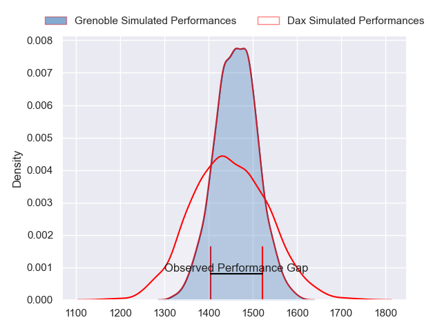
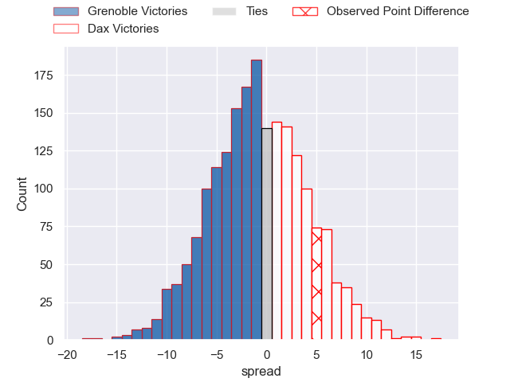
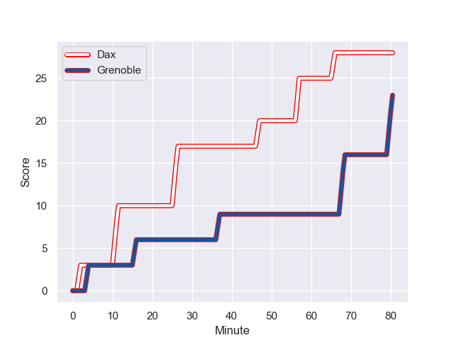
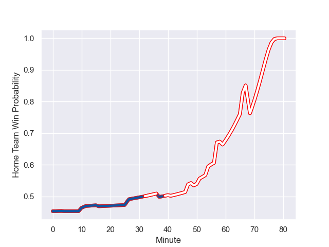

---  
layout: page  
title: Grenoble at Dax; 23-28  
date: 2023-09-01 18:00:00 -0500  
categories: match review  
---
# Grenoble at Dax; 23-28

# Club Level Predictions

The first set of predictions treats a club as the smallest object, as the club develops its members, organizes a gameplan, and deploys its players as needed for each match. This club model has a prediction of 0.485, which translates to predicting Grenoble to win by 0.5.

Each club has a rating and a rating deviation (simiar to a Glicko system), and expected performances can be generated. This allows for simulated matches and spreads like the ones below.
## Projected Performances

## Projected Spreads

## Projected Results

# Player Level Predictions - Version 1

Treating teams instead as an entity made up of the currently active players, I have ratings for each player in an altogether different system. These can be combined to form team ratings once teamsheets are announced, weighting starters a bit higher than the reserves. After the match is played, players can be weighted by their minutes on the field, allowing for an accurate measure of the team's composition. With these compiled team ratings, we can make predictions, measure inaccuracy, and update the individual player ratings.
## Prediction with Player Minutes: Grenoble by 4.2

Grenoble by 8.2 on a neutral field
## Prediction without Player Minutes: Grenoble by 2.5

Grenoble by 6.5 on a neutral pitch

## Scores over Time

## Win Probability over Time

There were 11 large changes in win probability in this match

|   Away Minutes | Away Player         |   Away elo |   Away Percentile |   Number |   Home Percentile |   Home elo | Home Player           |   Home Minutes |
|---------------:|:--------------------|-----------:|------------------:|---------:|------------------:|-----------:|:----------------------|---------------:|
|             49 | Luka Goginava       |      67.79 |  917935           |        1 |       1.00426e+06 |      83.63 | Louis Mary            |             51 |
|             80 | Bernabe Massa       |      82.53 |       1.01501e+06 |        2 |       1.01986e+06 |      70.45 | Maxime Delonca        |             51 |
|             41 | Siua Halanukonuka   |      77.51 |       1.01994e+06 |        3 |       1.01986e+06 |      66.73 | Nephi Leatigaga       |             51 |
|             10 | Thomas Lainault     |     109.93 |  854529           |        4 |       1.01988e+06 |      58.17 | Joshua Furno          |             80 |
|             56 | Brendon Nansen      |      70.53 |       1.01997e+06 |        5 |       1.01987e+06 |      71.68 | Matt Luamanu          |             51 |
|             80 | Victor Guillaumond  |      88.39 |  982708           |        6 |  600264           |      35.47 | Jean-Baptiste Barrère |             80 |
|             80 | Steeve Blanc-Mappaz |      70.11 |       1.01992e+06 |        7 |  966844           |      89.59 | Arnaud Aletti         |             59 |
|             80 | Antonin Berruyer    |      69.83 |       1.01996e+06 |        8 |  966759           |      84.71 | Brice Ferrer          |             80 |
|             65 | Barnabé Couilloud   |      72.07 |       1.01995e+06 |        9 |  929946           |      73.45 | Paul Ravier           |             54 |
|             80 | Romain Barthélémy   |      76.81 |       1.0199e+06  |       10 |  970026           |      76.08 | Hugo Cerisier         |             54 |
|             80 | Karim Qadiri        |      76.64 |       1.01993e+06 |       11 |  815702           |      45.76 | Maxime Oltmann        |             80 |
|             54 | Terence Hepetema    |      76.22 |       1.01996e+06 |       12 |       1.01987e+06 |      67.02 | Ilikena Bolakoro      |             80 |
|             80 | Romain Fusier       |      72.26 |  967640           |       13 |       1.02058e+06 |      70.82 | Bastien Daguerre      |             80 |
|             80 | Erwan Dridi         |      70.92 |       1.01994e+06 |       14 |  966692           |      77.94 | Théo Gatelier         |             80 |
|             58 | Hugo Trouilloud     |      70.42 |       1.00713e+06 |       15 |  977060           |      88.98 | Théo Duprat           |             58 |
|             70 | Georgi Javakhia     |      89.42 |  819666           |       16 |  790284           |      96.53 | Asa Faitotoa          |             29 |
|             39 | Regis Montagne      |      85.26 |  971649           |       17 |     nan           |      69.59 | Iban Hiriart-Urruty   |             29 |
|             31 | Zack Gauthier       |      90.32 |  995752           |       18 |  750236           |      66.39 | Jean-Baptiste Singer  |             29 |
|             22 | Geoffrey Cros       |      69.6  |       1.01993e+06 |       19 |  868361           |      83.61 | Thibaud Dréan         |             29 |
|             26 | Bautista Ezcurra    |      74.15 |     nan           |       20 |  966597           |      93.03 | Simon Garrouteigt     |             26 |
|             24 | Diego Pinheiro Ruiz |      73.97 |     nan           |       21 |  847145           |      96.7  | Romuald Séguy         |             26 |
|             15 | Max Clément         |      74.49 |     nan           |       22 |     nan           |      70.57 | Jope Naceava          |             22 |
|            nan | nan                 |     nan    |     nan           |       23 |  974857           |      44.17 | Théo Tremeau          |             21 |

# Player Level Predictions - Version 2

Treating teams instead as an entity made up of the currently active players, I have ratings for each player in an altogether different system. These can be combined to form team ratings once teamsheets are announced, weighting starters a bit higher than the reserves. After the match is played, players can be weighted by their minutes on the field, allowing for an accurate measure of the team's composition. With these compiled team ratings, we can make predictions, measure inaccuracy, and update the individual player ratings.
## Prediction with Player Minutes: Grenoble by 0.7

Grenoble by 5.2 on a neutral field
## Prediction without Player Minutes: Dax by 0.1

Grenoble by 4.4 on a neutral pitch

|   Away Minutes | Away Player         |   Away elo |   Away variance |   Number |   Home variance |   Home elo | Home Player           |   Home Minutes |
|---------------:|:--------------------|-----------:|----------------:|---------:|----------------:|-----------:|:----------------------|---------------:|
|             49 | Luka Goginava       |      53.28 |           49.79 |        1 |           49.74 |      52.32 | Louis Mary            |             51 |
|             80 | Bernabe Massa       |      53.91 |           49.94 |        2 |           49.85 |      39.73 | Maxime Delonca        |             51 |
|             41 | Siua Halanukonuka   |      46.89 |           49.92 |        3 |           49.75 |      36.27 | Nephi Leatigaga       |             51 |
|             10 | Thomas Lainault     |      59.64 |           49.62 |        4 |           49.58 |      28.95 | Joshua Furno          |             80 |
|             56 | Brendon Nansen      |      46    |           49.72 |        5 |           49.87 |      41.25 | Matt Luamanu          |             51 |
|             80 | Victor Guillaumond  |      42.41 |           49.97 |        6 |           49.65 |       4.09 | Jean-Baptiste Barrère |             80 |
|             80 | Steeve Blanc-Mappaz |      45.83 |           49.58 |        7 |           49.61 |      51.49 | Arnaud Aletti         |             59 |
|             80 | Antonin Berruyer    |      45.43 |           49.71 |        8 |           49.79 |      45.27 | Brice Ferrer          |             80 |
|             65 | Barnabé Couilloud   |      45.67 |           49.79 |        9 |           49.91 |      61.4  | Paul Ravier           |             54 |
|             80 | Romain Barthélémy   |      46.17 |           49.8  |       10 |           49.88 |      56.48 | Hugo Cerisier         |             54 |
|             80 | Karim Qadiri        |      47.28 |           49.79 |       11 |           49.79 |      -2.61 | Maxime Oltmann        |             80 |
|             54 | Terence Hepetema    |      47.02 |           49.88 |       12 |           49.79 |      36.36 | Ilikena Bolakoro      |             80 |
|             80 | Romain Fusier       |      39.67 |           49.9  |       13 |           49.96 |      45.13 | Bastien Daguerre      |             80 |
|             80 | Erwan Dridi         |      45.35 |           49.74 |       14 |           49.79 |      53.77 | Théo Gatelier         |             80 |
|             58 | Hugo Trouilloud     |      39.13 |           50    |       15 |           49.79 |      56.45 | Théo Duprat           |             58 |
|             70 | Georgi Javakhia     |      56.08 |           50    |       16 |           50    |      45.43 | Asa Faitotoa          |             29 |
|             39 | Regis Montagne      |      48.16 |           49.74 |       17 |           50    |      46.65 | Iban Hiriart-Urruty   |             29 |
|             31 | Zack Gauthier       |      63.9  |           49.62 |       18 |           49.71 |      12.5  | Jean-Baptiste Singer  |             29 |
|             22 | Geoffrey Cros       |      45.67 |           49.64 |       19 |           49.84 |      42.72 | Thibaud Dréan         |             29 |
|             26 | Bautista Ezcurra    |      46.65 |           50    |       20 |           50    |      58.58 | Simon Garrouteigt     |             26 |
|             24 | Diego Pinheiro Ruiz |      46.65 |           50    |       21 |           49.7  |      36.67 | Romuald Séguy         |             26 |
|             15 | Max Clément         |      46.5  |           49.98 |       22 |           49.86 |      40.32 | Jope Naceava          |             22 |
|            nan | nan                 |     nan    |          nan    |       23 |           49.97 |      34.22 | Théo Tremeau          |             21 |

