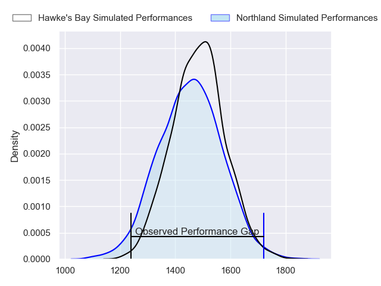
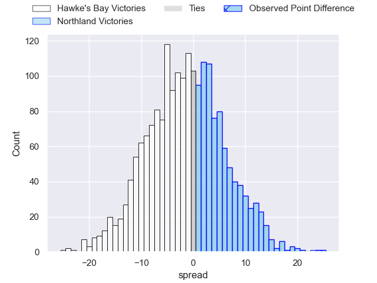
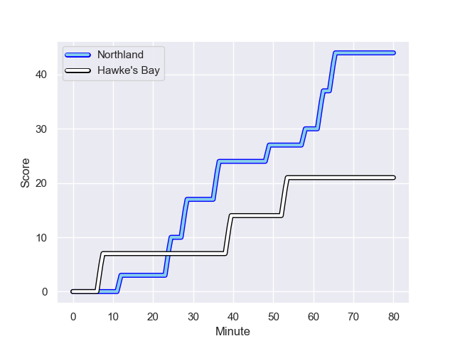
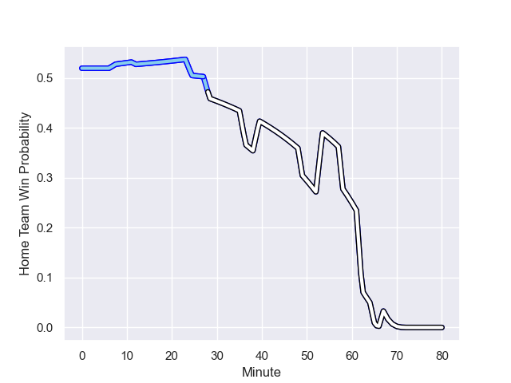

---  
layout: page  
title: Hawke's Bay at Northland; 21.0-44.0  
date: 2023-09-01 18:00:00 -0500  
categories: match review  
---
# Hawke's Bay at Northland; 21.0-44.0

# Club Level Predictions

The first set of predictions treats a club as the smallest object, as the club develops its members, organizes a gameplan, and deploys its players as needed for each match. This club model has a prediction of 0.447, which translates to predicting Hawke's Bay to win by 1.9.

Each club has a rating and a rating deviation (simiar to a Glicko system), and expected performances can be generated. This allows for simulated matches and spreads like the ones below.
## Projected Performances

## Projected Spreads

## Projected Results

# Player Level Predictions - Version 1

Treating teams instead as an entity made up of the currently active players, I have ratings for each player in an altogether different system. These can be combined to form team ratings once teamsheets are announced, weighting starters a bit higher than the reserves. After the match is played, players can be weighted by their minutes on the field, allowing for an accurate measure of the team's composition. With these compiled team ratings, we can make predictions, measure inaccuracy, and update the individual player ratings.
## Prediction with Player Minutes: Northland by 7.4

Northland by 3.4 on a neutral field
## Prediction without Player Minutes: Hawke's Bay by 0.3

Hawke's Bay by 4.3 on a neutral pitch

## Scores over Time

## Win Probability over Time

There were 11 large changes in win probability in this match

|   Away Minutes | Away Player         |   Away elo |   Away Percentile |   Number |   Home Percentile |   Home elo | Home Player         |   Home Minutes |
|---------------:|:--------------------|-----------:|------------------:|---------:|------------------:|-----------:|:--------------------|---------------:|
|             67 | Pouri Rakete-Stones |     105.59 |  895658           |        1 |            962387 |     116.63 | Rob Cobb            |             49 |
|             74 | Tyrone Thompson     |     101.22 |       1.00647e+06 |        2 |            706226 |     117.29 | Matt Moulds         |             67 |
|             67 | Joel Hintz          |      91.3  |  932567           |        3 |           1033852 |     101.96 | Remsy Lemisio       |             40 |
|             54 | Frank Lochore       |      94.52 |       1.03375e+06 |        4 |            906504 |      91.81 | Sam Caird           |             67 |
|             80 | Tom Parsons         |     120.33 |  667186           |        5 |            860604 |      92.31 | Liam Hallam-Eames   |             80 |
|             80 | Marino Mikaele-Tu'u |     137.44 |  844579           |        6 |           1034193 |      99.46 | Rory Woods          |             49 |
|             63 | Josh Kaifa          |     103.42 |  847188           |        7 |           1008326 |     103.64 | Jonah Mau'u         |             80 |
|             80 | Devan Flanders      |     129.43 |  932897           |        8 |           1004572 |      98.24 | Rob Rush            |             80 |
|             63 | Folau Fakatava      |      95.94 |  932789           |        9 |            803170 |      95.56 | Sam Nock            |             49 |
|             80 | Lincoln McClutchie  |      86.46 |  940353           |       10 |            962254 |     121.82 | Rivez Reihana       |             63 |
|             80 | Ollie Sapsford      |      93.68 |  962451           |       11 |           1006105 |     116.68 | Heremaia Murray     |             80 |
|             72 | Stacey Ili          |     109.42 |  807655           |       12 |            754194 |     147.59 | Jack Goodhue        |             73 |
|             67 | Nick Grigg          |     111.18 |  830611           |       13 |            843562 |      83.98 | Tamati Tua          |             80 |
|             80 | Paula Balekana      |     158.31 |  905231           |       14 |           1034346 |     106.98 | Tama Anderson       |             80 |
|             80 | Harry Godfrey       |     100.54 |       1.02401e+06 |       15 |            963031 |     127.5  | Joshua Moorby       |             80 |
|             26 | Geoff Cridge        |     106.16 |  762954           |       16 |            839748 |     281.4  | Nelson Rebolo       |             40 |
|             17 | Sam Wye             |     101.89 |     nan           |       17 |            894735 |     110.6  | Lisati Milo-Harris  |             31 |
|             17 | Patrick Tuifua      |     109    |       1.03394e+06 |       18 |            810955 |     104.75 | Matt Polwart-Matich |             31 |
|             13 | Kienan Higgins      |      95.19 |     nan           |       19 |            849697 |     120.67 | Jarred Adams        |             31 |
|             13 | Kianu Kereru-Symes  |      97.99 |  937944           |       20 |            703839 |      88.43 | Daniel Hawkins      |             17 |
|             13 | Bo Abra             |     175.36 |     nan           |       21 |            752574 |      90.39 | Jordan Olsen        |             13 |
|              8 | Lolagi Visinia      |      87.23 |  667423           |       22 |            803181 |      81.39 | Sean Sweetman       |             13 |
|              6 | Hisamitsu Shimada   |     309.32 |       1.02961e+06 |       23 |            407709 |      85.2  | Rene Ranger         |              7 |

# Player Level Predictions - Version 2

Treating teams instead as an entity made up of the currently active players, I have ratings for each player in an altogether different system. These can be combined to form team ratings once teamsheets are announced, weighting starters a bit higher than the reserves. After the match is played, players can be weighted by their minutes on the field, allowing for an accurate measure of the team's composition. With these compiled team ratings, we can make predictions, measure inaccuracy, and update the individual player ratings.
## Prediction with Player Minutes: Northland by 3.3

Hawke's Bay by 0.1 on a neutral field
## Prediction without Player Minutes: Northland by 2.9

Hawke's Bay by 0.5 on a neutral pitch

|   Away Minutes | Away Player         |   Away elo |   Away variance |   Number |   Home variance |   Home elo | Home Player         |   Home Minutes |
|---------------:|:--------------------|-----------:|----------------:|---------:|----------------:|-----------:|:--------------------|---------------:|
|             67 | Pouri Rakete-Stones |      47.81 |           49.37 |        1 |           49.57 |      47.08 | Rob Cobb            |             49 |
|             74 | Tyrone Thompson     |      38.21 |           49.48 |        2 |           49.42 |      41.66 | Matt Moulds         |             67 |
|             67 | Joel Hintz          |      68.2  |           48.54 |        3 |           49.44 |      48.83 | Remsy Lemisio       |             40 |
|             54 | Frank Lochore       |      48.49 |           49.34 |        4 |           49.16 |      -5.14 | Sam Caird           |             67 |
|             80 | Tom Parsons         |      47.82 |           49.3  |        5 |           49.37 |       5.21 | Liam Hallam-Eames   |             80 |
|             80 | Marino Mikaele-Tu'u |      23.7  |           49.57 |        6 |           49.97 |      46.5  | Rory Woods          |             49 |
|             63 | Josh Kaifa          |      52.39 |           49.37 |        7 |           49.22 |      50.5  | Jonah Mau'u         |             80 |
|             80 | Devan Flanders      |      54.1  |           49.21 |        8 |           49    |      34.09 | Rob Rush            |             80 |
|             63 | Folau Fakatava      |      44.2  |           49.45 |        9 |           49.91 |      56.71 | Sam Nock            |             49 |
|             80 | Lincoln McClutchie  |      42.55 |           49.05 |       10 |           49.26 |      44.65 | Rivez Reihana       |             63 |
|             80 | Ollie Sapsford      |      49.39 |           49.21 |       11 |           48.98 |      43.32 | Heremaia Murray     |             80 |
|             72 | Stacey Ili          |      74.4  |           48.39 |       12 |           49.39 |     104.91 | Jack Goodhue        |             73 |
|             67 | Nick Grigg          |      11.85 |           49.55 |       13 |           49.08 |      46.21 | Tamati Tua          |             80 |
|             80 | Paula Balekana      |      21.53 |           46.91 |       14 |           50    |      46.65 | Tama Anderson       |             80 |
|             80 | Harry Godfrey       |      37.23 |           49.27 |       15 |           49.37 |      59.55 | Joshua Moorby       |             80 |
|             26 | Geoff Cridge        |      44.35 |           49.6  |       16 |           50    |      54.21 | Nelson Rebolo       |             40 |
|             17 | Sam Wye             |      46.33 |           49.95 |       17 |           49.25 |      26.44 | Lisati Milo-Harris  |             31 |
|             17 | Patrick Tuifua      |      45.46 |           49.83 |       18 |           49.04 |      54.98 | Matt Polwart-Matich |             31 |
|             13 | Kienan Higgins      |      53.29 |           50    |       19 |           49.36 |      51.29 | Jarred Adams        |             31 |
|             13 | Kianu Kereru-Symes  |      61.09 |           48.7  |       20 |           49.63 |      30.08 | Daniel Hawkins      |             17 |
|             13 | Bo Abra             |      42.9  |           49.97 |       21 |           49.88 |      41.95 | Jordan Olsen        |             13 |
|              8 | Lolagi Visinia      |      35.78 |           49.71 |       22 |           49.76 |      15.56 | Sean Sweetman       |             13 |
|              6 | Hisamitsu Shimada   |      65.63 |           49.97 |       23 |           49.76 |      37.68 | Rene Ranger         |              7 |

