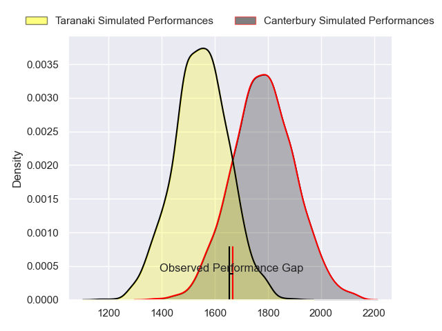
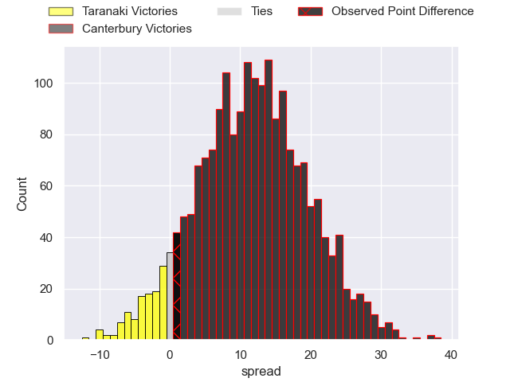
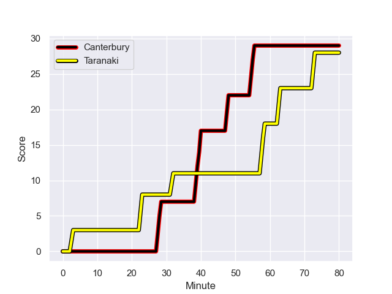
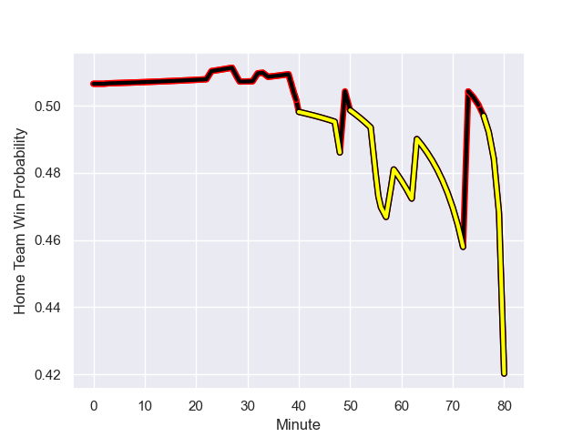

---  
layout: page  
title: Taranaki at Canterbury; 28.0-29.0  
date: 2023-09-02 18:00:00 -0500  
categories: match review  
---
# Taranaki at Canterbury; 28.0-29.0

# Club Level Predictions

The first set of predictions treats a club as the smallest object, as the club develops its members, organizes a gameplan, and deploys its players as needed for each match. This club model has a prediction of 0.784, which translates to predicting Canterbury to win by 11.7.

Each club has a rating and a rating deviation (simiar to a Glicko system), and expected performances can be generated. This allows for simulated matches and spreads like the ones below.
## Projected Performances

## Projected Spreads

## Projected Results

# Player Level Predictions - Version 1

Treating teams instead as an entity made up of the currently active players, I have ratings for each player in an altogether different system. These can be combined to form team ratings once teamsheets are announced, weighting starters a bit higher than the reserves. After the match is played, players can be weighted by their minutes on the field, allowing for an accurate measure of the team's composition. With these compiled team ratings, we can make predictions, measure inaccuracy, and update the individual player ratings.
## Prediction with Player Minutes: Canterbury by 5.1

Canterbury by 1.1 on a neutral field
## Prediction without Player Minutes: Canterbury by 3.5

Taranaki by 0.5 on a neutral pitch

## Scores over Time

## Win Probability over Time

There were 2 large changes in win probability in this match

|   Away Minutes | Away Player                   |   Away elo |   Away Percentile |   Number |   Home Percentile |   Home elo | Home Player       |   Home Minutes |
|---------------:|:------------------------------|-----------:|------------------:|---------:|------------------:|-----------:|:------------------|---------------:|
|             60 | Jared Proffit                 |      78.07 |  807451           |        1 |  584345           |      97.44 | Joe Moody         |             59 |
|             50 | Bradley Slater                |     121.09 |  912940           |        2 |  590650           |     116.1  | Ben Funnell       |             34 |
|             50 | Reuben O'Neill                |      93.42 |  801681           |        3 |       1.03361e+06 |     106.22 | Seb Calder        |             49 |
|             56 | Jesse Parete                  |      86.4  |  761405           |        4 |  497458           |      80.84 | Luke Romano       |             49 |
|             40 | Tom Franklin                  |     137.05 |  593746           |        5 |  994813           |     117.24 | Sam Darry         |             80 |
|             80 | Pita Gus Sowakula             |     211.04 |  894789           |        6 |  845243           |     128.04 | Billy Harmon      |             58 |
|             80 | Tom Florence                  |     104.69 |  907716           |        7 |  914606           |     146.32 | Tom Christie      |             80 |
|             80 | Kaylum Boshier                |      85.08 |  962821           |        8 |  962462           |     139.73 | Cullen Grace      |             80 |
|             60 | Adam Lennox                   |      90.2  |       1.02374e+06 |        9 |  716793           |      98.5  | Mitchell Drummond |             49 |
|             80 | Jayson Potroz                 |     107.9  |  942468           |       10 |       1.01072e+06 |      98.24 | Alex Harford      |             77 |
|             50 | Kini Naholo                   |     143.25 |  979047           |       11 |       1.0056e+06  |      95.7  | Isaiah Punivai    |             80 |
|             60 | Teihorangi Walden             |      96.76 |  711469           |       12 |  963493           |      95.7  | Rameka Poihipi    |             80 |
|             80 | Daniel Rona                   |     118.11 |       1.0043e+06  |       13 |  413346           |     135.77 | Ryan Crotty       |             60 |
|             80 | Jacob Ratumaitavuki-Kneepkens |     156.77 |  999620           |       14 |  962594           |     113.28 | Dallas McLeod     |             80 |
|             80 | Stephen Perofeta              |     122.91 |  844140           |       15 |  993265           |     128.97 | Chay Fihaki       |             80 |
|             20 | Donald Brighouse              |      76.6  |  750225           |       16 |  735622           |     121.57 | Dan Lienert-Brown |             21 |
|             30 | Michael Bent                  |     113.8  |  496435           |       17 |  845339           |     115.71 | Oli Jager         |             31 |
|             30 | Ricky Riccitelli              |      99.22 |  803592           |       18 |       1.02183e+06 |     127.71 | George Bell       |             46 |
|             24 | Heiden Bedwell-Curtis         |      69.81 |  701760           |       19 |       1.00566e+06 |     122.19 | Zach Gallagher    |             31 |
|             40 | Fiti Sa                       |     108.43 |     nan           |       20 |     nan           |     150.55 | Reed Prinsep      |             22 |
|             20 | Liam Blyde                    |     117.23 |  963641           |       21 |  466730           |     110.51 | Willi Heinz       |             31 |
|             30 | Vereniki Tikoisolomone        |     106.33 |       1.00427e+06 |       22 |     nan           |     109.67 | Jone Rova         |              3 |
|             20 | Matt McKenzie                 |      86.54 |  962854           |       23 |  843772           |     104.29 | Solomon Alaimalo  |             20 |

# Player Level Predictions - Version 2

Treating teams instead as an entity made up of the currently active players, I have ratings for each player in an altogether different system. These can be combined to form team ratings once teamsheets are announced, weighting starters a bit higher than the reserves. After the match is played, players can be weighted by their minutes on the field, allowing for an accurate measure of the team's composition. With these compiled team ratings, we can make predictions, measure inaccuracy, and update the individual player ratings.
## Prediction with Player Minutes: Canterbury by 8.0

Canterbury by 4.6 on a neutral field
## Prediction without Player Minutes: Canterbury by 9.4

Canterbury by 6.0 on a neutral pitch

|   Away Minutes | Away Player                   |   Away elo |   Away variance |   Number |   Home variance |   Home elo | Home Player       |   Home Minutes |
|---------------:|:------------------------------|-----------:|----------------:|---------:|----------------:|-----------:|:------------------|---------------:|
|             60 | Jared Proffit                 |      38.57 |           49.29 |        1 |           49.86 |      69.55 | Joe Moody         |             59 |
|             50 | Bradley Slater                |      56.93 |           49.54 |        2 |           49.63 |      84.56 | Ben Funnell       |             34 |
|             50 | Reuben O'Neill                |      39.44 |           49.52 |        3 |           49.51 |      45.19 | Seb Calder        |             49 |
|             56 | Jesse Parete                  |      24.73 |           49.28 |        4 |           49.76 |      59.89 | Luke Romano       |             49 |
|             40 | Tom Franklin                  |      89.37 |           49.47 |        5 |           49.94 |      54.93 | Sam Darry         |             80 |
|             80 | Pita Gus Sowakula             |      84.12 |           49.16 |        6 |           49.4  |      77.26 | Billy Harmon      |             58 |
|             80 | Tom Florence                  |      63.79 |           49.17 |        7 |           49.62 |      91.37 | Tom Christie      |             80 |
|             80 | Kaylum Boshier                |      44.06 |           49.08 |        8 |           49.71 |      86.95 | Cullen Grace      |             80 |
|             60 | Adam Lennox                   |      40.23 |           49.55 |        9 |           49.7  |      93.83 | Mitchell Drummond |             49 |
|             80 | Jayson Potroz                 |     100.68 |           46.93 |       10 |           49.91 |      52.93 | Alex Harford      |             77 |
|             50 | Kini Naholo                   |      85.4  |           49.25 |       11 |           50    |      46.06 | Isaiah Punivai    |             80 |
|             60 | Teihorangi Walden             |      16.18 |           49.31 |       12 |           49.47 |      67.62 | Rameka Poihipi    |             80 |
|             80 | Daniel Rona                   |      67.31 |           49.86 |       13 |           49.74 |     119.61 | Ryan Crotty       |             60 |
|             80 | Jacob Ratumaitavuki-Kneepkens |     101.3  |           48.99 |       14 |           49.57 |      70.59 | Dallas McLeod     |             80 |
|             80 | Stephen Perofeta              |     105.89 |           49.24 |       15 |           49.4  |      67.48 | Chay Fihaki       |             80 |
|             20 | Donald Brighouse              |       6.77 |           49.96 |       16 |           49.68 |      46.61 | Dan Lienert-Brown |             21 |
|             30 | Michael Bent                  |     102.84 |           49.68 |       17 |           49.92 |      82.95 | Oli Jager         |             31 |
|             30 | Ricky Riccitelli              |      50.09 |           49.37 |       18 |           49.85 |      60.5  | George Bell       |             46 |
|             24 | Heiden Bedwell-Curtis         |      29.94 |           49.82 |       19 |           50    |      43.66 | Zach Gallagher    |             31 |
|             40 | Fiti Sa                       |      47.58 |           49.96 |       20 |           50    |      85.53 | Reed Prinsep      |             22 |
|             20 | Liam Blyde                    |      66.2  |           49.96 |       21 |           49.7  |      92.31 | Willi Heinz       |             31 |
|             30 | Vereniki Tikoisolomone        |      68.97 |           49.66 |       22 |           49.98 |      46.47 | Jone Rova         |              3 |
|             20 | Matt McKenzie                 |      44.63 |           49.55 |       23 |           49.97 |      89.75 | Solomon Alaimalo  |             20 |

