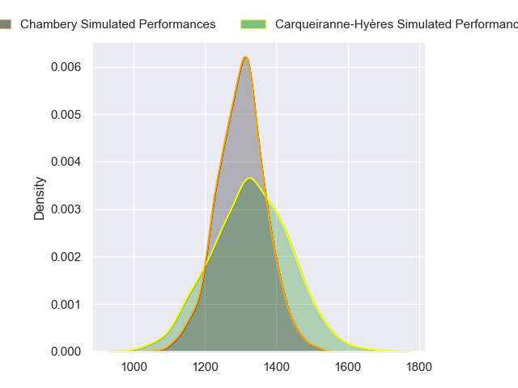
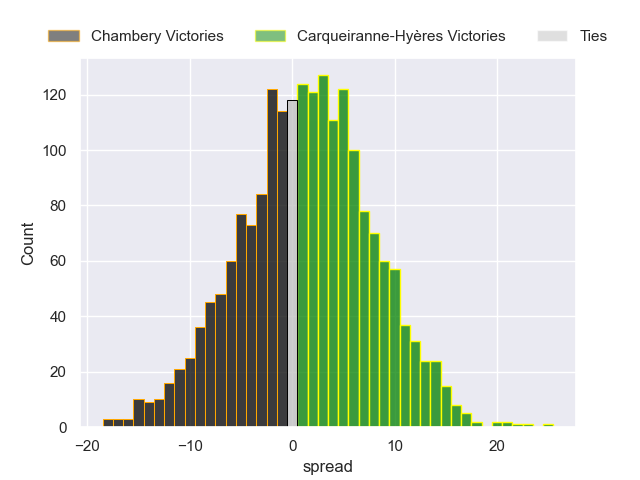

---  
layout: page  
title: Narbonne at Massy; 27.0-23.0  
date: 2023-09-02 18:00:00 -0500  
categories: match review  
---
# Narbonne at Massy; 27.0-23.0

# Club Level Predictions

The first set of predictions treats a club as the smallest object, as the club develops its members, organizes a gameplan, and deploys its players as needed for each match. This club model has a prediction of 0.538, which translates to predicting Carqueiranne-Hyères to win by 1.4.

Each club has a rating and a rating deviation (simiar to a Glicko system), and expected performances can be generated. This allows for simulated matches and spreads like the ones below.
## Projected Performances

## Projected Spreads

## Projected Results

