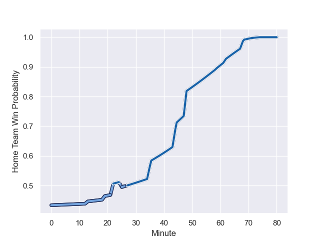

---  
layout: page  
title: Bayonne at Castres Olympique; 0.0-37.0  
date: 2023-09-02 18:00:00 -0500  
categories: match review  
---
# Bayonne at Castres Olympique; 0.0-37.0

# Club Level Predictions

The first set of predictions treats a club as the smallest object, as the club develops its members, organizes a gameplan, and deploys its players as needed for each match. This club model has a prediction of 0.665, which translates to predicting Castres Olympique to win by 6.0.

Each club has a rating and a rating deviation (simiar to a Glicko system), and expected performances can be generated. This allows for simulated matches and spreads like the ones below.
## Projected Performances

## Projected Spreads

## Projected Results

# Player Level Predictions - Version 2

Treating teams instead as an entity made up of the currently active players, I have ratings for each player in an altogether different system. These can be combined to form team ratings once teamsheets are announced, weighting starters a bit higher than the reserves. After the match is played, players can be weighted by their minutes on the field, allowing for an accurate measure of the team's composition. With these compiled team ratings, we can make predictions, measure inaccuracy, and update the individual player ratings.
## Prediction with Player Minutes: Bayonne by 2.9

Bayonne by 7.8 on a neutral field
## Prediction without Player Minutes: Bayonne by 3.5

Bayonne by 8.4 on a neutral pitch

## Scores over Time

## Win Probability over Time

There were 5 large changes in win probability in this match

|   Away Minutes | Away Player             |   Away elo |   Number |   Home elo | Home Player        |   Home Minutes |
|---------------:|:------------------------|-----------:|---------:|-----------:|:-------------------|---------------:|
|             45 | Quentin Bethune         |      57.38 |        1 |      52.38 | Quentin Walcker    |             48 |
|             47 | Facundo Bosch           |      70.94 |        2 |      69.52 | Gaetan Barlot      |             48 |
|             47 | Tevita Tatafu           |      43.66 |        3 |      51.23 | Wilfrid Hounkpatin |             48 |
|             45 | Denis Marchois          |     104.02 |        4 |      68.04 | Leone Nakarawa     |             69 |
|             80 | Lucas Paulos            |      68.32 |        5 |      60.63 | Tom Staniforth     |             80 |
|             80 | Remi Bourdeau           |      89.33 |        6 |      45.67 | Mathieu Babillot   |             68 |
|             80 | Arthur Iturria          |      90.04 |        7 |      42.9  | Baptiste Delaporte |             59 |
|             22 | Uzair Cassiem           |      73.46 |        8 |      74.5  | Tyler Ardron       |             80 |
|             42 | Maxime Machenaud        |      69.66 |        9 |       5.01 | Jeremy Fernandez   |             61 |
|             62 | Camille Lopez           |      99.57 |       10 |      41.63 | Pierre Popelin     |             80 |
|             80 | Arnaud Erbinartegaray   |      49.61 |       11 |      59.27 | Nathanael Hulleu   |             80 |
|             36 | Eneriko Buliruarua      |      14.43 |       12 |      47.9  | Adrea Cocagi       |             80 |
|             80 | Peyo Muscarditz         |      78.42 |       13 |      20.82 | Adrien Seguret     |             80 |
|             80 | Aurelien Callandret     |      64.93 |       14 |      80.79 | Filipo Nakosi      |             25 |
|             80 | Cheikh Tiberghien       |      32.33 |       15 |      52.78 | Julien Dumora      |             80 |
|             58 | Pierre Huguet           |      27.4  |       16 |      41.01 | Louis Le Brun      |             55 |
|             44 | Remy Baget              |      73.51 |       17 |      69.27 | Antoine Tichit     |             32 |
|             38 | Guillaume Rouet Piffard |      63.08 |       18 |      32.68 | Matt Tierney       |             32 |
|             35 | Swan Cormenier          |      48.89 |       19 |      37.76 | Loris Zarantonello |             32 |
|             35 | Thomas Ceyte            |      39.85 |       20 |      50.91 | Abraham Papali'i   |             21 |
|             33 | Vincent Giudicelli      |      28.02 |       21 |      47.24 | Gauthier Doubrere  |             19 |
|             33 | Pieter Scholtz          |      12.5  |       22 |      42.51 | Baptiste Cope      |             12 |
|             18 | Thomas Dolhagaray       |      35.22 |       23 |       7.6  | Gauthier Maravat   |             11 |

