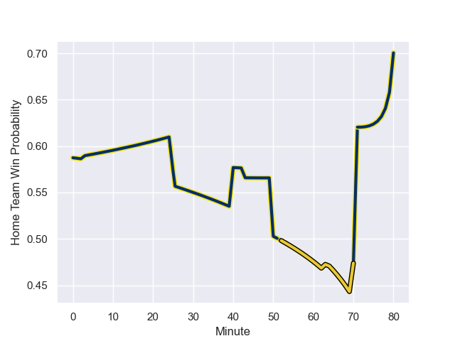

---  
layout: page  
title: La Rochelle at Clermont Auvergne; 10.0-11.0  
date: 2023-09-02 18:00:00 -0500  
categories: match review  
---
# La Rochelle at Clermont Auvergne; 10.0-11.0

# Club Level Predictions

The first set of predictions treats a club as the smallest object, as the club develops its members, organizes a gameplan, and deploys its players as needed for each match. This club model has a prediction of 0.447, which translates to predicting La Rochelle to win by 1.9.

Each club has a rating and a rating deviation (simiar to a Glicko system), and expected performances can be generated. This allows for simulated matches and spreads like the ones below.
## Projected Performances

## Projected Spreads

## Projected Results

# Player Level Predictions - Version 2

Treating teams instead as an entity made up of the currently active players, I have ratings for each player in an altogether different system. These can be combined to form team ratings once teamsheets are announced, weighting starters a bit higher than the reserves. After the match is played, players can be weighted by their minutes on the field, allowing for an accurate measure of the team's composition. With these compiled team ratings, we can make predictions, measure inaccuracy, and update the individual player ratings.
## Prediction with Player Minutes: Clermont Auvergne by 3.9

Clermont Auvergne by 1.0 on a neutral field
## Prediction without Player Minutes: Clermont Auvergne by 4.9

Clermont Auvergne by 0.1 on a neutral pitch

## Scores over Time

## Win Probability over Time

There were 6 large changes in win probability in this match

|   Away Minutes | Away Player           |   Away elo |   Number |   Home elo | Home Player          |   Home Minutes |
|---------------:|:----------------------|-----------:|---------:|-----------:|:---------------------|---------------:|
|             54 | Thierry Paiva         |      60.06 |        1 |      62.49 | Etienne Falgoux      |             43 |
|             67 | Quentin Lespiaucq     |      53.91 |        2 |      84.63 | Folau Fainga'a       |             50 |
|             54 | Aleksandre Kuntelia   |      38.93 |        3 |      66.55 | Rabah Slimani        |             43 |
|             80 | Thomas Lavault        |      72.88 |        4 |      56.34 | Thibaud Lanen        |             80 |
|             74 | Remi Picquette        |      50.07 |        5 |      96.74 | Rob Simmons          |             80 |
|             80 | Ultan Dillane         |      68.44 |        6 |      66.84 | Lucas Dessaigne      |             80 |
|             54 | Matthias Haddad       |      42.93 |        7 |      90.05 | Peceli Yato Senibitu |             64 |
|             80 | Judicael Cancoriet    |      39.26 |        8 |      57.53 | Caleb Timu           |             80 |
|             70 | Tawera Kerr-Barlow    |     118.52 |        9 |      82.47 | Sebastien Bezy       |             73 |
|             80 | Ihaia West            |      37    |       10 |      92.76 | Benjamin Urdapilleta |             80 |
|             80 | Dillyn Leyds          |     104.16 |       11 |      48.9  | Joris Jurand         |             80 |
|             80 | Jules Favre           |      71.84 |       12 |      46.65 | Leon Darricarrere    |             63 |
|             80 | Jack Nowell           |     104.01 |       13 |      58.06 | Julien Heriteau      |             80 |
|             70 | Teddy Thomas          |      94.65 |       14 |      77.09 | Bautista Delguy      |             80 |
|             80 | Brice Dulin           |     122.94 |       15 |      75.14 | Alex Newsome         |             80 |
|             26 | Georges-Henri Colombe |      24.87 |       16 |      49.63 | Daniel Bibi Biziwu   |             37 |
|             26 | Archer Holz           |      39.64 |       17 |      61.74 | Cristian Ojovan      |             37 |
|             26 | Oscar Jegou           |      42.47 |       18 |      37.6  | Etienne Fourcade     |             30 |
|             13 | Billy Pollard         |      49.93 |       19 |      69    | Anthony Belleau      |             17 |
|             10 | Teddy Iribaren        |      64.79 |       20 |      52.85 | Killian Tixeront     |             16 |
|             10 | Nathan Bollengier     |      45.16 |       21 |      48.76 | Enzo Sanga           |              7 |
|              6 | Thomas Ployet         |      44.49 |       22 |     nan    | nan                  |            nan |

