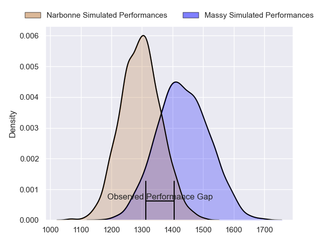
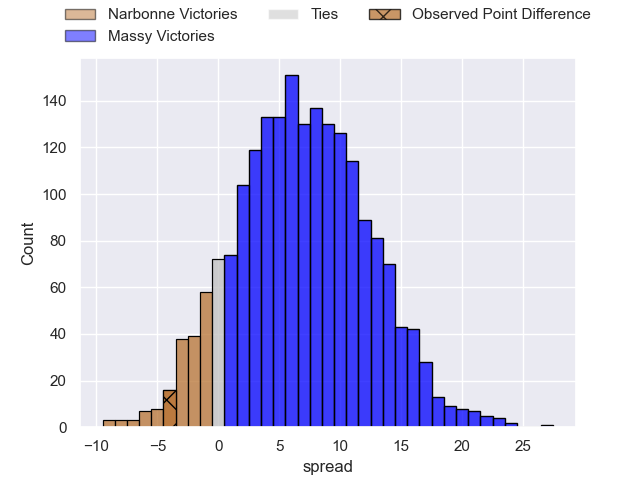
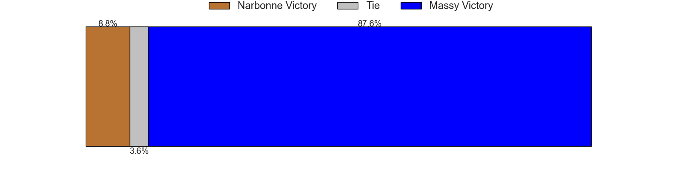
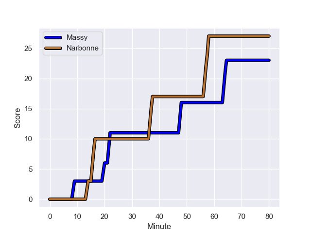
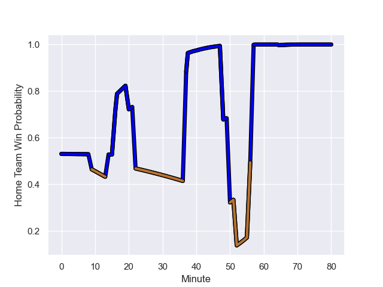

---  
layout: page  
title: Narbonne at Massy; 27.0-23.0  
date: 2023-09-02 18:00:00 -0500  
categories: match review  
---
# Narbonne at Massy; 27.0-23.0

# Club Level Predictions

The first set of predictions treats a club as the smallest object, as the club develops its members, organizes a gameplan, and deploys its players as needed for each match. This club model has a prediction of 0.682, which translates to predicting Massy to win by 6.8.

Each club has a rating and a rating deviation (simiar to a Glicko system), and expected performances can be generated. This allows for simulated matches and spreads like the ones below.
## Projected Performances

## Projected Spreads

## Projected Results

# Player Level Predictions - Version 2

Treating teams instead as an entity made up of the currently active players, I have ratings for each player in an altogether different system. These can be combined to form team ratings once teamsheets are announced, weighting starters a bit higher than the reserves. After the match is played, players can be weighted by their minutes on the field, allowing for an accurate measure of the team's composition. With these compiled team ratings, we can make predictions, measure inaccuracy, and update the individual player ratings.
## Prediction with Player Minutes: Massy by 1.3

Narbonne by 2.3 on a neutral field
## Prediction without Player Minutes: Narbonne by 0.0

Narbonne by 3.7 on a neutral pitch

## Scores over Time

## Win Probability over Time

There were 13 large changes in win probability in this match

|   Away Minutes | Away Player            |   Away elo |   Number |   Home elo | Home Player              |   Home Minutes |
|---------------:|:-----------------------|-----------:|---------:|-----------:|:-------------------------|---------------:|
|             40 | Geoffrey Moise         |      34.96 |        1 |       4.3  | Fernandez Correa         |             56 |
|             50 | Clément Esteriola      |      30.99 |        2 |      69.35 | Pierre Trassoudaine      |             66 |
|             56 | Levi Tikoipau          |      47.13 |        3 |      40.59 | Tijde Visser             |             56 |
|             80 | Bill Caffo             |      38.57 |        4 |      60.25 | Saba Pesvianidze         |             80 |
|             56 | Dennis Visser          |      30.97 |        5 |      14.25 | Koen Bloemen             |             50 |
|             80 | Thibault Clauzade      |      49.68 |        6 |      44.75 | Hugo Boutin              |             50 |
|             50 | Baptiste Abescat-Leroy |      41.04 |        7 |      47.01 | Marius Ruyffelaere       |             80 |
|             80 | Charles Malet          |      18.78 |        8 |       1.25 | Abongile Nonkontwana     |             80 |
|             50 | Josh Valentine         |      78.52 |        9 |      27.85 | Benjamin Prier           |             56 |
|             75 | Gilles Bosch           |       3.57 |       10 |      32.03 | Tom Deleuze              |             80 |
|             80 | Sébastien Giorgis      |      26.68 |       11 |      30.41 | Yanis Dit Robaglia       |             80 |
|             52 | Peter Betham           |     112.61 |       12 |      47.55 | Victorien Jacomme        |             80 |
|             80 | Pierre Nueno           |      51.52 |       13 |      37.94 | Tom Cusson               |             66 |
|             80 | Pierre-Hugo Ducom      |      39.64 |       14 |      65.11 | Alex Preira              |             80 |
|             80 | Paul Auradou           |      50.03 |       15 |      40.54 | Giorgi Gogoladze         |             80 |
|             40 | Sylvain Abadie         |      33.96 |       16 |      44.26 | Robin Poipy              |             24 |
|             30 | Christophe David       |      53.23 |       17 |      44.16 | Pierre-Alexandre Duclieu |             14 |
|             24 | Théo Castinel          |      52.06 |       18 |      46.08 | Nicolas Ferrer           |             24 |
|             24 | Mohamed Kbaier         |      41.16 |       19 |      46.6  | Lilian Rousset           |             30 |
|             30 | Luke Nakobukobua       |      61.69 |       20 |      38.65 | Tony Tissot              |             30 |
|             30 | Pablo Barbaste         |      46.05 |       21 |      23.55 | Lucas Rubio              |             24 |
|              5 | Tom Chauvet            |      46.27 |       22 |      47.46 | Arthur Seigneuret        |             14 |
|             28 | Théo Mias              |      33.26 |       23 |     nan    | nan                      |            nan |

