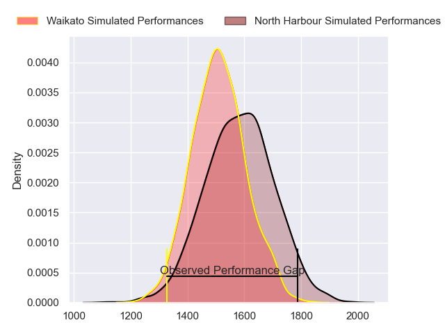
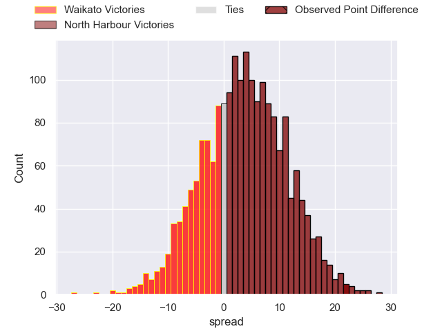
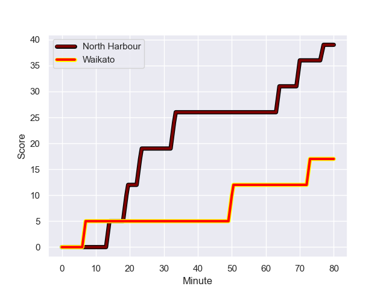
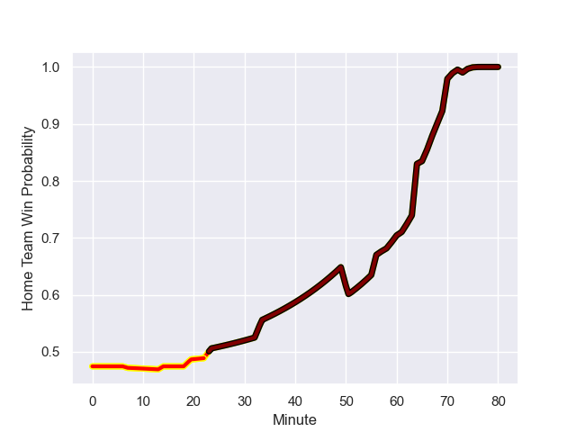

---  
layout: page  
title: Waikato at North Harbour; 17-39  
date: 2023-09-02 18:00:00 -0500  
categories: match review  
---
# Waikato at North Harbour; 17-39

# Club Level Predictions

The first set of predictions treats a club as the smallest object, as the club develops its members, organizes a gameplan, and deploys its players as needed for each match. This club model has a prediction of 0.6, which translates to predicting North Harbour to win by 3.7.

Each club has a rating and a rating deviation (simiar to a Glicko system), and expected performances can be generated. This allows for simulated matches and spreads like the ones below.
## Projected Performances

## Projected Spreads

## Projected Results

# Player Level Predictions - Version 1

Treating teams instead as an entity made up of the currently active players, I have ratings for each player in an altogether different system. These can be combined to form team ratings once teamsheets are announced, weighting starters a bit higher than the reserves. After the match is played, players can be weighted by their minutes on the field, allowing for an accurate measure of the team's composition. With these compiled team ratings, we can make predictions, measure inaccuracy, and update the individual player ratings.
## Prediction with Player Minutes: Waikato by 0.4

Waikato by 4.4 on a neutral field
## Prediction without Player Minutes: North Harbour by 0.1

Waikato by 3.9 on a neutral pitch

## Scores over Time

## Win Probability over Time

There were 4 large changes in win probability in this match

|   Away Minutes | Away Player                  |   Away elo |   Away Percentile |   Number |   Home Percentile |   Home elo | Home Player             |   Home Minutes |
|---------------:|:-----------------------------|-----------:|------------------:|---------:|------------------:|-----------:|:------------------------|---------------:|
|             56 | Oliver Norris                |      79.06 |       1.01916e+06 |        1 |       1.01672e+06 |      65.45 | Nic Mayhew              |             51 |
|             48 | Pita Alemania Jr Anae-Ah Sue |      73.66 |       1.01916e+06 |        2 |       1.01758e+06 |      77.13 | Shilo Klein             |             61 |
|             58 | George Dyer                  |      75.45 |  988657           |        3 |       1.0185e+06  |      73.37 | Tevita Mafileo          |             66 |
|             80 | James Tucker                 |      89.09 |  786010           |        4 |  899099           |     114.63 | Ben Grant               |             65 |
|             71 | Hamilton Burr                |      77.29 |       1.01921e+06 |        5 |       1.01946e+06 |      68.64 | Moni Ngakuru            |             80 |
|             80 | Malachi Wrampling-Alec       |      75.88 |       1.01913e+06 |        6 |       1.0185e+06  |      75.33 | Tamarau McGahan         |             80 |
|             56 | Jack Lam                     |      78.65 |       1.01936e+06 |        7 |       1.01859e+06 |      69.32 | Jed Melvin              |             61 |
|             80 | Simon Parker                 |      76.11 |       1.01911e+06 |        8 |       1.01862e+06 |      71.77 | Cameron Suafoa          |             80 |
|             57 | Cortez Lee Ratima            |      71.61 |       1.01923e+06 |        9 |       1.01859e+06 |      71.15 | Jamie Booth             |             61 |
|             70 | Taha Kemara                  |      77.74 |       1.01914e+06 |       10 |       1.01854e+06 |      72.93 | Oscar Koller            |             80 |
|             80 | Daniel Sinkinson             |      92.83 |       1.01725e+06 |       11 |       1.01945e+06 |      62.4  | Danyon Morgan-Puterangi |             67 |
|             61 | Austin Anderson              |      73.23 |       1.01938e+06 |       12 |       1.0186e+06  |      68.81 | Henry Taefu             |             80 |
|             80 | Mason Tupaea                 |      73.72 |       1.01915e+06 |       13 |       1.01851e+06 |      78.36 | Tom Barham              |             66 |
|             80 | Tepaea Cook-Savage           |      74.72 |       1.01918e+06 |       14 |       1.01863e+06 |      70.51 | Kade Banks              |             80 |
|             80 | Liam Coombes-Fabling         |      75.79 |       1.01937e+06 |       15 |  785734           |      78.86 | Shaun Stevenson         |             80 |
|             24 | Joe Johnston                 |      31.24 |  979267           |       16 |     nan           |      71.16 | Sione Mafileo           |             14 |
|             22 | Solomone Tukuafu             |      85.46 |       1.0191e+06  |       17 |       1.01676e+06 |      64.46 | Tevita Langi            |             29 |
|             32 | Caleb Ralph                  |      73.72 |     nan           |       18 |     nan           |      70.13 | Ray Niuia               |             19 |
|              9 | Xavier Saifoloi              |      68.61 |       1.01951e+06 |       19 |       1.01852e+06 |      70.18 | Maetaki He Lotu Inisi   |             19 |
|             24 | Colin Ayden Johnstone        |      74.82 |       1.01923e+06 |       20 |     nan           |      71.63 | Cameron Christie        |             15 |
|             23 | Xavier Roe                   |      78.34 |       1.01919e+06 |       21 |     nan           |      69.87 | Siaosi Nginingini       |             19 |
|             10 | Aaron Cruden                 |      68.73 |     nan           |       22 |       1.01862e+06 |      78.24 | Alapati Leiua           |             14 |
|             19 | Tana Tuhakaraina             |      80.15 |       1.01918e+06 |       23 |     nan           |      69.71 | Sofai Maka              |             13 |

# Player Level Predictions - Version 2

Treating teams instead as an entity made up of the currently active players, I have ratings for each player in an altogether different system. These can be combined to form team ratings once teamsheets are announced, weighting starters a bit higher than the reserves. After the match is played, players can be weighted by their minutes on the field, allowing for an accurate measure of the team's composition. With these compiled team ratings, we can make predictions, measure inaccuracy, and update the individual player ratings.
## Prediction with Player Minutes: Waikato by 0.5

Waikato by 3.8 on a neutral field
## Prediction without Player Minutes: Waikato by 0.6

Waikato by 4.0 on a neutral pitch

|   Away Minutes | Away Player                  |   Away elo |   Away variance |   Number |   Home variance |   Home elo | Home Player             |   Home Minutes |
|---------------:|:-----------------------------|-----------:|----------------:|---------:|----------------:|-----------:|:------------------------|---------------:|
|             56 | Oliver Norris                |      49.93 |           49.3  |        1 |           49.6  |      40.86 | Nic Mayhew              |             51 |
|             48 | Pita Alemania Jr Anae-Ah Sue |      50.22 |           49.39 |        2 |           49.31 |      38.42 | Shilo Klein             |             61 |
|             58 | George Dyer                  |      60.91 |           49.35 |        3 |           49.31 |      38.85 | Tevita Mafileo          |             66 |
|             80 | James Tucker                 |      70.13 |           49.18 |        4 |           47.34 |      71.17 | Ben Grant               |             65 |
|             71 | Hamilton Burr                |      54.89 |           49.11 |        5 |           49.66 |      40.22 | Moni Ngakuru            |             80 |
|             80 | Malachi Wrampling-Alec       |      51.82 |           49.57 |        6 |           49.35 |      37.88 | Tamarau McGahan         |             80 |
|             56 | Jack Lam                     |      50.96 |           49.84 |        7 |           49.4  |      39.7  | Jed Melvin              |             61 |
|             80 | Simon Parker                 |      50.78 |           49.11 |        8 |           49.23 |      37.85 | Cameron Suafoa          |             80 |
|             57 | Cortez Lee Ratima            |      49.09 |           49.42 |        9 |           49.29 |      39.33 | Jamie Booth             |             61 |
|             70 | Taha Kemara                  |      47.7  |           49.14 |       10 |           49.17 |      37.68 | Oscar Koller            |             80 |
|             80 | Daniel Sinkinson             |      50.55 |           49.24 |       11 |           49.51 |      38.12 | Danyon Morgan-Puterangi |             67 |
|             61 | Austin Anderson              |      44.23 |           49.72 |       12 |           49.23 |      38.14 | Henry Taefu             |             80 |
|             80 | Mason Tupaea                 |      46.07 |           49.75 |       13 |           49.29 |      40.44 | Tom Barham              |             66 |
|             80 | Tepaea Cook-Savage           |      54.71 |           49.28 |       14 |           49.17 |      37.68 | Kade Banks              |             80 |
|             80 | Liam Coombes-Fabling         |      47.11 |           49.19 |       15 |           49.53 |      82.64 | Shaun Stevenson         |             80 |
|             24 | Joe Johnston                 |     -18.98 |           48.34 |       16 |           49.85 |      45.41 | Sione Mafileo           |             14 |
|             22 | Solomone Tukuafu             |      48.62 |           49.65 |       17 |           49.56 |      43.32 | Tevita Langi            |             29 |
|             32 | Caleb Ralph                  |      46    |           49.92 |       18 |           49.93 |      46.45 | Ray Niuia               |             19 |
|              9 | Xavier Saifoloi              |      43.56 |           49.66 |       19 |           49.41 |      41.07 | Maetaki He Lotu Inisi   |             19 |
|             24 | Colin Ayden Johnstone        |      50.98 |           49.81 |       20 |           49.94 |      44.48 | Cameron Christie        |             15 |
|             23 | Xavier Roe                   |      48.79 |           49.58 |       21 |           50    |      46.65 | Siaosi Nginingini       |             19 |
|             10 | Aaron Cruden                 |      48.19 |           49.94 |       22 |           49.46 |      42.78 | Alapati Leiua           |             14 |
|             19 | Tana Tuhakaraina             |      51.25 |           49.57 |       23 |           50    |      46.65 | Sofai Maka              |             13 |

