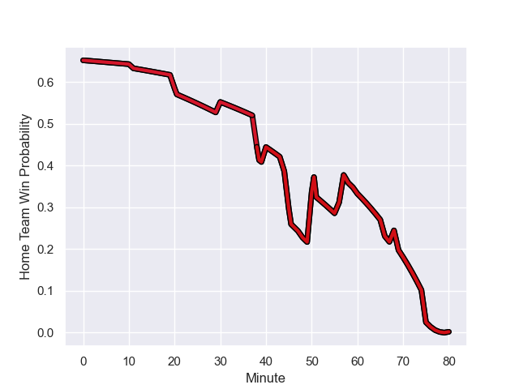

---  
layout: page  
title: Stade Toulousain at Oyonnax; 27.0-21.0  
date: 2023-09-02 18:00:00 -0500  
categories: match review  
---
# Stade Toulousain at Oyonnax; 27.0-21.0

# Club Level Predictions

The first set of predictions treats a club as the smallest object, as the club develops its members, organizes a gameplan, and deploys its players as needed for each match. This club model has a prediction of 0.396, which translates to predicting Stade Toulousain to win by 3.7.

Each club has a rating and a rating deviation (simiar to a Glicko system), and expected performances can be generated. This allows for simulated matches and spreads like the ones below.
## Projected Performances

## Projected Spreads

## Projected Results

# Player Level Predictions - Version 2

Treating teams instead as an entity made up of the currently active players, I have ratings for each player in an altogether different system. These can be combined to form team ratings once teamsheets are announced, weighting starters a bit higher than the reserves. After the match is played, players can be weighted by their minutes on the field, allowing for an accurate measure of the team's composition. With these compiled team ratings, we can make predictions, measure inaccuracy, and update the individual player ratings.
## Prediction with Player Minutes: Oyonnax by 6.9

Oyonnax by 2.2 on a neutral field
## Prediction without Player Minutes: Oyonnax by 6.7

Oyonnax by 2.0 on a neutral pitch

## Scores over Time

## Win Probability over Time

There were 16 large changes in win probability in this match

|   Away Minutes | Away Player            |   Away elo |   Number |   Home elo | Home Player         |   Home Minutes |
|---------------:|:-----------------------|-----------:|---------:|-----------:|:--------------------|---------------:|
|             60 | Rodrigue Neti          |      37.96 |        1 |      66.92 | Tommy Raynaud       |             69 |
|             60 | Guillaume Cramont      |      48.95 |        2 |      41.46 | Teddy Durand        |             51 |
|             50 | Owen Franks            |      58.56 |        3 |      45.17 | Ali Oz              |             44 |
|             80 | Piula Faasalele        |      59.73 |        4 |      32.51 | Kevin Kornath       |             48 |
|             50 | Emmanuel Meafou        |      58.41 |        5 |      55.52 | Hugo Fabregue       |             48 |
|             68 | Léo Banos              |      67.57 |        6 |      55.92 | Kevin Lebreton      |             80 |
|             58 | Theo Ntamack           |      44.02 |        7 |      61.12 | Loïc Credoz         |             80 |
|             80 | Alexandre Roumat       |      80.66 |        8 |      45.96 | Hugo Hermet         |             80 |
|             80 | Alexandre Roumat       |      80.66 |        8 |      70.99 | Rory Grice          |             80 |
|             80 | Paul Graou             |      36.87 |        9 |      81.16 | Charlie Cassang     |             56 |
|             78 | Billy Searle           |      12.8  |       10 |      73.68 | Jules Soulan        |             80 |
|             80 | Arthur Retiere         |      74.91 |       11 |      56.56 | Enzo Reybier        |             66 |
|             80 | Sofiane Guitoune       |      93.84 |       12 |      79.12 | Theo Millet         |             80 |
|             80 | Paul Costes            |      47.03 |       13 |      33.48 | Chris Farrell       |             66 |
|             56 | Lucas Tauzin           |      57.9  |       14 |      47.42 | Gavin Stark         |             80 |
|             80 | Matthis Lebel          |      99.49 |       15 |      89.33 | Darren Sweetnam     |             80 |
|             30 | Joel Merkler           |      47.38 |       16 |      47.82 | Thibault Berthaud   |             36 |
|             30 | Clement Verge          |      43.16 |       17 |      29.22 | Victor Lebas        |             32 |
|             24 | Pierre-Louis Barassi   |      62.44 |       18 |      20.13 | Leva Fifita         |             32 |
|             22 | Alban Placines         |      36.21 |       19 |      18.27 | Manu Leiataua       |             29 |
|             20 | Ian Boubila            |      36.92 |       20 |      89.25 | Jonathan Ruru       |             24 |
|             12 | Mathis Castro Ferreira |      46.65 |       21 |      86.32 | Lucas Mensa         |             14 |
|              2 | Valentin Delpy         |      66.35 |       22 |      45.26 | Justin Bouraux      |             14 |
|             20 | David Ainu'u           |      60.62 |       23 |      51.26 | Irakli Mirtskhulava |             11 |

