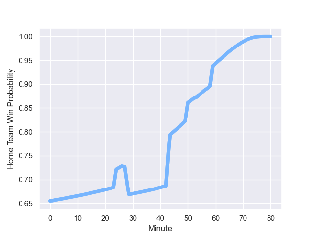

---  
layout: page  
title: Bourgoin-Jallieu at Périgueux; 7.0-22.0  
date: 2023-09-02 18:00:00 -0500  
categories: match review  
---
# Bourgoin-Jallieu at Périgueux; 7.0-22.0

# Club Level Predictions

The first set of predictions treats a club as the smallest object, as the club develops its members, organizes a gameplan, and deploys its players as needed for each match. This club model has a prediction of 0.731, which translates to predicting Périgueux to win by 8.9.

Each club has a rating and a rating deviation (simiar to a Glicko system), and expected performances can be generated. This allows for simulated matches and spreads like the ones below.
## Projected Performances

## Projected Spreads

## Projected Results

# Player Level Predictions - Version 2

Treating teams instead as an entity made up of the currently active players, I have ratings for each player in an altogether different system. These can be combined to form team ratings once teamsheets are announced, weighting starters a bit higher than the reserves. After the match is played, players can be weighted by their minutes on the field, allowing for an accurate measure of the team's composition. With these compiled team ratings, we can make predictions, measure inaccuracy, and update the individual player ratings.
## Prediction with Player Minutes: Périgueux by 7.0

Périgueux by 3.9 on a neutral field
## Prediction without Player Minutes: Périgueux by 6.5

Périgueux by 3.4 on a neutral pitch

## Scores over Time

## Win Probability over Time

There were 6 large changes in win probability in this match

|   Away Minutes | Away Player              |   Away elo |   Number |   Home elo | Home Player       |   Home Minutes |
|---------------:|:-------------------------|-----------:|---------:|-----------:|:------------------|---------------:|
|             27 | Zhorzhi (Jorji) Saldadze |      40.84 |        1 |      49.83 | Thomas Vidal      |             57 |
|             27 | Mohamed Khribache        |      31.57 |        2 |      48.28 | Lucas Marijon     |             67 |
|             27 | Osman Dimen              |      49.13 |        3 |      32.39 | Kalaveti Tawake   |             50 |
|             80 | Morgan Eames             |      -5.54 |        4 |      23.41 | Clement Lanen     |             80 |
|             27 | Jonathan Kpoku           |      45.45 |        5 |      39.73 | Jaco Willemse     |             41 |
|             60 | Bynjamin Rabatel         |      63.37 |        6 |      41.57 | Hendri Storm      |             63 |
|             80 | Theophile Cotte          |      41.53 |        7 |      72.64 | Afaesetiti Amosa  |             50 |
|             53 | Poutasi Luafutu          |      47.03 |        8 |      50.43 | Karl Lambert      |             80 |
|             63 | Tomas Munilla lo Duca    |      61.58 |        9 |       9.45 | Nicolas Faltrept  |             67 |
|             80 | Aviata Silago            |      29.6  |       10 |      51.44 | Greg Hutley       |             53 |
|             80 | Quentin Lefort           |      23.27 |       11 |      51.44 | Vincent Fouillade |             80 |
|             80 | Gaby Lovobalavu          |      49.85 |       12 |      62.36 | Fred Hickes       |             80 |
|             80 | Brieuc Plessis-Couillaud |      37.3  |       13 |      51.44 | Cyril Couturier   |             80 |
|             48 | Makalea Foliaki          |      49.49 |       14 |      58.6  | Axel Muller       |             80 |
|             80 | Nicolas Cachet           |      44.47 |       15 |      53.46 | Rory Scholes      |             80 |
|             53 | Rémy Gaborit             |      48.09 |       16 |      46.66 | Damien Lavergne   |             23 |
|             53 | Rossouw De Klerk         |      34.56 |       17 |      50.41 | Anthony Pelmard   |             30 |
|             53 | Killian Tripier          |      56.87 |       18 |      49.83 | Mathieu Pace      |             39 |
|             53 | Robin Gascou             |      44.19 |       19 |      46.65 | Nicolas Labattut  |             17 |
|             20 | Matteo Broeders          |      44.82 |       20 |      49.35 | Madioke Konate    |             30 |
|             27 | Théo Lepage              |      54.36 |       21 |      46.65 | Enzo Jaubert      |             13 |
|             17 | Remi Bouet               |      29.22 |       22 |      46.65 | Gaëtan Chapon     |             13 |
|             32 | Christopher Bosch        |      41.4  |       23 |      43.44 | Yann Caillat      |             27 |

