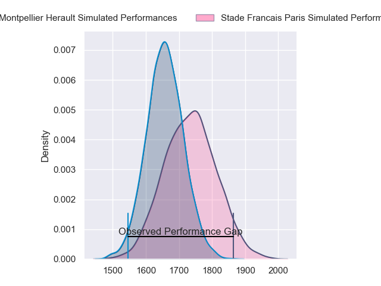
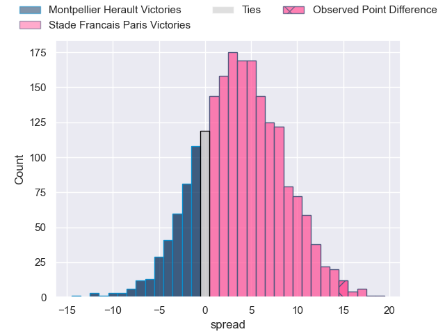
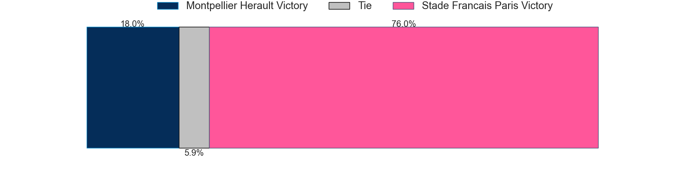
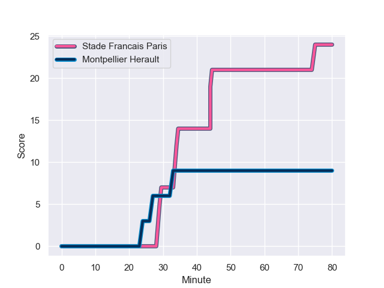
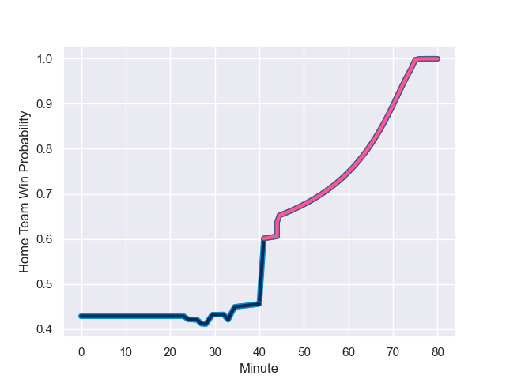

---  
layout: page  
title: Montpellier Herault at Stade Francais Paris; 9.0-24.0  
date: 2023-09-02 18:00:00 -0500  
categories: match review  
---
# Montpellier Herault at Stade Francais Paris; 9.0-24.0

# Club Level Predictions

The first set of predictions treats a club as the smallest object, as the club develops its members, organizes a gameplan, and deploys its players as needed for each match. This club model has a prediction of 0.605, which translates to predicting Stade Francais Paris to win by 3.7.

Each club has a rating and a rating deviation (simiar to a Glicko system), and expected performances can be generated. This allows for simulated matches and spreads like the ones below.
## Projected Performances

## Projected Spreads

## Projected Results

# Player Level Predictions - Version 1

Treating teams instead as an entity made up of the currently active players, I have ratings for each player in an altogether different system. These can be combined to form team ratings once teamsheets are announced, weighting starters a bit higher than the reserves. After the match is played, players can be weighted by their minutes on the field, allowing for an accurate measure of the team's composition. With these compiled team ratings, we can make predictions, measure inaccuracy, and update the individual player ratings.
## Prediction with Player Minutes: Montpellier Herault by 8.5

Montpellier Herault by 12.5 on a neutral field
## Prediction without Player Minutes: Montpellier Herault by 8.8

Montpellier Herault by 12.8 on a neutral pitch

## Scores over Time

## Win Probability over Time

There were 2 large changes in win probability in this match

|   Away Minutes | Away Player                 |   Away elo |   Away Percentile |   Number |   Home Percentile |   Home elo | Home Player             |   Home Minutes |
|---------------:|:----------------------------|-----------:|------------------:|---------:|------------------:|-----------:|:------------------------|---------------:|
|             58 | Baptiste Erdocio            |     103.06 |       1.01007e+06 |        1 |           1027729 |     137.02 | Sergo Abramishvili      |             47 |
|             68 | Vano Karkadze               |     107.33 |  961232           |        2 |            536035 |     130.56 | Mickael Ivaldi          |             65 |
|             41 | Karl Tu'inukuafe            |     100.48 |  815005           |        3 |            812598 |      93.32 | Giorgi Melikidze        |             47 |
|             80 | Elliott Stooke              |      73.75 |  668392           |        4 |            752009 |      96.46 | Paul Gabrillagues       |             80 |
|             80 | Tyler Duguid                |     100.61 |  999082           |        5 |            953809 |     120.39 | JJ van der Mescht       |             20 |
|             80 | Nicolaas Janse van Rensburg |     112.31 |  746147           |        6 |            933084 |     124.69 | Mathieu Hirigoyen       |             80 |
|             41 | Masivesi Dakuwaqa           |     184.7  |  938577           |        7 |            783549 |     110.96 | Romain Briatte          |             80 |
|             68 | Alexandre Becognee          |     119.1  |  894058           |        8 |            825927 |     116.22 | Giovanni Habel-Kueffner |             54 |
|             68 | Léo Coly                    |     207.19 |  962391           |        9 |            307772 |      99.75 | Rory Kockott            |             68 |
|             68 | Louis Carbonel              |      91.08 |  908776           |       10 |            992425 |     105.25 | Leo Barre               |             47 |
|             80 | George Bridge               |     175.99 |  855029           |       11 |            767400 |     109.82 | Lester Etien            |             80 |
|             41 | Auguste Cadot               |      74.33 |       1.02252e+06 |       12 |            919216 |     164.09 | Julien Delbouis         |             44 |
|             80 | Thomas Darmon               |     144.16 |  904618           |       13 |            841066 |     176.76 | Jeremy Ward             |             80 |
|             80 | Alexandre de Nardi          |     240.49 |  937665           |       14 |           1030072 |     126.78 | Peniasi Dakuwaqa        |             80 |
|             80 | Julien Tisseron             |     135.28 |  831760           |       15 |            759420 |     130.51 | Kylan Hamdaoui          |             80 |
|             39 | Sam Simmonds                |      96.32 |  678623           |       16 |            869337 |      94.73 | Baptiste Pesenti        |             60 |
|             39 | Pierre Lucas                |     117.23 |  864268           |       17 |            906651 |     118.39 | Pierre Boudehent        |             36 |
|             39 | Valentin Welsch             |     125.81 |     nan           |       18 |            934452 |     162.5  | Zack Henry              |             33 |
|             22 | Enzo Forletta               |     140.48 |  767816           |       19 |           1016034 |     229.47 | Hugo Ndiaye             |             33 |
|             12 | Clément Doumenc             |      54.14 |  921885           |       20 |            947702 |      95.98 | Moses Alo-Emile         |             33 |
|             12 | Adrien Sonzogni             |     105.78 |       1.03312e+06 |       21 |            920777 |      97.9  | Pierre-Henri Azagoh     |             26 |
|             12 | Martin Doan                 |     328.1  |  985029           |       22 |            914297 |     137.79 | Lucas Peyresblanques    |             15 |
|             12 | Louis Foursans-Bourdette    |     101.67 |  987987           |       23 |            975338 |      60.14 | Hugo Zabalza            |             12 |

# Player Level Predictions - Version 2

Treating teams instead as an entity made up of the currently active players, I have ratings for each player in an altogether different system. These can be combined to form team ratings once teamsheets are announced, weighting starters a bit higher than the reserves. After the match is played, players can be weighted by their minutes on the field, allowing for an accurate measure of the team's composition. With these compiled team ratings, we can make predictions, measure inaccuracy, and update the individual player ratings.
## Prediction with Player Minutes: Stade Francais Paris by 15.7

Stade Francais Paris by 10.7 on a neutral field
## Prediction without Player Minutes: Stade Francais Paris by 17.6

Stade Francais Paris by 12.5 on a neutral pitch

|   Away Minutes | Away Player                 |   Away elo |   Away variance |   Number |   Home variance |   Home elo | Home Player             |   Home Minutes |
|---------------:|:----------------------------|-----------:|----------------:|---------:|----------------:|-----------:|:------------------------|---------------:|
|             58 | Baptiste Erdocio            |      20.55 |           49.87 |        1 |           49.74 |      63.46 | Sergo Abramishvili      |             47 |
|             68 | Vano Karkadze               |      41.55 |           49.81 |        2 |           49.69 |      95.33 | Mickael Ivaldi          |             65 |
|             41 | Karl Tu'inukuafe            |      69.11 |           49.84 |        3 |           49.59 |      83.6  | Giorgi Melikidze        |             47 |
|             80 | Elliott Stooke              |      76.99 |           49.71 |        4 |           49.59 |      74.42 | Paul Gabrillagues       |             80 |
|             80 | Tyler Duguid                |      37.55 |           49.66 |        5 |           49.91 |      77.95 | JJ van der Mescht       |             20 |
|             80 | Nicolaas Janse van Rensburg |      62.13 |           49.62 |        6 |           49.59 |      38.07 | Mathieu Hirigoyen       |             80 |
|             41 | Masivesi Dakuwaqa           |      59.68 |           50    |        7 |           49.13 |      45.4  | Romain Briatte          |             80 |
|             68 | Alexandre Becognee          |      35.23 |           49.62 |        8 |           49.94 |      88.71 | Giovanni Habel-Kueffner |             54 |
|             68 | Léo Coly                    |      34.44 |           49.67 |        9 |           49.84 |     115.29 | Rory Kockott            |             68 |
|             68 | Louis Carbonel              |      42.93 |           49.66 |       10 |           49.54 |      63.12 | Leo Barre               |             47 |
|             80 | George Bridge               |     105.68 |           49.62 |       11 |           49.8  |      68.43 | Lester Etien            |             80 |
|             41 | Auguste Cadot               |      22.41 |           50    |       12 |           49.8  |      75.57 | Julien Delbouis         |             44 |
|             80 | Thomas Darmon               |      22.61 |           49.62 |       13 |           49.39 |      91.09 | Jeremy Ward             |             80 |
|             80 | Alexandre de Nardi          |      58.26 |           50    |       14 |           49.59 |      42.18 | Peniasi Dakuwaqa        |             80 |
|             80 | Julien Tisseron             |      53.57 |           49.62 |       15 |           49.29 |      49.06 | Kylan Hamdaoui          |             80 |
|             39 | Sam Simmonds                |      64.78 |           49.91 |       16 |           49.68 |      72.81 | Baptiste Pesenti        |             60 |
|             39 | Pierre Lucas                |      28.9  |           49.96 |       17 |           49.79 |      54.05 | Pierre Boudehent        |             36 |
|             39 | Valentin Welsch             |      46.65 |           50    |       18 |           49.83 |      61.16 | Zack Henry              |             33 |
|             22 | Enzo Forletta               |      57.33 |           49.75 |       19 |           50    |      49.17 | Hugo Ndiaye             |             33 |
|             12 | Clément Doumenc             |      33.42 |           49.94 |       20 |           49.93 |      59.07 | Moses Alo-Emile         |             33 |
|             12 | Adrien Sonzogni             |      45.46 |           50    |       21 |           49.86 |      47.31 | Pierre-Henri Azagoh     |             26 |
|             12 | Martin Doan                 |      46.42 |           49.95 |       22 |           49.95 |      45.3  | Lucas Peyresblanques    |             15 |
|             12 | Louis Foursans-Bourdette    |      37.85 |           49.96 |       23 |           50    |      36.67 | Hugo Zabalza            |             12 |

