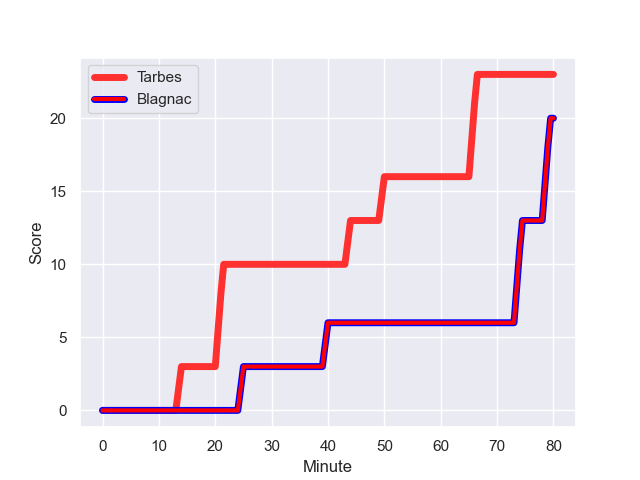
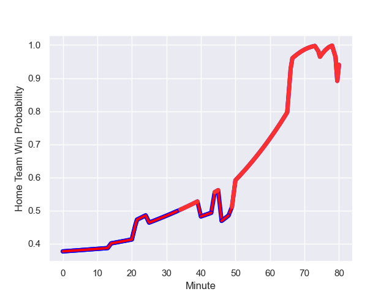

---  
layout: page  
title: Blagnac at Tarbes; 20.0-23.0  
date: 2023-09-02 18:00:00 -0500  
categories: match review  
---
# Blagnac at Tarbes; 20.0-23.0

# Club Level Predictions

The first set of predictions treats a club as the smallest object, as the club develops its members, organizes a gameplan, and deploys its players as needed for each match. This club model has a prediction of 0.519, which translates to predicting Tarbes to win by 0.7.

Each club has a rating and a rating deviation (simiar to a Glicko system), and expected performances can be generated. This allows for simulated matches and spreads like the ones below.
## Projected Performances

## Projected Spreads

## Projected Results

# Player Level Predictions - Version 2

Treating teams instead as an entity made up of the currently active players, I have ratings for each player in an altogether different system. These can be combined to form team ratings once teamsheets are announced, weighting starters a bit higher than the reserves. After the match is played, players can be weighted by their minutes on the field, allowing for an accurate measure of the team's composition. With these compiled team ratings, we can make predictions, measure inaccuracy, and update the individual player ratings.
## Prediction with Player Minutes: Blagnac by 5.5

Blagnac by 9.8 on a neutral field
## Prediction without Player Minutes: Blagnac by 5.3

Blagnac by 9.5 on a neutral pitch

## Scores over Time

## Win Probability over Time

There were 11 large changes in win probability in this match

|   Away Minutes | Away Player         |   Away elo |   Number |   Home elo | Home Player            |   Home Minutes |
|---------------:|:--------------------|-----------:|---------:|-----------:|:-----------------------|---------------:|
|             49 | Alexis Decaux       |      59.89 |        1 |      41.84 | Antoine Palisse        |             46 |
|             49 | Antoine Marty-Rybak |      51.06 |        2 |      40.42 | Florian Lamothe        |             49 |
|             49 | Victor Delmas       |      54.45 |        3 |      39.7  | Aleksi Tchitchiashvili |             46 |
|             46 | Vincent Mutel       |      53.93 |        4 |      45.6  | Francis Rolland        |             80 |
|             80 | Victor Fromenteze   |       8.62 |        5 |      45.23 | Baptiste Peytavi       |             46 |
|             80 | Simon Veyrac        |      60.12 |        6 |      55.55 | Alexis Armary          |             80 |
|             46 | Alexandre Perrin    |      47.63 |        7 |      28.55 | Dorian Bonnin          |             49 |
|             80 | Mathieu Vachon      |      62.22 |        8 |      33.29 | Len Massyn             |             80 |
|             80 | Bernard Reggiardo   |      48.24 |        9 |      32.21 | Thibaut Dulucq         |             74 |
|             80 | Ugo Seunes          |      64.42 |       10 |      19.75 | Anthony Fuertes        |             80 |
|             69 | Thibault Moleana    |      47.04 |       11 |      40.95 | Clement Latorre        |             80 |
|             63 | Aurelien Labau      |      62.03 |       12 |      33    | William Pees           |             77 |
|             80 | Lukas Doyhenard     |      57.66 |       13 |      24.72 | Johan Paulet           |             80 |
|             80 | Peïo Retegui        |      46.65 |       14 |      11.68 | Jone Tuva              |             80 |
|             49 | Antoine Renaud      |      26.33 |       15 |      30.69 | Mathieu Berbizier      |             21 |
|             31 | Romain Fricou       |      46.65 |       16 |      36.69 | Johan Mees Erasmus     |             34 |
|             31 | Gabin Villerouge    |      49.45 |       17 |      43    | Enzo Mondon            |             31 |
|             31 | Benjamin Bertrand   |      49.91 |       18 |      43.58 | Toma Taufa             |             34 |
|             34 | Nikita Bekov        |      75.03 |       19 |      34.2  | Jone Trevor Seuvou     |             34 |
|             34 | Ianis Ponsole       |      67.31 |       20 |      41.22 | Léo Saint-Guilhem      |             31 |
|             11 | Pierre Jeudi        |      49.82 |       21 |      19.92 | Anthony Meric          |              6 |
|             17 | Clément Vareilles   |      38.94 |       22 |      35.01 | Julien Cantan          |              3 |
|             31 | Gérald Augustin     |      45.74 |       23 |      36.23 | Thibaut Trotta         |             59 |

