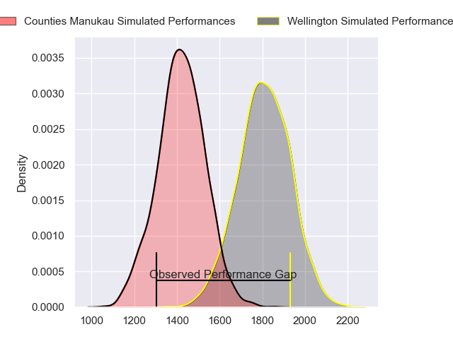
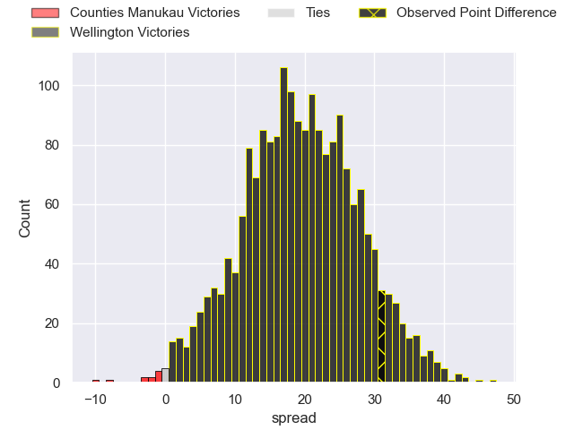
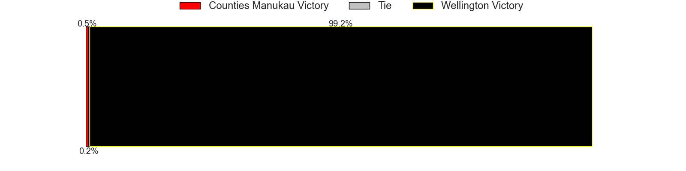
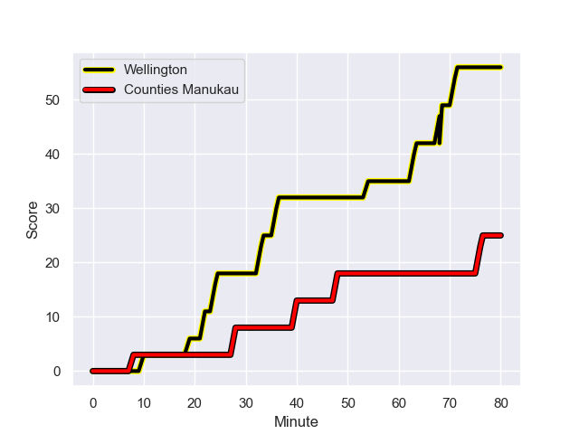
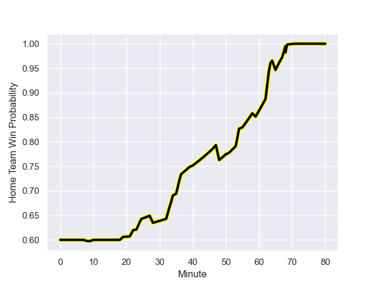

---  
layout: page  
title: Counties Manukau at Wellington; 25.0-56.0  
date: 2023-09-02 18:00:00 -0500  
categories: match review  
---
# Counties Manukau at Wellington; 25.0-56.0

# Club Level Predictions

The first set of predictions treats a club as the smallest object, as the club develops its members, organizes a gameplan, and deploys its players as needed for each match. This club model has a prediction of 0.894, which translates to predicting Wellington to win by 19.6.

Each club has a rating and a rating deviation (simiar to a Glicko system), and expected performances can be generated. This allows for simulated matches and spreads like the ones below.
## Projected Performances

## Projected Spreads

## Projected Results

# Player Level Predictions - Version 1

Treating teams instead as an entity made up of the currently active players, I have ratings for each player in an altogether different system. These can be combined to form team ratings once teamsheets are announced, weighting starters a bit higher than the reserves. After the match is played, players can be weighted by their minutes on the field, allowing for an accurate measure of the team's composition. With these compiled team ratings, we can make predictions, measure inaccuracy, and update the individual player ratings.
## Prediction with Player Minutes: Wellington by 21.6

Wellington by 17.6 on a neutral field
## Prediction without Player Minutes: Wellington by 16.9

Wellington by 12.9 on a neutral pitch

## Scores over Time

## Win Probability over Time

There were 4 large changes in win probability in this match

|   Away Minutes | Away Player         |   Away elo |   Away Percentile |   Number |   Home Percentile |   Home elo | Home Player            |   Home Minutes |
|---------------:|:--------------------|-----------:|------------------:|---------:|------------------:|-----------:|:-----------------------|---------------:|
|             34 | Kauvaka Kaivelata   |     118.01 |       1.02336e+06 |        1 |  934010           |     129.85 | Xavier Numia           |             55 |
|             47 | Ioane Moananu       |     102.59 |       1.03339e+06 |        2 |  709924           |      71.46 | James O'Reilly         |             40 |
|             47 | Salesi Tuifua       |     101.76 |       1.0334e+06  |        3 |       1.03357e+06 |     107.88 | Siale Lauaki           |             51 |
|             47 | Alex McRobbie       |      86.69 |       1.00581e+06 |        4 |  649891           |      90.1  | Dominic Bird           |             65 |
|             80 | Jim Thompson        |     107.07 |       1.03339e+06 |        5 |       1.03354e+06 |     119.25 | Hugo Plummer           |             80 |
|             34 | Viliami Taulani     |      75.32 |  849550           |        6 |  536366           |     140.44 | Brad Shields           |             80 |
|             80 | Sean Reidy          |     105.9  |  700080           |        7 |  895250           |     185.32 | Du'Plessis Kirifi      |             80 |
|             59 | Hoskins Sotutu      |     151.56 |  911352           |        8 |       1.00442e+06 |      97.31 | Keelan Whitman         |             55 |
|             65 | Liam Daniela        |      99.12 |  899777           |        9 |       1.03356e+06 |     114.59 | Kyle Preston           |             47 |
|             80 | Riley Hohepa        |      91.9  |  963673           |       10 |       1.00775e+06 |     108.41 | Aidan Morgan           |             65 |
|             80 | Peniasi Malimali    |      73.71 |       1.00583e+06 |       11 |       1.03404e+06 |     102.96 | Isi Saumaki            |             80 |
|             80 | Sione Molia         |      66.15 |  710000           |       12 |  844639           |     101.74 | Peter Umaga-Jensen     |             55 |
|             80 | Tevita Ofa          |      84.5  |       1.02343e+06 |       13 |  907576           |     126.38 | Billy Proctor          |             80 |
|             57 | Toni Pulu           |     155.81 |  658157           |       14 |  898547           |      91.58 | Losi Filipo            |             80 |
|             80 | Etene Nanai-Seturo  |     144.25 |  937726           |       15 |  996591           |     123.91 | Ruben Love             |             80 |
|             33 | Keran Van Staden    |      99.15 |     nan           |       16 |  815922           |      80.72 | Cameron Orr            |             25 |
|             46 | Siate Taupaki       |      97.78 |     nan           |       17 |     nan           |     111.78 | Josiah Tavita-Metcalfe |             29 |
|             33 | Ian West-Stevens    |     103.36 |       1.0334e+06  |       18 |     nan           |     114.61 | Penieli Poasa          |             40 |
|             21 | Sam Tuifua          |     106.69 |       1.02339e+06 |       19 |       1.03352e+06 |     105.95 | Akira Ieremia          |             15 |
|             33 | William Furniss     |      89.23 |       1.02341e+06 |       20 |       1.03352e+06 |     105.54 | Dominic Ropeti         |             25 |
|             46 | Adam Brash          |      77.73 |       1.02338e+06 |       21 |  890405           |     100.63 | Kemara Hauiti-Parapara |             33 |
|             15 | Cohen Brady-Leathem |      96.93 |     nan           |       22 |       1.02333e+06 |     113.11 | Sam Clarke             |             15 |
|             23 | AJ Alatimu          |     195.17 |  900039           |       23 |       1.02195e+06 |     135.46 | Riley Higgins          |             25 |

# Player Level Predictions - Version 2

Treating teams instead as an entity made up of the currently active players, I have ratings for each player in an altogether different system. These can be combined to form team ratings once teamsheets are announced, weighting starters a bit higher than the reserves. After the match is played, players can be weighted by their minutes on the field, allowing for an accurate measure of the team's composition. With these compiled team ratings, we can make predictions, measure inaccuracy, and update the individual player ratings.
## Prediction with Player Minutes: Wellington by 14.3

Wellington by 10.9 on a neutral field
## Prediction without Player Minutes: Wellington by 13.6

Wellington by 10.1 on a neutral pitch

|   Away Minutes | Away Player         |   Away elo |   Away variance |   Number |   Home variance |   Home elo | Home Player            |   Home Minutes |
|---------------:|:--------------------|-----------:|----------------:|---------:|----------------:|-----------:|:-----------------------|---------------:|
|             34 | Kauvaka Kaivelata   |      49.84 |           49.44 |        1 |           49.54 |      87.35 | Xavier Numia           |             55 |
|             47 | Ioane Moananu       |      47.65 |           49.73 |        2 |           49.7  |      42.51 | James O'Reilly         |             40 |
|             47 | Salesi Tuifua       |      46.89 |           49.55 |        3 |           49.71 |      48.88 | Siale Lauaki           |             51 |
|             47 | Alex McRobbie       |      23.1  |           49.56 |        4 |           49.8  |      91.02 | Dominic Bird           |             65 |
|             80 | Jim Thompson        |      48.99 |           49.31 |        5 |           49.59 |      57.38 | Hugo Plummer           |             80 |
|             34 | Viliami Taulani     |      27.2  |           49.92 |        6 |           49.41 |      86.31 | Brad Shields           |             80 |
|             80 | Sean Reidy          |      78.11 |           49.22 |        7 |           49.47 |      85.13 | Du'Plessis Kirifi      |             80 |
|             59 | Hoskins Sotutu      |      84.11 |           49.22 |        8 |           49.81 |      55.88 | Keelan Whitman         |             55 |
|             65 | Liam Daniela        |      47.64 |           49.29 |        9 |           49.73 |      54.49 | Kyle Preston           |             47 |
|             80 | Riley Hohepa        |      31.2  |           49.22 |       10 |           49.42 |      62.73 | Aidan Morgan           |             65 |
|             80 | Peniasi Malimali    |      30.96 |           49.56 |       11 |           49.96 |      48.54 | Isi Saumaki            |             80 |
|             80 | Sione Molia         |      48.85 |           49.6  |       12 |           49.49 |      49.74 | Peter Umaga-Jensen     |             55 |
|             80 | Tevita Ofa          |      42.59 |           49.34 |       13 |           49.44 |      80.06 | Billy Proctor          |             80 |
|             57 | Toni Pulu           |      89.81 |           49.38 |       14 |           49.42 |      56.77 | Losi Filipo            |             80 |
|             80 | Etene Nanai-Seturo  |      38.56 |           49.22 |       15 |           49.44 |      87.52 | Ruben Love             |             80 |
|             33 | Keran Van Staden    |      45.48 |           49.95 |       16 |           49.74 |      51.58 | Cameron Orr            |             25 |
|             46 | Siate Taupaki       |      46.73 |           49.97 |       17 |           49.9  |      50.41 | Josiah Tavita-Metcalfe |             29 |
|             33 | Ian West-Stevens    |      48.12 |           49.52 |       18 |           49.93 |      49.79 | Penieli Poasa          |             40 |
|             21 | Sam Tuifua          |      48.86 |           49.66 |       19 |           49.81 |      48.9  | Akira Ieremia          |             15 |
|             33 | William Furniss     |      37.91 |           50    |       20 |           49.71 |      50.67 | Dominic Ropeti         |             25 |
|             46 | Adam Brash          |      41.81 |           49.87 |       21 |           49.57 |      71.95 | Kemara Hauiti-Parapara |             33 |
|             15 | Cohen Brady-Leathem |      46.52 |           49.97 |       22 |           49.86 |      52.83 | Sam Clarke             |             15 |
|             23 | AJ Alatimu          |      63.43 |           47.52 |       23 |           49.65 |      82.81 | Riley Higgins          |             25 |

