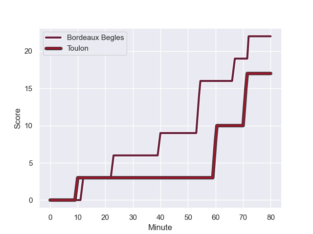
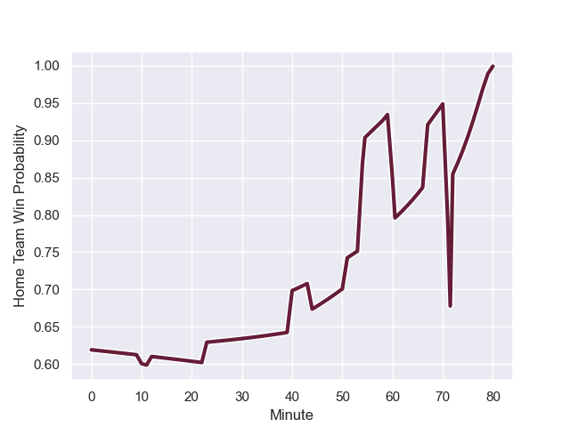

---  
layout: page  
title: Toulon at Bordeaux Begles; 17.0-22.0  
date: 2023-09-03 18:00:00 -0500  
categories: match review  
---
# Toulon at Bordeaux Begles; 17.0-22.0

# Club Level Predictions

The first set of predictions treats a club as the smallest object, as the club develops its members, organizes a gameplan, and deploys its players as needed for each match. This club model has a prediction of 0.616, which translates to predicting Bordeaux Begles to win by 4.1.

Each club has a rating and a rating deviation (simiar to a Glicko system), and expected performances can be generated. This allows for simulated matches and spreads like the ones below.
## Projected Performances

## Projected Spreads

## Projected Results

# Player Level Predictions - Version 2

Treating teams instead as an entity made up of the currently active players, I have ratings for each player in an altogether different system. These can be combined to form team ratings once teamsheets are announced, weighting starters a bit higher than the reserves. After the match is played, players can be weighted by their minutes on the field, allowing for an accurate measure of the team's composition. With these compiled team ratings, we can make predictions, measure inaccuracy, and update the individual player ratings.
## Prediction with Player Minutes: Bordeaux Begles by 5.3

Toulon by 0.6 on a neutral field
## Prediction without Player Minutes: Bordeaux Begles by 4.6

Toulon by 0.1 on a neutral pitch

## Scores over Time

## Win Probability over Time

There were 12 large changes in win probability in this match

|   Away Minutes | Away Player         |   Away elo |   Number |   Home elo | Home Player               |   Home Minutes |
|---------------:|:--------------------|-----------:|---------:|-----------:|:--------------------------|---------------:|
|             44 | Dany Priso          |      67.28 |        1 |      67.45 | Lekso Kaulashvili         |             51 |
|             44 | Christopher Tolofua |      75.46 |        2 |      50.86 | Maxime Lamothe            |             58 |
|             44 | Emerick Setiano     |      65.37 |        3 |      81.47 | Vadim Cobilas             |             35 |
|             44 | Mathieu Tanguy      |      23.89 |        4 |      26.78 | Thomas Jolmes             |             51 |
|             44 | Alun Wyn Jones      |     100.27 |        5 |      48.91 | Kane Douglas              |             80 |
|             44 | Yannick Youyoutte   |      48.72 |        6 |      57.4  | Mahamadou Diaby           |             80 |
|             80 | Esteban Abadie      |      38.6  |        7 |      61.38 | Bastien Vergnes Taillefer |             51 |
|             80 | Selevasio Tolofua   |      78.97 |        8 |      63.8  | Raphael Lakafia           |             80 |
|             80 | Baptiste Serin      |      87.95 |        9 |      17.22 | Paul Abadie               |             51 |
|             80 | Enzo Herve          |      64.18 |       10 |      43.7  | Mateo Garcia              |             80 |
|             80 | Rayan Rebbadj       |      37.91 |       11 |      23.9  | Pablo Uberti              |             80 |
|             80 | Seta Tuicuvu        |      36.2  |       12 |      36.65 | Ben Tapuai                |             80 |
|             67 | Maëlan Rabut        |      28.82 |       13 |      66.8  | Jean-Baptiste Dubie       |             56 |
|             80 | Gaël Dréan          |      23.5  |       14 |      91.5  | Romain Buros              |             80 |
|             80 | Aymeric Luc         |      41.45 |       15 |      66.19 | Nans Ducuing              |             59 |
|             36 | Kieran Brookes      |      38.64 |       16 |      34.75 | Carlu Sadie               |             45 |
|             36 | Mattéo Le Corvec    |      41.15 |       17 |      44.08 | Alexandre Ricard          |             29 |
|             36 | Adrien Warion       |      36.09 |       18 |      64.13 | Ugo Boniface              |             29 |
|             36 | Matthias Halagahu   |      45.01 |       19 |      57    | Antoine Miquel            |             29 |
|             36 | Bruce Devaux        |      44.26 |       20 |      14.24 | Theo Nanette              |             29 |
|             36 | Yanis Boulassel     |      46.68 |       21 |      50.72 | Nicolas Depoortere        |             24 |
|             13 | Noah Lolesio        |      62.68 |       22 |      60.23 | Clement Maynadier         |             22 |
|            nan | nan                 |     nan    |       23 |      75.01 | Zack Holmes               |             21 |

