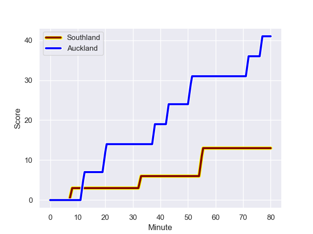
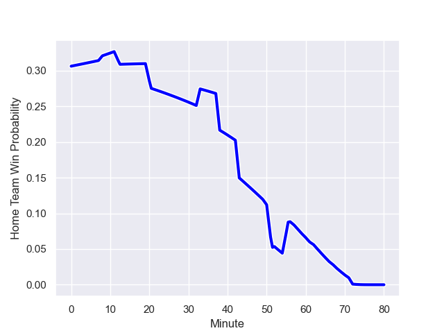

---  
layout: page  
title: Auckland at Southland; 41.0-13.0  
date: 2023-09-03 18:00:00 -0500  
categories: match review  
---
# Auckland at Southland; 41.0-13.0

# Club Level Predictions

The first set of predictions treats a club as the smallest object, as the club develops its members, organizes a gameplan, and deploys its players as needed for each match. This club model has a prediction of 0.232, which translates to predicting Auckland to win by 11.0.

Each club has a rating and a rating deviation (simiar to a Glicko system), and expected performances can be generated. This allows for simulated matches and spreads like the ones below.
## Projected Performances

## Projected Spreads

## Projected Results

# Player Level Predictions - Version 2

Treating teams instead as an entity made up of the currently active players, I have ratings for each player in an altogether different system. These can be combined to form team ratings once teamsheets are announced, weighting starters a bit higher than the reserves. After the match is played, players can be weighted by their minutes on the field, allowing for an accurate measure of the team's composition. With these compiled team ratings, we can make predictions, measure inaccuracy, and update the individual player ratings.
## Prediction with Player Minutes: Auckland by 9.1

Auckland by 12.4 on a neutral field
## Prediction without Player Minutes: Auckland by 8.6

Auckland by 12.0 on a neutral pitch

## Scores over Time

## Win Probability over Time

There were 4 large changes in win probability in this match

|   Away Minutes | Away Player         |   Away elo |   Number |   Home elo | Home Player           |   Home Minutes |
|---------------:|:--------------------|-----------:|---------:|-----------:|:----------------------|---------------:|
|             57 | Josh Fusitua        |      50.98 |        1 |      26.21 | Shaun Stodart         |             62 |
|             73 | Soane Vikena        |      48.47 |        2 |      48.96 | Jack Taylor           |             57 |
|             69 | Sione Ahio          |      46.62 |        3 |      47.55 | Quinn Harrison-Jones  |             50 |
|             80 | Patrick Tuipulotu   |      78.44 |        4 |      61.83 | Danny Drake           |             80 |
|             69 | Josh Beehre         |      51.23 |        5 |       4.75 | Josh Bekhuis          |             52 |
|             67 | Adrian Choat        |      48.74 |        6 |      38.07 | Blair Ryall           |             80 |
|             80 | Blake Gibson        |      71.66 |        7 |      43.63 | Hayden Michaels       |             80 |
|             80 | Vaiolini Ekuasi     |      37.54 |        8 |      47.33 | Semisi Tupou Ta’eiloa |             57 |
|             56 | Kalani Thomas       |      49.53 |        9 |       6.69 | Jay Renton            |             52 |
|             73 | Zarn Sullivan       |      64.47 |       10 |      22.89 | Dan Hollinshead       |             80 |
|             80 | Xavier TIto-Harris  |      46.65 |       11 |      34.86 | Michael Manson        |             80 |
|             80 | Bryce Heem          |     113.59 |       12 |      43.58 | Tevita Latu           |             60 |
|             67 | Corey Evans         |      52.31 |       13 |      32.29 | Matt Whaanga          |             80 |
|             80 | AJ Lam              |      49.22 |       14 |      20.52 | Viliami Fine          |             80 |
|             80 | Roger Tuivasa-Sheck |      33.68 |       15 |      35.04 | Greg Dyer             |             67 |
|             23 | Ben Ake             |      43.33 |       16 |      37.59 | Jonah Aoina           |             30 |
|              7 | Joe Royal           |      27.93 |       17 |      46.65 | Hunter Fahey          |             18 |
|             11 | Marcel Renata       |      48.62 |       18 |      49.93 | Nic Souchon           |             23 |
|             13 | Che Clark           |      44.87 |       19 |      -7.47 | Mike McKee            |             28 |
|             11 | Edward Annandale    |      37.33 |       20 |      46.65 | Jacob Henry Coghlan   |             23 |
|             24 | Taufa Funaki        |      30.36 |       21 |      47.18 | Noah Foster           |             20 |
|              7 | Jock McKenzie       |      45.62 |       22 |      44.65 | Connor McLeod         |             28 |
|             13 | Payton Spencer      |      41.89 |       23 |      46.65 | Angus Simmers         |             13 |

