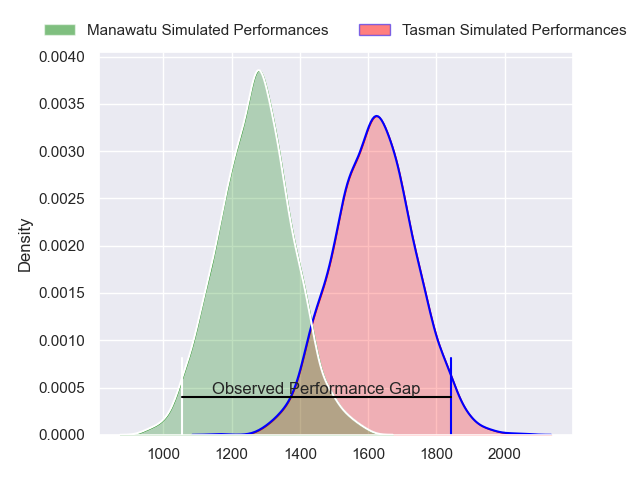
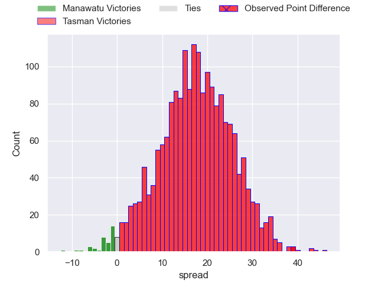
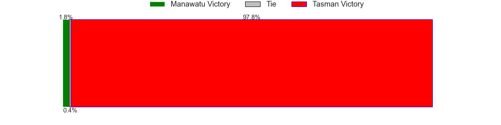
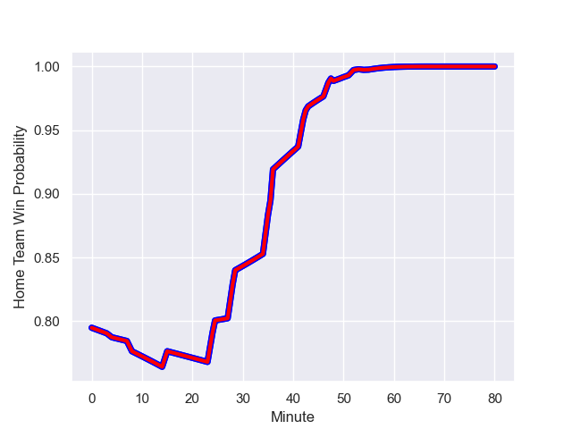

---  
layout: page  
title: Manawatu at Tasman; 19.0-58.0  
date: 2023-09-03 18:00:00 -0500  
categories: match review  
---
# Manawatu at Tasman; 19.0-58.0

# Club Level Predictions

The first set of predictions treats a club as the smallest object, as the club develops its members, organizes a gameplan, and deploys its players as needed for each match. This club model has a prediction of 0.868, which translates to predicting Tasman to win by 17.3.

Each club has a rating and a rating deviation (simiar to a Glicko system), and expected performances can be generated. This allows for simulated matches and spreads like the ones below.
## Projected Performances

## Projected Spreads

## Projected Results

# Player Level Predictions - Version 2

Treating teams instead as an entity made up of the currently active players, I have ratings for each player in an altogether different system. These can be combined to form team ratings once teamsheets are announced, weighting starters a bit higher than the reserves. After the match is played, players can be weighted by their minutes on the field, allowing for an accurate measure of the team's composition. With these compiled team ratings, we can make predictions, measure inaccuracy, and update the individual player ratings.
## Prediction with Player Minutes: Tasman by 14.9

Tasman by 11.6 on a neutral field
## Prediction without Player Minutes: Tasman by 16.0

Tasman by 12.7 on a neutral pitch

## Scores over Time

## Win Probability over Time

There were 2 large changes in win probability in this match

|   Away Minutes | Away Player           |   Away elo |   Number |   Home elo | Home Player          |   Home Minutes |
|---------------:|:----------------------|-----------:|---------:|-----------:|:---------------------|---------------:|
|             43 | Malakai Hala-Ngatai   |      47.29 |        1 |      44.9  | Ryan Coxon           |             48 |
|              4 | Leif Schwenke         |      40.74 |        2 |      41.51 | Feleti Kaitu'u       |             55 |
|             48 | Flyn Yates            |      29.09 |        3 |      35.89 | Luca Inch            |             55 |
|             54 | Ofa Tauatevalu        |      36.1  |        4 |      72.16 | Quinten Strange      |             48 |
|             80 | Johannes Momsen       |      17.51 |        5 |      65.99 | Michael Curry        |             80 |
|             51 | TK Howden             |      15.73 |        6 |      50.14 | Max Hicks            |             80 |
|             80 | Slade McDowall        |      78.91 |        7 |      41.8  | Anton Segner         |             80 |
|             80 | Brayden Iose          |      10.31 |        8 |     103.74 | Ethan Blackadder     |             54 |
|             54 | Jordi Viljoen         |      45.94 |        9 |      54.04 | Noah Hotham          |             49 |
|             80 | Brett Cameron         |      35.85 |       10 |      46.67 | Shun Miyake          |             80 |
|             80 | Epeli Waqaicece       |      51.33 |       11 |      47.14 | Willi Gualter        |             80 |
|             53 | Jason Emery           |      27.07 |       12 |      86.26 | Alex Nankivell       |             80 |
|             80 | Te Rangatira Waitokia |      18.73 |       13 |      66.76 | Levi Aumua           |             48 |
|             80 | Drew Wild             |      41.58 |       14 |      37.34 | Timoci Tavatavanawai |             80 |
|             80 | Beaudein Waaka        |      -2.79 |       15 |      50.46 | Macca Springer       |             54 |
|             37 | Joseph Gavigan        |      29.36 |       16 |      47.03 | Matt Graham-Williams |             32 |
|             76 | Raymond Tuputupu      |      47.44 |       17 |      71.69 | Samuel Matenga       |             25 |
|             32 | Cole Keith            |      64.08 |       18 |      46.65 | Monu Moli            |             25 |
|             29 | Terrell Peita         |      66.54 |       19 |      46.11 | Angus Fletcher       |             32 |
|             26 | Johnny Galloway       |      34.89 |       20 |      48.83 | Seta Baker           |             26 |
|             26 | John Poland           |      67.52 |       21 |      37.12 | Louie Chapman        |             31 |
|              3 | Kyle Brown            |      43.67 |       22 |      47.21 | Jack Gray            |             32 |
|             24 | Isaiah Ravula         |      50.43 |       23 |      56.79 | Tomasi Alosio        |             26 |

