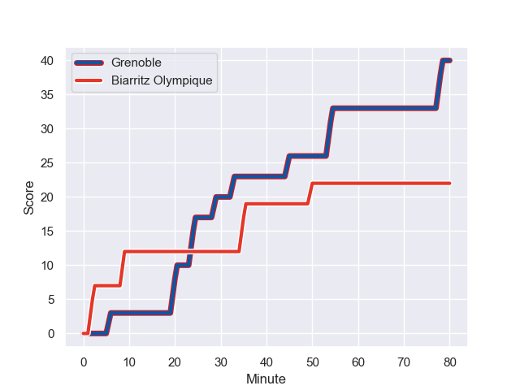
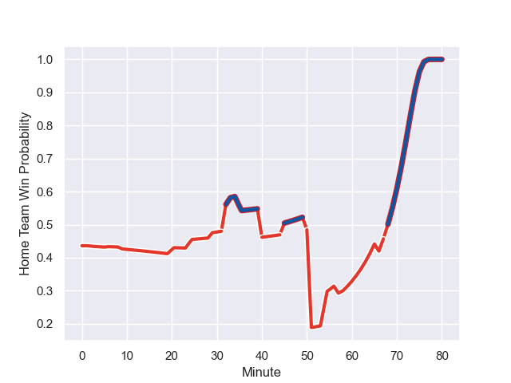

---  
layout: page  
title: Biarritz Olympique at Grenoble; 22.0-40.0  
date: 2023-09-06 18:00:00 -0500  
categories: match review  
---
# Biarritz Olympique at Grenoble; 22.0-40.0

# Club Level Predictions

The first set of predictions treats a club as the smallest object, as the club develops its members, organizes a gameplan, and deploys its players as needed for each match. This club model has a prediction of 0.671, which translates to predicting Grenoble to win by 6.3.

Each club has a rating and a rating deviation (simiar to a Glicko system), and expected performances can be generated. This allows for simulated matches and spreads like the ones below.
## Projected Performances

## Projected Spreads

## Projected Results

# Player Level Predictions - Version 1

Treating teams instead as an entity made up of the currently active players, I have ratings for each player in an altogether different system. These can be combined to form team ratings once teamsheets are announced, weighting starters a bit higher than the reserves. After the match is played, players can be weighted by their minutes on the field, allowing for an accurate measure of the team's composition. With these compiled team ratings, we can make predictions, measure inaccuracy, and update the individual player ratings.
## Prediction with Player Minutes: Biarritz Olympique by 7.1

Biarritz Olympique by 11.1 on a neutral field
## Prediction without Player Minutes: Grenoble by 0.0

Biarritz Olympique by 4.0 on a neutral pitch

## Scores over Time

## Win Probability over Time

There were 20 large changes in win probability in this match

|   Away Minutes | Away Player              |   Away elo |   Away Percentile |   Number |   Home Percentile |   Home elo | Home Player         |   Home Minutes |
|---------------:|:-------------------------|-----------:|------------------:|---------:|------------------:|-----------:|:--------------------|---------------:|
|             45 | Kevin Tougne             |     177.72 |  943156           |        1 |       1.01266e+06 |     211.57 | Zack Gauthier       |             44 |
|             32 | Thomas Sauveterre        |     158.04 |  863329           |        2 |       1.03167e+06 |     127.83 | Bernabe Massa       |             71 |
|             40 | Zakaria El Fakir         |     112.37 |  878213           |        3 |  988311           |     224.37 | Regis Montagne      |             66 |
|             80 | Johnny Dyer              |     298.48 |  940914           |        4 |  834814           |     159.06 | Georgi Javakhia     |             44 |
|             40 | Pieter Jansen van Vuuren |      90.05 |  892047           |        5 |  859337           |     199.63 | Pierce Phillips     |             80 |
|             57 | Tiaan Jacobs             |     120.63 |       1.03384e+06 |        6 |  902414           |     101.63 | Antonin Berruyer    |             80 |
|             80 | Dave O'Callaghan         |      45.23 |  609157           |        7 |  893944           |     104.72 | Steeve Blanc-Mappaz |             80 |
|             80 | Charlie Francoz          |     110.63 |  879451           |        8 |  593327           |     135.49 | Tala Gray           |             67 |
|             51 | Kerman Aurrekoetxea      |     219.99 |  981592           |        9 |  965693           |     141.87 | Barnabe Couilloud   |             58 |
|             80 | Chris Hilsenbeck         |     224.47 |  777313           |       10 |  623216           |     105.86 | Sam Davies          |             73 |
|             58 | Baptiste Fariscot        |     122.98 |       1.02223e+06 |       11 |  827214           |     115.15 | Geoffrey Cros       |             80 |
|             80 | Ilian Perraux            |     103.41 |  600317           |       12 |  698695           |      83.69 | Bautista Ezcurra    |             80 |
|             65 | Robin McClintock         |     111.39 |       1.03395e+06 |       13 |  991256           |     172.89 | Romain Trouilloud   |             80 |
|             80 | Zach Kibirige            |      88.84 |  725274           |       14 |  955864           |      86.22 | Erwan Dridi         |             80 |
|             80 | Gervais Cordin           |     162.63 |  896210           |       15 |  787832           |     104.77 | Julien Farnoux      |             65 |
|             48 | Bastien Soury            |      69.07 |  804573           |       16 |  704690           |      83.04 | Brandon Nansen      |             36 |
|             40 | Johan Aliouat            |      96.3  |  794843           |       17 |  933921           |     131.71 | Luka Goginava       |             36 |
|             40 | Lasha Tabidze            |     205.08 |     nan           |       18 |  571791           |     145.58 | Felipe Ezcurra      |             22 |
|             35 | Giorgi Nutsubidze        |     197.94 |  973277           |       19 |  984246           |     142.22 | Romain Fusier       |             15 |
|             29 | Antoine Domercq          |     122.79 |       1.03384e+06 |       20 |       1.02519e+06 |     109.84 | Vincent Vial        |             14 |
|             23 | Simon Augry              |     162.56 |  946012           |       21 |  999387           |     232.84 | Victor Guillaumond  |             13 |
|             22 | Joe Jonas                |     130.02 |       1.01157e+06 |       22 |       1.01268e+06 |     232.59 | Enzo Camilleri      |              9 |
|             15 | Francois Vergnaud        |     131.78 |  951891           |       23 |     nan           |     137.13 | Max Clement         |              7 |

# Player Level Predictions - Version 2

Treating teams instead as an entity made up of the currently active players, I have ratings for each player in an altogether different system. These can be combined to form team ratings once teamsheets are announced, weighting starters a bit higher than the reserves. After the match is played, players can be weighted by their minutes on the field, allowing for an accurate measure of the team's composition. With these compiled team ratings, we can make predictions, measure inaccuracy, and update the individual player ratings.
## Prediction with Player Minutes: Grenoble by 14.7

Grenoble by 9.9 on a neutral field
## Prediction without Player Minutes: Grenoble by 14.4

Grenoble by 9.6 on a neutral pitch

|   Away Minutes | Away Player              |   Away elo |   Away variance |   Number |   Home variance |   Home elo | Home Player         |   Home Minutes |
|---------------:|:-------------------------|-----------:|----------------:|---------:|----------------:|-----------:|:--------------------|---------------:|
|             45 | Kevin Tougne             |      42.12 |           49.94 |        1 |           49.73 |      54.86 | Zack Gauthier       |             44 |
|             32 | Thomas Sauveterre        |      53.73 |           50    |        2 |           49.94 |      52.1  | Bernabe Massa       |             71 |
|             40 | Zakaria El Fakir         |      28.54 |           49.8  |        3 |           49.74 |      48.4  | Regis Montagne      |             66 |
|             80 | Johnny Dyer              |       2.3  |           49.78 |        4 |           50    |      53.98 | Georgi Javakhia     |             44 |
|             40 | Pieter Jansen van Vuuren |      29.14 |           49.75 |        5 |           49.8  |      46.11 | Pierce Phillips     |             80 |
|             57 | Tiaan Jacobs             |      46.27 |           49.84 |        6 |           49.71 |      30.37 | Antonin Berruyer    |             80 |
|             80 | Dave O'Callaghan         |      19.96 |           50    |        7 |           48.49 |      36.19 | Steeve Blanc-Mappaz |             80 |
|             80 | Charlie Francoz          |      23.8  |           49.81 |        8 |           49.59 |      35.55 | Tala Gray           |             67 |
|             51 | Kerman Aurrekoetxea      |      38.09 |           49.92 |        9 |           49.78 |      23.41 | Barnabe Couilloud   |             58 |
|             80 | Chris Hilsenbeck         |      11.7  |           49.81 |       10 |           49.61 |      59.37 | Sam Davies          |             73 |
|             58 | Baptiste Fariscot        |      48.87 |           50    |       11 |           49.64 |      39.12 | Geoffrey Cros       |             80 |
|             80 | Ilian Perraux            |      52.71 |           49.68 |       12 |           50    |      80.32 | Bautista Ezcurra    |             80 |
|             65 | Robin McClintock         |      45.09 |           49.95 |       13 |           49.59 |      46.95 | Romain Trouilloud   |             80 |
|             80 | Zach Kibirige            |      21.04 |           49.6  |       14 |           49.74 |      50.14 | Erwan Dridi         |             80 |
|             80 | Gervais Cordin           |      36.64 |           49.68 |       15 |           49.8  |      84.44 | Julien Farnoux      |             65 |
|             48 | Bastien Soury            |      48.04 |           49.91 |       16 |           49.72 |      47.38 | Brandon Nansen      |             36 |
|             40 | Johan Aliouat            |      44.13 |           49.76 |       17 |           49.8  |      45.44 | Luka Goginava       |             36 |
|             40 | Lasha Tabidze            |      49.08 |           50    |       18 |           50    |      95.13 | Felipe Ezcurra      |             22 |
|             35 | Giorgi Nutsubidze        |      35.28 |           49.91 |       19 |           49.89 |      31.41 | Romain Fusier       |             15 |
|             29 | Antoine Domercq          |      44.55 |           49.85 |       20 |           49.92 |      45.36 | Vincent Vial        |             14 |
|             23 | Simon Augry              |      37.6  |           50    |       21 |           49.97 |      45.99 | Victor Guillaumond  |             13 |
|             22 | Joe Jonas                |      45.95 |           49.65 |       22 |           50    |      45.68 | Enzo Camilleri      |              9 |
|             15 | Francois Vergnaud        |       7.29 |           49.81 |       23 |           49.98 |      46.51 | Max Clement         |              7 |

