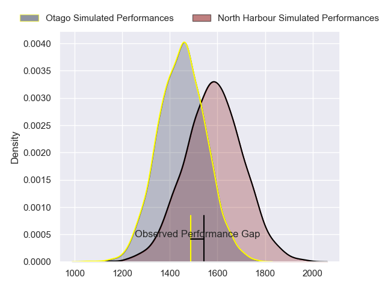
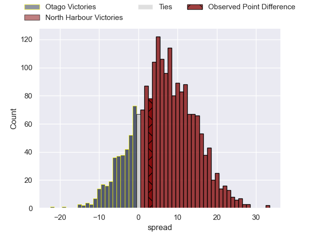
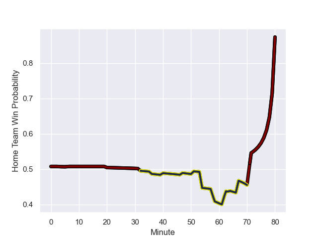

---  
layout: page  
title: Otago at North Harbour; 24.0-27.0  
date: 2023-09-06 18:00:00 -0500  
categories: match review  
---
# Otago at North Harbour; 24.0-27.0

# Club Level Predictions

The first set of predictions treats a club as the smallest object, as the club develops its members, organizes a gameplan, and deploys its players as needed for each match. This club model has a prediction of 0.674, which translates to predicting North Harbour to win by 6.6.

Each club has a rating and a rating deviation (simiar to a Glicko system), and expected performances can be generated. This allows for simulated matches and spreads like the ones below.
## Projected Performances

## Projected Spreads

## Projected Results

# Player Level Predictions - Version 1

Treating teams instead as an entity made up of the currently active players, I have ratings for each player in an altogether different system. These can be combined to form team ratings once teamsheets are announced, weighting starters a bit higher than the reserves. After the match is played, players can be weighted by their minutes on the field, allowing for an accurate measure of the team's composition. With these compiled team ratings, we can make predictions, measure inaccuracy, and update the individual player ratings.
## Prediction with Player Minutes: North Harbour by 5.3

North Harbour by 1.3 on a neutral field
## Prediction without Player Minutes: North Harbour by 7.8

North Harbour by 3.8 on a neutral pitch

## Scores over Time

## Win Probability over Time

There were 8 large changes in win probability in this match

|   Away Minutes | Away Player      |   Away elo |   Away Percentile |   Number |   Home Percentile |   Home elo | Home Player       |   Home Minutes |
|---------------:|:-----------------|-----------:|------------------:|---------:|------------------:|-----------:|:------------------|---------------:|
|             51 | Rohan Wingham    |     105.41 |       1.03293e+06 |        1 |       1.02309e+06 |      94.68 | Tevita Langi      |             47 |
|             51 | Ricky Jackson    |      83.79 |  909827           |        2 |  704137           |      72.98 | Ray Niuia         |             47 |
|             51 | Saula Mau        |      98.99 |  965329           |        3 |  613006           |     142.39 | Nic Mayhew        |             36 |
|             80 | Fabian Holland   |      93.18 |       1.00962e+06 |        4 |       1.03343e+06 |      96.47 | Cameron Christie  |             47 |
|             51 | Josh Hill        |      73.16 |  963008           |        5 |       1.00934e+06 |      75.48 | Mahroni Ngakuru   |             80 |
|             80 | Will Stodart     |      94.97 |       1.03363e+06 |        6 |       1.02373e+06 |      90.66 | Wallace Sititi    |             80 |
|             80 | Harry Taylor     |     219.71 |       1.01248e+06 |        7 |       1.02335e+06 |      91.98 | Karl Ruzich       |             61 |
|             51 | Samuel Fischli   |      96.41 |       1.00424e+06 |        8 |  963103           |     100.23 | Lotu Inisi        |             80 |
|             54 | Nathan Hastie    |      98.23 |       1.03345e+06 |        9 |  932783           |      83.07 | Siaosi Nginingini |             64 |
|             80 | Ajay Faleafaga   |      89.7  |       1.03351e+06 |       10 |       1.03305e+06 |     112.26 | Oscar Koller      |             51 |
|             54 | John Tapueluelu  |      93.88 |       1.02674e+06 |       11 |       1.0336e+06  |     108.12 | Sofai Maka        |             80 |
|             67 | Jack Leslie      |     104.6  |       1.0333e+06  |       12 |  466073           |     135.03 | Alapati Leiua     |             54 |
|             80 | Jake Te Hiwi     |      73.76 |       1.02336e+06 |       13 |       1.00508e+06 |      93.63 | Moses Leo         |             80 |
|             80 | Josh Whaanga     |      95.75 |       1.03292e+06 |       14 |       1.00513e+06 |     102.01 | Kade Banks        |             80 |
|             80 | Finn Hurley      |      94.94 |       1.03293e+06 |       15 |  800621           |     156.96 | Shaun Stevenson   |             80 |
|             29 | Abraham Pole     |     101.25 |       1.00436e+06 |       16 |     nan           |     110.3  | Sione Mafileo     |             44 |
|             29 | Henry Bell       |     102.49 |       1.00431e+06 |       17 |  963254           |      75.73 | Shilo Klein       |             33 |
|             29 | Jermaine Ainsley |     103.83 |  803896           |       18 |  962874           |     113.07 | Cameron Suafoa    |             33 |
|             29 | Will Tucker      |      95.03 |  941812           |       19 |       1.00542e+06 |     106.83 | Fatongia Paea     |             33 |
|             29 | Sean Withy       |      63.78 |       1.00903e+06 |       20 |  801050           |      98.13 | Bryn Gatland      |             29 |
|             26 | James Arscott    |      80.7  |  964332           |       21 |       1.02306e+06 |      96.43 | Tom Barham        |             26 |
|             26 | Jona Nareki      |     128.37 |  897880           |       22 |       1.02311e+06 |     102.93 | Tamarau McGahan   |             19 |
|             13 | Jeremiah Asi     |     102.46 |     nan           |       23 |  762444           |      90.49 | Jamie Booth       |             16 |

# Player Level Predictions - Version 2

Treating teams instead as an entity made up of the currently active players, I have ratings for each player in an altogether different system. These can be combined to form team ratings once teamsheets are announced, weighting starters a bit higher than the reserves. After the match is played, players can be weighted by their minutes on the field, allowing for an accurate measure of the team's composition. With these compiled team ratings, we can make predictions, measure inaccuracy, and update the individual player ratings.
## Prediction with Player Minutes: North Harbour by 6.9

North Harbour by 3.6 on a neutral field
## Prediction without Player Minutes: North Harbour by 6.5

North Harbour by 3.1 on a neutral pitch

|   Away Minutes | Away Player      |   Away elo |   Away variance |   Number |   Home variance |   Home elo | Home Player       |   Home Minutes |
|---------------:|:-----------------|-----------:|----------------:|---------:|----------------:|-----------:|:------------------|---------------:|
|             51 | Rohan Wingham    |      40.52 |           49.55 |        1 |           49.57 |      41.39 | Tevita Langi      |             47 |
|             51 | Ricky Jackson    |      43.8  |           49.77 |        2 |           49.8  |      54.78 | Ray Niuia         |             47 |
|             51 | Saula Mau        |      38.83 |           49.56 |        3 |           49.61 |      75.39 | Nic Mayhew        |             36 |
|             80 | Fabian Holland   |      52.77 |           49.62 |        4 |           49.94 |      44.78 | Cameron Christie  |             47 |
|             51 | Josh Hill        |      38.07 |           49.97 |        5 |           49.67 |      12.64 | Mahroni Ngakuru   |             80 |
|             80 | Will Stodart     |      46.65 |           50    |        6 |           49.65 |      38.75 | Wallace Sititi    |             80 |
|             80 | Harry Taylor     |      40.26 |           49.89 |        7 |           49.85 |      42.97 | Karl Ruzich       |             61 |
|             51 | Samuel Fischli   |      61.18 |           48.51 |        8 |           49.42 |      49.62 | Lotu Inisi        |             80 |
|             54 | Nathan Hastie    |      46.11 |           49.9  |        9 |           50    |      47.97 | Siaosi Nginingini |             64 |
|             80 | Ajay Faleafaga   |      44.97 |           49.9  |       10 |           49.19 |      40.7  | Oscar Koller      |             51 |
|             54 | John Tapueluelu  |      48.96 |           49.88 |       11 |           50    |      46.65 | Sofai Maka        |             80 |
|             67 | Jack Leslie      |      42.92 |           49.62 |       12 |           49.48 |      45.24 | Alapati Leiua     |             54 |
|             80 | Jake Te Hiwi     |      34.33 |           49.63 |       13 |           50    |      50.05 | Moses Leo         |             80 |
|             80 | Josh Whaanga     |      35.57 |           49.26 |       14 |           49.19 |      44.96 | Kade Banks        |             80 |
|             80 | Finn Hurley      |      37.25 |           49.39 |       15 |           49.54 |      82.9  | Shaun Stevenson   |             80 |
|             29 | Abraham Pole     |      50.56 |           49.84 |       16 |           49.85 |      72.85 | Sione Mafileo     |             44 |
|             29 | Henry Bell       |      39.01 |           49.48 |       17 |           48.46 |      45.66 | Shilo Klein       |             33 |
|             29 | Jermaine Ainsley |      40.19 |           49.7  |       18 |           49.25 |      46.53 | Cameron Suafoa    |             33 |
|             29 | Will Tucker      |      18.5  |           49.38 |       19 |           50    |      55.07 | Fatongia Paea     |             33 |
|             29 | Sean Withy       |      37.66 |           49.32 |       20 |           50    |      77.62 | Bryn Gatland      |             29 |
|             26 | James Arscott    |      31.85 |           49.64 |       21 |           49.31 |      40.97 | Tom Barham        |             26 |
|             26 | Jona Nareki      |      67.12 |           49.43 |       22 |           49.38 |      51.89 | Tamarau McGahan   |             19 |
|             13 | Jeremiah Asi     |      46.09 |           49.82 |       23 |           49.3  |      12.34 | Jamie Booth       |             16 |

