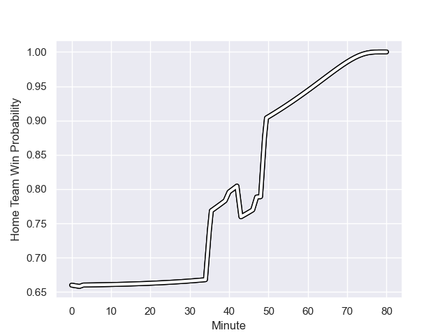

---  
layout: page  
title: Provence Rugby at Brive; 6.0-17.0  
date: 2023-09-07 18:00:00 -0500  
categories: match review  
---
# Provence Rugby at Brive; 6.0-17.0

# Club Level Predictions

The first set of predictions treats a club as the smallest object, as the club develops its members, organizes a gameplan, and deploys its players as needed for each match. This club model has a prediction of 0.699, which translates to predicting Brive to win by 7.4.

Each club has a rating and a rating deviation (simiar to a Glicko system), and expected performances can be generated. This allows for simulated matches and spreads like the ones below.
## Projected Performances

## Projected Spreads

## Projected Results

# Player Level Predictions - Version 2

Treating teams instead as an entity made up of the currently active players, I have ratings for each player in an altogether different system. These can be combined to form team ratings once teamsheets are announced, weighting starters a bit higher than the reserves. After the match is played, players can be weighted by their minutes on the field, allowing for an accurate measure of the team's composition. With these compiled team ratings, we can make predictions, measure inaccuracy, and update the individual player ratings.
## Prediction with Player Minutes: Brive by 7.3

Brive by 2.4 on a neutral field
## Prediction without Player Minutes: Brive by 6.1

Brive by 1.3 on a neutral pitch

## Scores over Time

## Win Probability over Time

There were 5 large changes in win probability in this match

|   Away Minutes | Away Player           |   Away elo |   Number |   Home elo | Home Player             |   Home Minutes |
|---------------:|:----------------------|-----------:|---------:|-----------:|:------------------------|---------------:|
|             47 | Thomas Vernet         |      48.18 |        1 |      38.94 | Daniel Brennan          |             40 |
|             47 | Lucas Martin          |      68.62 |        2 |      54.94 | Issam Hamel             |             56 |
|             47 | Paul Mallez           |      54.46 |        3 |      31.91 | Marcel van der Merwe    |             56 |
|             51 | Jérôme Dufour         |      65.75 |        4 |      51.62 | Retief Marais           |             50 |
|             80 | Clément Chartier      |      57.01 |        5 |      60.34 | Sitaleki Timani         |             12 |
|             51 | Guillaume Piazzoli    |      63.09 |        6 |      38.18 | Sasha Gue               |             80 |
|             80 | Jessy Jegerlehner     |       8.92 |        7 |      88.29 | Ross Moriarty           |             80 |
|             80 | Malohi Suta           |      48.69 |        8 |      54.08 | Rahboni Warren-Vosayaco |             80 |
|             53 | Joris Cazenave        |      39.02 |        9 |      50.6  | Julien Blanc            |             50 |
|             53 | Enzo Selponi          |      45.81 |       10 |      10.71 | Jackson Garden-Bachop   |             55 |
|             80 | Nadir Bouhedjeur      |      66.04 |       11 |      42.35 | Asaeli Tuivuaka         |             80 |
|             53 | Dorian Lavernhe       |      32.58 |       12 |      70.78 | Sam Johnson             |             80 |
|             80 | Louis Marrou          |      47.61 |       13 |      49.19 | Paula Walisolio         |             80 |
|             80 | Léo Drouet            |      51.88 |       14 |      43.35 | Mathis Ferté            |             80 |
|             80 | Adrien Lapegue-Lafaye |      36.13 |       15 |      69.46 | Stuart Olding           |             53 |
|             33 | Julius Nostadt        |      51.11 |       16 |      52.77 | Tevita Ratuva           |             68 |
|             33 | Loick Jammes          |      13.21 |       17 |      48.89 | Wesley Tapueluelu       |             40 |
|             33 | Quentin Samaran       |      42.12 |       18 |       5.03 | Leo Carbonneau          |             30 |
|             29 | Nicolas Mousties      |      42.28 |       19 |      46.02 | Julien Delannoy         |             30 |
|             29 | Theo Hannoyer         |      11.85 |       20 |      87.31 | Said Hireche            |             27 |
|             27 | Hugo Navizet          |      40.52 |       21 |      36.99 | Tom Raffy               |             25 |
|             27 | Arthur Coville        |      56.94 |       22 |      34.58 | Lucas da Silva          |             24 |
|             27 | Johnny McPhillips     |      47.25 |       23 |      52.47 | Vakh Abdaladze          |             24 |

