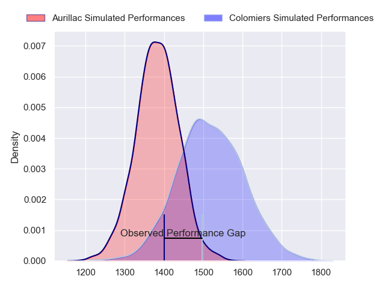
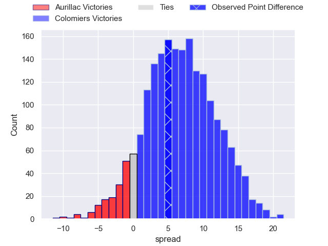
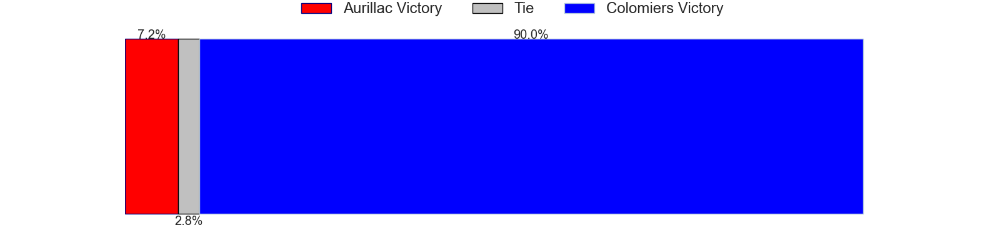
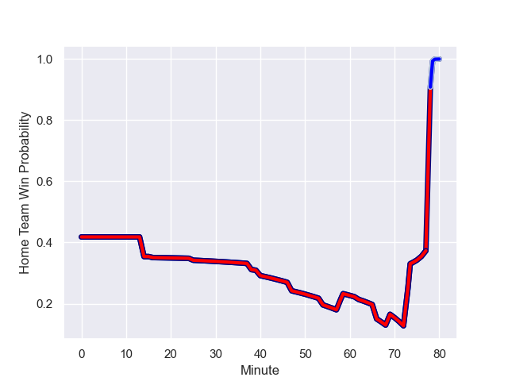

---  
layout: page  
title: Aurillac at Colomiers; 22.0-27.0  
date: 2023-09-07 18:00:00 -0500  
categories: match review  
---
# Aurillac at Colomiers; 22.0-27.0

# Club Level Predictions

The first set of predictions treats a club as the smallest object, as the club develops its members, organizes a gameplan, and deploys its players as needed for each match. This club model has a prediction of 0.68, which translates to predicting Colomiers to win by 6.7.

Each club has a rating and a rating deviation (simiar to a Glicko system), and expected performances can be generated. This allows for simulated matches and spreads like the ones below.
## Projected Performances

## Projected Spreads

## Projected Results

# Player Level Predictions - Version 1

Treating teams instead as an entity made up of the currently active players, I have ratings for each player in an altogether different system. These can be combined to form team ratings once teamsheets are announced, weighting starters a bit higher than the reserves. After the match is played, players can be weighted by their minutes on the field, allowing for an accurate measure of the team's composition. With these compiled team ratings, we can make predictions, measure inaccuracy, and update the individual player ratings.
## Prediction with Player Minutes: Aurillac by 10.4

Aurillac by 14.4 on a neutral field
## Prediction without Player Minutes: Aurillac by 8.0

Aurillac by 12.0 on a neutral pitch

## Scores over Time

## Win Probability over Time

There were 9 large changes in win probability in this match

|   Away Minutes | Away Player           |   Away elo |   Away Percentile |   Number |   Home Percentile |   Home elo | Home Player           |   Home Minutes |
|---------------:|:----------------------|-----------:|------------------:|---------:|------------------:|-----------:|:----------------------|---------------:|
|             62 | Robert Rodgers        |      83.53 |  996442           |        1 |  667533           |     103.26 | Thomas Dubois         |             80 |
|             62 | Robert Rodgers        |      83.53 |  996442           |        1 |  970815           |     183.04 | Guillaume Tartas      |             47 |
|             58 | Lilian Djomboue       |     136.9  |       1.02852e+06 |        2 |  741447           |     103.92 | Andrew Ready          |             40 |
|             62 | Giorgi Kartvelishvili |     201.88 |  962470           |        3 |  902758           |     137.3  | Marco Fepulea'i       |             47 |
|             80 | Heath Backhouse       |     208.64 |  952044           |        4 |  786005           |     131.77 | Jean Thomas           |             80 |
|             54 | Mehdi Slamani         |     143.03 |       1.03196e+06 |        5 |       1.03037e+06 |     138.51 | Louis Descoux         |             47 |
|             69 | Hugo Huurman          |     132.55 |       1.02992e+06 |        6 |  540902           |     103.31 | Anthony Coletta       |             54 |
|             80 | Beka Shvangiradze     |     135.11 |       1.02358e+06 |        7 |  963822           |     230.26 | Waël Ponpon           |             54 |
|             54 | Yohann Gbizie         |     193.03 |  964828           |        8 |  673693           |      91.41 | Aldric Lescure        |             80 |
|             62 | Mikheil Alania        |     209.18 |  986183           |        9 |  985879           |     228.45 | Ugo Seguela           |             56 |
|             80 | Antoine Aucagne       |     206.22 |  992314           |       10 |  858779           |      53.99 | Brett Herron          |             80 |
|             80 | Juun Pieters          |     137.02 |       1.03347e+06 |       11 |  837293           |     145.88 | Valentin Saurs        |             80 |
|             80 | Elijah Niko           |     100.24 |  722399           |       12 |  817558           |     112.47 | Dorian Laborde        |             80 |
|             80 | Hugo Bastard          |     130.68 |       1.02852e+06 |       13 |  633434           |     103.94 | Fabien Perrin         |             80 |
|             80 | Dachi Papunashvili    |     150.6  |       1.02778e+06 |       14 |  893022           |     128.68 | Paul Pimienta         |             80 |
|             76 | Anderson Neisen       |     137.2  |  710837           |       15 |       1.02352e+06 |     138.73 | Max Auriac            |             14 |
|             26 | Latuka Maituku        |     -54.13 |  549577           |       16 |     nan           |     116.43 | Baptiste Serrano      |             66 |
|             26 | Martial Rolland       |      40.24 |  955656           |       17 |  619997           |      29.11 | Thomas Larrieu        |             40 |
|             22 | Ronan Loughnane       |     103.67 |       1.02824e+06 |       18 |       1.00953e+06 |     222.65 | Pierre-Samuel Pacheco |             33 |
|             18 | Jean-Jacques Gymael   |     327.37 |  984785           |       19 |  961146           |     156.52 | Janse Roux            |             33 |
|             18 | David Delarue         |     106.84 |  824626           |       20 |  893414           |     171.7  | Hugo Pirlet           |             33 |
|             18 | Alex Dos Santos       |     117.32 |     nan           |       21 |  468033           |     118.5  | Rob Harley            |             26 |
|             11 | Théo Cambon           |     192.68 |  988310           |       22 |     nan           |     127.23 | Paolo Parpagiola      |             26 |
|              4 | Jules Margarit        |     110.93 |       1.02853e+06 |       23 |       1.02384e+06 |     130.36 | Mathis Galthié        |             24 |

# Player Level Predictions - Version 2

Treating teams instead as an entity made up of the currently active players, I have ratings for each player in an altogether different system. These can be combined to form team ratings once teamsheets are announced, weighting starters a bit higher than the reserves. After the match is played, players can be weighted by their minutes on the field, allowing for an accurate measure of the team's composition. With these compiled team ratings, we can make predictions, measure inaccuracy, and update the individual player ratings.
## Prediction with Player Minutes: Colomiers by 3.5

Aurillac by 1.1 on a neutral field
## Prediction without Player Minutes: Colomiers by 3.2

Aurillac by 1.4 on a neutral pitch

|   Away Minutes | Away Player           |   Away elo |   Away variance |   Number |   Home variance |   Home elo | Home Player           |   Home Minutes |
|---------------:|:----------------------|-----------:|----------------:|---------:|----------------:|-----------:|:----------------------|---------------:|
|             62 | Robert Rodgers        |      27.52 |           49.97 |        1 |           49.91 |      42.51 | Thomas Dubois         |             80 |
|             62 | Robert Rodgers        |      27.52 |           49.97 |        1 |           49.73 |      46.63 | Guillaume Tartas      |             47 |
|             58 | Lilian Djomboue       |      45.01 |           50    |        2 |           50    |      30.9  | Andrew Ready          |             40 |
|             62 | Giorgi Kartvelishvili |      47.25 |           49.7  |        3 |           49.82 |      11.53 | Marco Fepulea'i       |             47 |
|             80 | Heath Backhouse       |      62.07 |           49.82 |        4 |           49.79 |      50.77 | Jean Thomas           |             80 |
|             54 | Mehdi Slamani         |      46.22 |           50    |        5 |           49.78 |      45.35 | Louis Descoux         |             47 |
|             69 | Hugo Huurman          |      47.83 |           49.95 |        6 |           50    |      34.73 | Anthony Coletta       |             54 |
|             80 | Beka Shvangiradze     |      61.54 |           49.66 |        7 |           49.92 |      40.7  | Waël Ponpon           |             54 |
|             54 | Yohann Gbizie         |      60.68 |           49.93 |        8 |           49.57 |      52.31 | Aldric Lescure        |             80 |
|             62 | Mikheil Alania        |      36.22 |           49.92 |        9 |           49.67 |      34.2  | Ugo Seguela           |             56 |
|             80 | Antoine Aucagne       |      30.87 |           49.86 |       10 |           49.78 |      12.26 | Brett Herron          |             80 |
|             80 | Juun Pieters          |      43.04 |           49.79 |       11 |           50    |      24.15 | Valentin Saurs        |             80 |
|             80 | Elijah Niko           |      37.22 |           49.79 |       12 |           49.64 |      46.3  | Dorian Laborde        |             80 |
|             80 | Hugo Bastard          |      47.79 |           49.79 |       13 |           49.66 |      39.44 | Fabien Perrin         |             80 |
|             80 | Dachi Papunashvili    |      41.04 |           50    |       14 |           49.91 |      55.27 | Paul Pimienta         |             80 |
|             76 | Anderson Neisen       |      46.99 |           49.59 |       15 |           50    |      53.56 | Max Auriac            |             14 |
|             26 | Latuka Maituku        |      -8.2  |           49.88 |       16 |           50    |      46.65 | Baptiste Serrano      |             66 |
|             26 | Martial Rolland       |      31.11 |           49.66 |       17 |           49.75 |      -1.9  | Thomas Larrieu        |             40 |
|             22 | Ronan Loughnane       |      44.01 |           50    |       18 |           49.85 |      43.48 | Pierre-Samuel Pacheco |             33 |
|             18 | Jean-Jacques Gymael   |      39.46 |           49.91 |       19 |           50    |      34.1  | Janse Roux            |             33 |
|             18 | David Delarue         |      37.69 |           49.68 |       20 |           49.75 |      42.51 | Hugo Pirlet           |             33 |
|             18 | Alex Dos Santos       |      46.65 |           50    |       21 |           49.57 |      79.46 | Rob Harley            |             26 |
|             11 | Théo Cambon           |      33.67 |           50    |       22 |           50    |      46.65 | Paolo Parpagiola      |             26 |
|              4 | Jules Margarit        |      35.98 |           50    |       23 |           50    |      54.51 | Mathis Galthié        |             24 |

